

### 859

|Name|RAJ2000[deg]|DEJ2000[deg] |Ext[arcmin]| Ext,ml | z | z_src| C|GC(XSZ,Delta_z<0.01)| GC(OPT,Delta_z<0.01)|GC| R_sig[arcmin] | R500[arcmin] | R500[Mpc]| CRsig[c/s] | CR500[c/s] |L500[1E44 erg/s]|F500[1E-12 erg/s/cm^2]| M500[1E14 Msun]|Tx[keV]|Cnt_sig|Beta|Rc[arcmin]|Comment|Alias|
|---|---|---|---|---|---|------|---|--------|---------|----------|---|---|---|---|---|---|---|---|---|---|---|---|---|---|
|859| 326.603| -57.284| 1.83| 61.32| 0.0753(0.005)| z1, z_xsz| B| MCXC, PSZ2, Tar, XB| A, N, W| A, MCXC, N, PSZ2, Tar, W, XB| 13.675| 10.970| 0.941| 0.451(0.052)| 0.436(0.050)| 1.149(0.079)| 8.264(0.565)| 2.54(0.09)| 3.90(0.08)| 133.5| 0.582(-0.052+0.080)| 2.496(-0.554+0.760)| -| k178|

|[RASS image](../image/859/859_img.pdf)|[filtered image](../image/859/859_fil.pdf)|[Segment image](../image/859/859_seg.pdf)|
|-------------------|--------------------|-------------------|
| 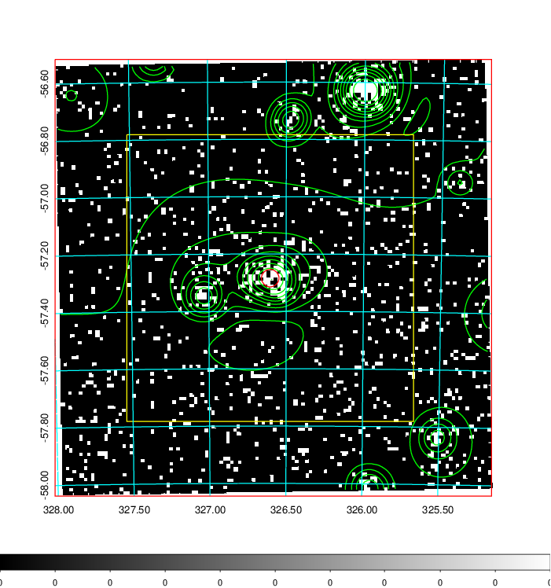  | 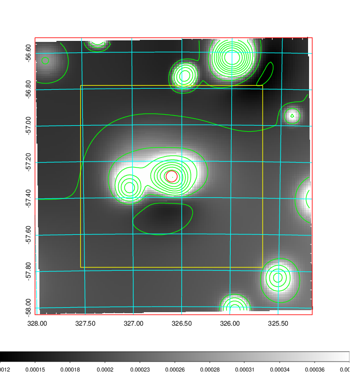   | 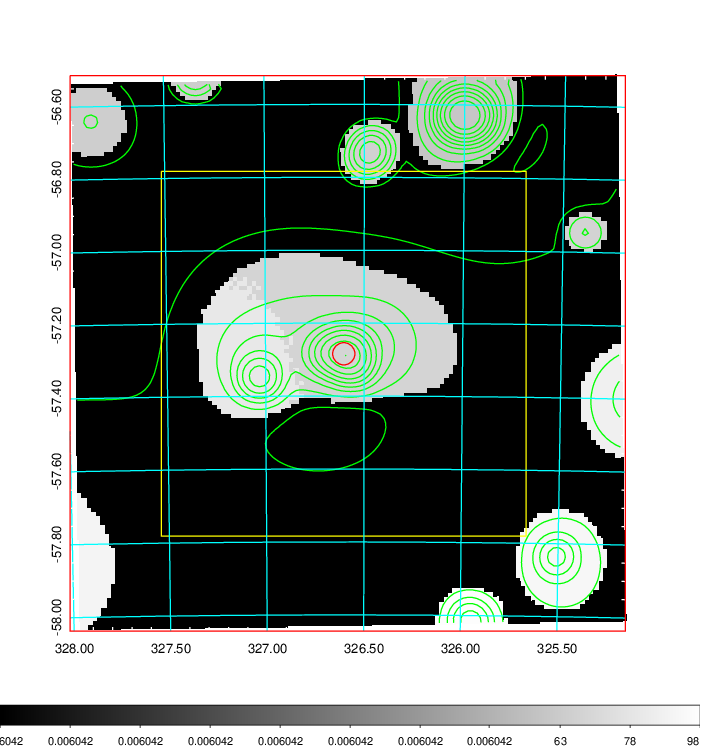  |

|[Exposure image](../image/859/859_mex.pdf)| [nH image](../image/859/859_nh.pdf)| [Planck image](../image/859/859_p.pdf)|
|-------------------|--------------------|-------------------|
|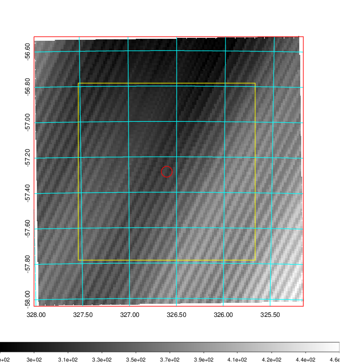   | 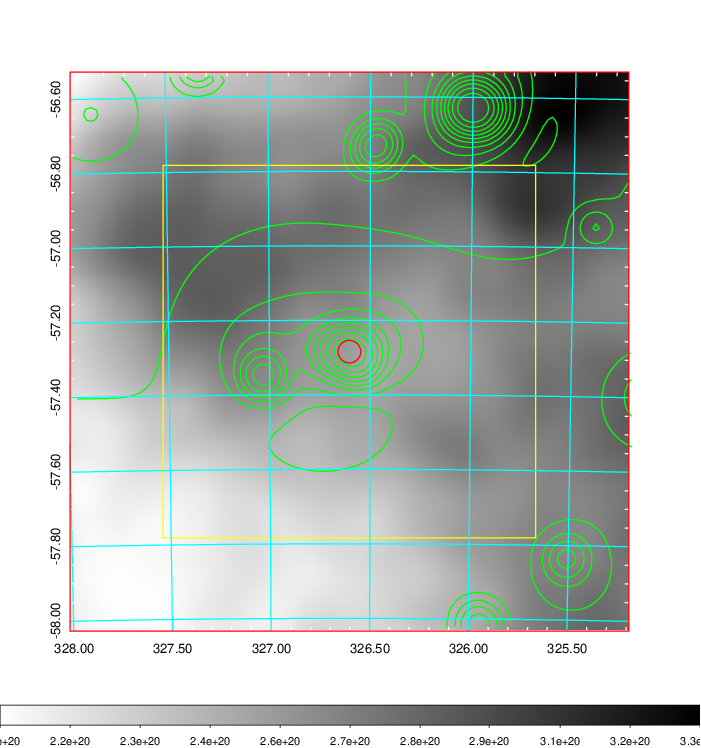    | 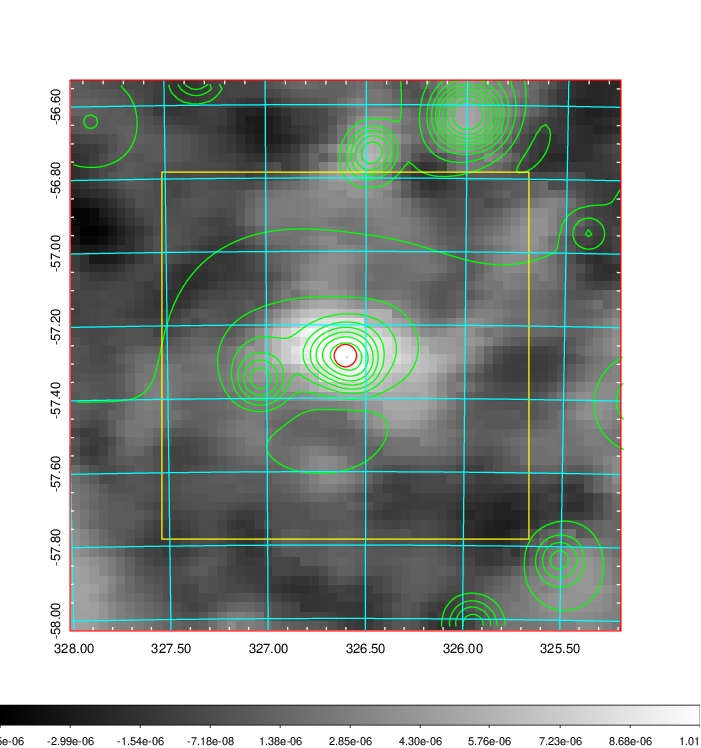 |

|[Redshift Histogram](../image/859/859_zg.pdf) | [DSS image(z1)](../image/859/859_dss_z1.pdf)      |  [DSS image(z2)](../image/859/859_dss_z2.pdf)    |
|-------------------|--------------------|-------------------|
|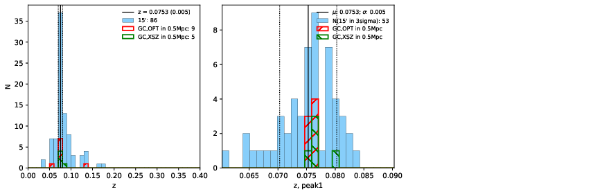 |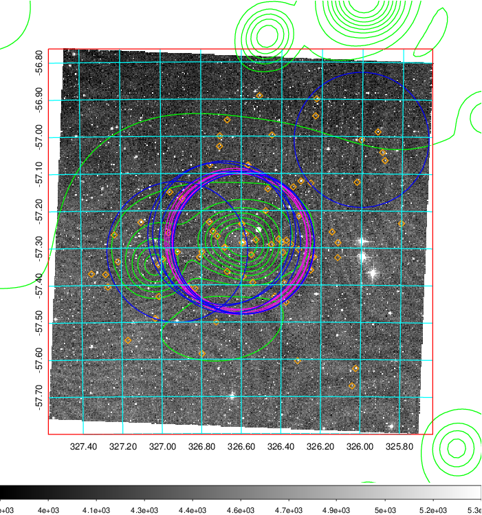  Blue circle for optical clusters;  Magenta circle for XSZ clusters;  all with r=1Mpc;  Only GC with Delta_z<0.01 are shown. | 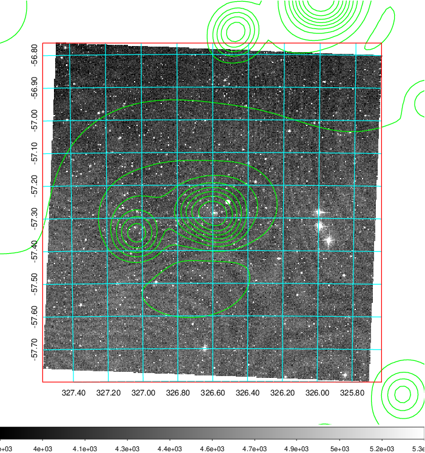 Blue circle for optical clusters;  Magenta circle for XSZ clusters;  all with r=1Mpc;  Only GC with Delta_z<0.01 are shown.  |

|[Previous-identified clusters](../image/859/859_gc.pdf) | [2MASS image](../image/859/859_2mass.pdf)      |
|-------------------|-------------------|
|  Green, magenta, and blue circles  for optical, X-ray and SZ clusters  respectively, with redshift of clusters  labelled. The radius of circles  are 1Mpc.|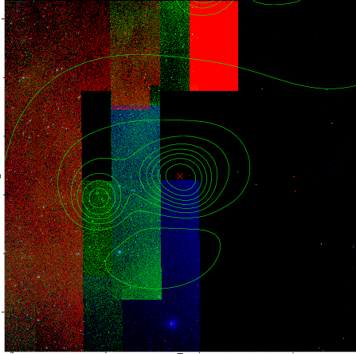  |

|[DES image](../image/859/859_des.pdf)   |
|-------------------|
| 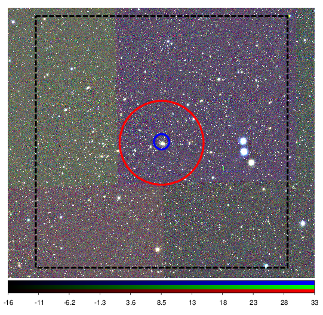  |
