

### 86

|Name|RAJ2000[deg]|DEJ2000[deg] |Ext[arcmin]| Ext,ml | z | z_src| C|GC(XSZ,Delta_z<0.01)| GC(OPT,Delta_z<0.01)|GC| R_sig[arcmin] | R500[arcmin] | R500[Mpc]| CRsig[c/s] | CR500[c/s] |L500[1E44 erg/s]|F500[1E-12 erg/s/cm^2]| M500[1E14 Msun]|Tx[keV]|Cnt_sig|Beta|Rc[arcmin]|Comment|Alias|
|---|---|---|---|---|---|------|---|--------|---------|----------|---|---|---|---|---|---|---|---|---|---|---|---|---|---|
|86| 27.149| 14.032| 4.12| 28.60| 0.0694(0.005)| z1, z_xsz| B| L03| -| A, C, F20, L03, N, SPI, SWXCS, W| 12.212| 8.935| 0.711| 0.133(0.037)| 0.127(0.035)| 0.255(0.042)| 2.177(0.361)| 1.09(0.09)| 2.31(0.12)| 59.0| 0.615(-0.084+0.178)| 2.740(-0.905+1.503)| -| t205|

|[RASS image](../image/86/86_img.pdf)|[filtered image](../image/86/86_fil.pdf)|[Segment image](../image/86/86_seg.pdf)|
|-------------------|--------------------|-------------------|
| 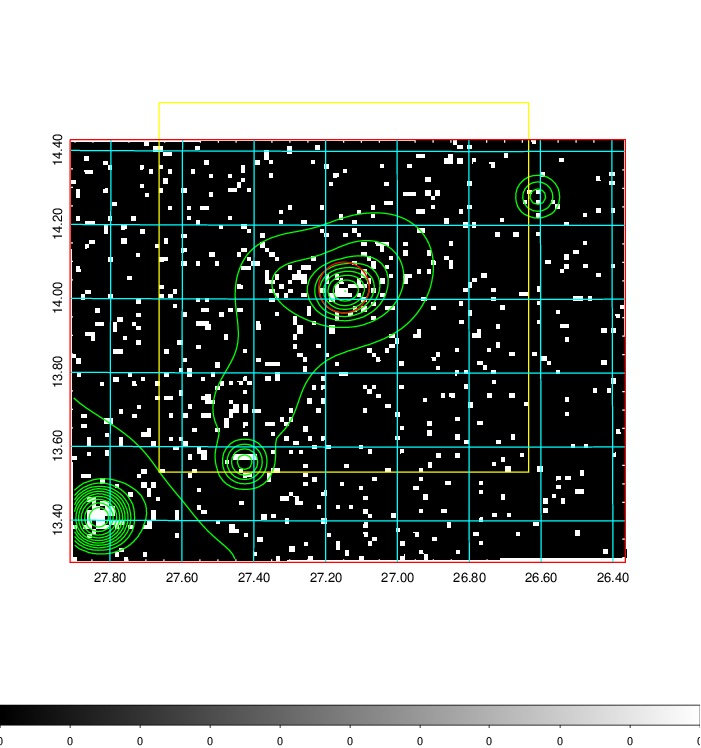  | 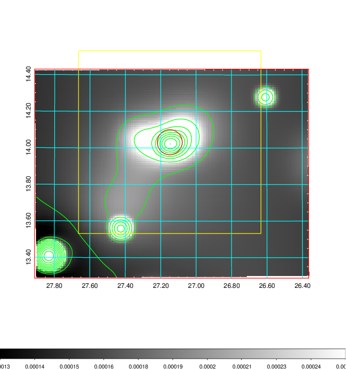   | 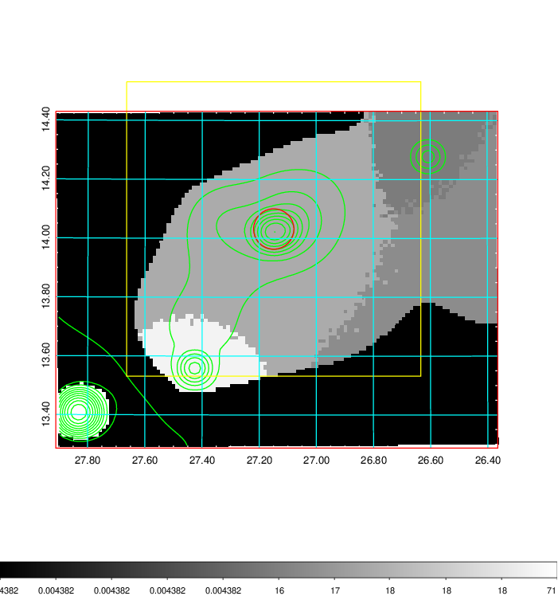  |

|[Exposure image](../image/86/86_mex.pdf)| [nH image](../image/86/86_nh.pdf)| [Planck image](../image/86/86_p.pdf)|
|-------------------|--------------------|-------------------|
|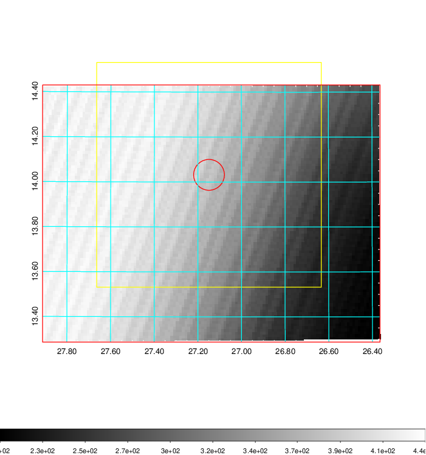   | 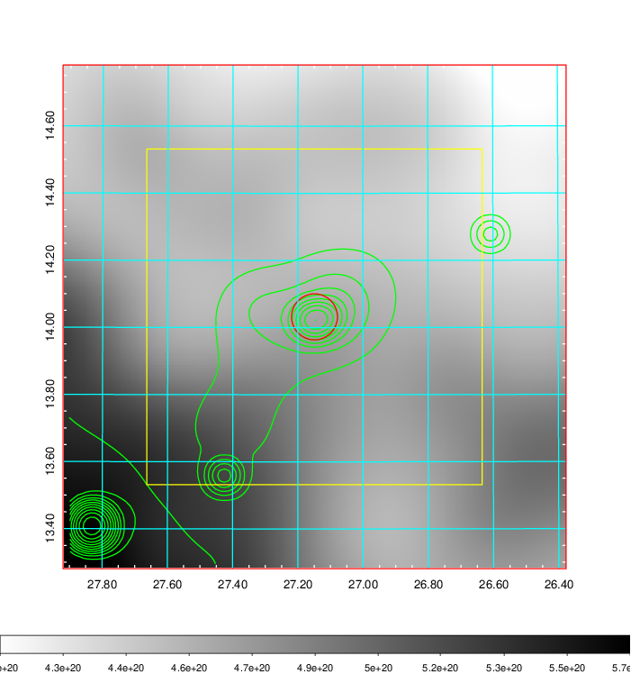    | 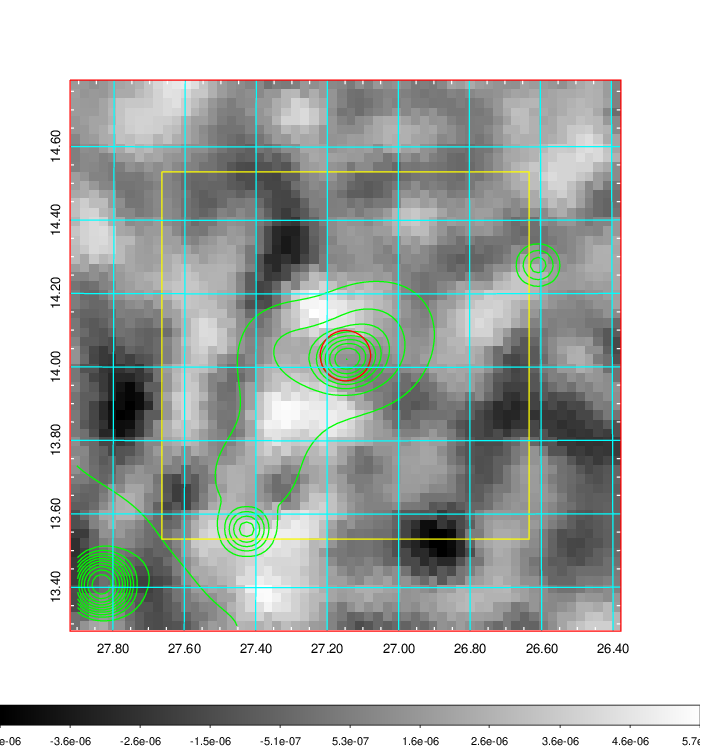 |

|[Redshift Histogram](../image/86/86_zg.pdf) | [DSS image(z1)](../image/86/86_dss_z1.pdf)      |  [DSS image(z2)](../image/86/86_dss_z2.pdf)    |
|-------------------|--------------------|-------------------|
|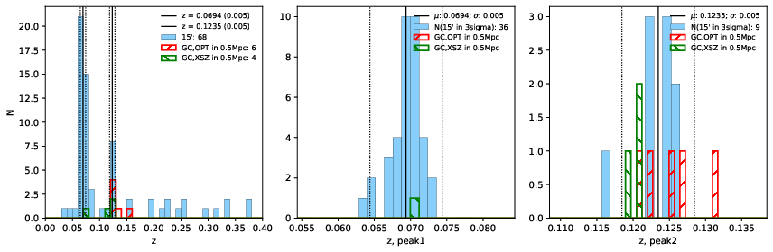 |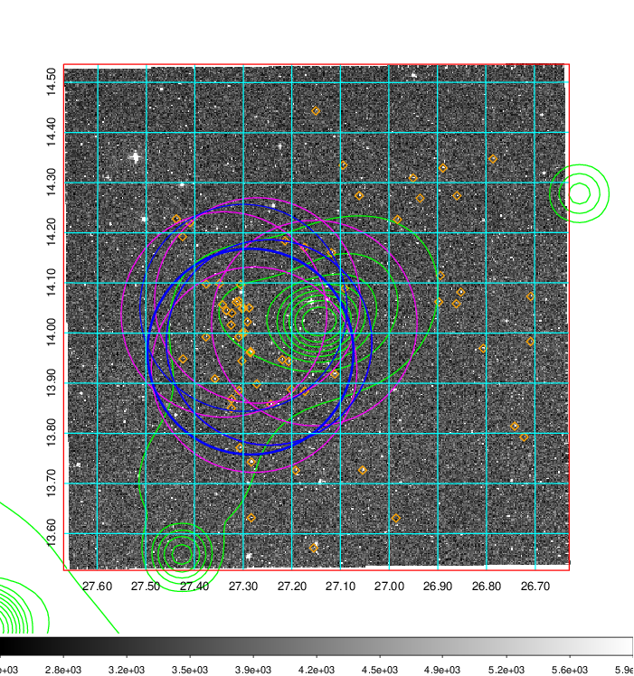  Blue circle for optical clusters;  Magenta circle for XSZ clusters;  all with r=1Mpc;  Only GC with Delta_z<0.01 are shown. | 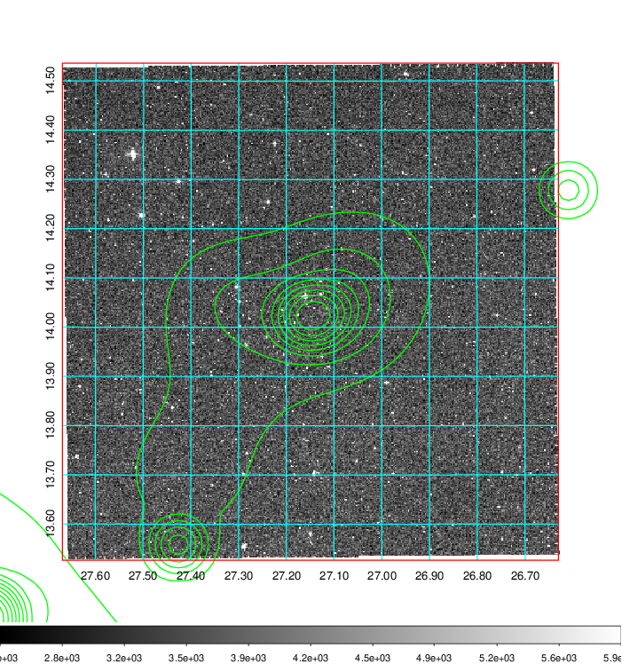 Blue circle for optical clusters;  Magenta circle for XSZ clusters;  all with r=1Mpc;  Only GC with Delta_z<0.01 are shown.  |

|[Previous-identified clusters](../image/86/86_gc.pdf) | [2MASS image](../image/86/86_2mass.pdf)      |[SDSS image](../image/86/86_sdss.pdf)   |
|-------------------|-------------------|-------------------|
|  Green, magenta, and blue circles  for optical, X-ray and SZ clusters  respectively, with redshift of clusters  labelled. The radius of circles  are 1Mpc.|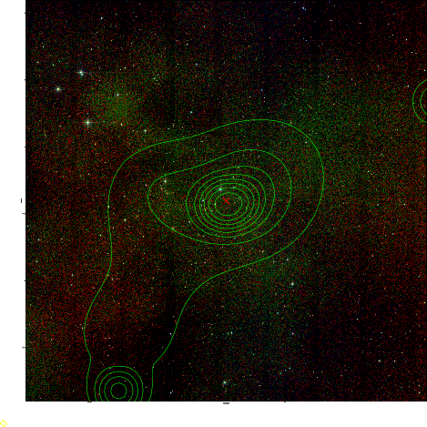  | 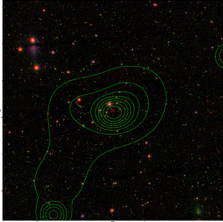  |

