

### 860

|Name|RAJ2000[deg]|DEJ2000[deg] |Ext[arcmin]| Ext,ml | z | z_src| C|GC(XSZ,Delta_z<0.01)| GC(OPT,Delta_z<0.01)|GC| R_sig[arcmin] | R500[arcmin] | R500[Mpc]| CRsig[c/s] | CR500[c/s] |L500[1E44 erg/s]|F500[1E-12 erg/s/cm^2]| M500[1E14 Msun]|Tx[keV]|Cnt_sig|Beta|Rc[arcmin]|Comment|Alias|
|---|---|---|---|---|---|------|---|--------|---------|----------|---|---|---|---|---|---|---|---|---|---|---|---|---|---|
|860| 326.714| -43.903| 3.01| 143.86| 0.0624(0.005)| z1, z_xsz| B| MCXC, PSZ2, Tar, XB| A, N| A, MCXC, N, PSZ2, Tar, XB| 11.238| 12.278| 0.886| 0.476(0.051)| 0.484(0.052)| 0.885(0.054)| 9.439(0.573)| 2.10(0.06)| 3.45(0.07)| 140.5| 0.907(-0.098+0.066)| 5.771(-0.748+0.519)| -| k378|

|[RASS image](../image/860/860_img.pdf)|[filtered image](../image/860/860_fil.pdf)|[Segment image](../image/860/860_seg.pdf)|
|-------------------|--------------------|-------------------|
| 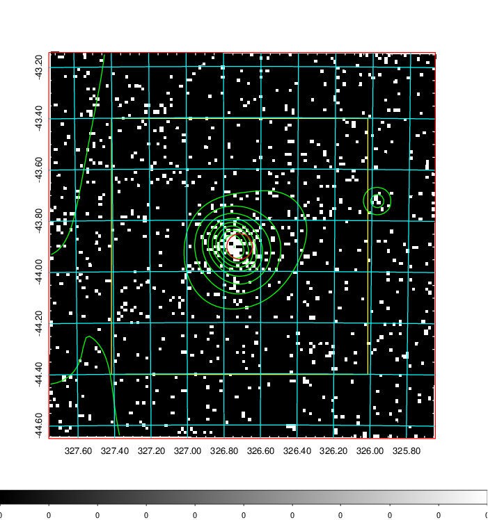  | 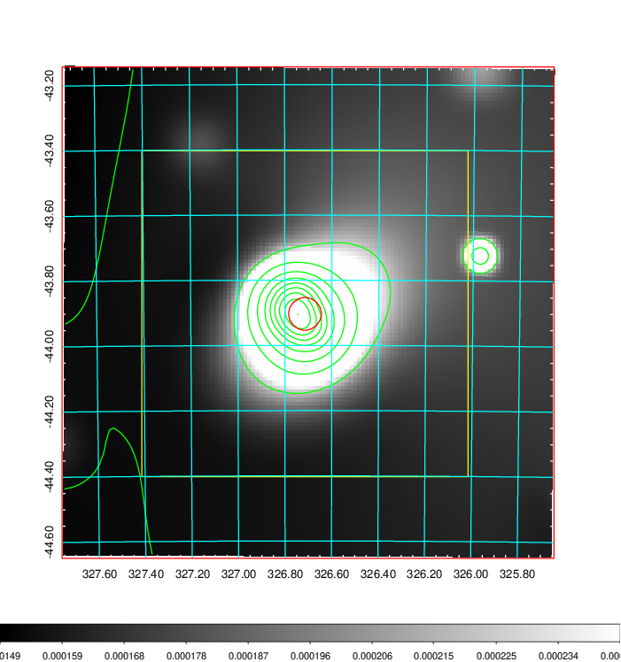   | 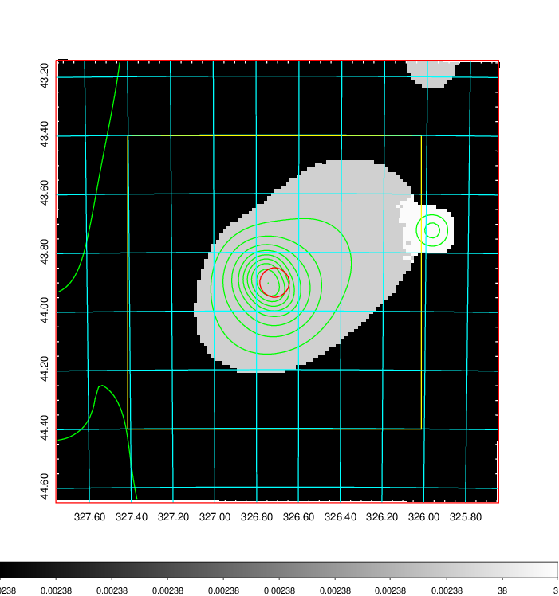  |

|[Exposure image](../image/860/860_mex.pdf)| [nH image](../image/860/860_nh.pdf)| [Planck image](../image/860/860_p.pdf)|
|-------------------|--------------------|-------------------|
|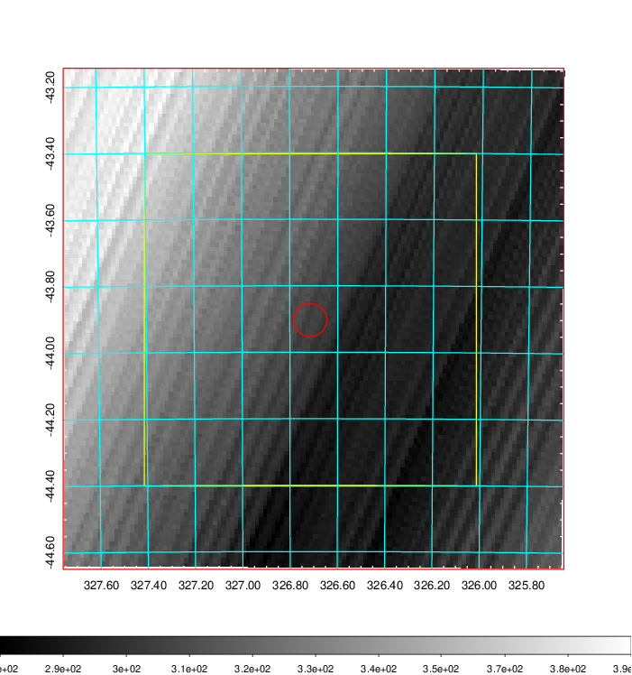   | 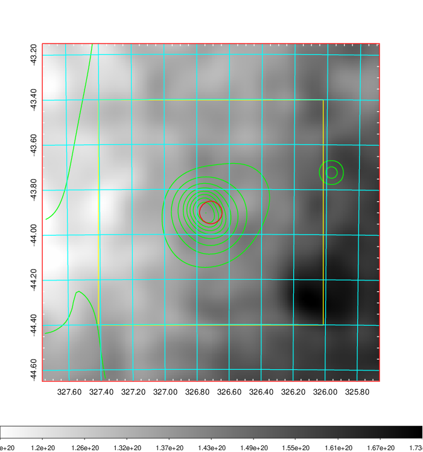    | 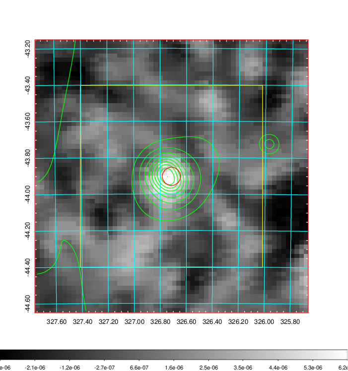 |

|[Redshift Histogram](../image/860/860_zg.pdf) | [DSS image(z1)](../image/860/860_dss_z1.pdf)      |  [DSS image(z2)](../image/860/860_dss_z2.pdf)    |
|-------------------|--------------------|-------------------|
|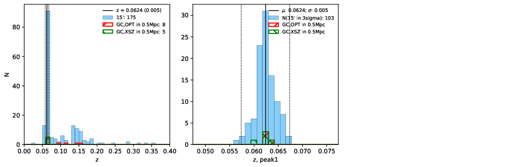 |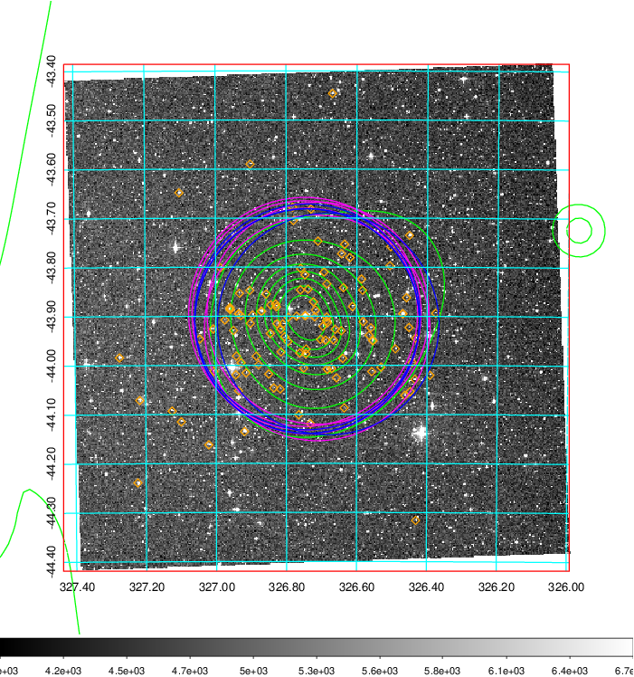  Blue circle for optical clusters;  Magenta circle for XSZ clusters;  all with r=1Mpc;  Only GC with Delta_z<0.01 are shown. | 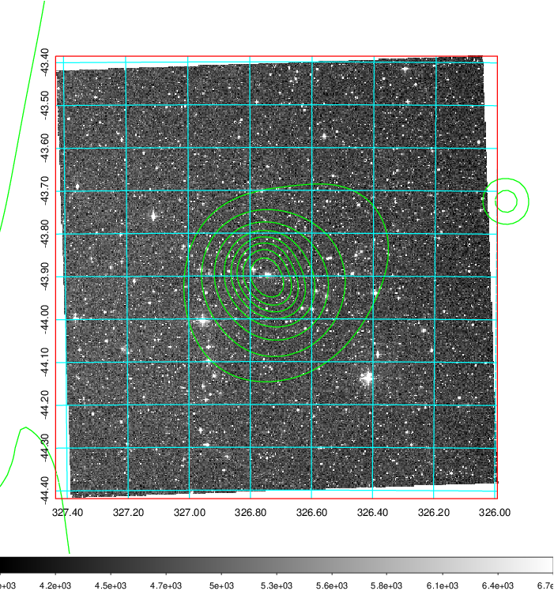 Blue circle for optical clusters;  Magenta circle for XSZ clusters;  all with r=1Mpc;  Only GC with Delta_z<0.01 are shown.  |

|[Previous-identified clusters](../image/860/860_gc.pdf) | [2MASS image](../image/860/860_2mass.pdf)      |
|-------------------|-------------------|
|  Green, magenta, and blue circles  for optical, X-ray and SZ clusters  respectively, with redshift of clusters  labelled. The radius of circles  are 1Mpc.|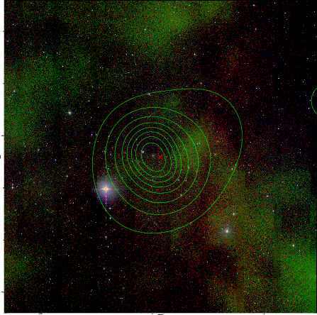  |

|[DES image](../image/860/860_des.pdf)   |
|-------------------|
| 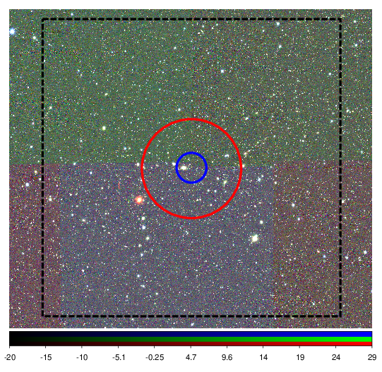  |
