

### 861

|Name|RAJ2000[deg]|DEJ2000[deg] |Ext[arcmin]| Ext,ml | z | z_src| C|GC(XSZ,Delta_z<0.01)| GC(OPT,Delta_z<0.01)|GC| R_sig[arcmin] | R500[arcmin] | R500[Mpc]| CRsig[c/s] | CR500[c/s] |L500[1E44 erg/s]|F500[1E-12 erg/s/cm^2]| M500[1E14 Msun]|Tx[keV]|Cnt_sig|Beta|Rc[arcmin]|Comment|Alias|
|---|---|---|---|---|---|------|---|--------|---------|----------|---|---|---|---|---|---|---|---|---|---|---|---|---|---|
|861| 326.979| -46.008| 2.41| 70.19| 0.0621(0.007)| z1, z_xsz| B| MCXC, Tar| A, N| A, MCXC, N, Tar| 14.162| 11.774| 0.845| 0.401(0.050)| 0.390(0.049)| 0.700(0.055)| 7.539(0.595)| 1.82(0.07)| 3.16(0.08)| 106.2| 0.723(-0.113+0.148)| 3.949(-1.039+1.151)| -| k286|

|[RASS image](../image/861/861_img.pdf)|[filtered image](../image/861/861_fil.pdf)|[Segment image](../image/861/861_seg.pdf)|
|-------------------|--------------------|-------------------|
| 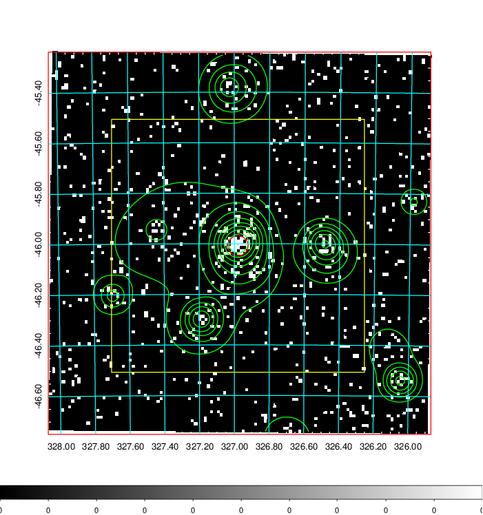  | 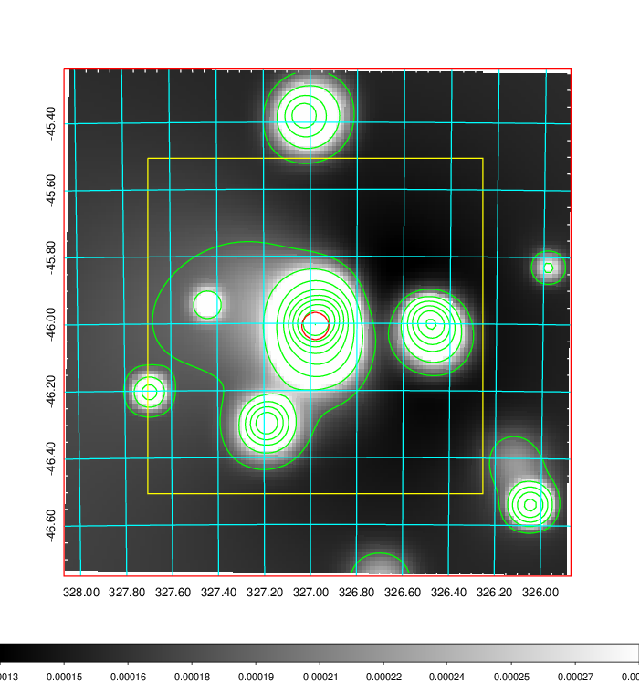   | 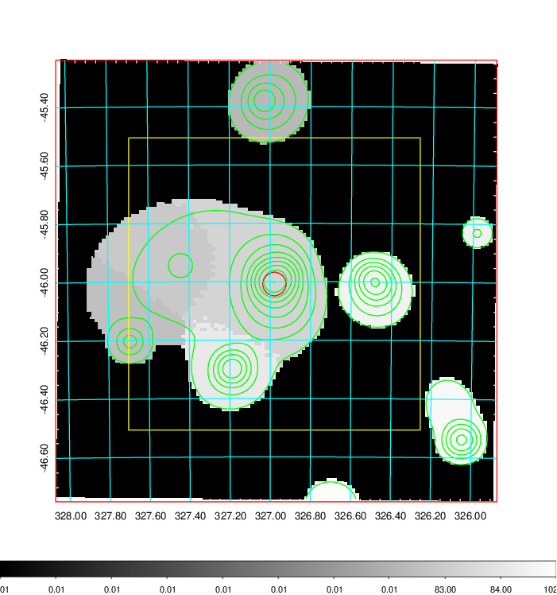  |

|[Exposure image](../image/861/861_mex.pdf)| [nH image](../image/861/861_nh.pdf)| [Planck image](../image/861/861_p.pdf)|
|-------------------|--------------------|-------------------|
|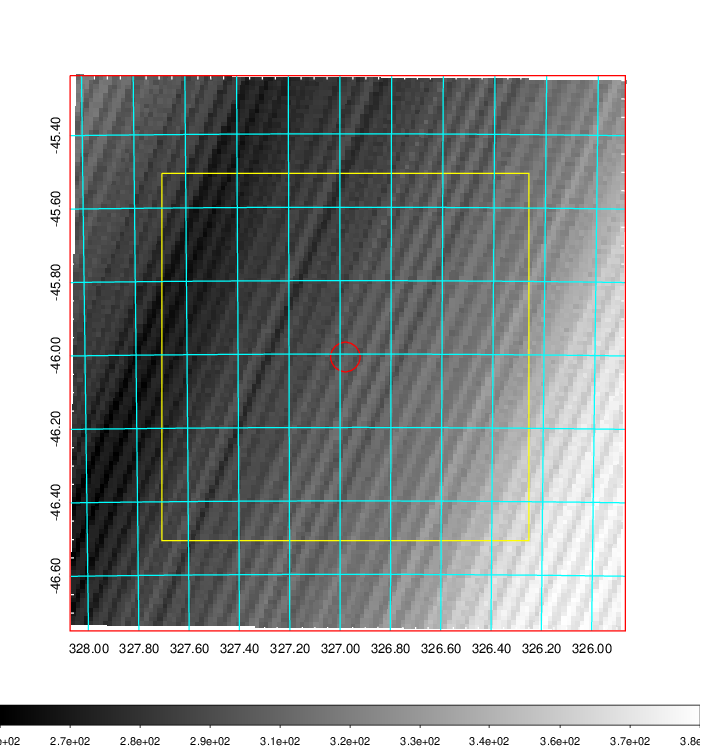   | 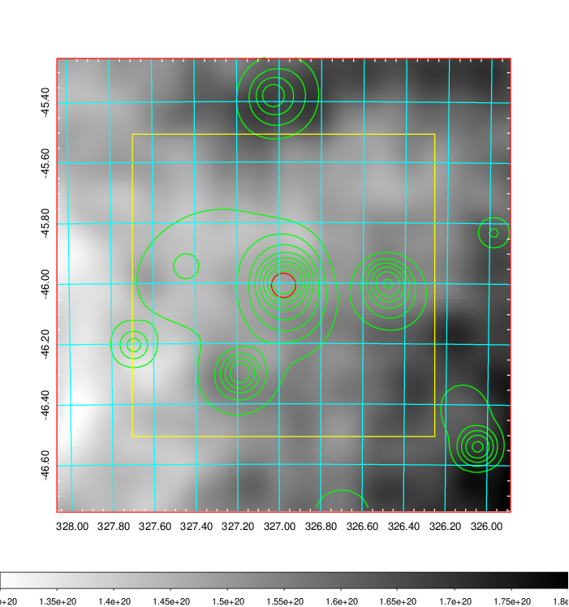    | 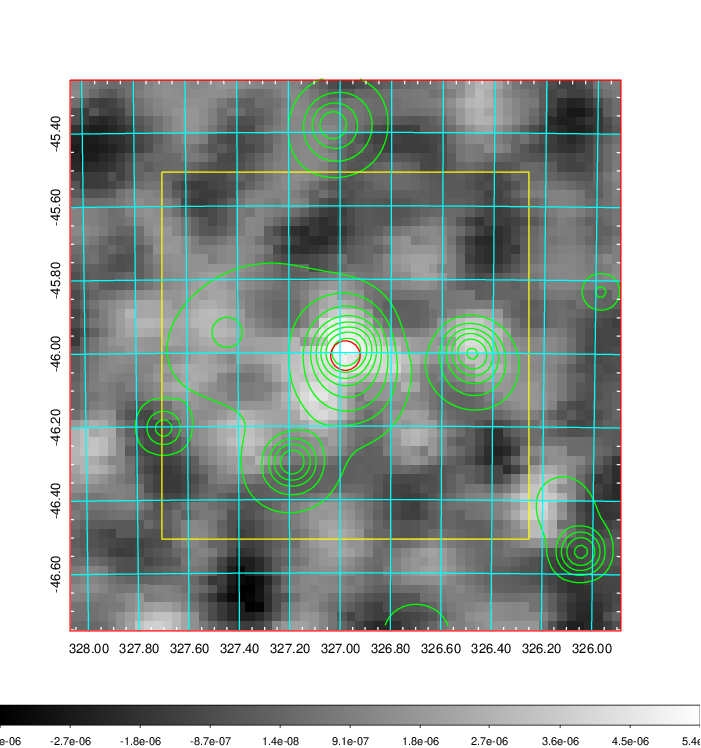 |

|[Redshift Histogram](../image/861/861_zg.pdf) | [DSS image(z1)](../image/861/861_dss_z1.pdf)      |  [DSS image(z2)](../image/861/861_dss_z2.pdf)    |
|-------------------|--------------------|-------------------|
|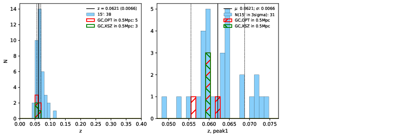 |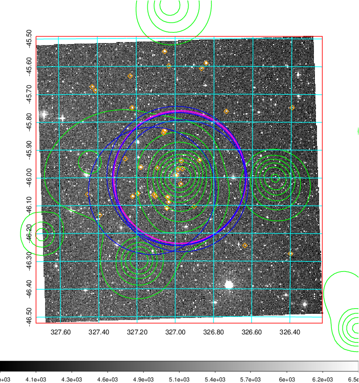  Blue circle for optical clusters;  Magenta circle for XSZ clusters;  all with r=1Mpc;  Only GC with Delta_z<0.01 are shown. | 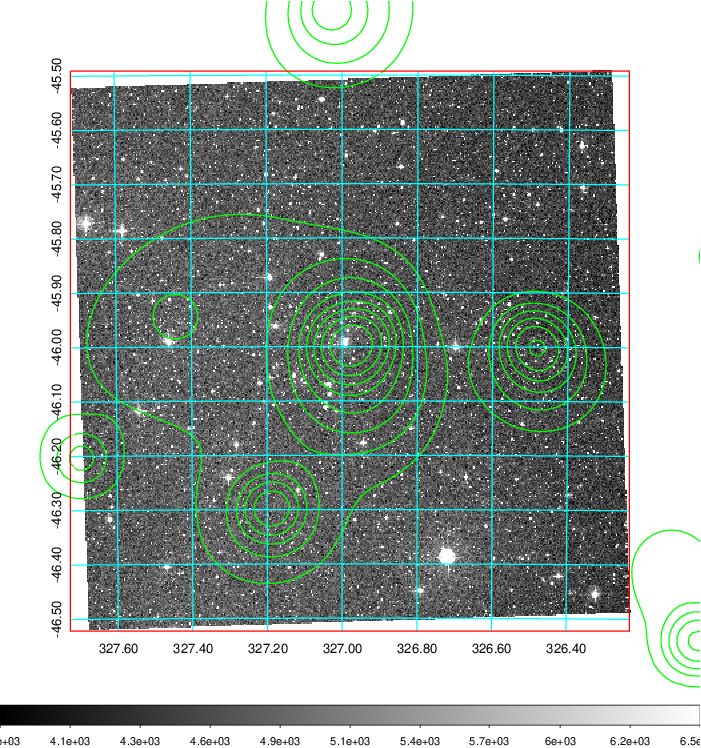 Blue circle for optical clusters;  Magenta circle for XSZ clusters;  all with r=1Mpc;  Only GC with Delta_z<0.01 are shown.  |

|[Previous-identified clusters](../image/861/861_gc.pdf) | [2MASS image](../image/861/861_2mass.pdf)      |
|-------------------|-------------------|
|  Green, magenta, and blue circles  for optical, X-ray and SZ clusters  respectively, with redshift of clusters  labelled. The radius of circles  are 1Mpc.|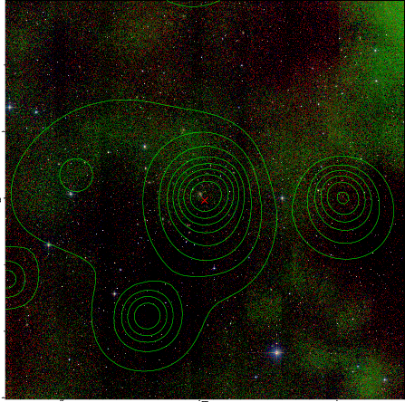  |

|[DES image](../image/861/861_des.pdf)   |
|-------------------|
| 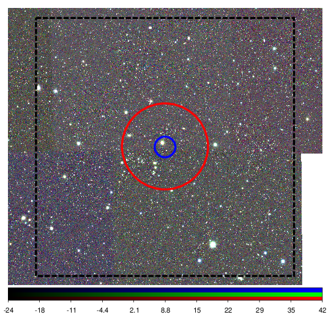  |
