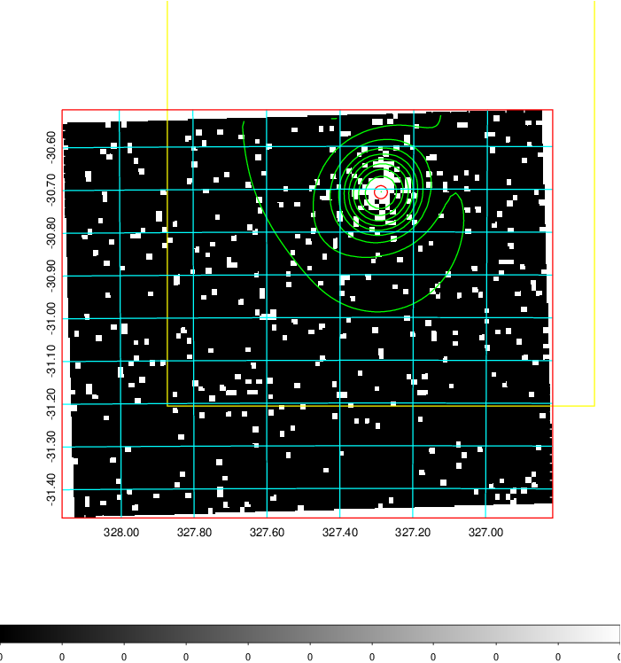
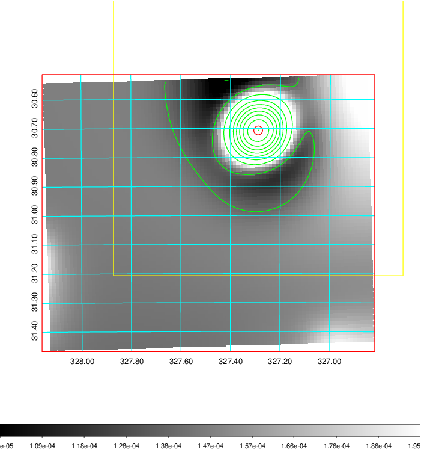
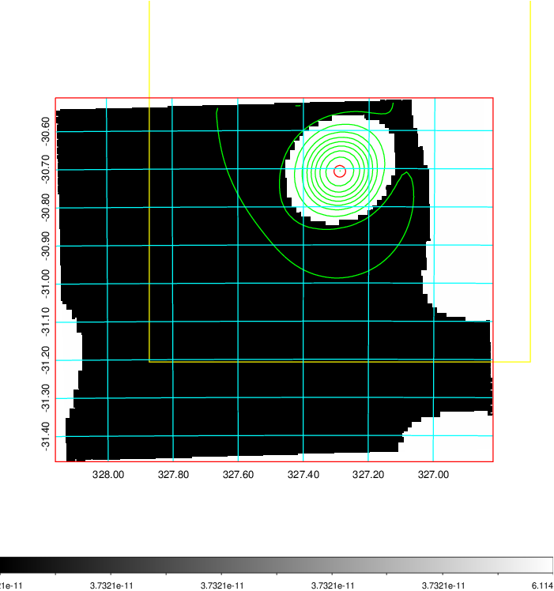
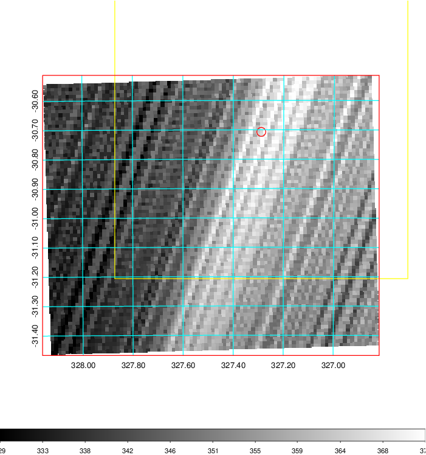
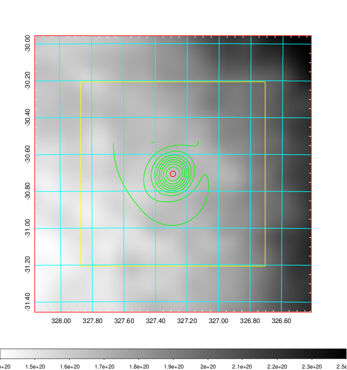
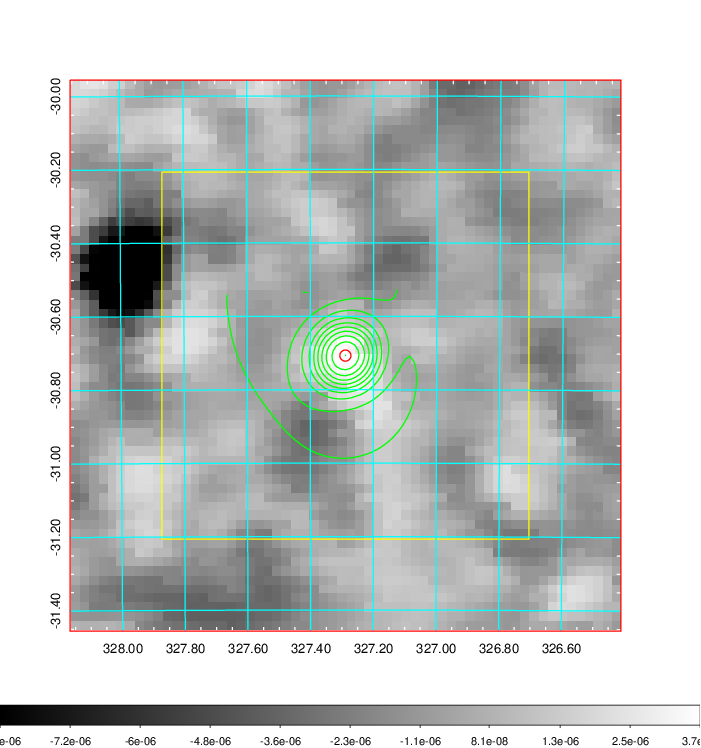
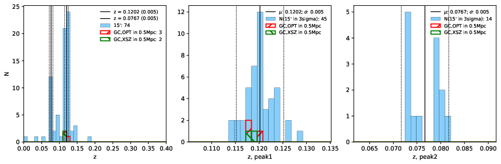
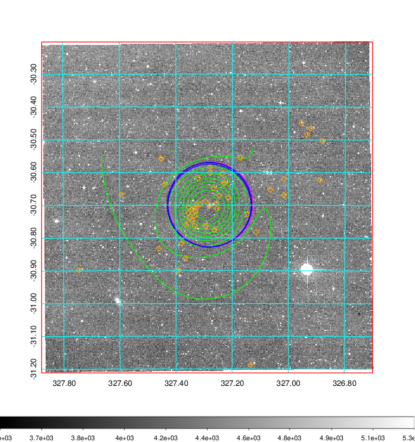
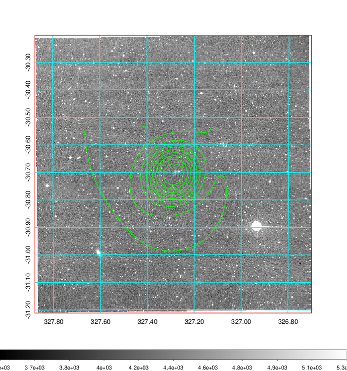
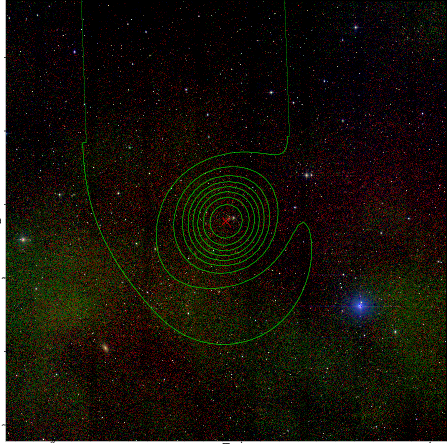

### 862

|Name|RAJ2000[deg]|DEJ2000[deg] |Ext[arcmin]| Ext,ml | z | z_src| C|GC(XSZ,Delta_z<0.01)| GC(OPT,Delta_z<0.01)|GC| R_sig[arcmin] | R500[arcmin] | R500[Mpc]| CRsig[c/s] | CR500[c/s] |L500[1E44 erg/s]|F500[1E-12 erg/s/cm^2]| M500[1E14 Msun]|Tx[keV]|Cnt_sig|Beta|Rc[arcmin]|Comment|Alias|
|---|---|---|---|---|---|------|---|--------|---------|----------|---|---|---|---|---|---|---|---|---|---|---|---|---|---|
|862| 327.289| -30.707| 0.91| 32.26| 0.1202(0.005)| z1, z_xsz| B| MCXC, XB| A, W| A, MCXC, W, XB| 22.231| 8.493| 1.104| 0.435(0.050)| 0.395(0.045)| 2.969(0.192)| 7.891(0.510)| 4.30(0.14)| 5.47(0.11)| 140.3| 0.535(-0.021+0.026)| 0.935(-0.356+0.347)| -| k025|

|[RASS image](../image/862/862_img.pdf)|[filtered image](../image/862/862_fil.pdf)|[Segment image](../image/862/862_seg.pdf)|
|-------------------|--------------------|-------------------|
|   |    |   |

|[Exposure image](../image/862/862_mex.pdf)| [nH image](../image/862/862_nh.pdf)| [Planck image](../image/862/862_p.pdf)|
|-------------------|--------------------|-------------------|
|   |     |  |

|[Redshift Histogram](../image/862/862_zg.pdf) | [DSS image(z1)](../image/862/862_dss_z1.pdf)      |  [DSS image(z2)](../image/862/862_dss_z2.pdf)    |
|-------------------|--------------------|-------------------|
| |  Blue circle for optical clusters;  Magenta circle for XSZ clusters;  all with r=1Mpc;  Only GC with Delta_z<0.01 are shown. |  Blue circle for optical clusters;  Magenta circle for XSZ clusters;  all with r=1Mpc;  Only GC with Delta_z<0.01 are shown.  |

|[known Abell/XSZ clusters](../image/862/862_gc.pdf) | [2MASS image](../image/862/862_2mass.pdf)      |
|-------------------|-------------------|
|  Magenta, blue and green circles  for optical, X-ray and SZ clusters  respectively, with redshift of clusters  labelled. The radius of circles  are 1Mpc.|  |

|[ATLAS image](../image/862/862_s.pdf)        |
|-------------------|
|   |
