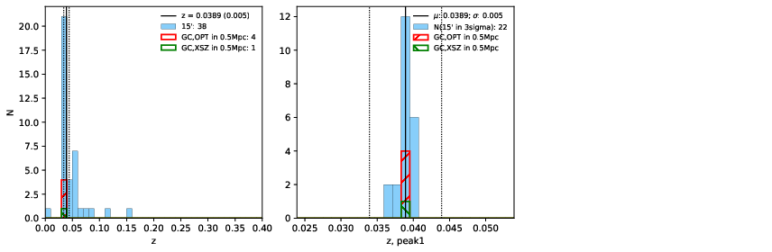

### 863

|Name|RAJ2000[deg]|DEJ2000[deg] |Ext[arcmin]| Ext,ml | z | z_src| C|GC(XSZ,Delta_z<0.01)| GC(OPT,Delta_z<0.01)|GC| R_sig[arcmin] | R500[arcmin] | R500[Mpc]| CRsig[c/s] | CR500[c/s] |L500[1E44 erg/s]|F500[1E-12 erg/s/cm^2]| M500[1E14 Msun]|Tx[keV]|Cnt_sig|Beta|Rc[arcmin]|Comment|Alias|
|---|---|---|---|---|---|------|---|--------|---------|----------|---|---|---|---|---|---|---|---|---|---|---|---|---|---|
|863| 327.880| -55.352| 4.30| 43.68| 0.0389(0.005)| z1, z_xsz| B| MCXC| A, N| A, MCXC, N| 12.700| 13.589| 0.628| 0.231(0.040)| 0.234(0.041)| 0.143(0.018)| 4.059(0.499)| 0.73(0.05)| 1.79(0.07)| 101.7| 0.670(-0.122+0.193)| 5.526(-1.629+2.063)| -| k499|

|[RASS image](../image/863/863_img.pdf)|[filtered image](../image/863/863_fil.pdf)|[Segment image](../image/863/863_seg.pdf)|
|-------------------|--------------------|-------------------|
|   |    |   |

|[Exposure image](../image/863/863_mex.pdf)| [nH image](../image/863/863_nh.pdf)| [Planck image](../image/863/863_p.pdf)|
|-------------------|--------------------|-------------------|
|   |     |  |

|[Redshift Histogram](../image/863/863_zg.pdf) | [DSS image(z1)](../image/863/863_dss_z1.pdf)      |  [DSS image(z2)](../image/863/863_dss_z2.pdf)    |
|-------------------|--------------------|-------------------|
| |  Blue circle for optical clusters;  Magenta circle for XSZ clusters;  all with r=1Mpc;  Only GC with Delta_z<0.01 are shown. |  Blue circle for optical clusters;  Magenta circle for XSZ clusters;  all with r=1Mpc;  Only GC with Delta_z<0.01 are shown.  |

|[known Abell/XSZ clusters](../image/863/863_gc.pdf) | [2MASS image](../image/863/863_2mass.pdf)      |
|-------------------|-------------------|
|  Magenta, blue and green circles  for optical, X-ray and SZ clusters  respectively, with redshift of clusters  labelled. The radius of circles  are 1Mpc.|  |

|[DES image](../image/863/863_des.pdf)   |
|-------------------|
|   |
