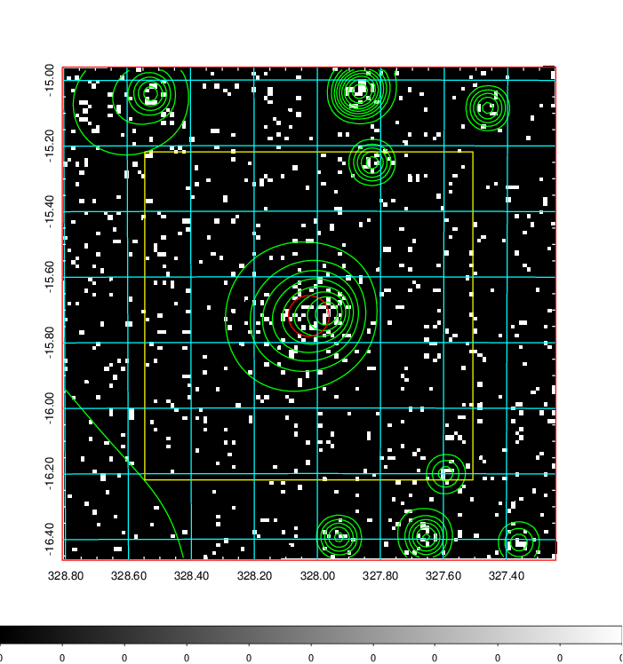
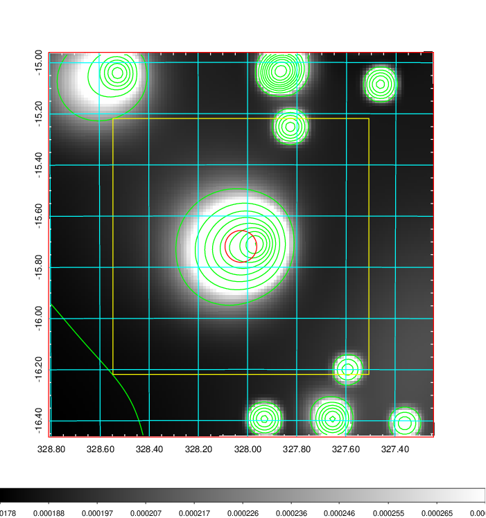
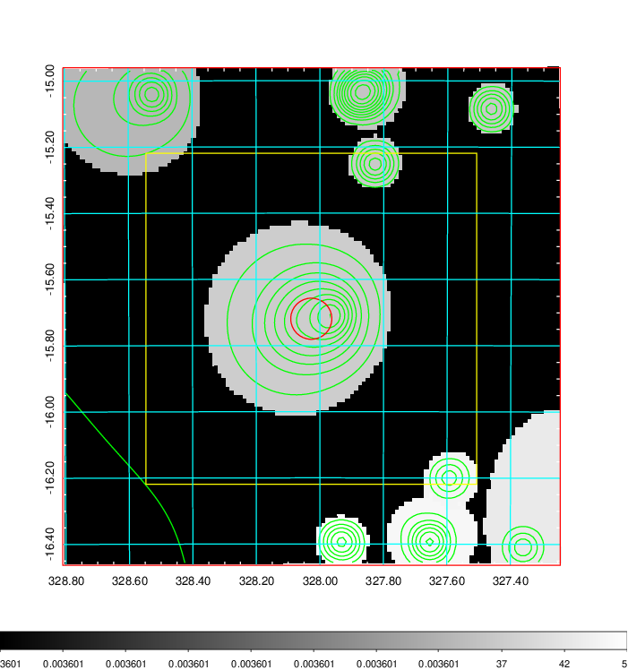
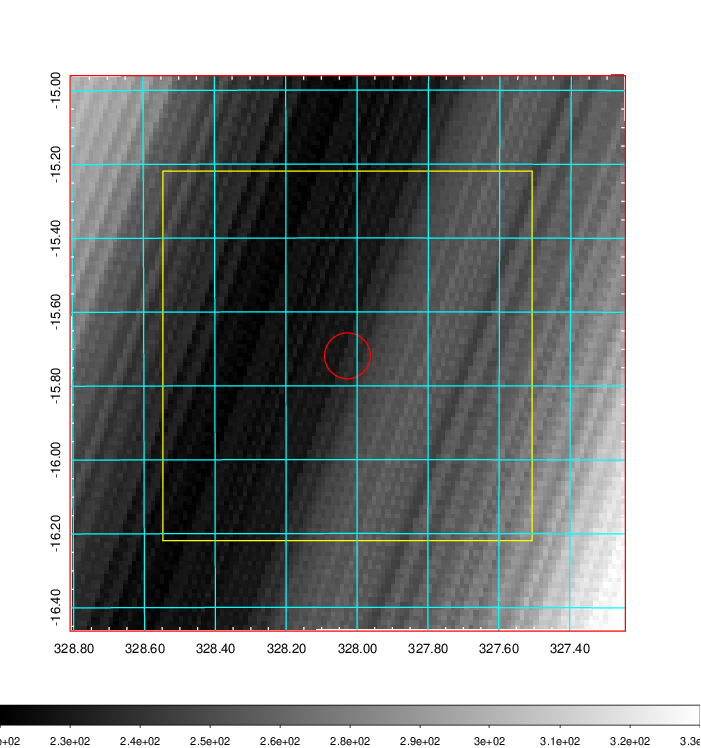
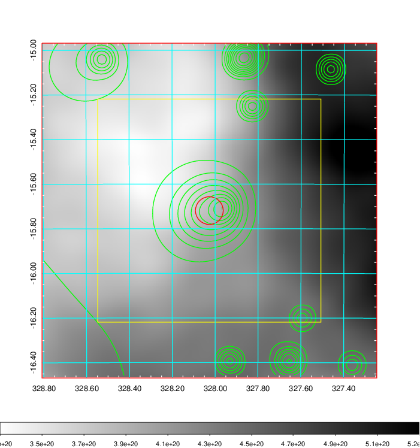
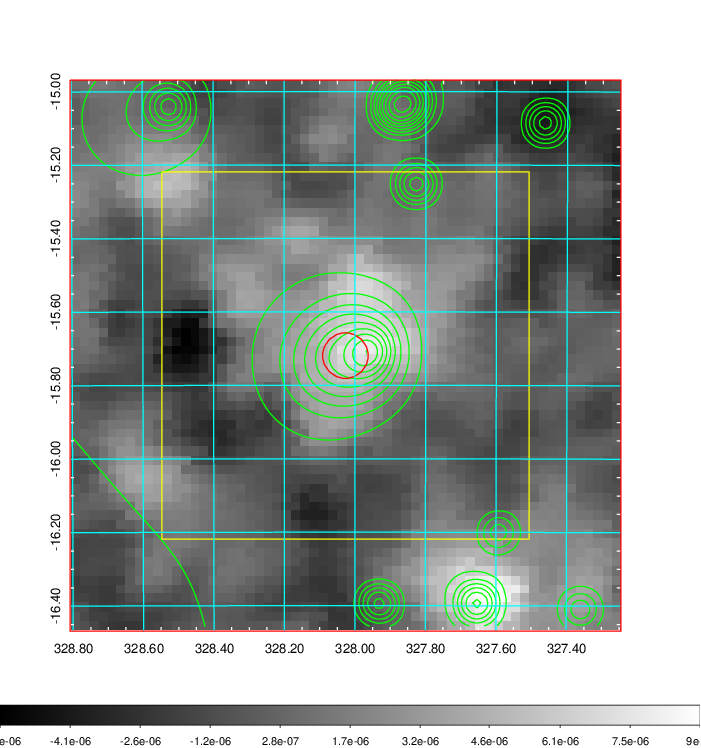
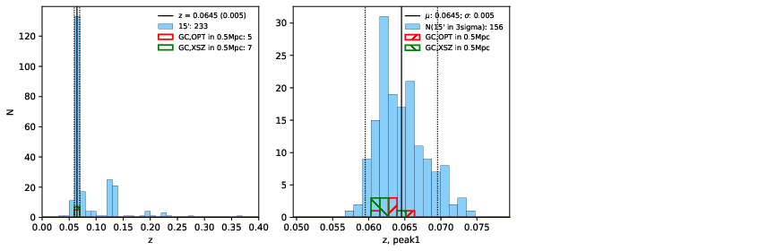
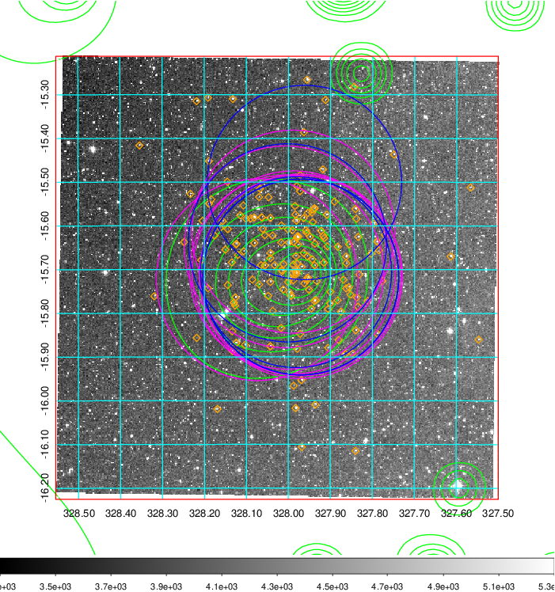
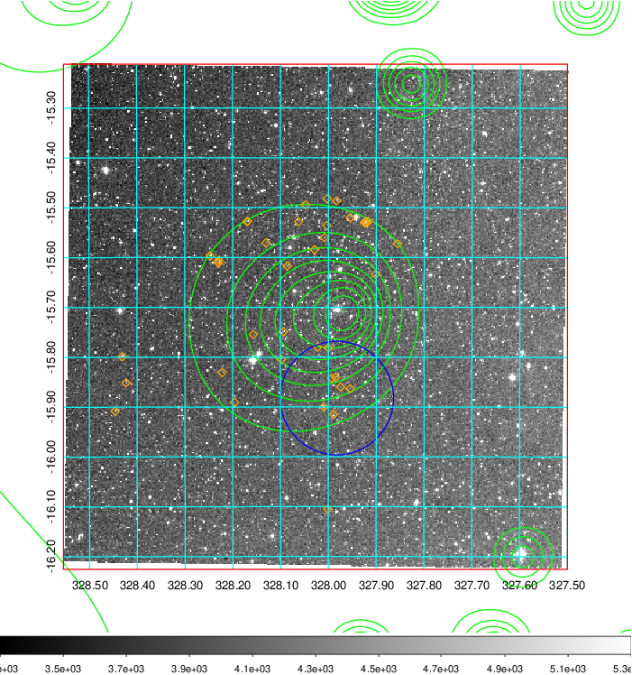
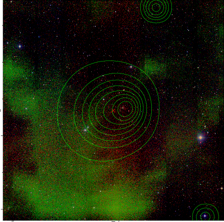

### 864

|Name|RAJ2000[deg]|DEJ2000[deg] |Ext[arcmin]| Ext,ml | z | z_src| C|GC(XSZ,Delta_z<0.01)| GC(OPT,Delta_z<0.01)|GC| R_sig[arcmin] | R500[arcmin] | R500[Mpc]| CRsig[c/s] | CR500[c/s] |L500[1E44 erg/s]|F500[1E-12 erg/s/cm^2]| M500[1E14 Msun]|Tx[keV]|Cnt_sig|Beta|Rc[arcmin]|Comment|Alias|
|---|---|---|---|---|---|------|---|--------|---------|----------|---|---|---|---|---|---|---|---|---|---|---|---|---|---|
|864| 328.027| -15.719| 3.73| 41.74| 0.0645(0.005)| z1, z_xsz| B| L03, MCXC, PSZ2, Tar, XB| A, N, W| A, L03, MCXC, N, PSZ2, Tar, W, XB| 40.600| 11.234| 0.836| 0.365(0.121)| 0.326(0.108)| 0.587(0.136)| 5.846(1.350)| 1.76(0.21)| 3.10(0.23)| 99.3| 0.782(-0.109+0.133)| 6.720(-1.377+1.397)| -| k456|

|[RASS image](../image/864/864_img.pdf)|[filtered image](../image/864/864_fil.pdf)|[Segment image](../image/864/864_seg.pdf)|
|-------------------|--------------------|-------------------|
|   |    |   |

|[Exposure image](../image/864/864_mex.pdf)| [nH image](../image/864/864_nh.pdf)| [Planck image](../image/864/864_p.pdf)|
|-------------------|--------------------|-------------------|
|   |     |  |

|[Redshift Histogram](../image/864/864_zg.pdf) | [DSS image(z1)](../image/864/864_dss_z1.pdf)      |  [DSS image(z2)](../image/864/864_dss_z2.pdf)    |
|-------------------|--------------------|-------------------|
| |  Blue circle for optical clusters;  Magenta circle for XSZ clusters;  all with r=1Mpc;  Only GC with Delta_z<0.01 are shown. |  Blue circle for optical clusters;  Magenta circle for XSZ clusters;  all with r=1Mpc;  Only GC with Delta_z<0.01 are shown.  |

|[known Abell/XSZ clusters](../image/864/864_gc.pdf) | [2MASS image](../image/864/864_2mass.pdf)      |
|-------------------|-------------------|
|  Magenta, blue and green circles  for optical, X-ray and SZ clusters  respectively, with redshift of clusters  labelled. The radius of circles  are 1Mpc.|  |

|[ATLAS image](../image/864/864_s.pdf)        |
|-------------------|
|   |
