

### 866

|Name|RAJ2000[deg]|DEJ2000[deg] |Ext[arcmin]| Ext,ml | z | z_src| C|GC(XSZ,Delta_z<0.01)| GC(OPT,Delta_z<0.01)|GC| R_sig[arcmin] | R500[arcmin] | R500[Mpc]| CRsig[c/s] | CR500[c/s] |L500[1E44 erg/s]|F500[1E-12 erg/s/cm^2]| M500[1E14 Msun]|Tx[keV]|Cnt_sig|Beta|Rc[arcmin]|Comment|Alias|
|---|---|---|---|---|---|------|---|--------|---------|----------|---|---|---|---|---|---|---|---|---|---|---|---|---|---|
|866| 328.402| 17.687| 0.89| 29.59| 0.2269(0.005)| z1, z_xsz| B| MCXC, PSZ2, Tar, XB| A, N, RM, W| A, C, F20, MCXC, N, PSZ2, Tar, W, XB| 6.850| 6.680| 1.458| 0.441(0.056)| 0.439(0.056)| 12.529(0.459)| 8.212(0.301)| 11.06(0.18)| 10.16(0.11)| 114.6| 0.881(-0.107+0.083)| 2.647(-0.520+0.393)| -| k024|

|[RASS image](../image/866/866_img.pdf)|[filtered image](../image/866/866_fil.pdf)|[Segment image](../image/866/866_seg.pdf)|
|-------------------|--------------------|-------------------|
| 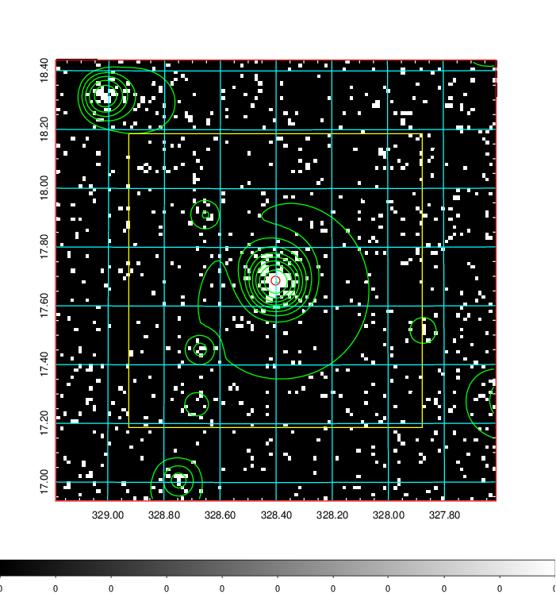  | 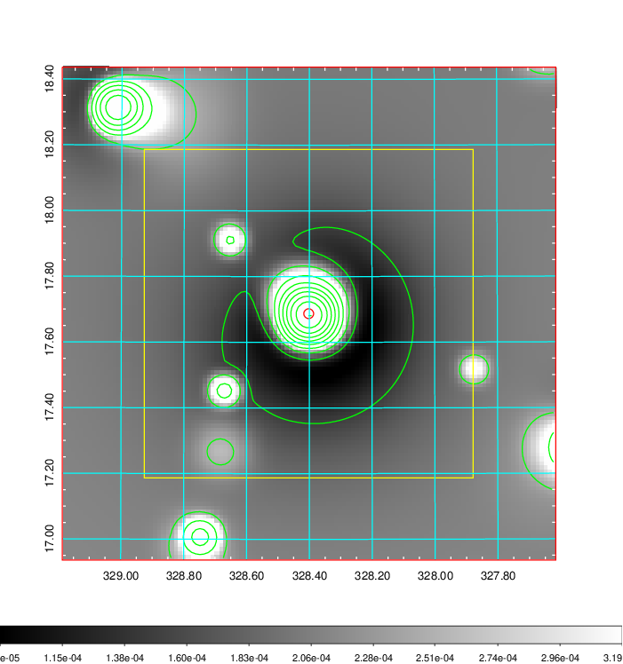   | 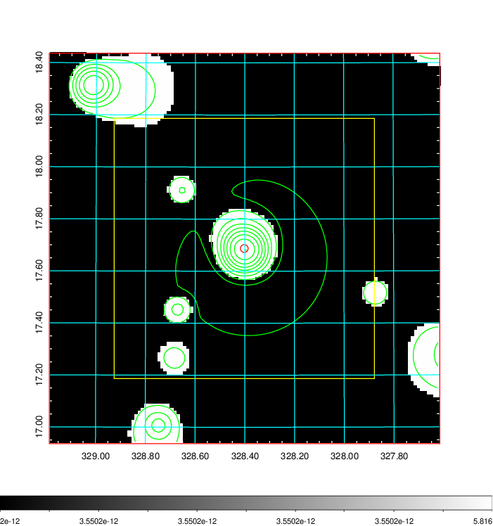  |

|[Exposure image](../image/866/866_mex.pdf)| [nH image](../image/866/866_nh.pdf)| [Planck image](../image/866/866_p.pdf)|
|-------------------|--------------------|-------------------|
|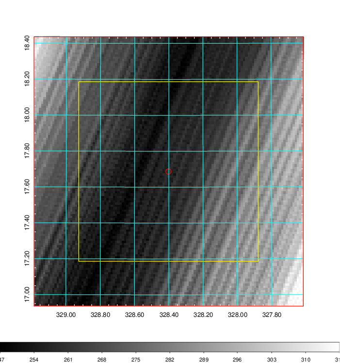   | 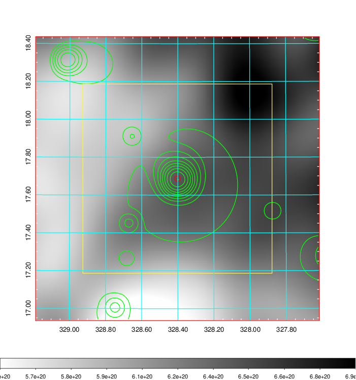    | 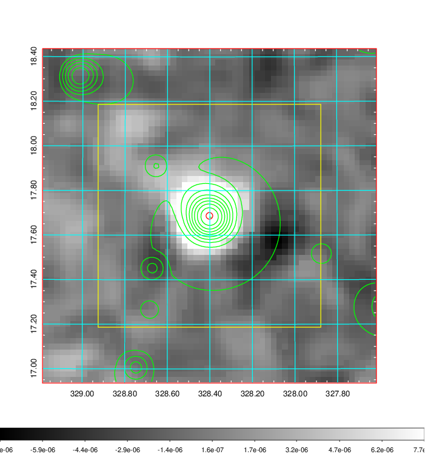 |

|[Redshift Histogram](../image/866/866_zg.pdf) | [DSS image(z1)](../image/866/866_dss_z1.pdf)      |  [DSS image(z2)](../image/866/866_dss_z2.pdf)    |
|-------------------|--------------------|-------------------|
|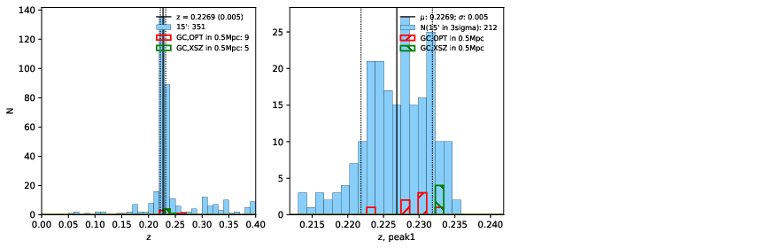 |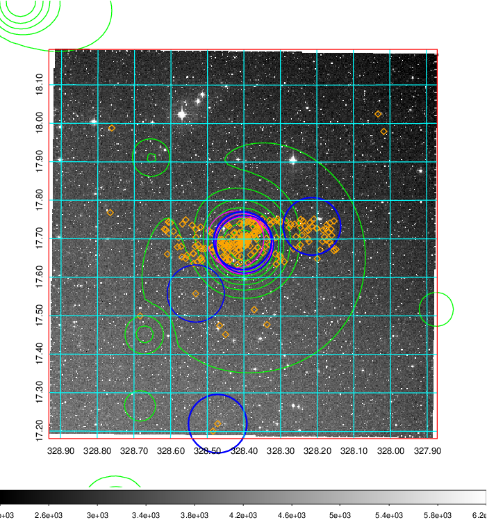  Blue circle for optical clusters;  Magenta circle for XSZ clusters;  all with r=1Mpc;  Only GC with Delta_z<0.01 are shown. | 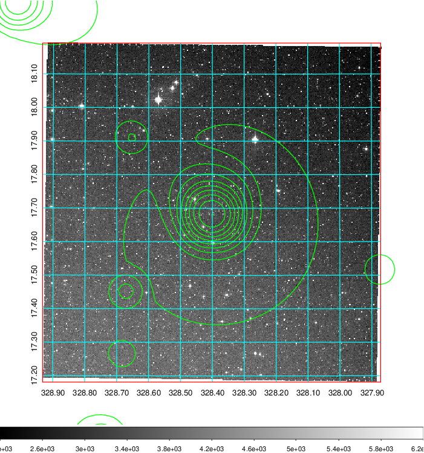 Blue circle for optical clusters;  Magenta circle for XSZ clusters;  all with r=1Mpc;  Only GC with Delta_z<0.01 are shown.  |

|[Previous-identified clusters](../image/866/866_gc.pdf) | [2MASS image](../image/866/866_2mass.pdf)      |[SDSS image](../image/866/866_sdss.pdf)   |
|-------------------|-------------------|-------------------|
|  Green, magenta, and blue circles  for optical, X-ray and SZ clusters  respectively, with redshift of clusters  labelled. The radius of circles  are 1Mpc.|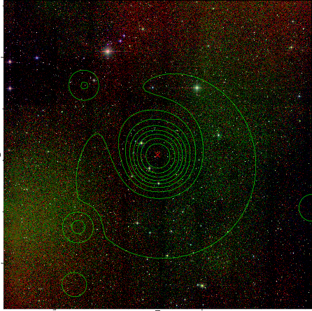  | 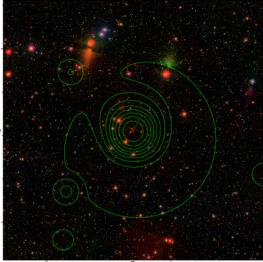  |

