

### 867

|Name|RAJ2000[deg]|DEJ2000[deg] |Ext[arcmin]| Ext,ml | z | z_src| C|GC(XSZ,Delta_z<0.01)| GC(OPT,Delta_z<0.01)|GC| R_sig[arcmin] | R500[arcmin] | R500[Mpc]| CRsig[c/s] | CR500[c/s] |L500[1E44 erg/s]|F500[1E-12 erg/s/cm^2]| M500[1E14 Msun]|Tx[keV]|Cnt_sig|Beta|Rc[arcmin]|Comment|Alias|
|---|---|---|---|---|---|------|---|--------|---------|----------|---|---|---|---|---|---|---|---|---|---|---|---|---|---|
|867| 328.410| -44.136| 4.06| 27.06| 0.1386(0.005)| z1,| G| -| -| A, N, W| 25.194| 6.779| 0.995| 0.211(0.063)| 0.188(0.057)| 1.961(0.694)| 3.829(1.354)| 3.21(0.56)| 4.59(0.51)| 77.2| 0.862(-0.125+0.096)| 9.852(-1.802+1.323)| An Abell cluster with $z$ = 0.1444 and offset = 1.49 Mpc(9.92 arcmin)| t199|

|[RASS image](../image/867/867_img.pdf)|[filtered image](../image/867/867_fil.pdf)|[Segment image](../image/867/867_seg.pdf)|
|-------------------|--------------------|-------------------|
| 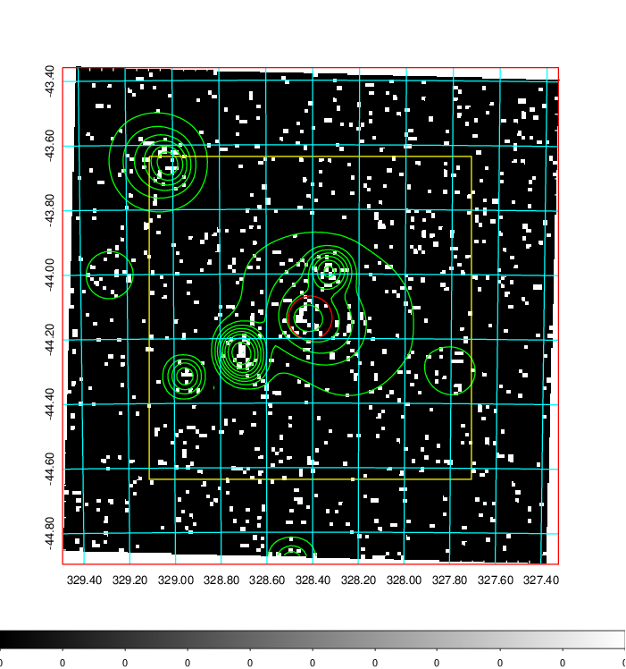  | 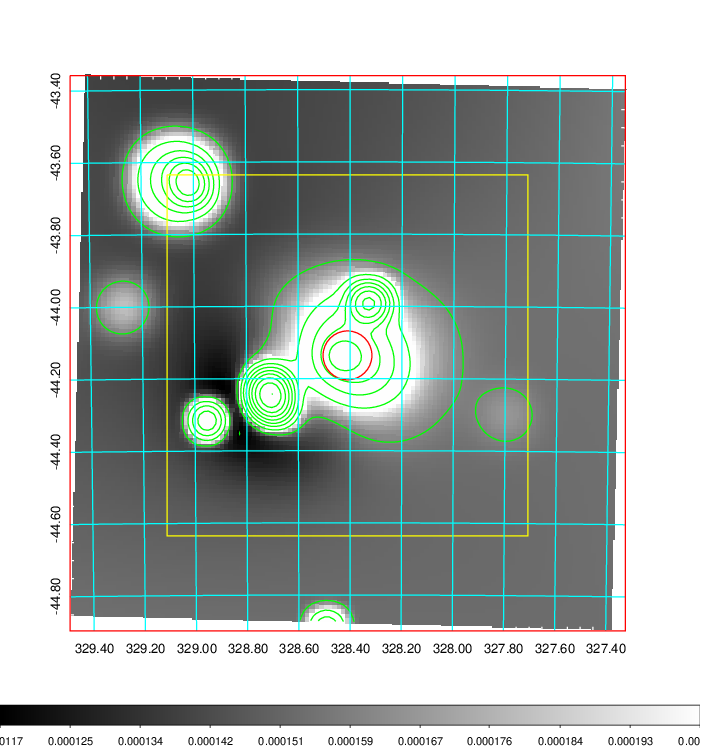   | 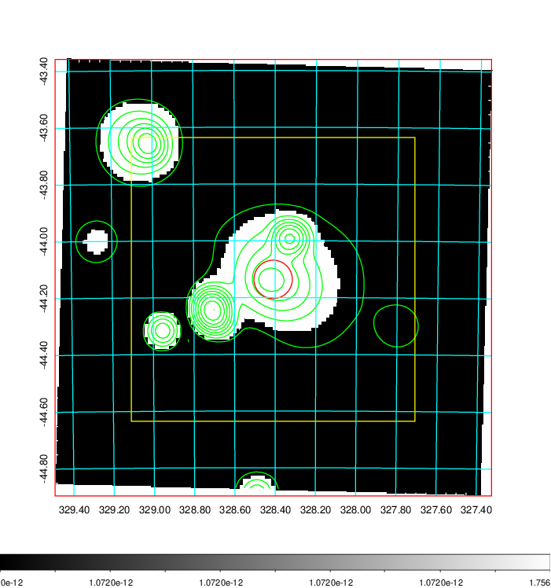  |

|[Exposure image](../image/867/867_mex.pdf)| [nH image](../image/867/867_nh.pdf)| [Planck image](../image/867/867_p.pdf)|
|-------------------|--------------------|-------------------|
|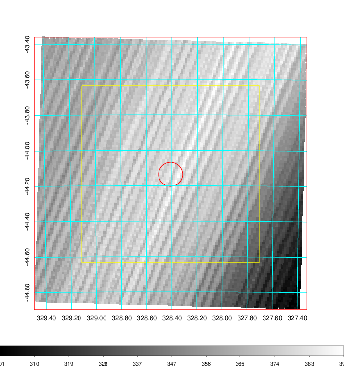   | 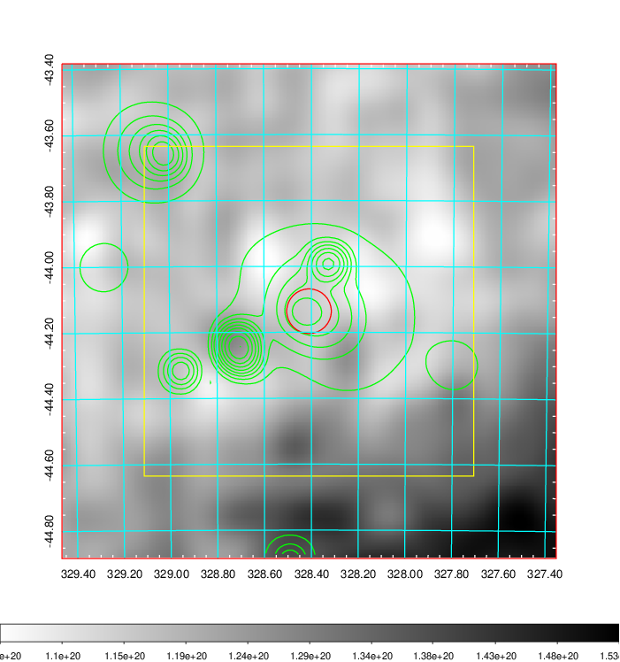    | 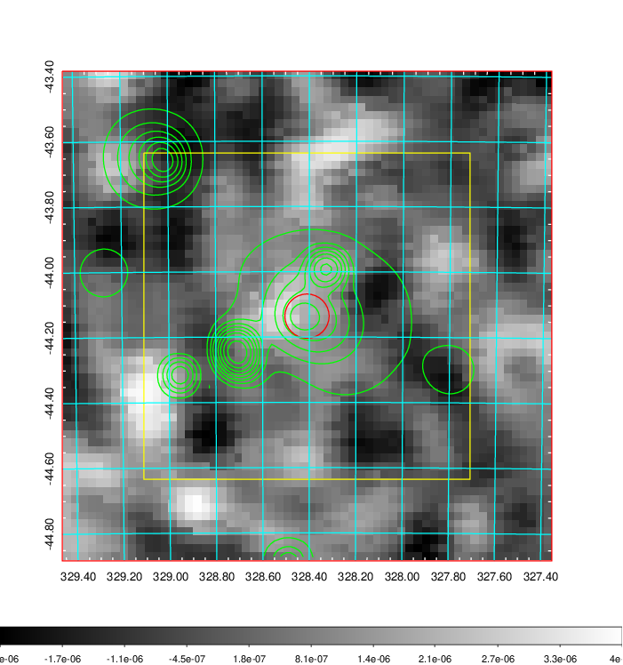 |

|[Redshift Histogram](../image/867/867_zg.pdf) | [DSS image(z1)](../image/867/867_dss_z1.pdf)      |  [DSS image(z2)](../image/867/867_dss_z2.pdf)    |
|-------------------|--------------------|-------------------|
|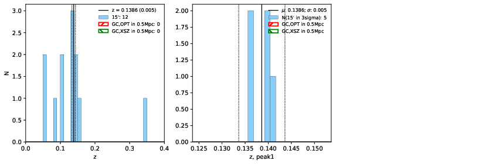 |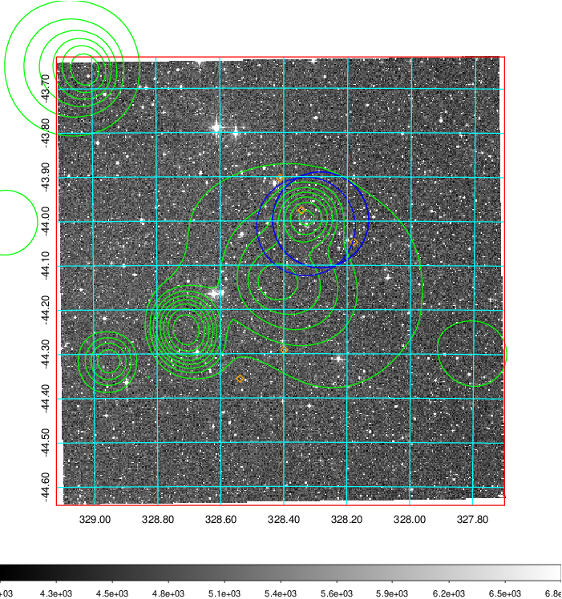  Blue circle for optical clusters;  Magenta circle for XSZ clusters;  all with r=1Mpc;  Only GC with Delta_z<0.01 are shown. | 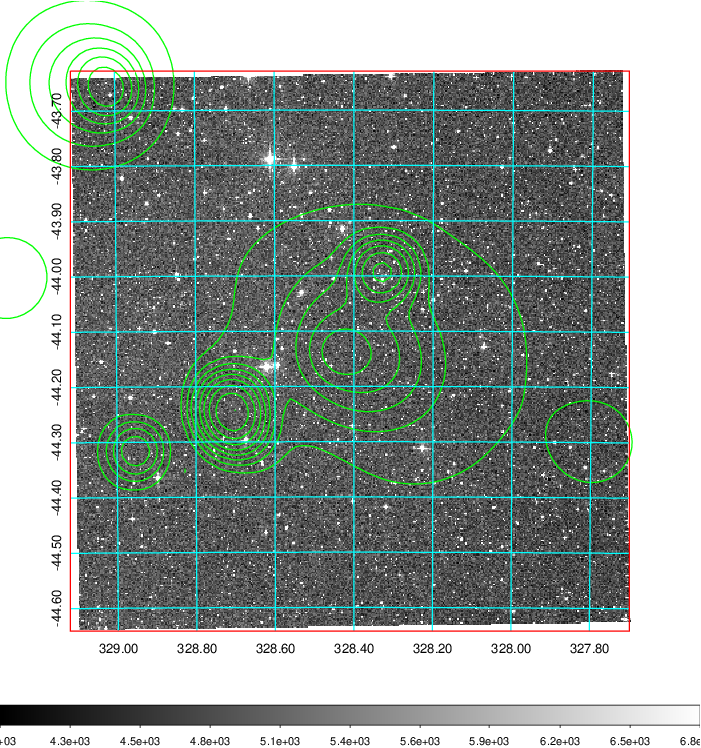 Blue circle for optical clusters;  Magenta circle for XSZ clusters;  all with r=1Mpc;  Only GC with Delta_z<0.01 are shown.  |

|[Previous-identified clusters](../image/867/867_gc.pdf) | [2MASS image](../image/867/867_2mass.pdf)      |
|-------------------|-------------------|
|  Green, magenta, and blue circles  for optical, X-ray and SZ clusters  respectively, with redshift of clusters  labelled. The radius of circles  are 1Mpc.|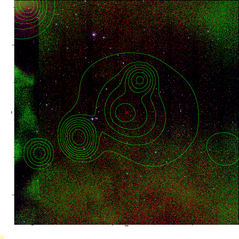  |

|[DES image](../image/867/867_des.pdf)   |
|-------------------|
| 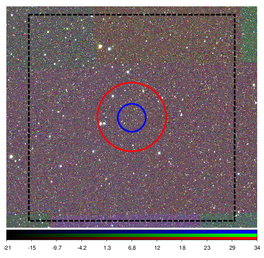  |
