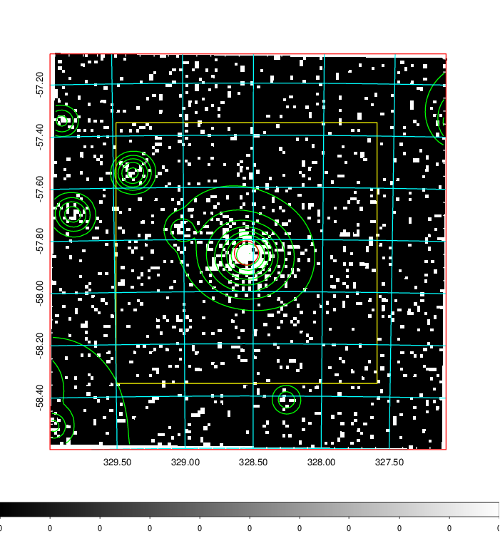
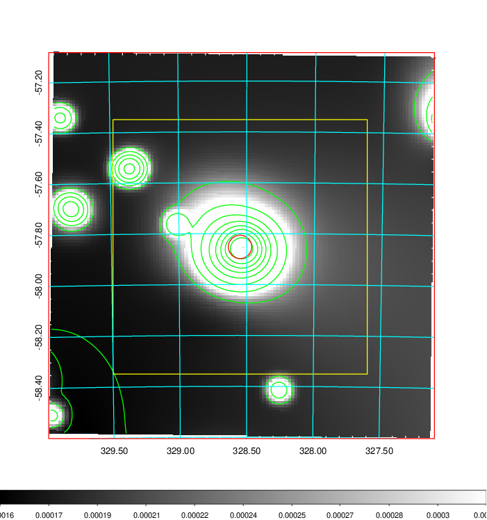
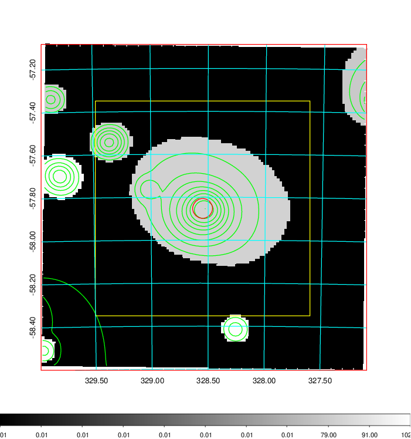
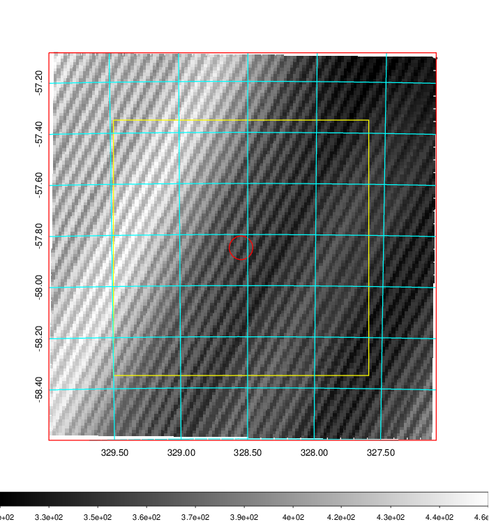
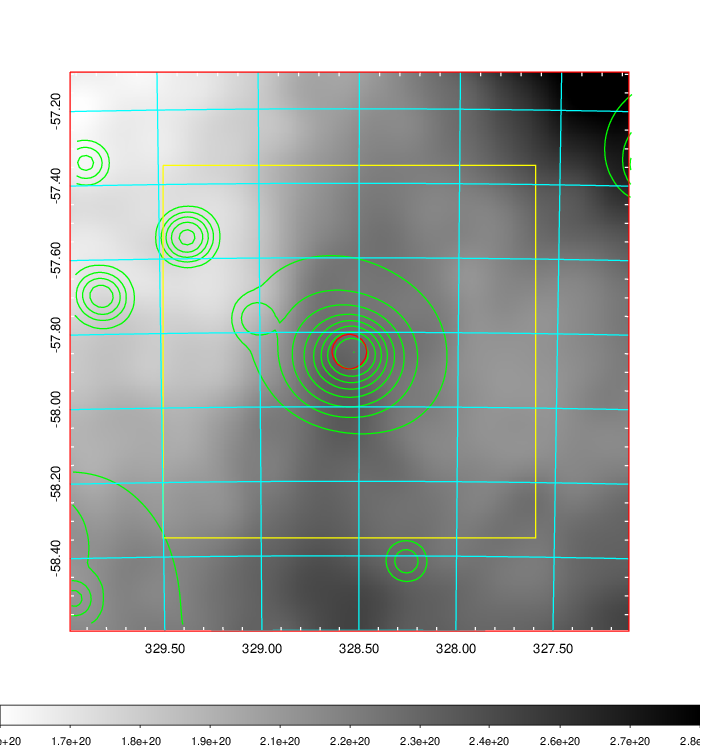
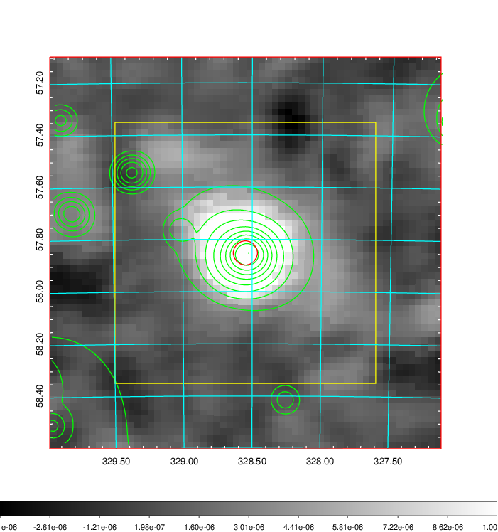
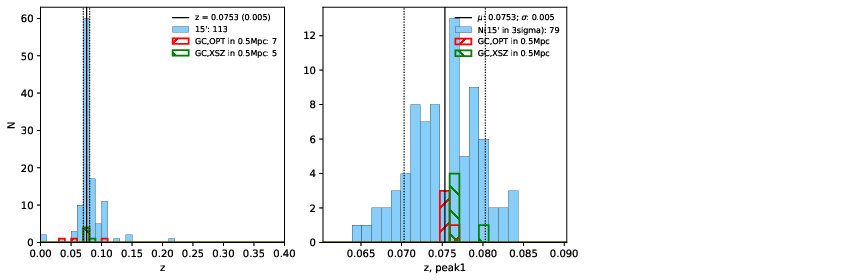
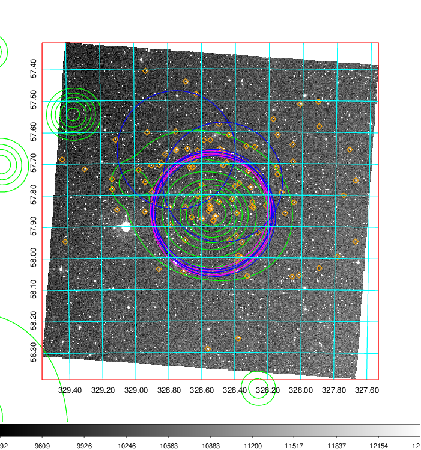
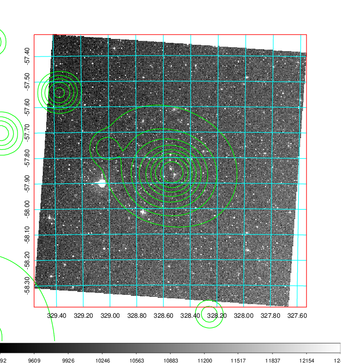
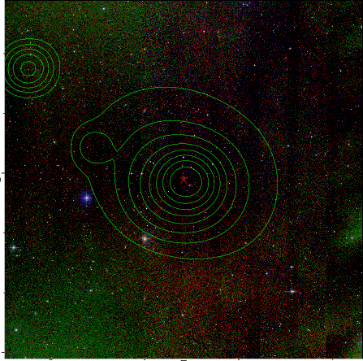

### 868

|Name|RAJ2000[deg]|DEJ2000[deg] |Ext[arcmin]| Ext,ml | z | z_src| C|GC(XSZ,Delta_z<0.01)| GC(OPT,Delta_z<0.01)|GC| R_sig[arcmin] | R500[arcmin] | R500[Mpc]| CRsig[c/s] | CR500[c/s] |L500[1E44 erg/s]|F500[1E-12 erg/s/cm^2]| M500[1E14 Msun]|Tx[keV]|Cnt_sig|Beta|Rc[arcmin]|Comment|Alias|
|---|---|---|---|---|---|------|---|--------|---------|----------|---|---|---|---|---|---|---|---|---|---|---|---|---|---|
|868| 328.549| -57.852| 2.77| 256.09| 0.0753(0.005)| z1, z_xsz| B| MCXC, PSZ2, Tar, XB| A, W| A, MCXC, N, PSZ2, Tar, W, XB| 22.725| 12.377| 1.061| 0.838(0.079)| 0.779(0.074)| 2.086(0.092)| 15.007(0.663)| 3.65(0.08)| 4.87(0.07)| 301.0| 0.723(-0.043+0.052)| 4.129(-0.472+0.533)| -| k348|

|[RASS image](../image/868/868_img.pdf)|[filtered image](../image/868/868_fil.pdf)|[Segment image](../image/868/868_seg.pdf)|
|-------------------|--------------------|-------------------|
|   |    |   |

|[Exposure image](../image/868/868_mex.pdf)| [nH image](../image/868/868_nh.pdf)| [Planck image](../image/868/868_p.pdf)|
|-------------------|--------------------|-------------------|
|   |     |  |

|[Redshift Histogram](../image/868/868_zg.pdf) | [DSS image(z1)](../image/868/868_dss_z1.pdf)      |  [DSS image(z2)](../image/868/868_dss_z2.pdf)    |
|-------------------|--------------------|-------------------|
| |  Blue circle for optical clusters;  Magenta circle for XSZ clusters;  all with r=1Mpc;  Only GC with Delta_z<0.01 are shown. |  Blue circle for optical clusters;  Magenta circle for XSZ clusters;  all with r=1Mpc;  Only GC with Delta_z<0.01 are shown.  |

|[known Abell/XSZ clusters](../image/868/868_gc.pdf) | [2MASS image](../image/868/868_2mass.pdf)      |
|-------------------|-------------------|
|  Magenta, blue and green circles  for optical, X-ray and SZ clusters  respectively, with redshift of clusters  labelled. The radius of circles  are 1Mpc.|  |

|[DES image](../image/868/868_des.pdf)   |
|-------------------|
|   |
