

### 869

|Name|RAJ2000[deg]|DEJ2000[deg] |Ext[arcmin]| Ext,ml | z | z_src| C|GC(XSZ,Delta_z<0.01)| GC(OPT,Delta_z<0.01)|GC| R_sig[arcmin] | R500[arcmin] | R500[Mpc]| CRsig[c/s] | CR500[c/s] |L500[1E44 erg/s]|F500[1E-12 erg/s/cm^2]| M500[1E14 Msun]|Tx[keV]|Cnt_sig|Beta|Rc[arcmin]|Comment|Alias|
|---|---|---|---|---|---|------|---|--------|---------|----------|---|---|---|---|---|---|---|---|---|---|---|---|---|---|
|869| 329.249| 28.016| 5.11| 25.78| 0.0687(0.005)| z1, z_xsz| B| F20, SPI| -| C, F20, SPI, W| 12.700| 7.868| 0.620| 0.069(0.029)| 0.065(0.028)| 0.118(0.033)| 1.030(0.291)| 0.72(0.11)| 1.79(0.16)| 51.7| 0.850(-0.153+0.106)| 6.276(-1.398+1.107)| -| t266|

|[RASS image](../image/869/869_img.pdf)|[filtered image](../image/869/869_fil.pdf)|[Segment image](../image/869/869_seg.pdf)|
|-------------------|--------------------|-------------------|
| 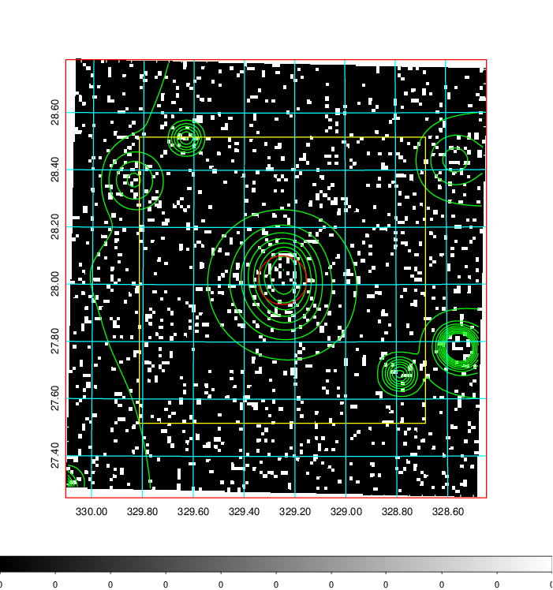  | 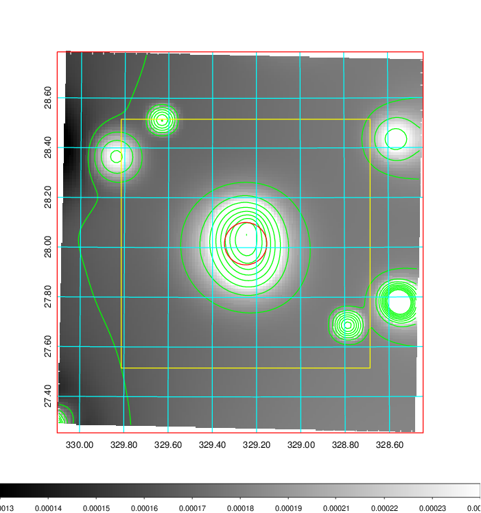   | 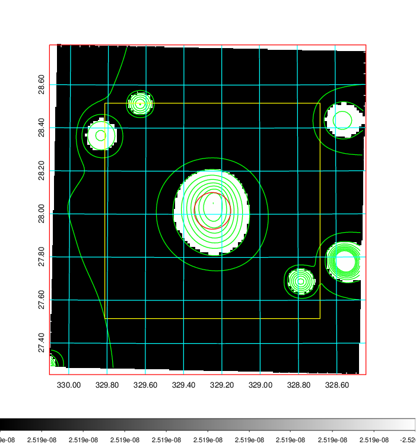  |

|[Exposure image](../image/869/869_mex.pdf)| [nH image](../image/869/869_nh.pdf)| [Planck image](../image/869/869_p.pdf)|
|-------------------|--------------------|-------------------|
|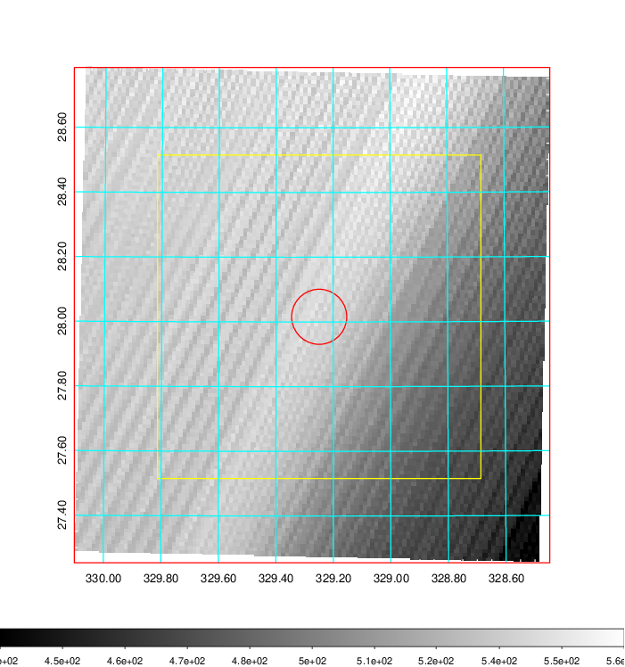   | 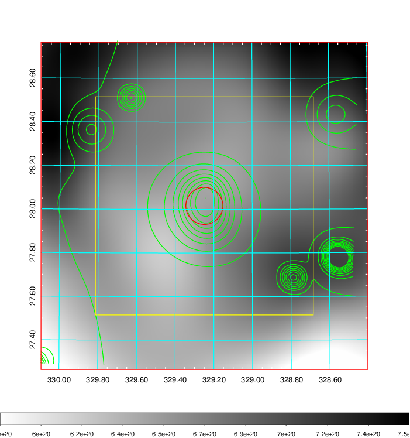    | 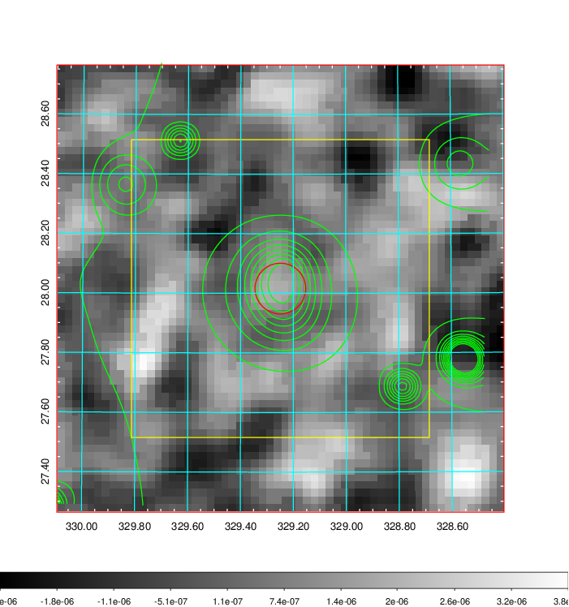 |

|[Redshift Histogram](../image/869/869_zg.pdf) | [DSS image(z1)](../image/869/869_dss_z1.pdf)      |  [DSS image(z2)](../image/869/869_dss_z2.pdf)    |
|-------------------|--------------------|-------------------|
|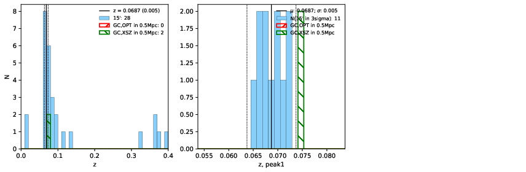 |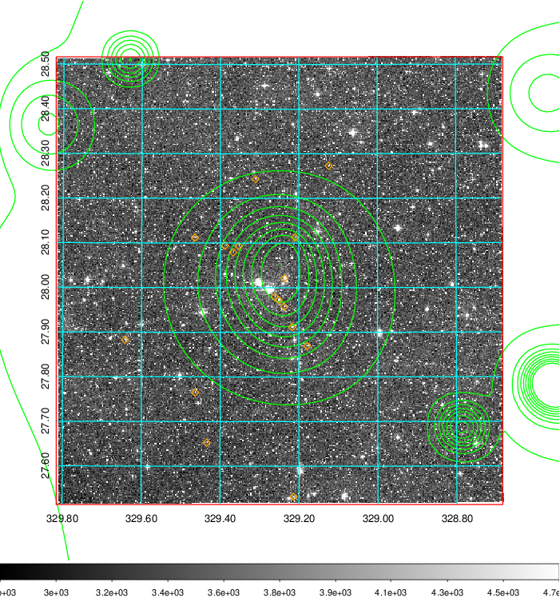  Blue circle for optical clusters;  Magenta circle for XSZ clusters;  all with r=1Mpc;  Only GC with Delta_z<0.01 are shown. | 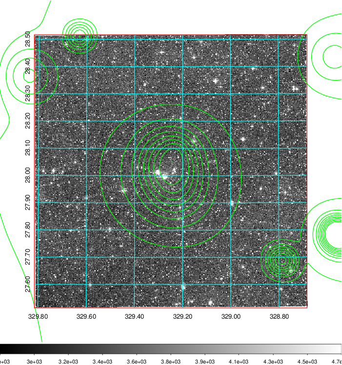 Blue circle for optical clusters;  Magenta circle for XSZ clusters;  all with r=1Mpc;  Only GC with Delta_z<0.01 are shown.  |

|[known Abell/XSZ clusters](../image/869/869_gc.pdf) | [2MASS image](../image/869/869_2mass.pdf)      |[SDSS image](../image/869/869_sdss.pdf)   |
|-------------------|-------------------|-------------------|
|  Magenta, blue and green circles  for optical, X-ray and SZ clusters  respectively, with redshift of clusters  labelled. The radius of circles  are 1Mpc.|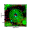  | 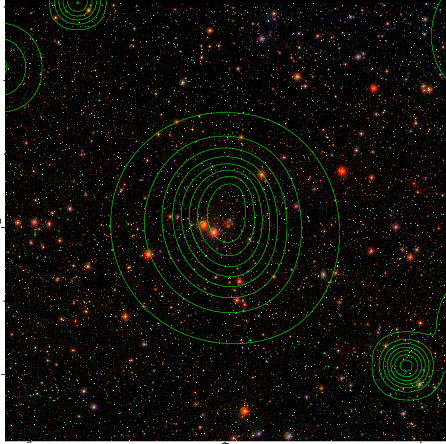  |

