

### 870

|Name|RAJ2000[deg]|DEJ2000[deg] |Ext[arcmin]| Ext,ml | z | z_src| C|GC(XSZ,Delta_z<0.01)| GC(OPT,Delta_z<0.01)|GC| R_sig[arcmin] | R500[arcmin] | R500[Mpc]| CRsig[c/s] | CR500[c/s] |L500[1E44 erg/s]|F500[1E-12 erg/s/cm^2]| M500[1E14 Msun]|Tx[keV]|Cnt_sig|Beta|Rc[arcmin]|Comment|Alias|
|---|---|---|---|---|---|------|---|--------|---------|----------|---|---|---|---|---|---|---|---|---|---|---|---|---|---|
|870| 329.293| -7.808| 6.56| 93.14| 0.0579(0.005)| z1, z_xsz| B| L03, MCXC, XB| A, N, W| A, C, F20, L03, MCXC, N, W, XB| 26.675| 12.377| 0.833| 0.438(0.080)| 0.402(0.073)| 0.593(0.071)| 7.391(0.886)| 1.74(0.11)| 3.06(0.12)| 157.0| 0.721(-0.087+0.121)| 8.606(-1.595+1.933)| -| k551|

|[RASS image](../image/870/870_img.pdf)|[filtered image](../image/870/870_fil.pdf)|[Segment image](../image/870/870_seg.pdf)|
|-------------------|--------------------|-------------------|
| 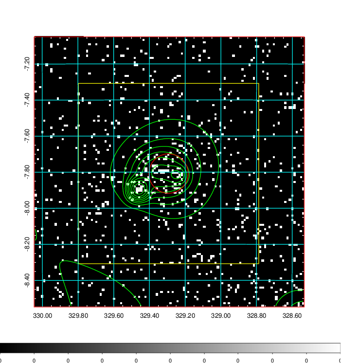  | 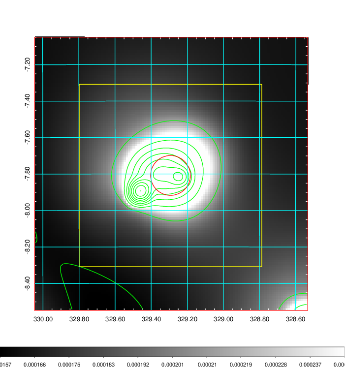   | 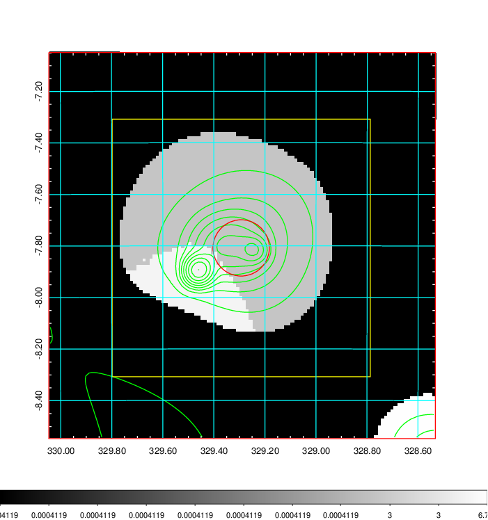  |

|[Exposure image](../image/870/870_mex.pdf)| [nH image](../image/870/870_nh.pdf)| [Planck image](../image/870/870_p.pdf)|
|-------------------|--------------------|-------------------|
|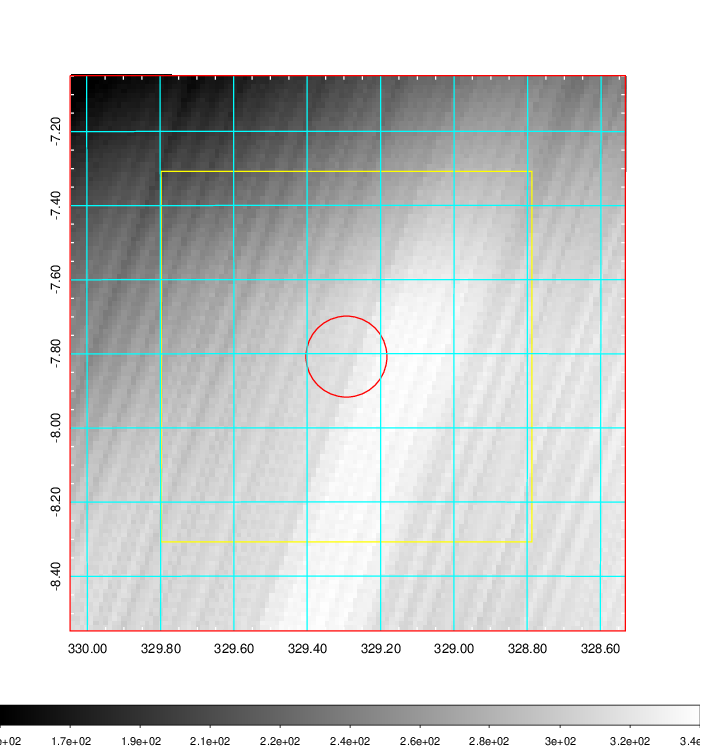   | 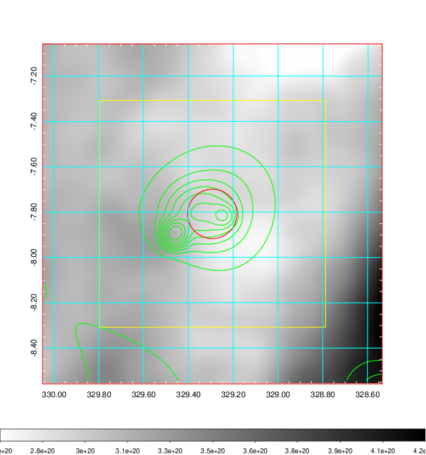    | 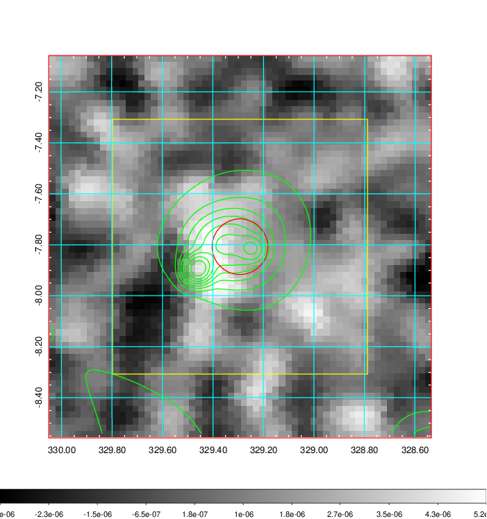 |

|[Redshift Histogram](../image/870/870_zg.pdf) | [DSS image(z1)](../image/870/870_dss_z1.pdf)      |  [DSS image(z2)](../image/870/870_dss_z2.pdf)    |
|-------------------|--------------------|-------------------|
|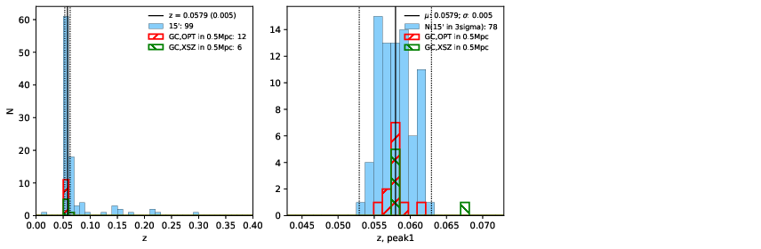 |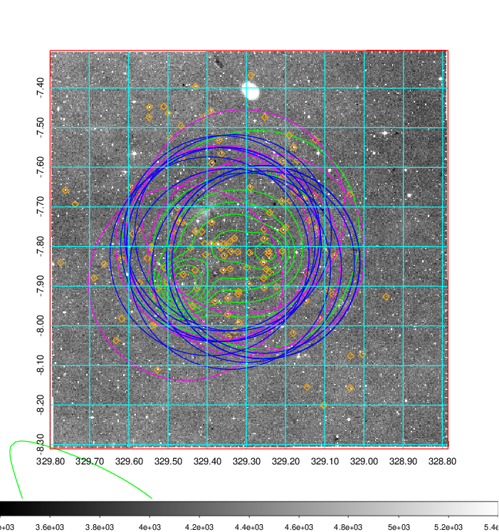  Blue circle for optical clusters;  Magenta circle for XSZ clusters;  all with r=1Mpc;  Only GC with Delta_z<0.01 are shown. | 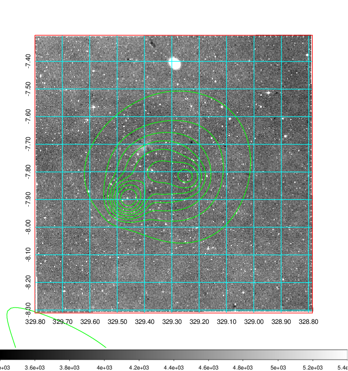 Blue circle for optical clusters;  Magenta circle for XSZ clusters;  all with r=1Mpc;  Only GC with Delta_z<0.01 are shown.  |

|[known Abell/XSZ clusters](../image/870/870_gc.pdf) | [2MASS image](../image/870/870_2mass.pdf)      |[SDSS image](../image/870/870_sdss.pdf)   |
|-------------------|-------------------|-------------------|
|  Magenta, blue and green circles  for optical, X-ray and SZ clusters  respectively, with redshift of clusters  labelled. The radius of circles  are 1Mpc.|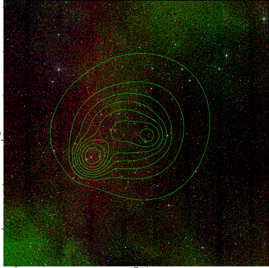  | 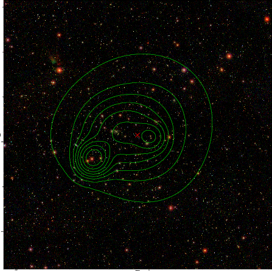  |

