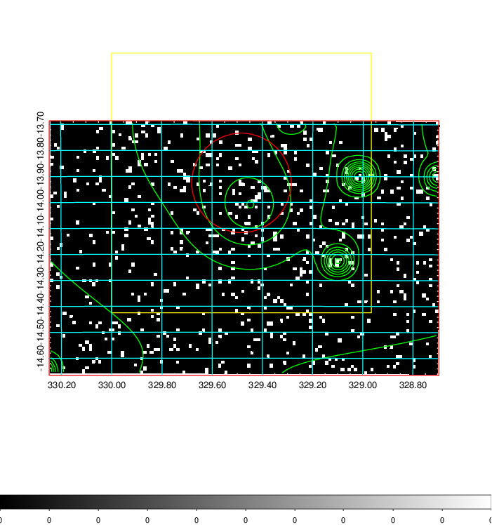
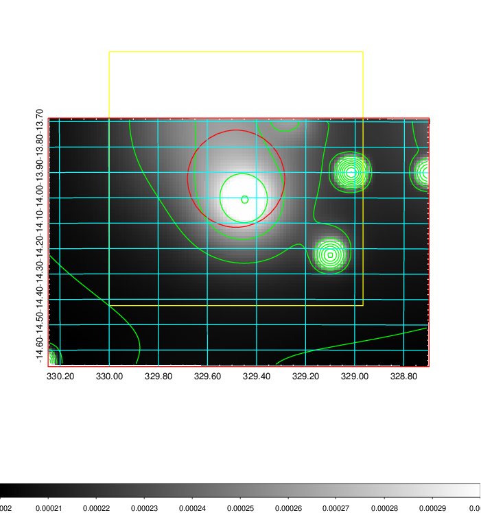
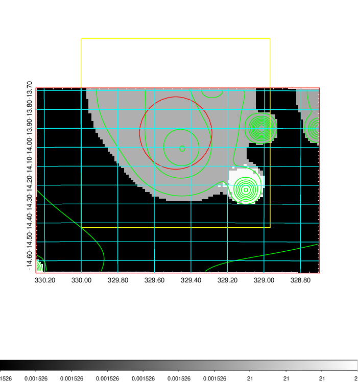
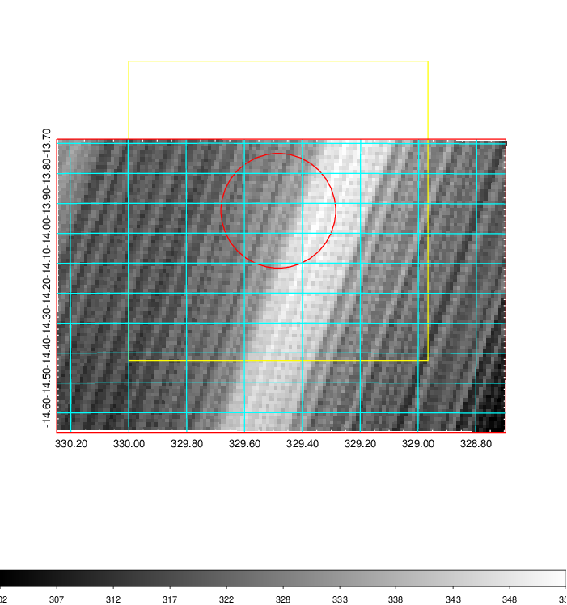
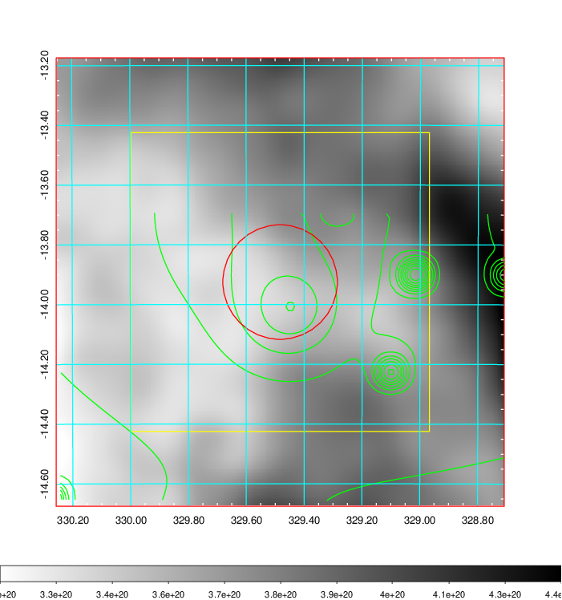
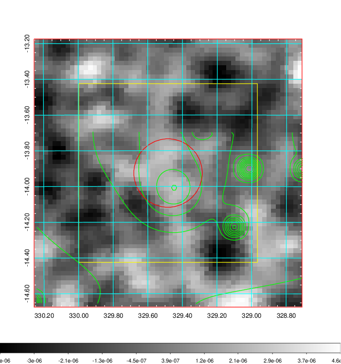
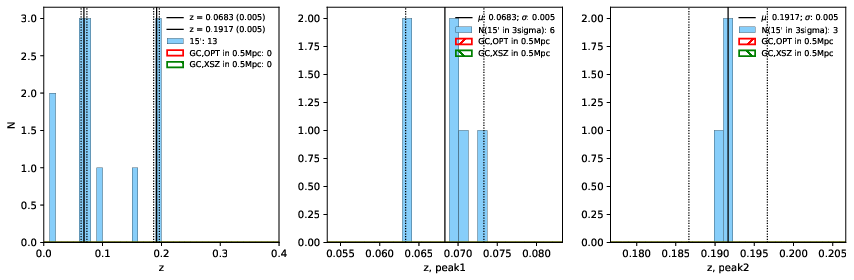
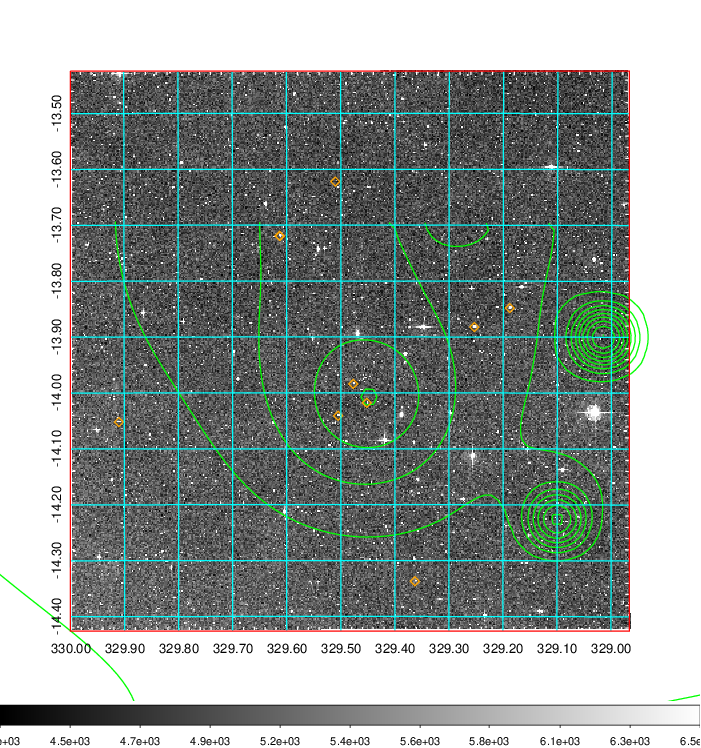
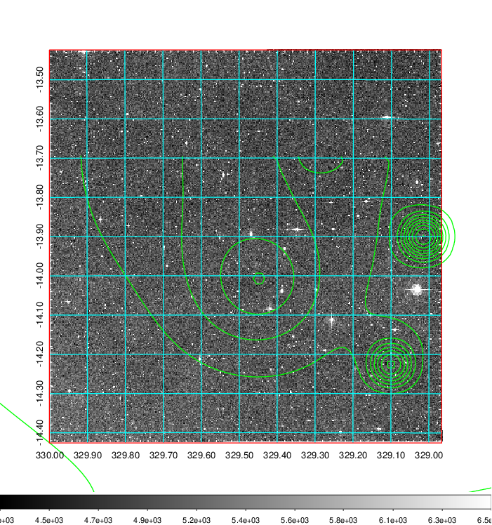
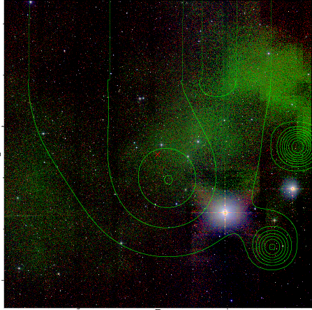

### 871

|Name|RAJ2000[deg]|DEJ2000[deg] |Ext[arcmin]| Ext,ml | z | z_src| C|GC(XSZ,Delta_z<0.01)| GC(OPT,Delta_z<0.01)|GC| R_sig[arcmin] | R500[arcmin] | R500[Mpc]| CRsig[c/s] | CR500[c/s] |L500[1E44 erg/s]|F500[1E-12 erg/s/cm^2]| M500[1E14 Msun]|Tx[keV]|Cnt_sig|Beta|Rc[arcmin]|Comment|Alias|
|---|---|---|---|---|---|------|---|--------|---------|----------|---|---|---|---|---|---|---|---|---|---|---|---|---|---|
|871| 329.483| -13.925| 11.50| 28.57| 0.0683(0.005)| z1,| G| -| -| -| 13.675| 9.060| 0.710| 0.140(0.039)| 0.132(0.037)| 0.267(0.090)| 2.357(0.796)| 1.09(0.19)| 2.30(0.25)| 39.5| 0.586(-0.066+0.169)| 7.115(-1.036+2.097)| -| t480|

|[RASS image](../image/871/871_img.pdf)|[filtered image](../image/871/871_fil.pdf)|[Segment image](../image/871/871_seg.pdf)|
|-------------------|--------------------|-------------------|
|   |    |   |

|[Exposure image](../image/871/871_mex.pdf)| [nH image](../image/871/871_nh.pdf)| [Planck image](../image/871/871_p.pdf)|
|-------------------|--------------------|-------------------|
|   |     |  |

|[Redshift Histogram](../image/871/871_zg.pdf) | [DSS image(z1)](../image/871/871_dss_z1.pdf)      |  [DSS image(z2)](../image/871/871_dss_z2.pdf)    |
|-------------------|--------------------|-------------------|
| |  Blue circle for optical clusters;  Magenta circle for XSZ clusters;  all with r=1Mpc;  Only GC with Delta_z<0.01 are shown. |  Blue circle for optical clusters;  Magenta circle for XSZ clusters;  all with r=1Mpc;  Only GC with Delta_z<0.01 are shown.  |

|[known Abell/XSZ clusters](../image/871/871_gc.pdf) | [2MASS image](../image/871/871_2mass.pdf)      |
|-------------------|-------------------|
|  Magenta, blue and green circles  for optical, X-ray and SZ clusters  respectively, with redshift of clusters  labelled. The radius of circles  are 1Mpc.|  |

|[ATLAS image](../image/871/871_s.pdf)        |
|-------------------|
|   |
