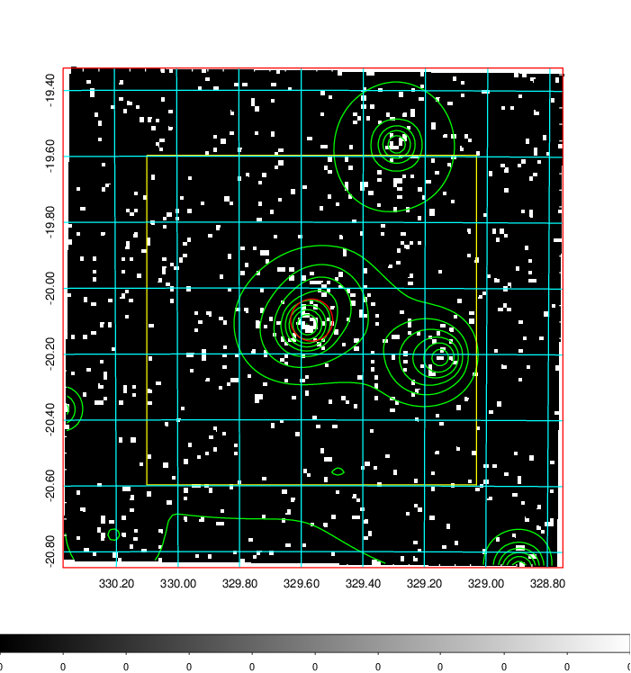
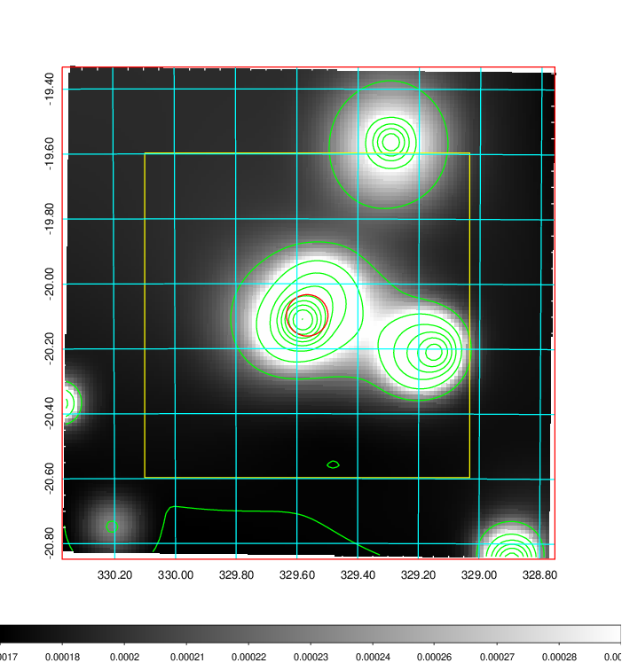
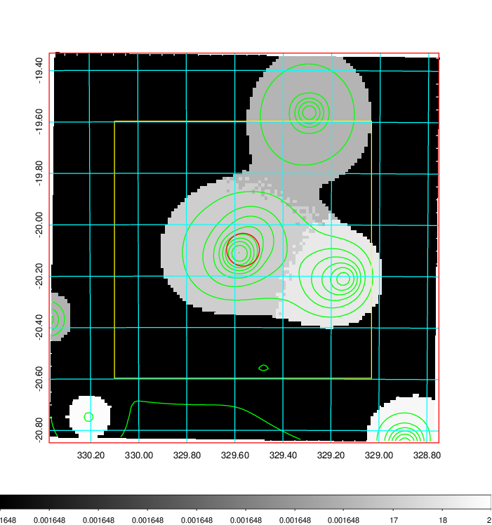
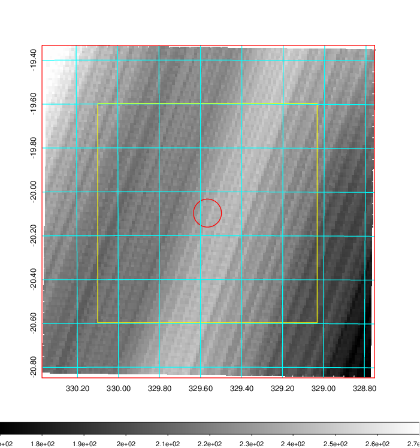
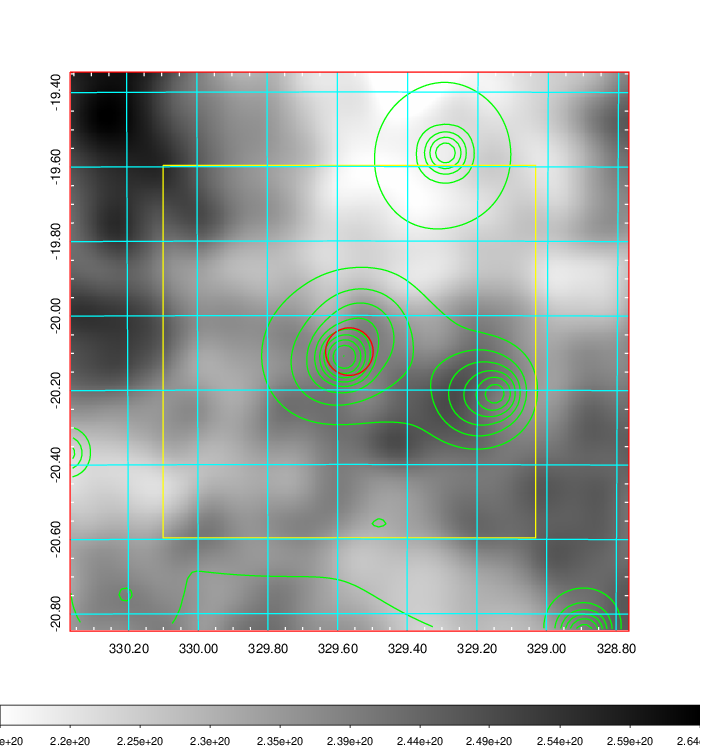
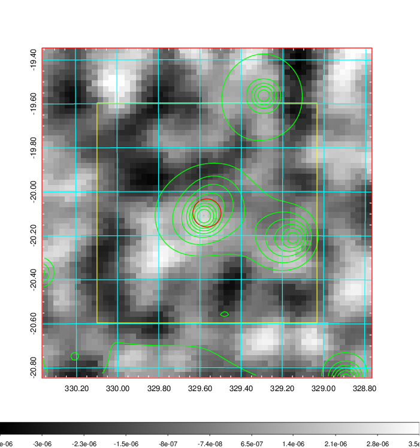
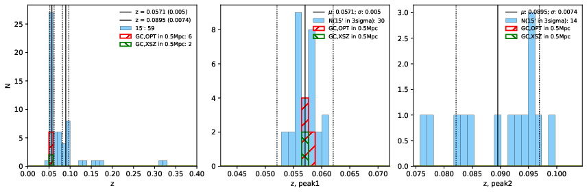
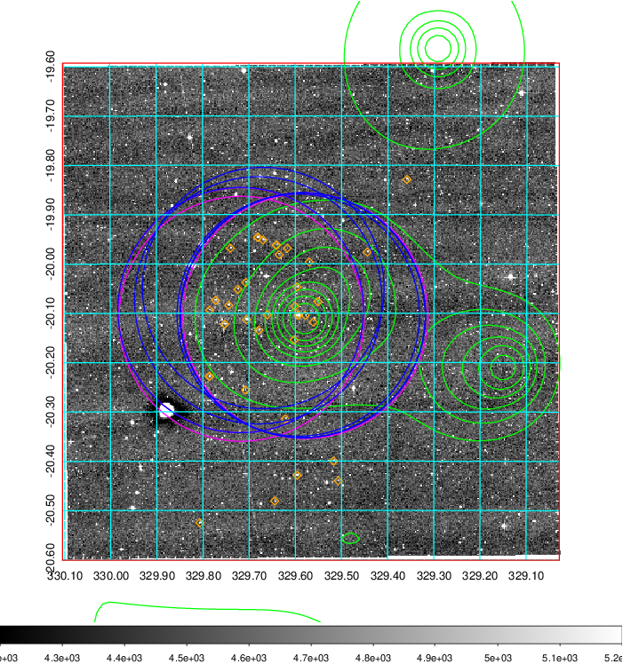
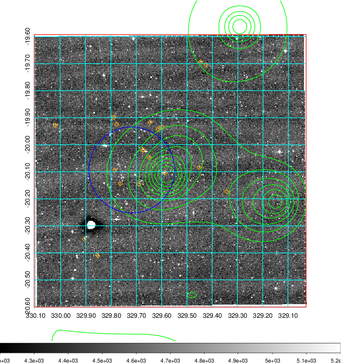
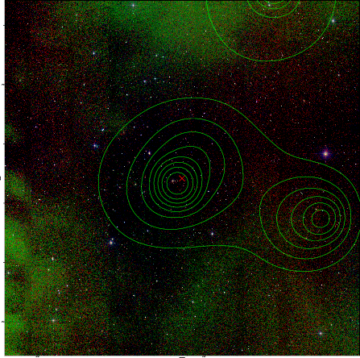

### 872

|Name|RAJ2000[deg]|DEJ2000[deg] |Ext[arcmin]| Ext,ml | z | z_src| C|GC(XSZ,Delta_z<0.01)| GC(OPT,Delta_z<0.01)|GC| R_sig[arcmin] | R500[arcmin] | R500[Mpc]| CRsig[c/s] | CR500[c/s] |L500[1E44 erg/s]|F500[1E-12 erg/s/cm^2]| M500[1E14 Msun]|Tx[keV]|Cnt_sig|Beta|Rc[arcmin]|Comment|Alias|
|---|---|---|---|---|---|------|---|--------|---------|----------|---|---|---|---|---|---|---|---|---|---|---|---|---|---|
|872| 329.566| -20.097| 3.84| 26.35| 0.0571(0.005)| z1, z_xsz| B| L03, MCXC| A, N, W| A, L03, MCXC, N, SWXCS, W| 12.356| 10.666| 0.708| 0.195(0.082)| 0.191(0.080)| 0.269(0.062)| 3.455(0.791)| 1.07(0.12)| 2.27(0.17)| 56.5| 0.890(-0.114+0.078)| 5.842(-1.083+0.842)| -| k462|

|[RASS image](../image/872/872_img.pdf)|[filtered image](../image/872/872_fil.pdf)|[Segment image](../image/872/872_seg.pdf)|
|-------------------|--------------------|-------------------|
|   |    |   |

|[Exposure image](../image/872/872_mex.pdf)| [nH image](../image/872/872_nh.pdf)| [Planck image](../image/872/872_p.pdf)|
|-------------------|--------------------|-------------------|
|   |     |  |

|[Redshift Histogram](../image/872/872_zg.pdf) | [DSS image(z1)](../image/872/872_dss_z1.pdf)      |  [DSS image(z2)](../image/872/872_dss_z2.pdf)    |
|-------------------|--------------------|-------------------|
| |  Blue circle for optical clusters;  Magenta circle for XSZ clusters;  all with r=1Mpc;  Only GC with Delta_z<0.01 are shown. |  Blue circle for optical clusters;  Magenta circle for XSZ clusters;  all with r=1Mpc;  Only GC with Delta_z<0.01 are shown.  |

|[known Abell/XSZ clusters](../image/872/872_gc.pdf) | [2MASS image](../image/872/872_2mass.pdf)      |
|-------------------|-------------------|
|  Magenta, blue and green circles  for optical, X-ray and SZ clusters  respectively, with redshift of clusters  labelled. The radius of circles  are 1Mpc.|  |

|[ATLAS image](../image/872/872_s.pdf)        |
|-------------------|
|   |
