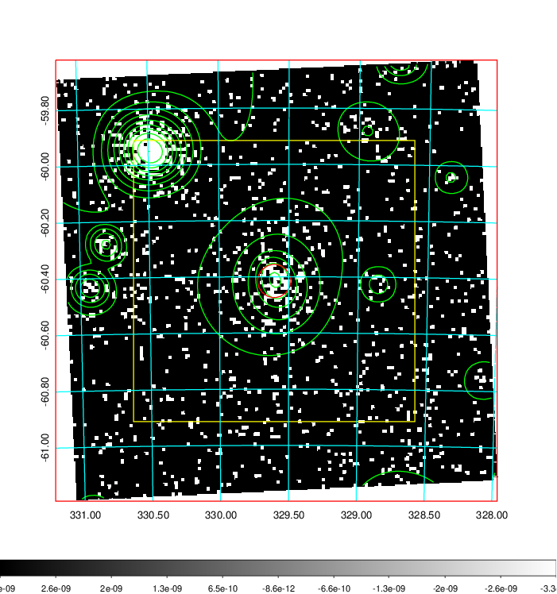
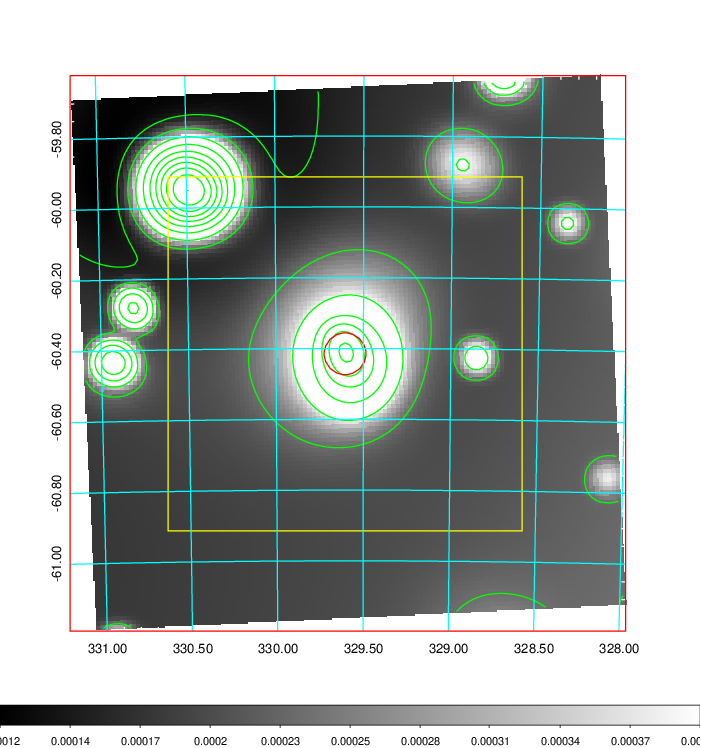
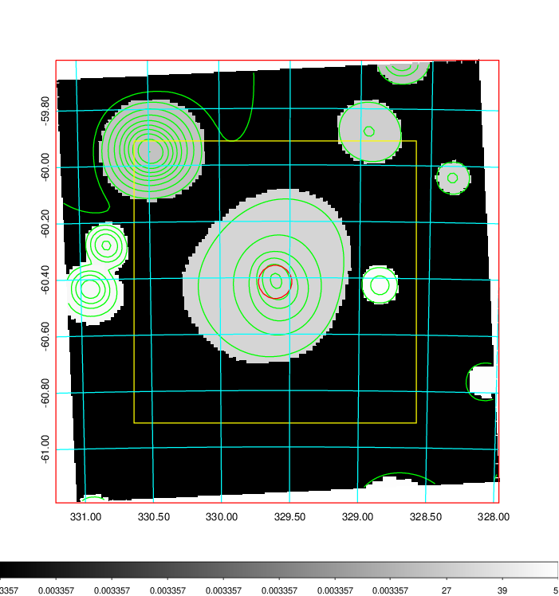
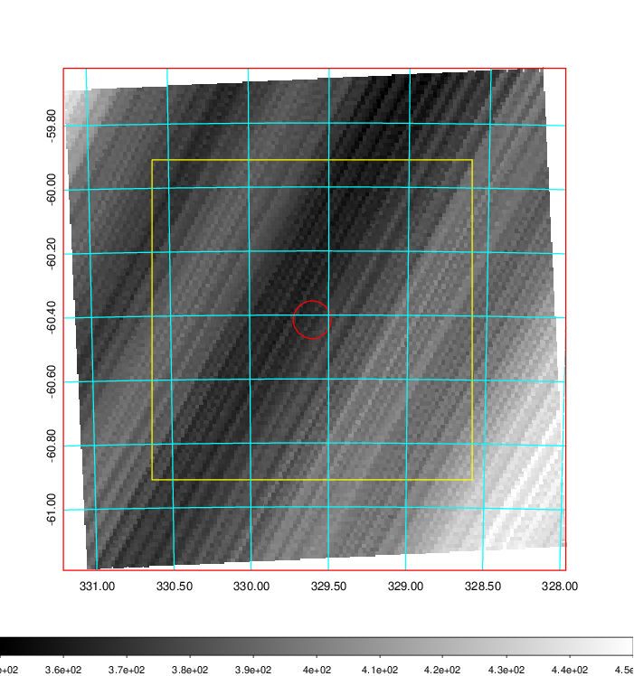
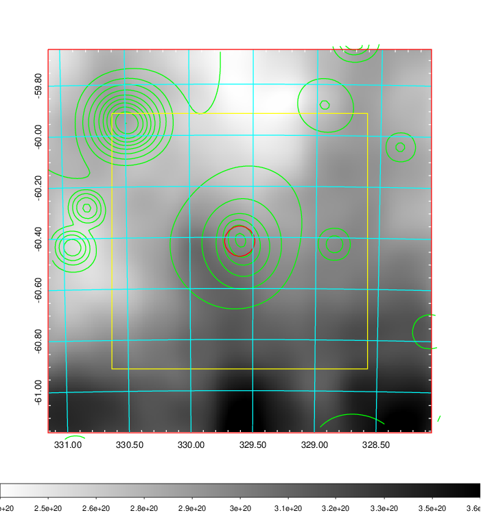
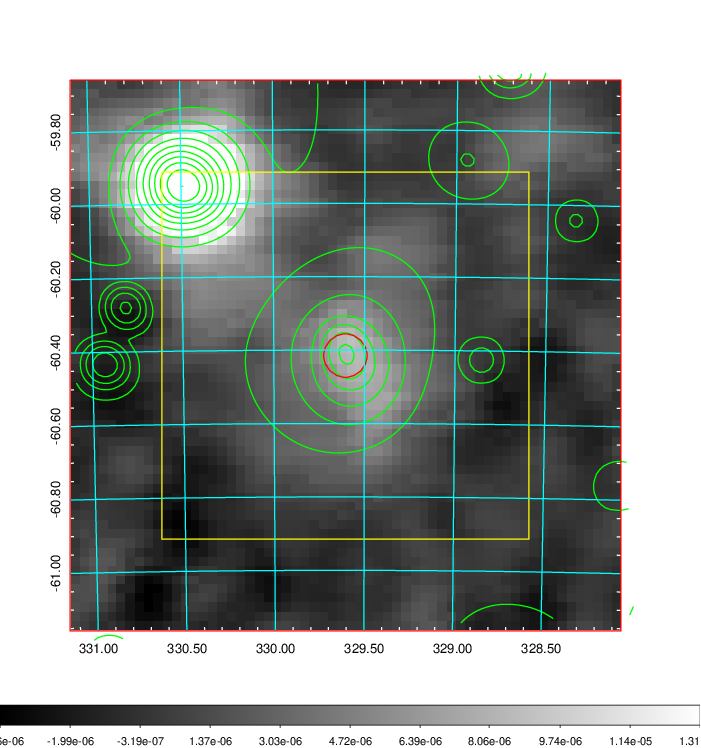
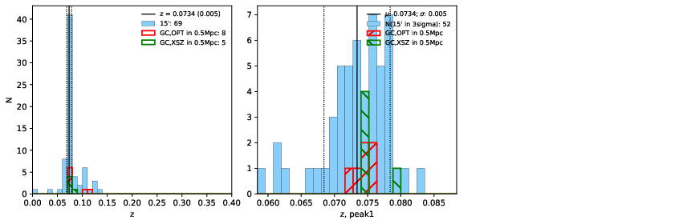
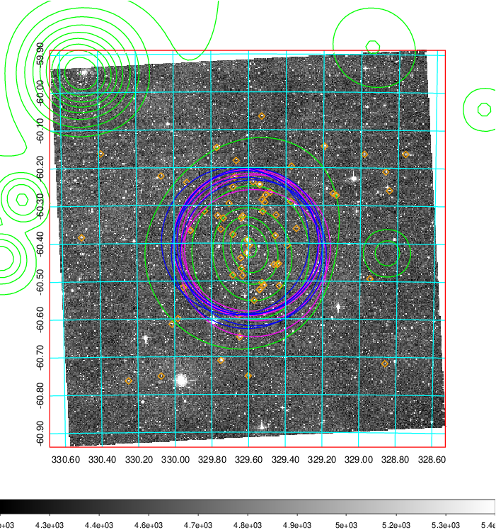
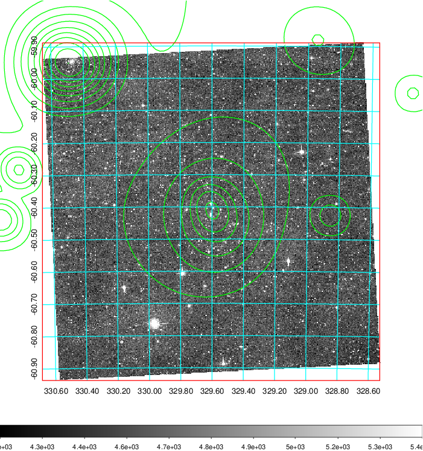
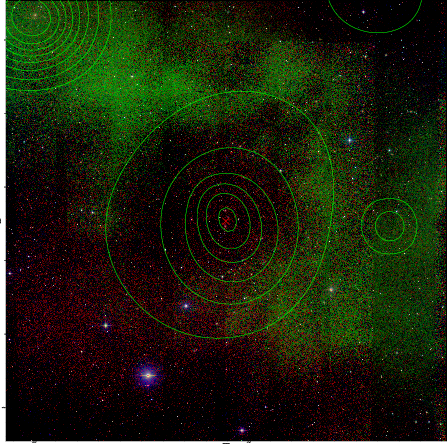

### 873

|Name|RAJ2000[deg]|DEJ2000[deg] |Ext[arcmin]| Ext,ml | z | z_src| C|GC(XSZ,Delta_z<0.01)| GC(OPT,Delta_z<0.01)|GC| R_sig[arcmin] | R500[arcmin] | R500[Mpc]| CRsig[c/s] | CR500[c/s] |L500[1E44 erg/s]|F500[1E-12 erg/s/cm^2]| M500[1E14 Msun]|Tx[keV]|Cnt_sig|Beta|Rc[arcmin]|Comment|Alias|
|---|---|---|---|---|---|------|---|--------|---------|----------|---|---|---|---|---|---|---|---|---|---|---|---|---|---|
|873| 329.605| -60.415| 3.54| 113.98| 0.0734(0.005)| z1, z_xsz| B| MCXC, PSZ2, Tar, XB| A, N, W| A, MCXC, N, PSZ2, Tar, W, XB| 11.238| 10.890| 0.912| 0.390(0.046)| 0.388(0.046)| 0.965(0.058)| 7.325(0.441)| 2.31(0.07)| 3.68(0.07)| 140.2| 0.803(-0.133+0.127)| 5.904(-1.313+1.103)| -| k438|

|[RASS image](../image/873/873_img.pdf)|[filtered image](../image/873/873_fil.pdf)|[Segment image](../image/873/873_seg.pdf)|
|-------------------|--------------------|-------------------|
|   |    |   |

|[Exposure image](../image/873/873_mex.pdf)| [nH image](../image/873/873_nh.pdf)| [Planck image](../image/873/873_p.pdf)|
|-------------------|--------------------|-------------------|
|   |     |  |

|[Redshift Histogram](../image/873/873_zg.pdf) | [DSS image(z1)](../image/873/873_dss_z1.pdf)      |  [DSS image(z2)](../image/873/873_dss_z2.pdf)    |
|-------------------|--------------------|-------------------|
| |  Blue circle for optical clusters;  Magenta circle for XSZ clusters;  all with r=1Mpc;  Only GC with Delta_z<0.01 are shown. |  Blue circle for optical clusters;  Magenta circle for XSZ clusters;  all with r=1Mpc;  Only GC with Delta_z<0.01 are shown.  |

|[known Abell/XSZ clusters](../image/873/873_gc.pdf) | [2MASS image](../image/873/873_2mass.pdf)      |
|-------------------|-------------------|
|  Magenta, blue and green circles  for optical, X-ray and SZ clusters  respectively, with redshift of clusters  labelled. The radius of circles  are 1Mpc.|  |

|[DES image](../image/873/873_des.pdf)   |
|-------------------|
|   |
