

### 874

|Name|RAJ2000[deg]|DEJ2000[deg] |Ext[arcmin]| Ext,ml | z | z_src| C|GC(XSZ,Delta_z<0.01)| GC(OPT,Delta_z<0.01)|GC| R_sig[arcmin] | R500[arcmin] | R500[Mpc]| CRsig[c/s] | CR500[c/s] |L500[1E44 erg/s]|F500[1E-12 erg/s/cm^2]| M500[1E14 Msun]|Tx[keV]|Cnt_sig|Beta|Rc[arcmin]|Comment|Alias|
|---|---|---|---|---|---|------|---|--------|---------|----------|---|---|---|---|---|---|---|---|---|---|---|---|---|---|
|874| 329.617| -9.806| 1.70| 42.56| 0.0799(0.006)| z1, z_xsz| B| L03, MCXC, XB| A| A, L03, MCXC, XB| 7.338| 9.784| 0.885| 0.270(0.044)| 0.286(0.047)| 0.819(0.067)| 5.198(0.425)| 2.13(0.09)| 3.50(0.09)| 82.4| 0.899(-0.108+0.072)| 3.830(-0.639+0.472)| -| k158|

|[RASS image](../image/874/874_img.pdf)|[filtered image](../image/874/874_fil.pdf)|[Segment image](../image/874/874_seg.pdf)|
|-------------------|--------------------|-------------------|
| 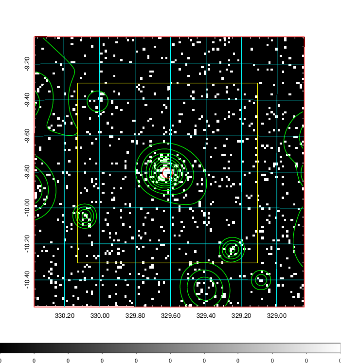  | 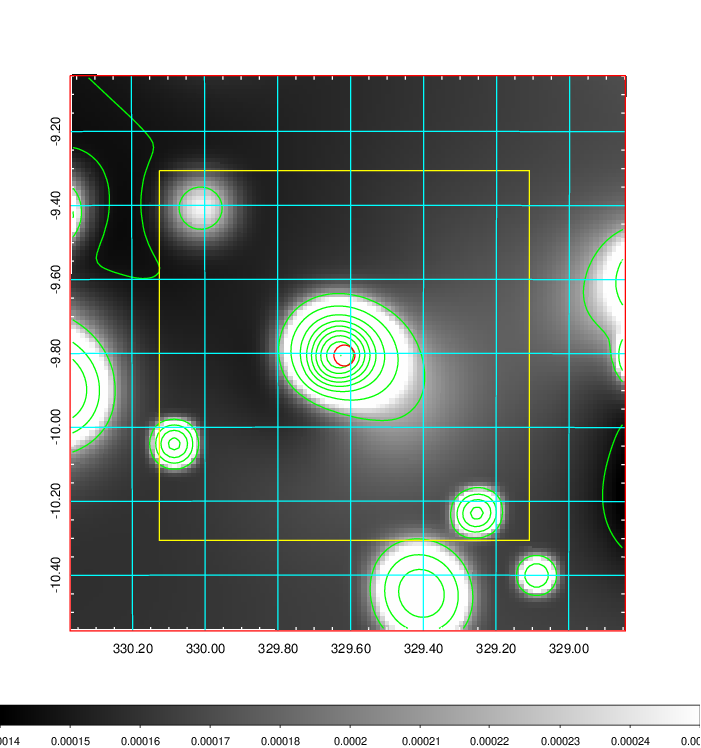   | 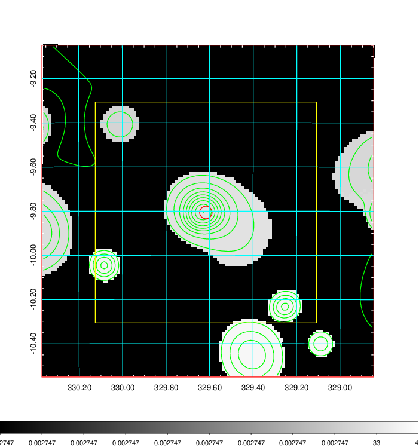  |

|[Exposure image](../image/874/874_mex.pdf)| [nH image](../image/874/874_nh.pdf)| [Planck image](../image/874/874_p.pdf)|
|-------------------|--------------------|-------------------|
|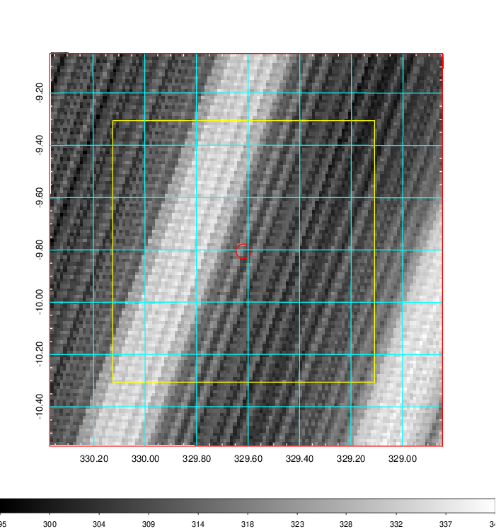   | 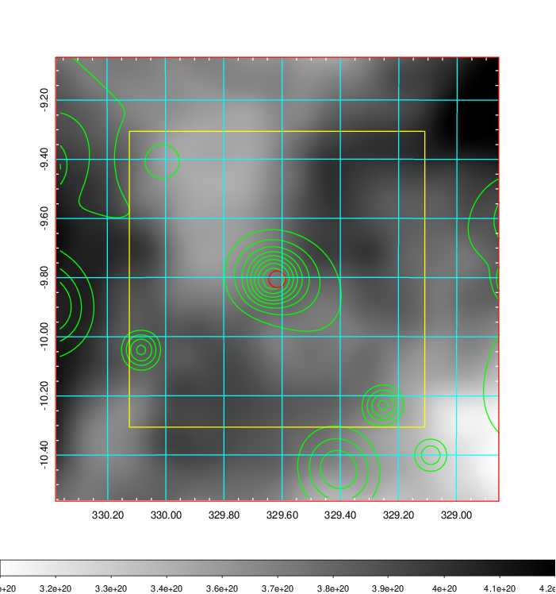    | 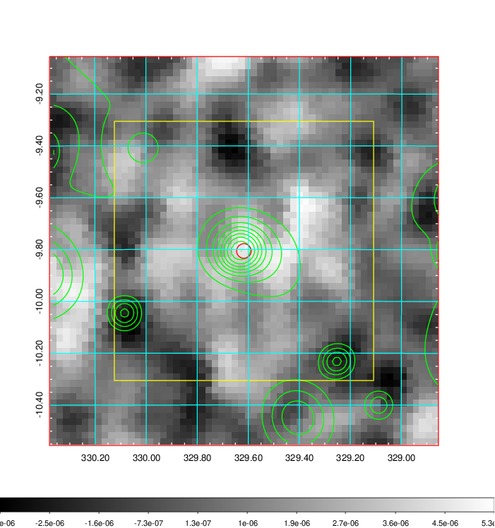 |

|[Redshift Histogram](../image/874/874_zg.pdf) | [DSS image(z1)](../image/874/874_dss_z1.pdf)      |  [DSS image(z2)](../image/874/874_dss_z2.pdf)    |
|-------------------|--------------------|-------------------|
|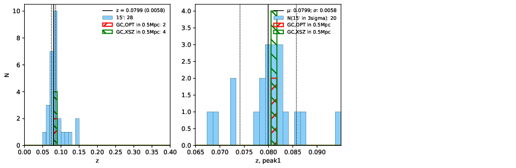 |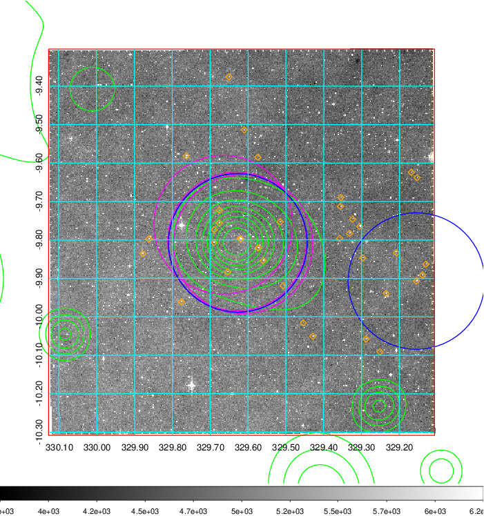  Blue circle for optical clusters;  Magenta circle for XSZ clusters;  all with r=1Mpc;  Only GC with Delta_z<0.01 are shown. | 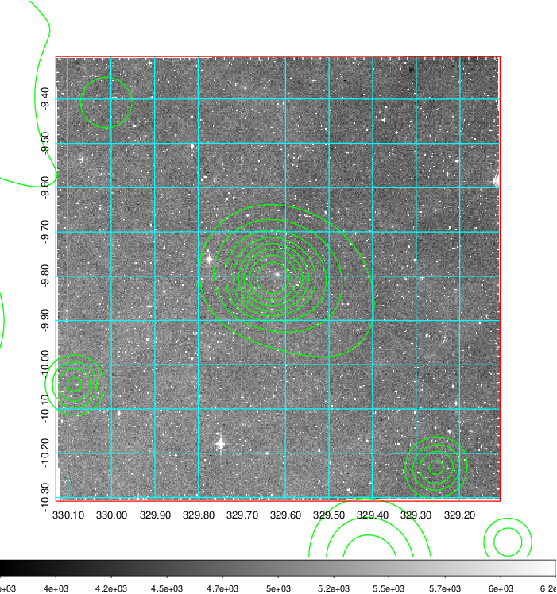 Blue circle for optical clusters;  Magenta circle for XSZ clusters;  all with r=1Mpc;  Only GC with Delta_z<0.01 are shown.  |

|[Previous-identified clusters](../image/874/874_gc.pdf) | [2MASS image](../image/874/874_2mass.pdf)      |
|-------------------|-------------------|
|  Green, magenta, and blue circles  for optical, X-ray and SZ clusters  respectively, with redshift of clusters  labelled. The radius of circles  are 1Mpc.|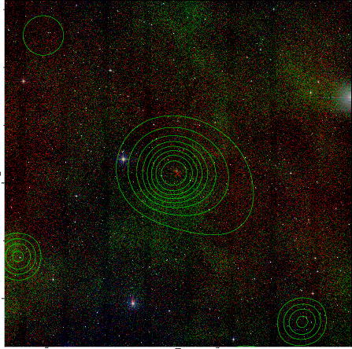  |

|[ATLAS image](../image/874/874_s.pdf)        |
|-------------------|
| 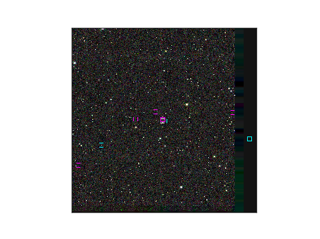  |
