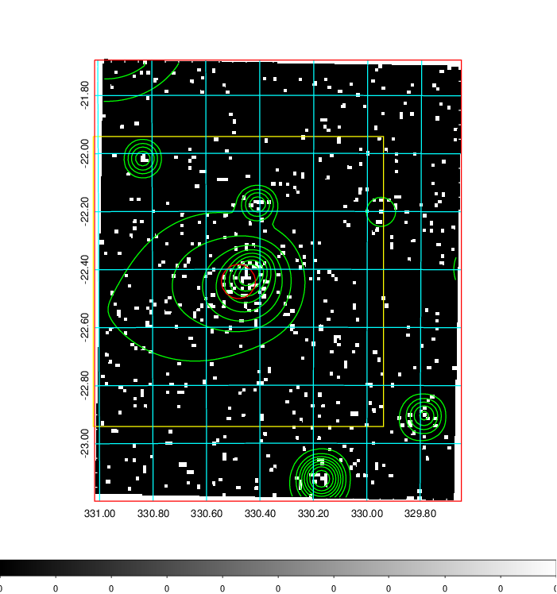
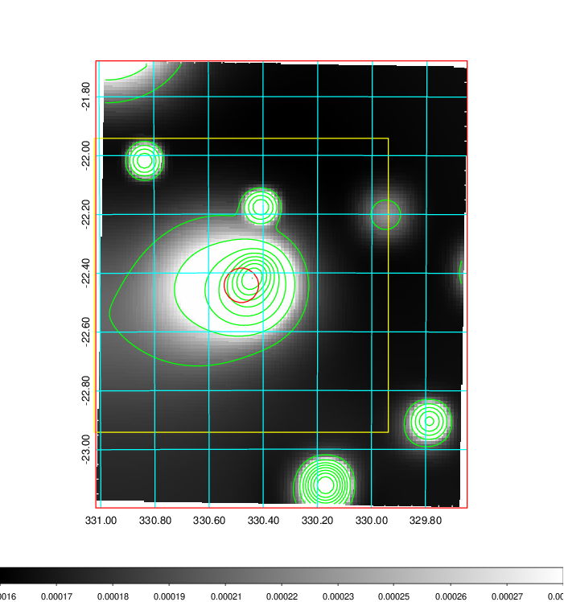
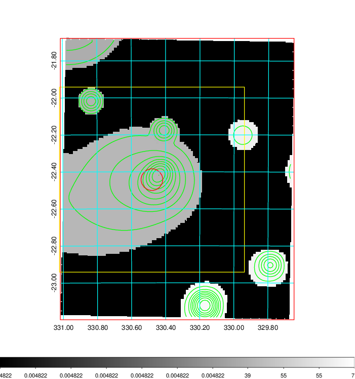
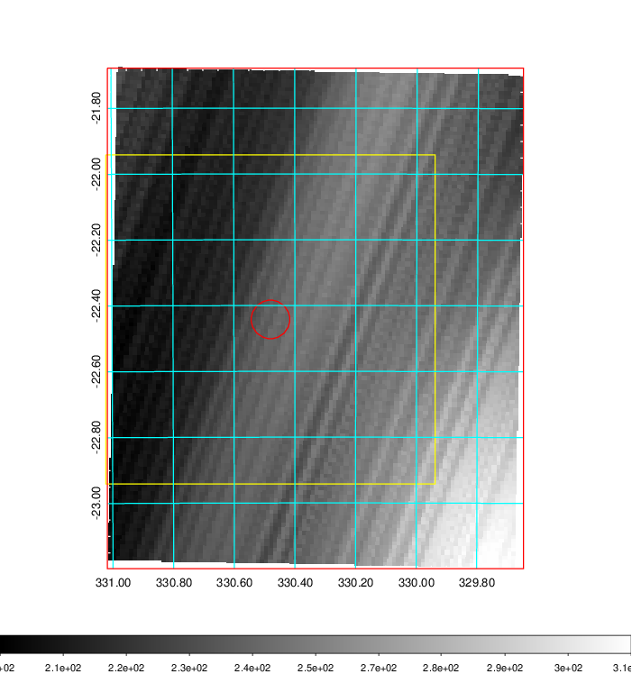
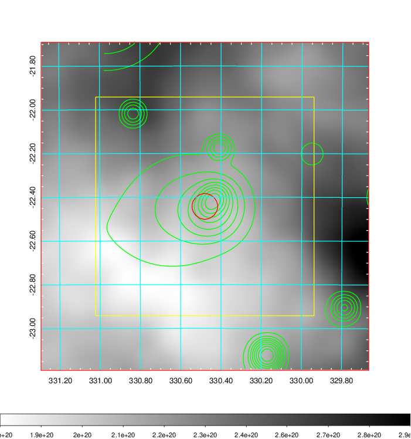
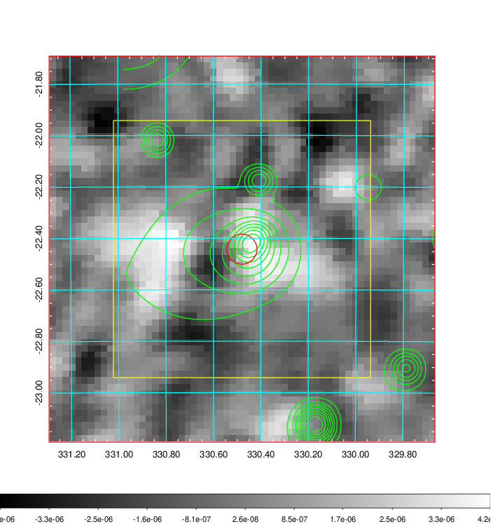
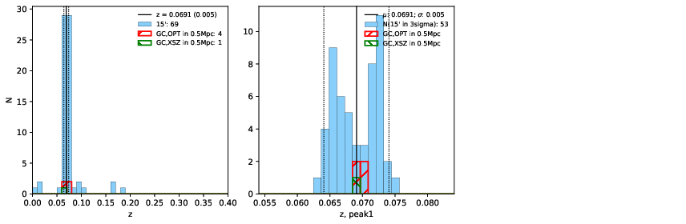
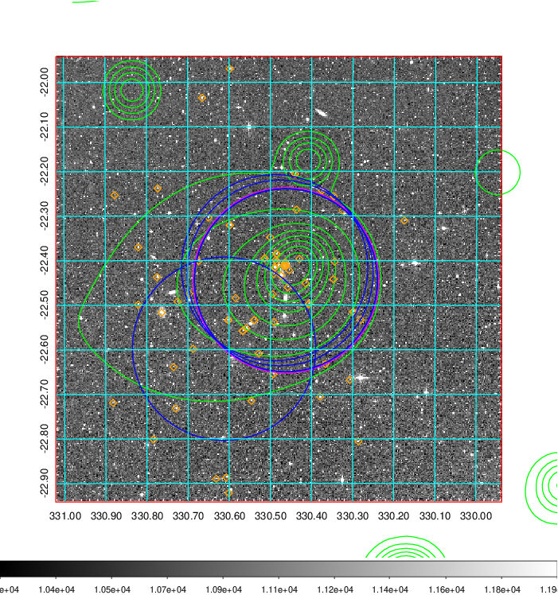
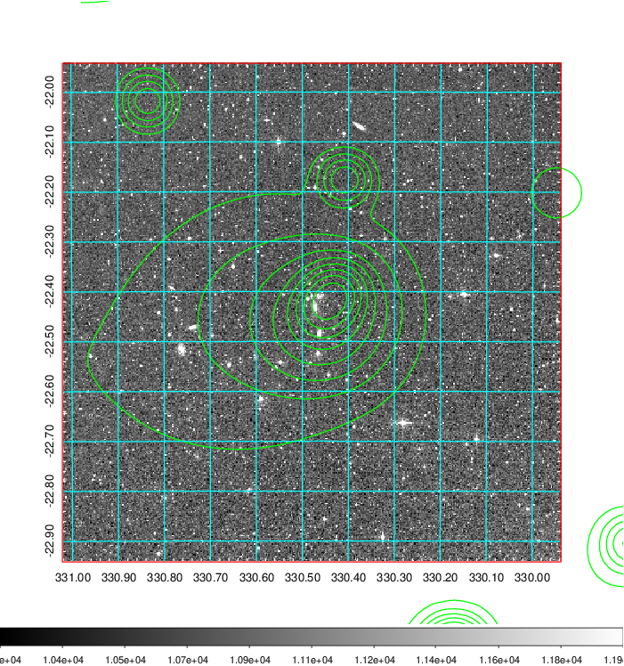
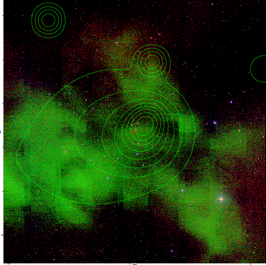

### 875

|Name|RAJ2000[deg]|DEJ2000[deg] |Ext[arcmin]| Ext,ml | z | z_src| C|GC(XSZ,Delta_z<0.01)| GC(OPT,Delta_z<0.01)|GC| R_sig[arcmin] | R500[arcmin] | R500[Mpc]| CRsig[c/s] | CR500[c/s] |L500[1E44 erg/s]|F500[1E-12 erg/s/cm^2]| M500[1E14 Msun]|Tx[keV]|Cnt_sig|Beta|Rc[arcmin]|Comment|Alias|
|---|---|---|---|---|---|------|---|--------|---------|----------|---|---|---|---|---|---|---|---|---|---|---|---|---|---|
|875| 330.480| -22.442| 3.52| 41.23| 0.0691(0.005)| z1, z_xsz| B| MCXC| A, N, W| A, MCXC, N, W| 15.812| 9.850| 0.781| 0.224(0.066)| 0.211(0.062)| 0.461(0.090)| 3.977(0.772)| 1.44(0.14)| 2.75(0.17)| 71.1| 0.746(-0.128+0.153)| 5.678(-1.569+1.601)| -| k434|

|[RASS image](../image/875/875_img.pdf)|[filtered image](../image/875/875_fil.pdf)|[Segment image](../image/875/875_seg.pdf)|
|-------------------|--------------------|-------------------|
|   |    |   |

|[Exposure image](../image/875/875_mex.pdf)| [nH image](../image/875/875_nh.pdf)| [Planck image](../image/875/875_p.pdf)|
|-------------------|--------------------|-------------------|
|   |     |  |

|[Redshift Histogram](../image/875/875_zg.pdf) | [DSS image(z1)](../image/875/875_dss_z1.pdf)      |  [DSS image(z2)](../image/875/875_dss_z2.pdf)    |
|-------------------|--------------------|-------------------|
| |  Blue circle for optical clusters;  Magenta circle for XSZ clusters;  all with r=1Mpc;  Only GC with Delta_z<0.01 are shown. |  Blue circle for optical clusters;  Magenta circle for XSZ clusters;  all with r=1Mpc;  Only GC with Delta_z<0.01 are shown.  |

|[known Abell/XSZ clusters](../image/875/875_gc.pdf) | [2MASS image](../image/875/875_2mass.pdf)      |
|-------------------|-------------------|
|  Magenta, blue and green circles  for optical, X-ray and SZ clusters  respectively, with redshift of clusters  labelled. The radius of circles  are 1Mpc.|  |

|[ATLAS image](../image/875/875_s.pdf)        |
|-------------------|
|   |
