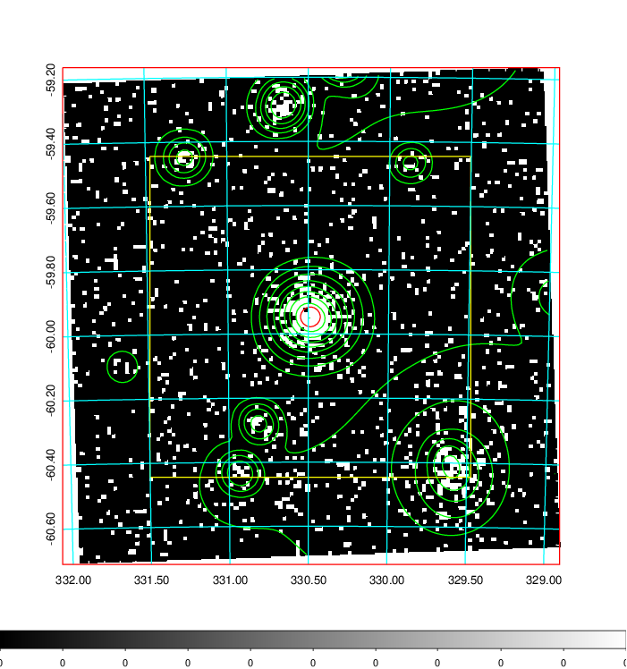
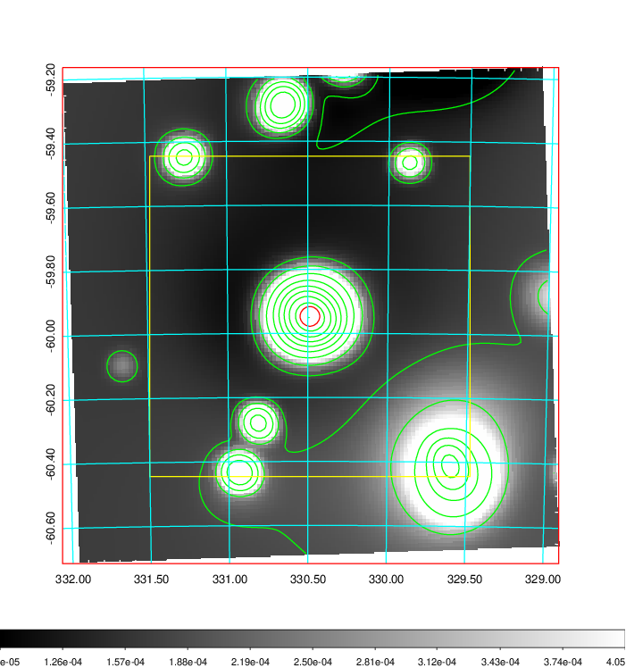
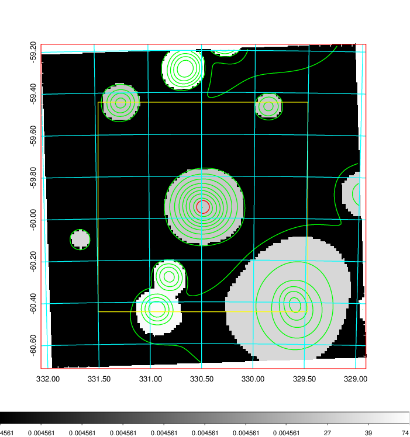
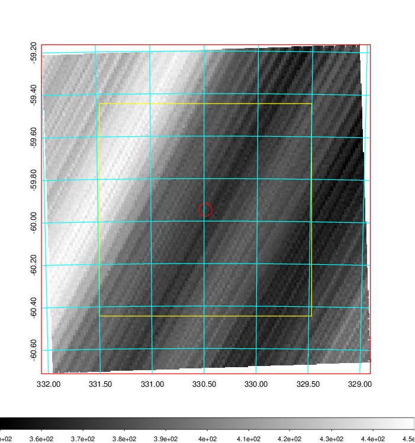
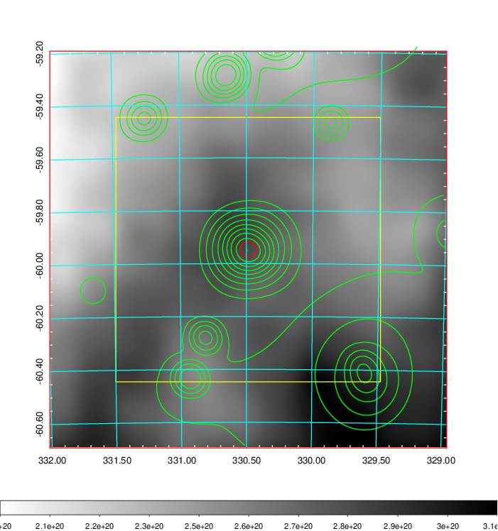
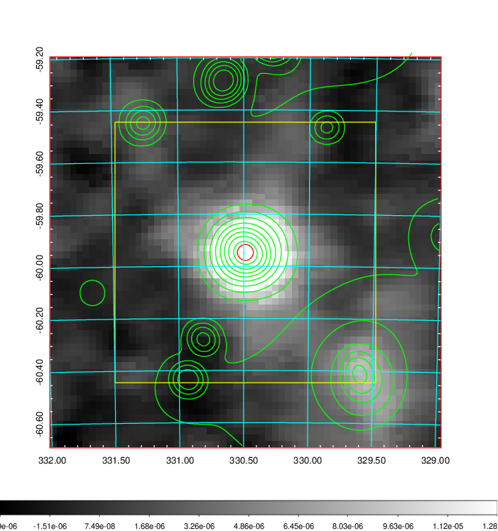
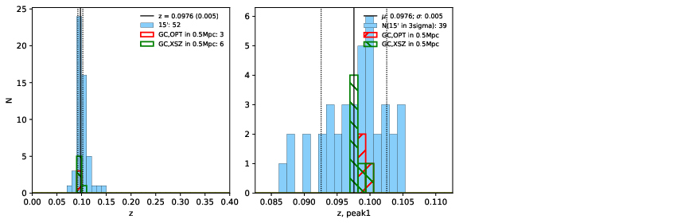
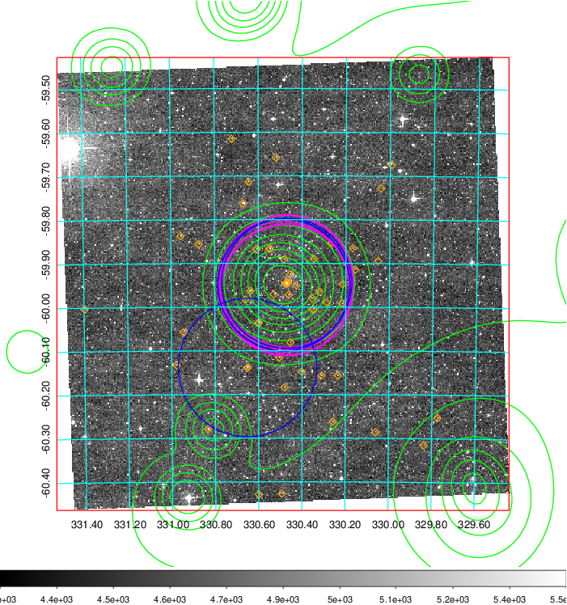
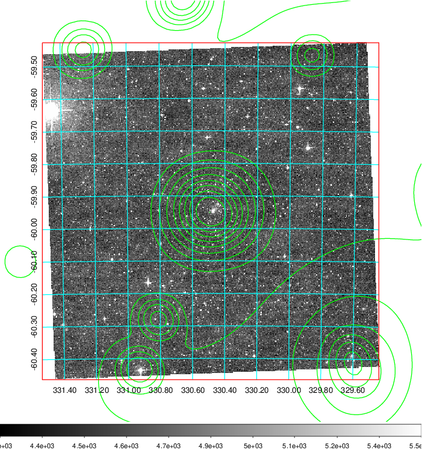
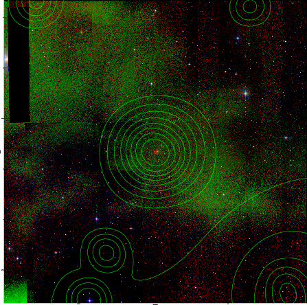

### 876

|Name|RAJ2000[deg]|DEJ2000[deg] |Ext[arcmin]| Ext,ml | z | z_src| C|GC(XSZ,Delta_z<0.01)| GC(OPT,Delta_z<0.01)|GC| R_sig[arcmin] | R500[arcmin] | R500[Mpc]| CRsig[c/s] | CR500[c/s] |L500[1E44 erg/s]|F500[1E-12 erg/s/cm^2]| M500[1E14 Msun]|Tx[keV]|Cnt_sig|Beta|Rc[arcmin]|Comment|Alias|
|---|---|---|---|---|---|------|---|--------|---------|----------|---|---|---|---|---|---|---|---|---|---|---|---|---|---|
|876| 330.487| -59.947| 1.84| 255.48| 0.0976(0.005)| z1, z_xsz| B| B15, MCXC, PSZ2, Tar, XB| A, N| A, B15, MCXC, N, PSZ2, Tar, W, XB| 9.775| 11.357| 1.230| 0.919(0.058)| 0.944(0.059)| 4.393(0.109)| 18.252(0.452)| 5.81(0.07)| 6.54(0.05)| 323.9| 0.953(-0.059+0.034)| 4.401(-0.333+0.232)| -| k181|

|[RASS image](../image/876/876_img.pdf)|[filtered image](../image/876/876_fil.pdf)|[Segment image](../image/876/876_seg.pdf)|
|-------------------|--------------------|-------------------|
|   |    |   |

|[Exposure image](../image/876/876_mex.pdf)| [nH image](../image/876/876_nh.pdf)| [Planck image](../image/876/876_p.pdf)|
|-------------------|--------------------|-------------------|
|   |     |  |

|[Redshift Histogram](../image/876/876_zg.pdf) | [DSS image(z1)](../image/876/876_dss_z1.pdf)      |  [DSS image(z2)](../image/876/876_dss_z2.pdf)    |
|-------------------|--------------------|-------------------|
| |  Blue circle for optical clusters;  Magenta circle for XSZ clusters;  all with r=1Mpc;  Only GC with Delta_z<0.01 are shown. |  Blue circle for optical clusters;  Magenta circle for XSZ clusters;  all with r=1Mpc;  Only GC with Delta_z<0.01 are shown.  |

|[known Abell/XSZ clusters](../image/876/876_gc.pdf) | [2MASS image](../image/876/876_2mass.pdf)      |
|-------------------|-------------------|
|  Magenta, blue and green circles  for optical, X-ray and SZ clusters  respectively, with redshift of clusters  labelled. The radius of circles  are 1Mpc.|  |

|[DES image](../image/876/876_des.pdf)   |
|-------------------|
|   |
