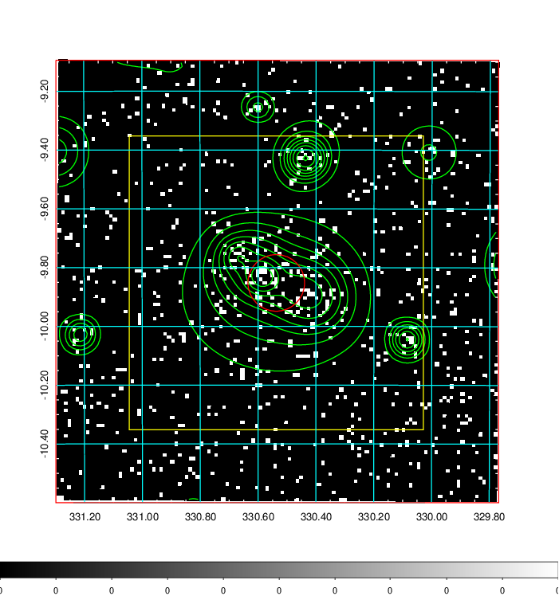
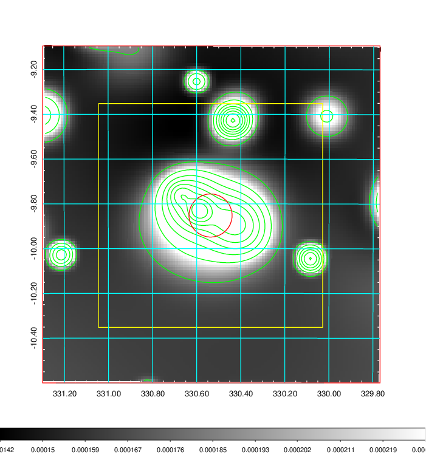
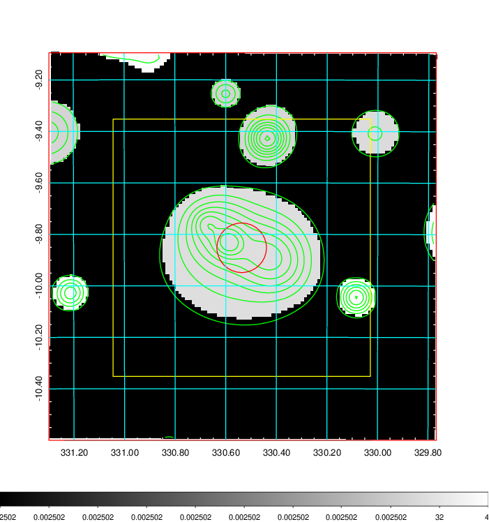
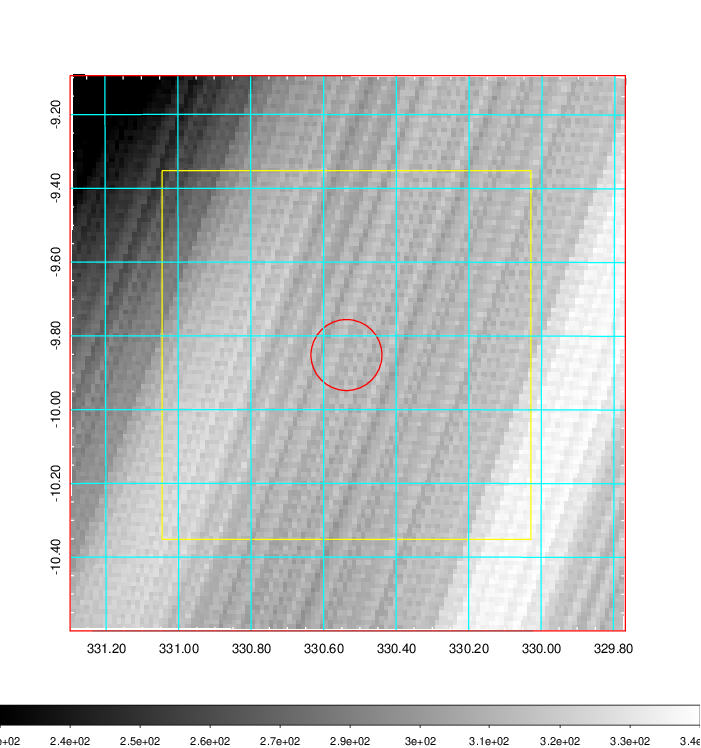
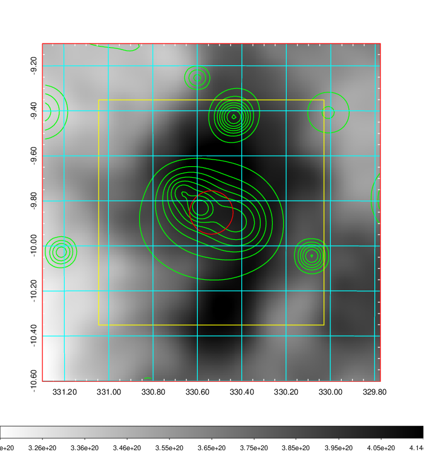
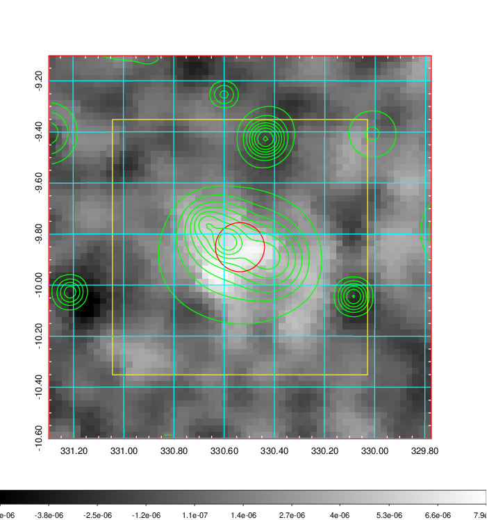
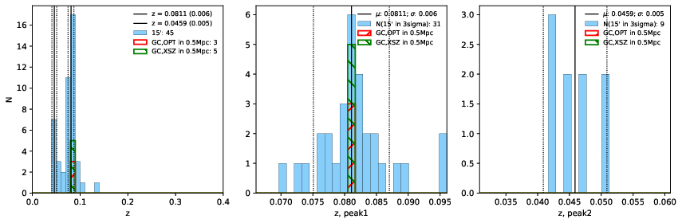
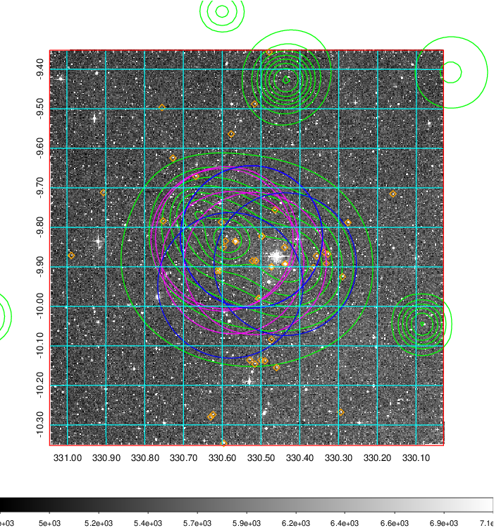
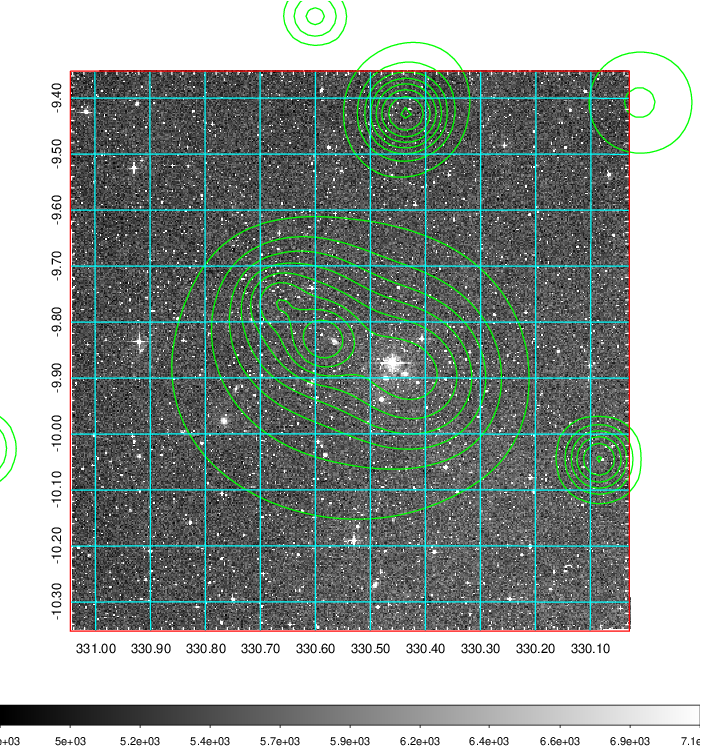
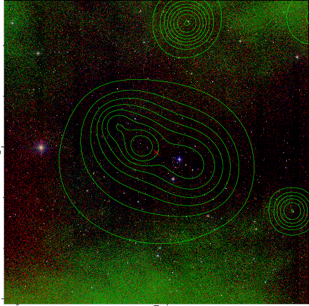

### 877

|Name|RAJ2000[deg]|DEJ2000[deg] |Ext[arcmin]| Ext,ml | z | z_src| C|GC(XSZ,Delta_z<0.01)| GC(OPT,Delta_z<0.01)|GC| R_sig[arcmin] | R500[arcmin] | R500[Mpc]| CRsig[c/s] | CR500[c/s] |L500[1E44 erg/s]|F500[1E-12 erg/s/cm^2]| M500[1E14 Msun]|Tx[keV]|Cnt_sig|Beta|Rc[arcmin]|Comment|Alias|
|---|---|---|---|---|---|------|---|--------|---------|----------|---|---|---|---|---|---|---|---|---|---|---|---|---|---|
|877| 330.537| -9.852| 5.78| 64.34| 0.0811(0.006)| z1, z_xsz| B| L03, MCXC, PSZ2, Tar| A, N| A, C, L03, MCXC, N, PSZ2, Tar, W| 13.188| 9.800| 0.899| 0.307(0.046)| 0.295(0.044)| 0.873(0.090)| 5.374(0.551)| 2.23(0.11)| 3.60(0.12)| 89.9| 0.853(-0.156+0.105)| 11.350(-2.103+1.519)| -| k534|

|[RASS image](../image/877/877_img.pdf)|[filtered image](../image/877/877_fil.pdf)|[Segment image](../image/877/877_seg.pdf)|
|-------------------|--------------------|-------------------|
|   |    |   |

|[Exposure image](../image/877/877_mex.pdf)| [nH image](../image/877/877_nh.pdf)| [Planck image](../image/877/877_p.pdf)|
|-------------------|--------------------|-------------------|
|   |     |  |

|[Redshift Histogram](../image/877/877_zg.pdf) | [DSS image(z1)](../image/877/877_dss_z1.pdf)      |  [DSS image(z2)](../image/877/877_dss_z2.pdf)    |
|-------------------|--------------------|-------------------|
| |  Blue circle for optical clusters;  Magenta circle for XSZ clusters;  all with r=1Mpc;  Only GC with Delta_z<0.01 are shown. |  Blue circle for optical clusters;  Magenta circle for XSZ clusters;  all with r=1Mpc;  Only GC with Delta_z<0.01 are shown.  |

|[known Abell/XSZ clusters](../image/877/877_gc.pdf) | [2MASS image](../image/877/877_2mass.pdf)      |
|-------------------|-------------------|
|  Magenta, blue and green circles  for optical, X-ray and SZ clusters  respectively, with redshift of clusters  labelled. The radius of circles  are 1Mpc.|  |

|[ATLAS image](../image/877/877_s.pdf)        |
|-------------------|
|   |
