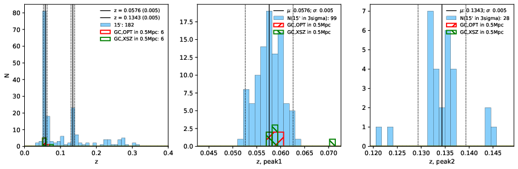

### 878

|Name|RAJ2000[deg]|DEJ2000[deg] |Ext[arcmin]| Ext,ml | z | z_src| C|GC(XSZ,Delta_z<0.01)| GC(OPT,Delta_z<0.01)|GC| R_sig[arcmin] | R500[arcmin] | R500[Mpc]| CRsig[c/s] | CR500[c/s] |L500[1E44 erg/s]|F500[1E-12 erg/s/cm^2]| M500[1E14 Msun]|Tx[keV]|Cnt_sig|Beta|Rc[arcmin]|Comment|Alias|
|---|---|---|---|---|---|------|---|--------|---------|----------|---|---|---|---|---|---|---|---|---|---|---|---|---|---|
|878| 331.407| -5.597| 2.49| 89.19| 0.0576(0.005)| z1, z_xsz| B| L03, MCXC, PSZ2, XB| A, N, W| A, F20, L03, MCXC, N, PSZ2, W, XB| 19.762| 14.211| 0.952| 0.760(0.083)| 0.726(0.080)| 1.039(0.063)| 13.093(0.791)| 2.59(0.08)| 3.92(0.08)| 171.6| 0.520(-0.014+0.024)| 2.096(-0.246+0.357)| -| k295|

|[RASS image](../image/878/878_img.pdf)|[filtered image](../image/878/878_fil.pdf)|[Segment image](../image/878/878_seg.pdf)|
|-------------------|--------------------|-------------------|
|   |    |   |

|[Exposure image](../image/878/878_mex.pdf)| [nH image](../image/878/878_nh.pdf)| [Planck image](../image/878/878_p.pdf)|
|-------------------|--------------------|-------------------|
|   |     |  |

|[Redshift Histogram](../image/878/878_zg.pdf) | [DSS image(z1)](../image/878/878_dss_z1.pdf)      |  [DSS image(z2)](../image/878/878_dss_z2.pdf)    |
|-------------------|--------------------|-------------------|
| |  Blue circle for optical clusters;  Magenta circle for XSZ clusters;  all with r=1Mpc;  Only GC with Delta_z<0.01 are shown. |  Blue circle for optical clusters;  Magenta circle for XSZ clusters;  all with r=1Mpc;  Only GC with Delta_z<0.01 are shown.  |

|[Previous-identified clusters](../image/878/878_gc.pdf) | [2MASS image](../image/878/878_2mass.pdf)      |[SDSS image](../image/878/878_sdss.pdf)   |
|-------------------|-------------------|-------------------|
|  Green, magenta, and blue circles  for optical, X-ray and SZ clusters  respectively, with redshift of clusters  labelled. The radius of circles  are 1Mpc.|  |   |

