

### 879

|Name|RAJ2000[deg]|DEJ2000[deg] |Ext[arcmin]| Ext,ml | z | z_src| C|GC(XSZ,Delta_z<0.01)| GC(OPT,Delta_z<0.01)|GC| R_sig[arcmin] | R500[arcmin] | R500[Mpc]| CRsig[c/s] | CR500[c/s] |L500[1E44 erg/s]|F500[1E-12 erg/s/cm^2]| M500[1E14 Msun]|Tx[keV]|Cnt_sig|Beta|Rc[arcmin]|Comment|Alias|
|---|---|---|---|---|---|------|---|--------|---------|----------|---|---|---|---|---|---|---|---|---|---|---|---|---|---|
|879| 331.482| -50.133| 5.39| 32.46| 0.0098(0.005)| z1,| G| -| -| A, N, W| 14.650| 30.293| 0.365| 0.183(0.040)| 0.223(0.048)| 0.007(0.001)| 3.237(0.646)| 0.14(0.01)| 0.64(0.04)| 57.4| 0.737(-0.161+0.175)| 6.990(-2.106+1.972)| An Abell cluster with $z$ = 0.0363 and offset = 0.18 Mpc, an SZ cluster with $z$ = 0.66 and offset = 0.35 Mpc(28.36 arcmin)| t277|

|[RASS image](../image/879/879_img.pdf)|[filtered image](../image/879/879_fil.pdf)|[Segment image](../image/879/879_seg.pdf)|
|-------------------|--------------------|-------------------|
| 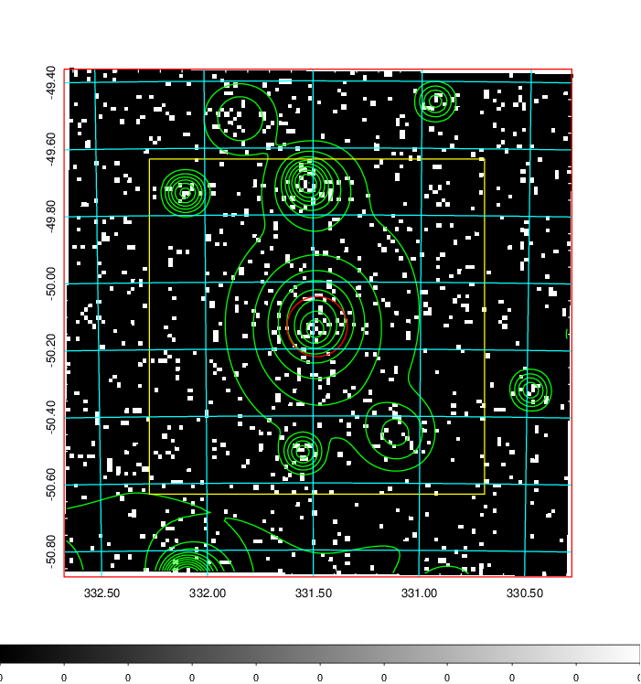  | 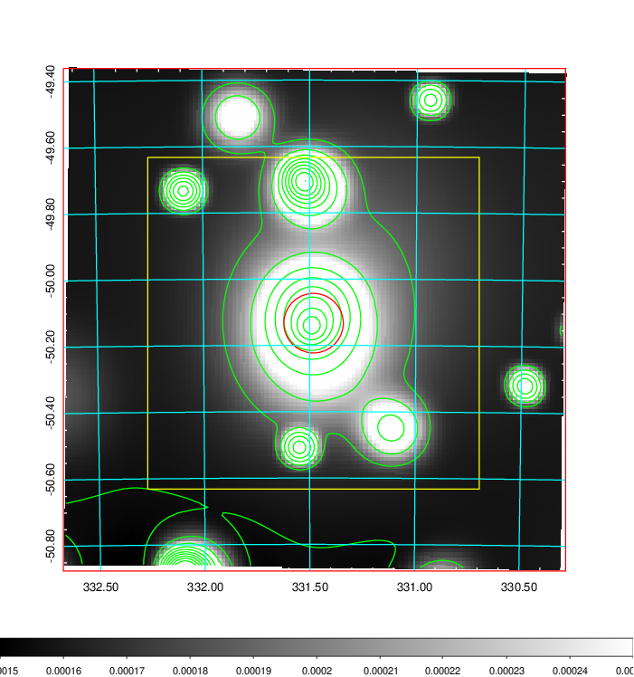   | 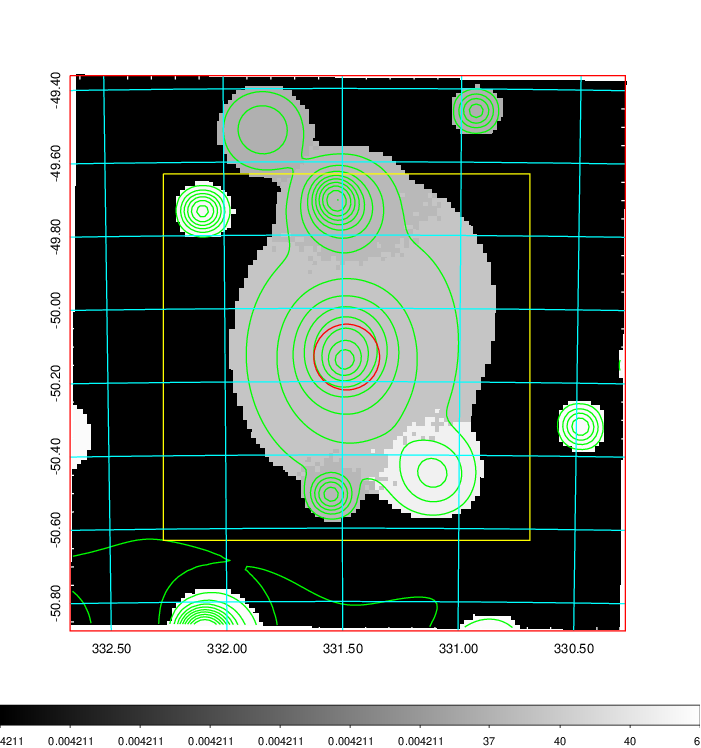  |

|[Exposure image](../image/879/879_mex.pdf)| [nH image](../image/879/879_nh.pdf)| [Planck image](../image/879/879_p.pdf)|
|-------------------|--------------------|-------------------|
|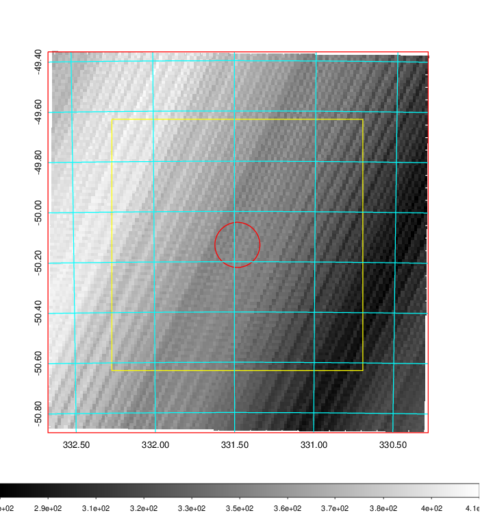   | 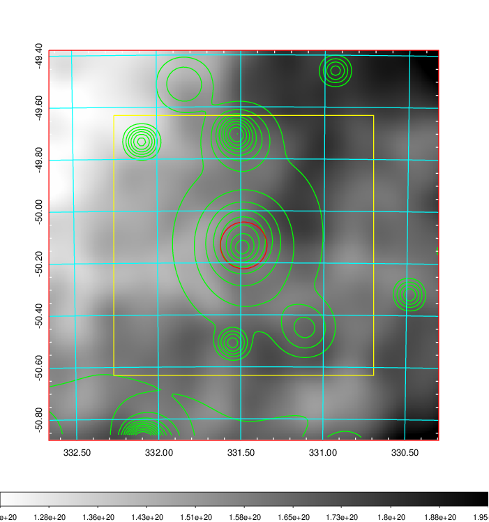    | 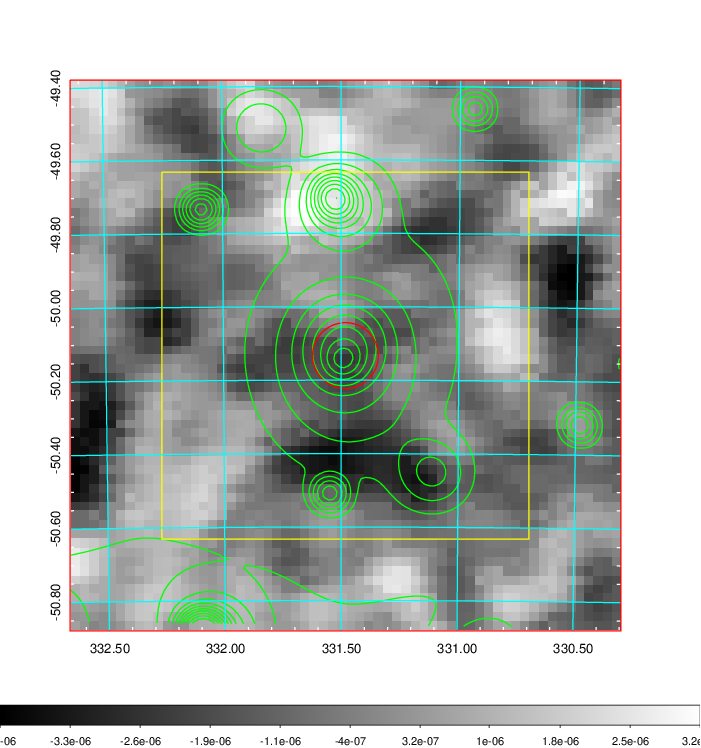 |

|[Redshift Histogram](../image/879/879_zg.pdf) | [DSS image(z1)](../image/879/879_dss_z1.pdf)      |  [DSS image(z2)](../image/879/879_dss_z2.pdf)    |
|-------------------|--------------------|-------------------|
|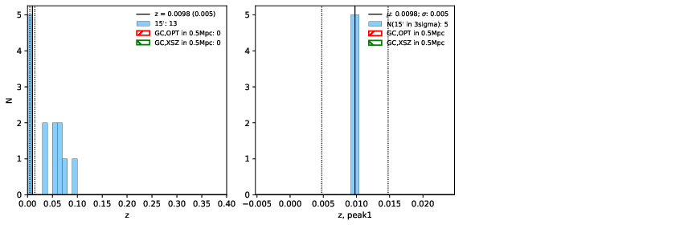 |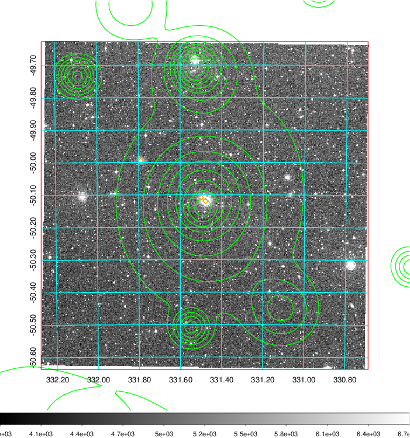  Blue circle for optical clusters;  Magenta circle for XSZ clusters;  all with r=1Mpc;  Only GC with Delta_z<0.01 are shown. | 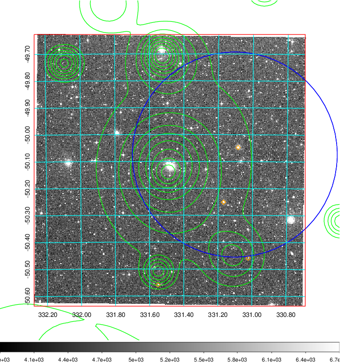 Blue circle for optical clusters;  Magenta circle for XSZ clusters;  all with r=1Mpc;  Only GC with Delta_z<0.01 are shown.  |

|[Previous-identified clusters](../image/879/879_gc.pdf) | [2MASS image](../image/879/879_2mass.pdf)      |
|-------------------|-------------------|
|  Green, magenta, and blue circles  for optical, X-ray and SZ clusters  respectively, with redshift of clusters  labelled. The radius of circles  are 1Mpc.|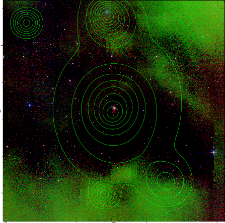  |

|[DES image](../image/879/879_des.pdf)   |
|-------------------|
| 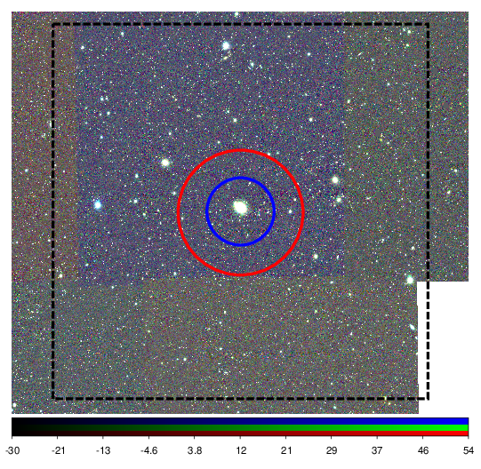  |
