

### 88

|Name|RAJ2000[deg]|DEJ2000[deg] |Ext[arcmin]| Ext,ml | z | z_src| C|GC(XSZ,Delta_z<0.01)| GC(OPT,Delta_z<0.01)|GC| R_sig[arcmin] | R500[arcmin] | R500[Mpc]| CRsig[c/s] | CR500[c/s] |L500[1E44 erg/s]|F500[1E-12 erg/s/cm^2]| M500[1E14 Msun]|Tx[keV]|Cnt_sig|Beta|Rc[arcmin]|Comment|Alias|
|---|---|---|---|---|---|------|---|--------|---------|----------|---|---|---|---|---|---|---|---|---|---|---|---|---|---|
|88| 27.702| 33.071| 3.87| 48.19| 0.0367(0.005)| z1, z_xsz| B| MCXC, Tar| A, N| A, F20, MCXC, N, SPI, Tar, W| 27.169| 17.219| 0.753| 0.622(0.085)| 0.586(0.080)| 0.315(0.038)| 10.094(1.224)| 1.26(0.08)| 2.50(0.10)| 175.0| 0.507(-0.005+0.011)| 5.363(-0.393+0.457)| -| k466|

|[RASS image](../image/88/88_img.pdf)|[filtered image](../image/88/88_fil.pdf)|[Segment image](../image/88/88_seg.pdf)|
|-------------------|--------------------|-------------------|
| 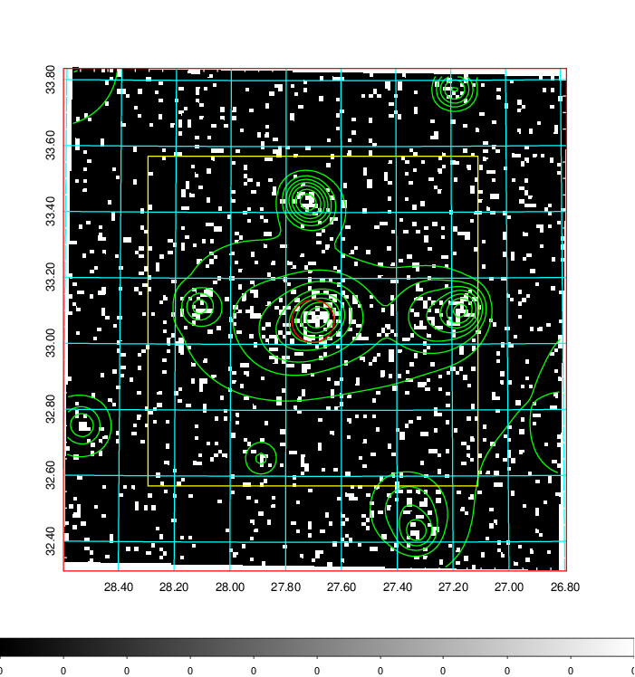  | 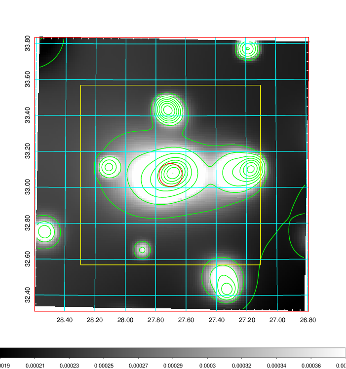   | 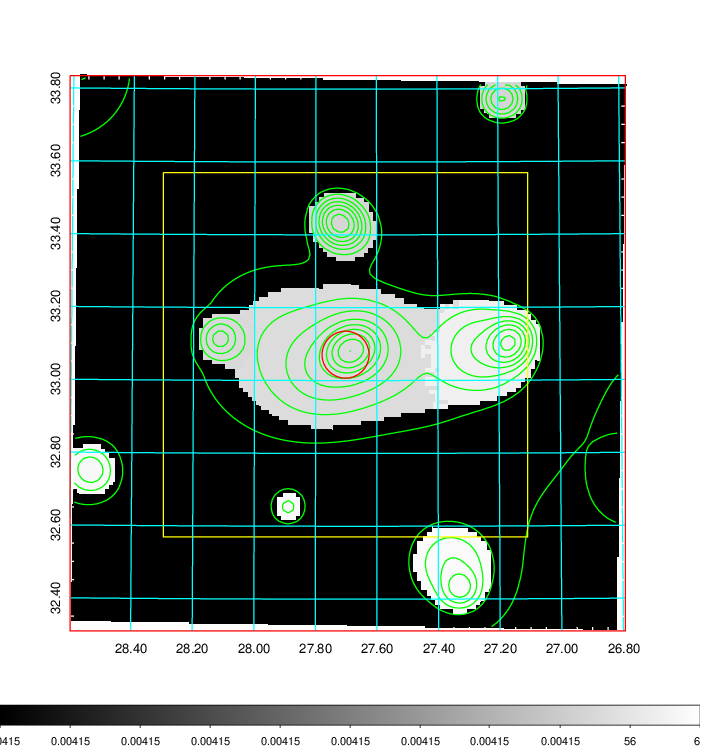  |

|[Exposure image](../image/88/88_mex.pdf)| [nH image](../image/88/88_nh.pdf)| [Planck image](../image/88/88_p.pdf)|
|-------------------|--------------------|-------------------|
|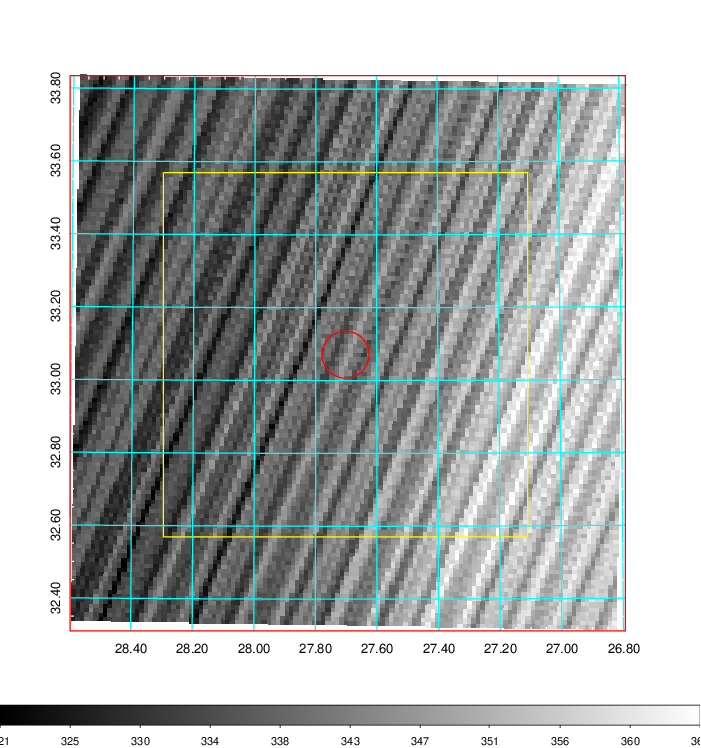   | 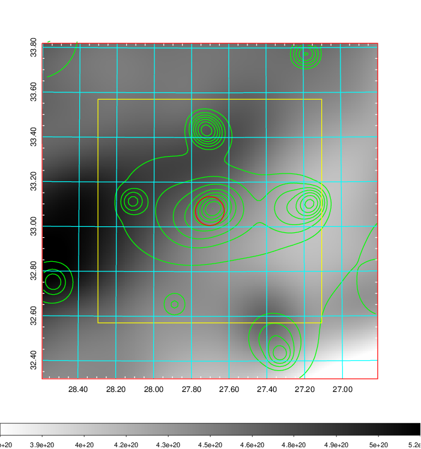    | 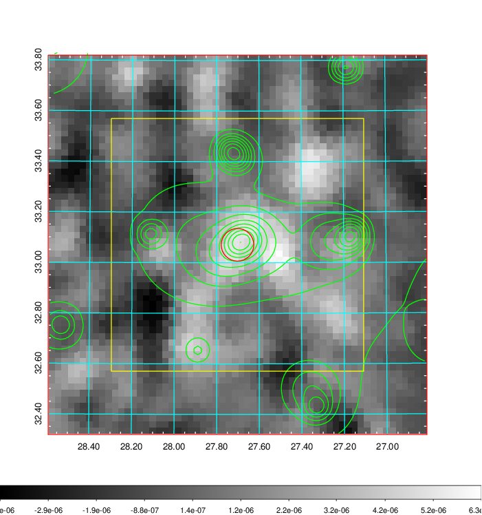 |

|[Redshift Histogram](../image/88/88_zg.pdf) | [DSS image(z1)](../image/88/88_dss_z1.pdf)      |  [DSS image(z2)](../image/88/88_dss_z2.pdf)    |
|-------------------|--------------------|-------------------|
|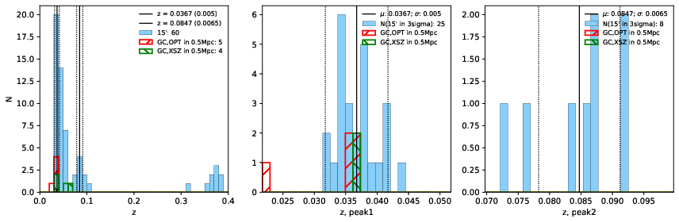 |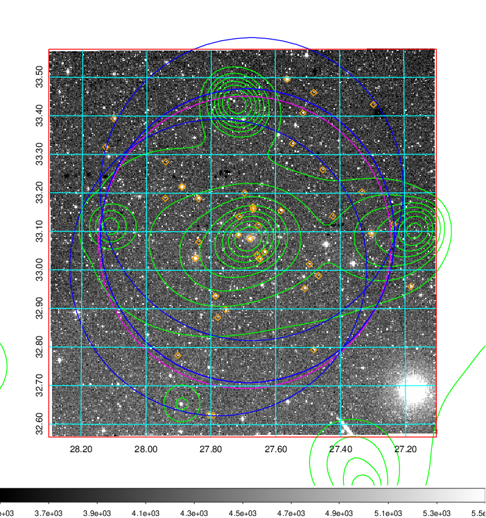  Blue circle for optical clusters;  Magenta circle for XSZ clusters;  all with r=1Mpc;  Only GC with Delta_z<0.01 are shown. | 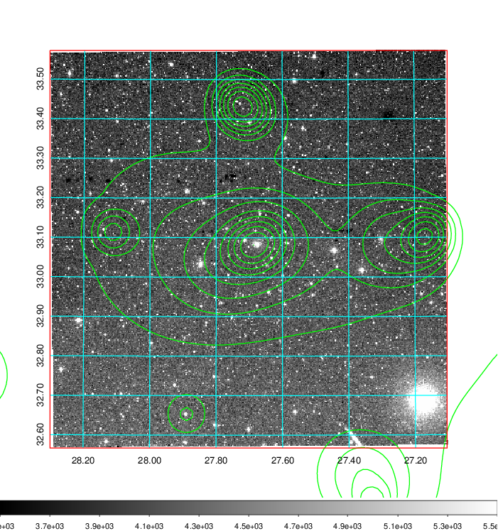 Blue circle for optical clusters;  Magenta circle for XSZ clusters;  all with r=1Mpc;  Only GC with Delta_z<0.01 are shown.  |

|[known Abell/XSZ clusters](../image/88/88_gc.pdf) | [2MASS image](../image/88/88_2mass.pdf)      |[SDSS image](../image/88/88_sdss.pdf)   |
|-------------------|-------------------|-------------------|
|  Magenta, blue and green circles  for optical, X-ray and SZ clusters  respectively, with redshift of clusters  labelled. The radius of circles  are 1Mpc.|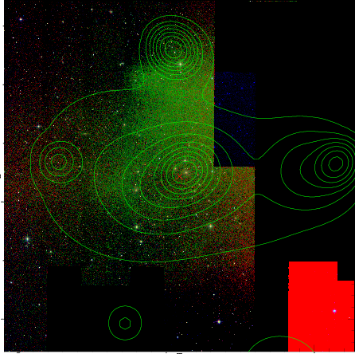  | 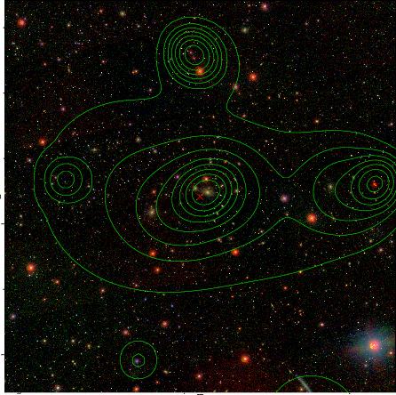  |

