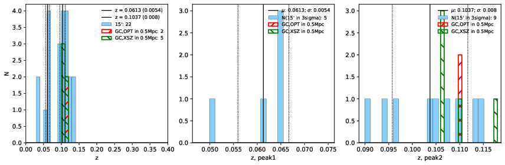

### 880

|Name|RAJ2000[deg]|DEJ2000[deg] |Ext[arcmin]| Ext,ml | z | z_src| C|GC(XSZ,Delta_z<0.01)| GC(OPT,Delta_z<0.01)|GC| R_sig[arcmin] | R500[arcmin] | R500[Mpc]| CRsig[c/s] | CR500[c/s] |L500[1E44 erg/s]|F500[1E-12 erg/s/cm^2]| M500[1E14 Msun]|Tx[keV]|Cnt_sig|Beta|Rc[arcmin]|Comment|Alias|
|---|---|---|---|---|---|------|---|--------|---------|----------|---|---|---|---|---|---|---|---|---|---|---|---|---|---|
|880| 332.350| -51.826| 2.05| 47.90| 0.1037(0.008)| z2, z_xsz| B| MCXC, PSZ2, Tar| A| A, MCXC, PSZ2, Tar, XB| 42.085| 8.359| 0.955| 0.296(0.097)| 0.261(0.085)| 1.428(0.257)| 5.214(0.939)| 2.74(0.24)| 4.12(0.23)| 118.4| 0.923(-0.078+0.054)| 4.589(-0.577+0.450)| -| k226|

|[RASS image](../image/880/880_img.pdf)|[filtered image](../image/880/880_fil.pdf)|[Segment image](../image/880/880_seg.pdf)|
|-------------------|--------------------|-------------------|
|   |    |   |

|[Exposure image](../image/880/880_mex.pdf)| [nH image](../image/880/880_nh.pdf)| [Planck image](../image/880/880_p.pdf)|
|-------------------|--------------------|-------------------|
|   |     |  |

|[Redshift Histogram](../image/880/880_zg.pdf) | [DSS image(z1)](../image/880/880_dss_z1.pdf)      |  [DSS image(z2)](../image/880/880_dss_z2.pdf)    |
|-------------------|--------------------|-------------------|
| |  Blue circle for optical clusters;  Magenta circle for XSZ clusters;  all with r=1Mpc;  Only GC with Delta_z<0.01 are shown. |  Blue circle for optical clusters;  Magenta circle for XSZ clusters;  all with r=1Mpc;  Only GC with Delta_z<0.01 are shown.  |

|[Previous-identified clusters](../image/880/880_gc.pdf) | [2MASS image](../image/880/880_2mass.pdf)      |
|-------------------|-------------------|
|  Green, magenta, and blue circles  for optical, X-ray and SZ clusters  respectively, with redshift of clusters  labelled. The radius of circles  are 1Mpc.|  |

|[DES image](../image/880/880_des.pdf)   |
|-------------------|
|   |
