

### 881

|Name|RAJ2000[deg]|DEJ2000[deg] |Ext[arcmin]| Ext,ml | z | z_src| C|GC(XSZ,Delta_z<0.01)| GC(OPT,Delta_z<0.01)|GC| R_sig[arcmin] | R500[arcmin] | R500[Mpc]| CRsig[c/s] | CR500[c/s] |L500[1E44 erg/s]|F500[1E-12 erg/s/cm^2]| M500[1E14 Msun]|Tx[keV]|Cnt_sig|Beta|Rc[arcmin]|Comment|Alias|
|---|---|---|---|---|---|------|---|--------|---------|----------|---|---|---|---|---|---|---|---|---|---|---|---|---|---|
|881| 332.589| -12.170| 2.55| 223.32| 0.0842(0.006)| z1, z_xsz| B| L03, MCXC, PSZ2, Tar| A, W| A, L03, MCXC, PSZ2, Tar, W| 8.800| 11.793| 1.119| 0.735(0.062)| 0.778(0.066)| 2.557(0.088)| 14.532(0.498)| 4.32(0.07)| 5.42(0.06)| 201.6| 0.957(-0.059+0.031)| 5.261(-0.383+0.284)| -| k310|

|[RASS image](../image/881/881_img.pdf)|[filtered image](../image/881/881_fil.pdf)|[Segment image](../image/881/881_seg.pdf)|
|-------------------|--------------------|-------------------|
| 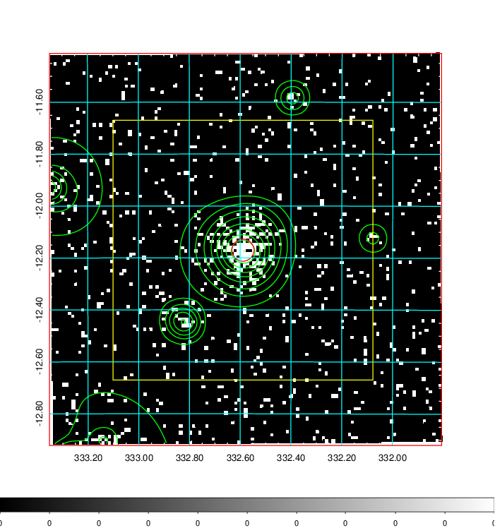  | 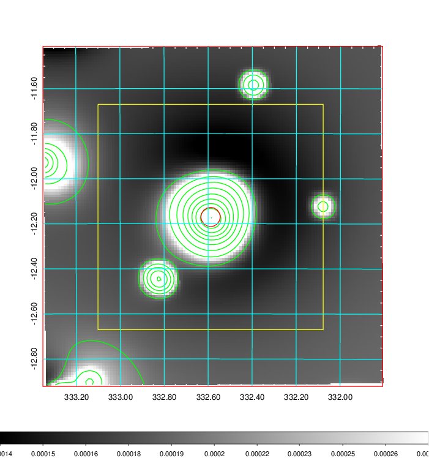   | 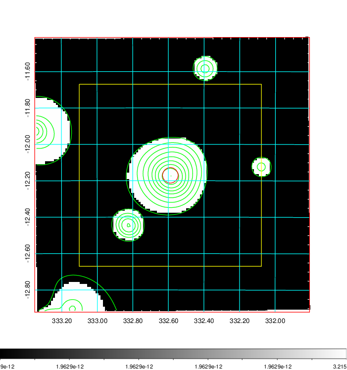  |

|[Exposure image](../image/881/881_mex.pdf)| [nH image](../image/881/881_nh.pdf)| [Planck image](../image/881/881_p.pdf)|
|-------------------|--------------------|-------------------|
|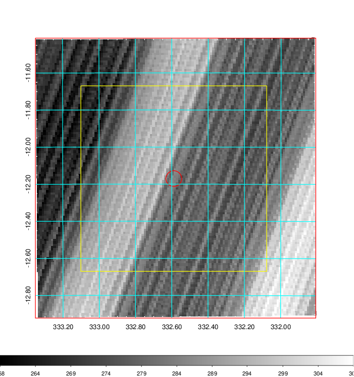   | 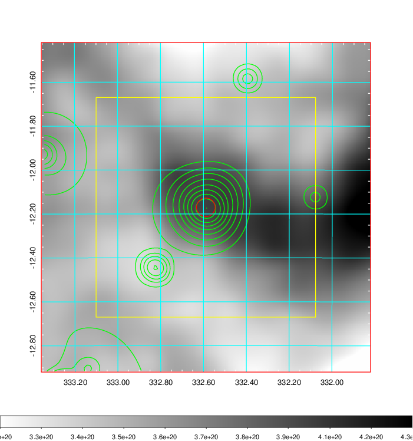    | 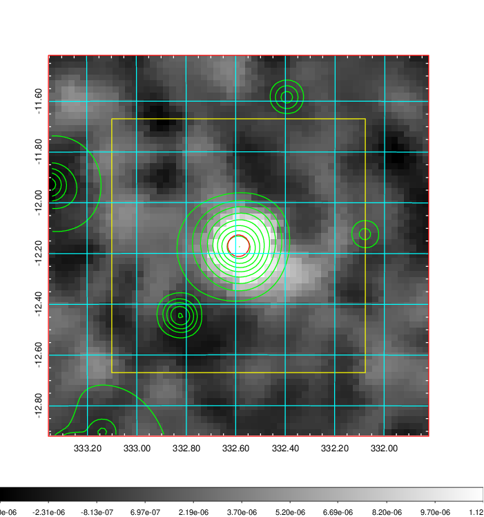 |

|[Redshift Histogram](../image/881/881_zg.pdf) | [DSS image(z1)](../image/881/881_dss_z1.pdf)      |  [DSS image(z2)](../image/881/881_dss_z2.pdf)    |
|-------------------|--------------------|-------------------|
|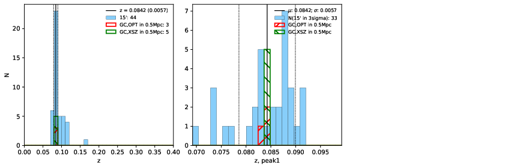 |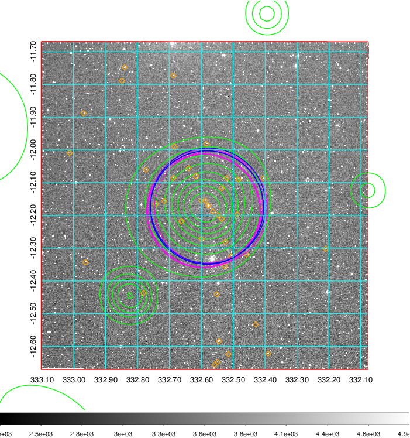  Blue circle for optical clusters;  Magenta circle for XSZ clusters;  all with r=1Mpc;  Only GC with Delta_z<0.01 are shown. | 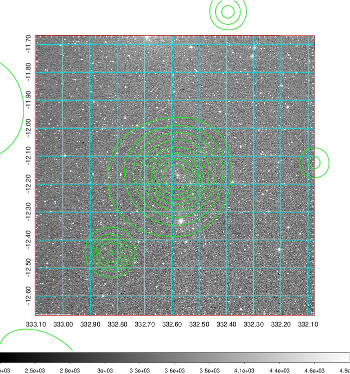 Blue circle for optical clusters;  Magenta circle for XSZ clusters;  all with r=1Mpc;  Only GC with Delta_z<0.01 are shown.  |

|[Previous-identified clusters](../image/881/881_gc.pdf) | [2MASS image](../image/881/881_2mass.pdf)      |
|-------------------|-------------------|
|  Green, magenta, and blue circles  for optical, X-ray and SZ clusters  respectively, with redshift of clusters  labelled. The radius of circles  are 1Mpc.|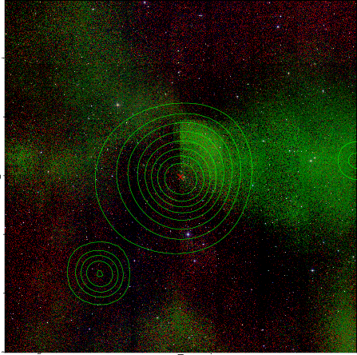  |

|[ATLAS image](../image/881/881_s.pdf)        |
|-------------------|
| 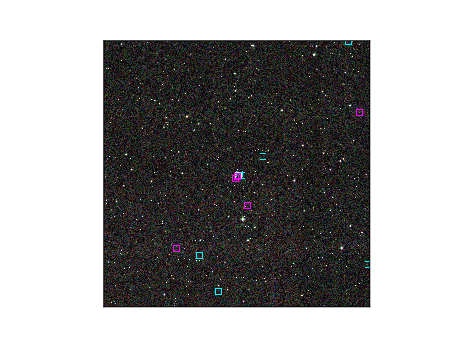  |
