

### 882

|Name|RAJ2000[deg]|DEJ2000[deg] |Ext[arcmin]| Ext,ml | z | z_src| C|GC(XSZ,Delta_z<0.01)| GC(OPT,Delta_z<0.01)|GC| R_sig[arcmin] | R500[arcmin] | R500[Mpc]| CRsig[c/s] | CR500[c/s] |L500[1E44 erg/s]|F500[1E-12 erg/s/cm^2]| M500[1E14 Msun]|Tx[keV]|Cnt_sig|Beta|Rc[arcmin]|Comment|Alias|
|---|---|---|---|---|---|------|---|--------|---------|----------|---|---|---|---|---|---|---|---|---|---|---|---|---|---|
|882| 333.636| -10.372| 1.26| 66.96| 0.0934(0.006)| z1, z_xsz| B| MCXC, PSZ2, Tar, XB| A, N, W| A, MCXC, N, PSZ2, Tar, W, XB| 14.825| 10.658| 1.110| 0.642(0.082)| 0.614(0.078)| 2.504(0.128)| 11.423(0.586)| 4.25(0.11)| 5.39(0.09)| 177.0| 0.866(-0.085+0.083)| 3.169(-0.515+0.457)| -| k070|

|[RASS image](../image/882/882_img.pdf)|[filtered image](../image/882/882_fil.pdf)|[Segment image](../image/882/882_seg.pdf)|
|-------------------|--------------------|-------------------|
| 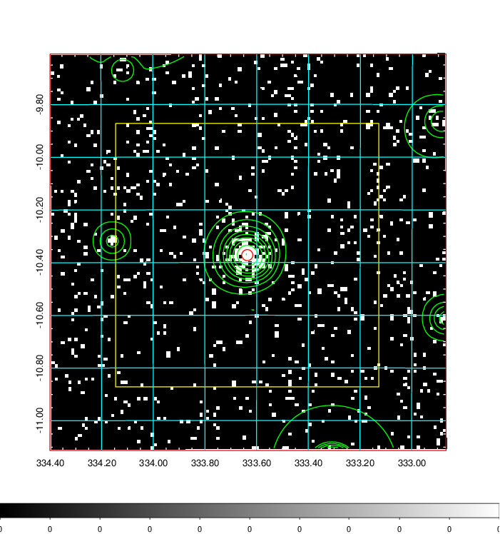  | 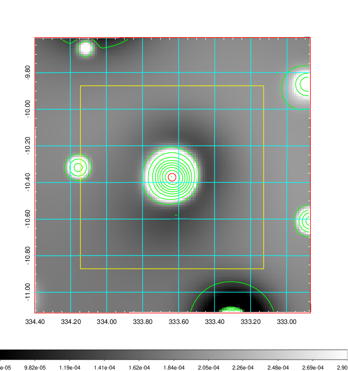   | 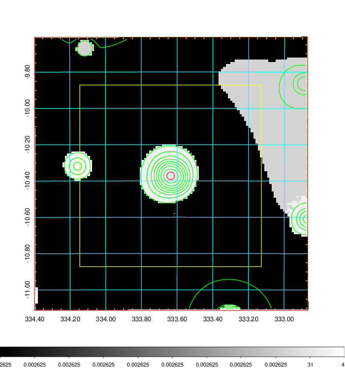  |

|[Exposure image](../image/882/882_mex.pdf)| [nH image](../image/882/882_nh.pdf)| [Planck image](../image/882/882_p.pdf)|
|-------------------|--------------------|-------------------|
|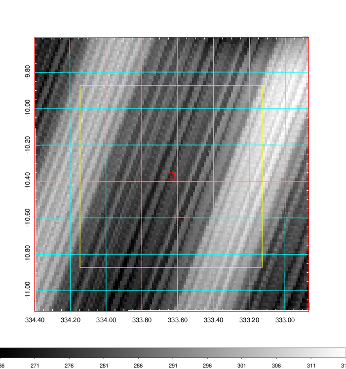   | 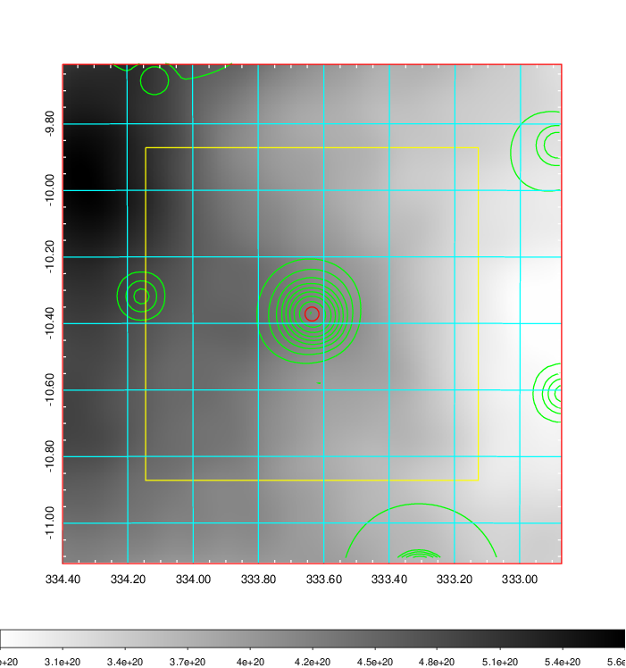    | 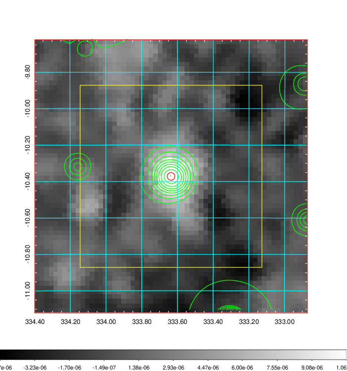 |

|[Redshift Histogram](../image/882/882_zg.pdf) | [DSS image(z1)](../image/882/882_dss_z1.pdf)      |  [DSS image(z2)](../image/882/882_dss_z2.pdf)    |
|-------------------|--------------------|-------------------|
|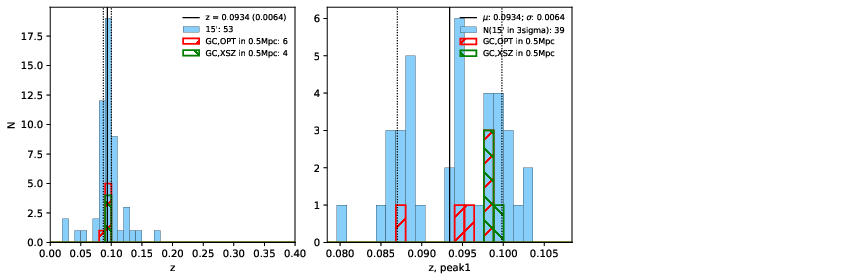 |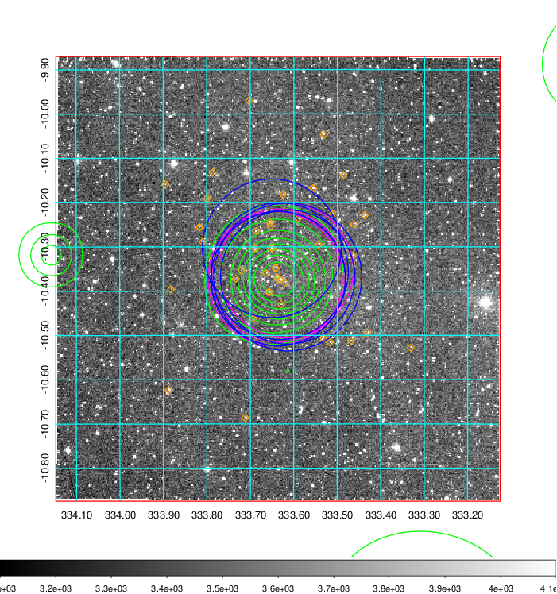  Blue circle for optical clusters;  Magenta circle for XSZ clusters;  all with r=1Mpc;  Only GC with Delta_z<0.01 are shown. | 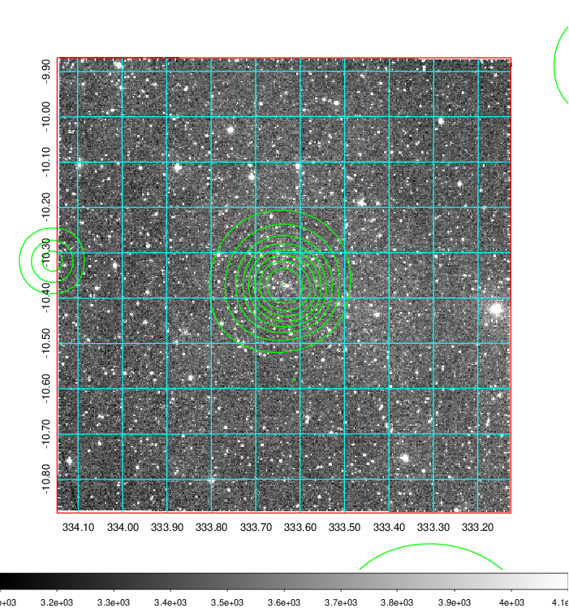 Blue circle for optical clusters;  Magenta circle for XSZ clusters;  all with r=1Mpc;  Only GC with Delta_z<0.01 are shown.  |

|[Previous-identified clusters](../image/882/882_gc.pdf) | [2MASS image](../image/882/882_2mass.pdf)      |
|-------------------|-------------------|
|  Green, magenta, and blue circles  for optical, X-ray and SZ clusters  respectively, with redshift of clusters  labelled. The radius of circles  are 1Mpc.|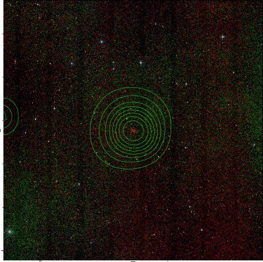  |

|[ATLAS image](../image/882/882_s.pdf)        |
|-------------------|
| 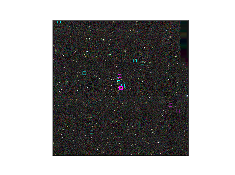  |
