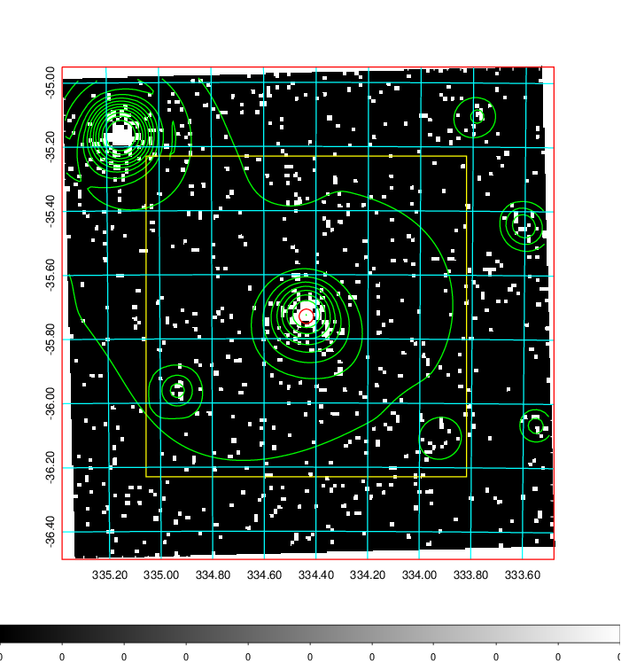
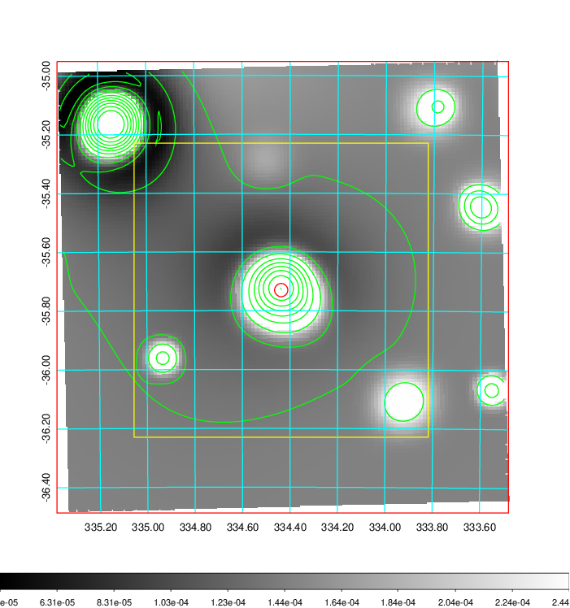
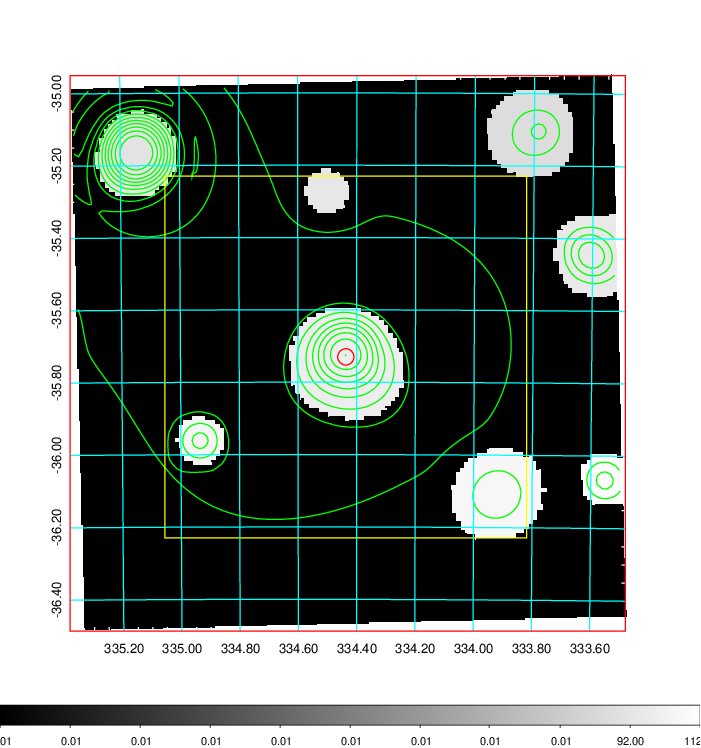
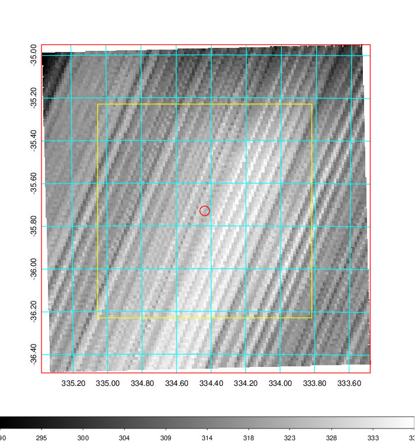
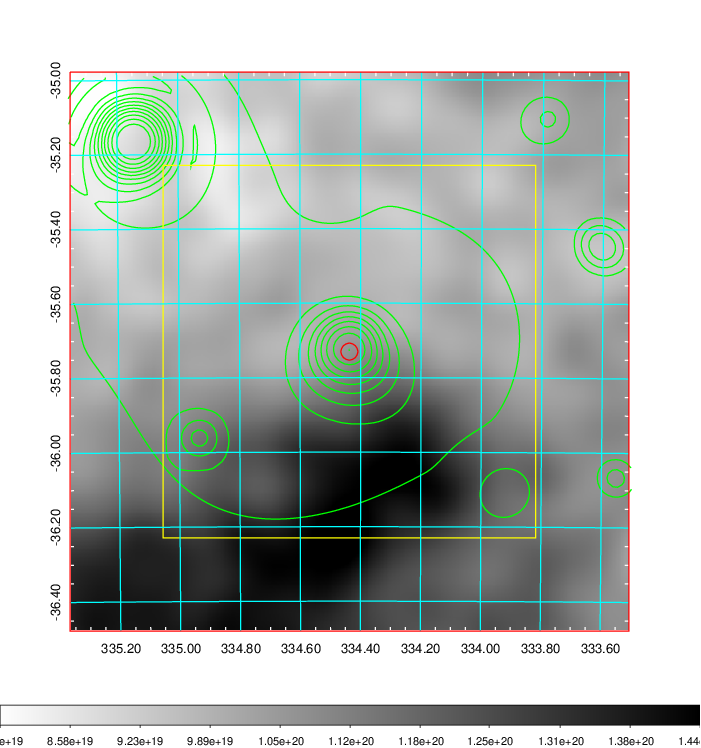
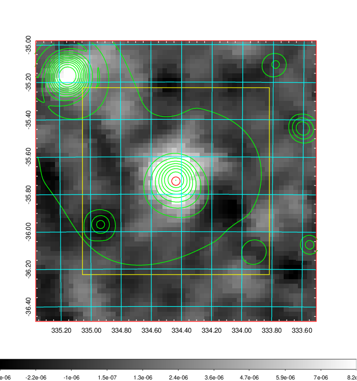
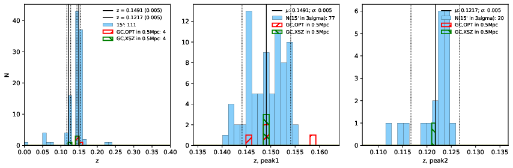
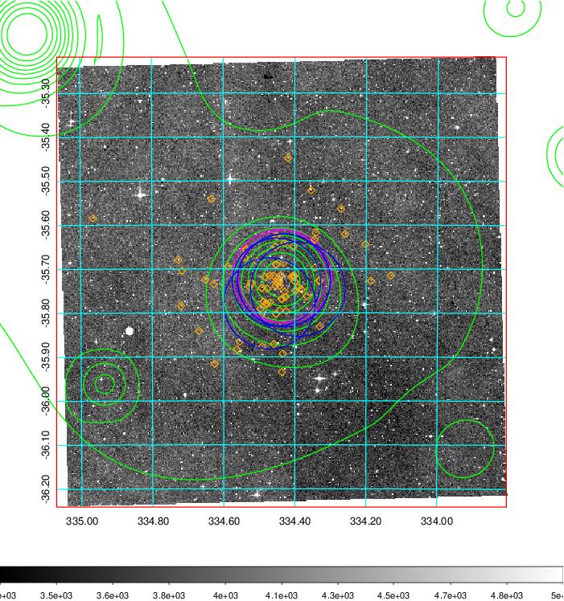
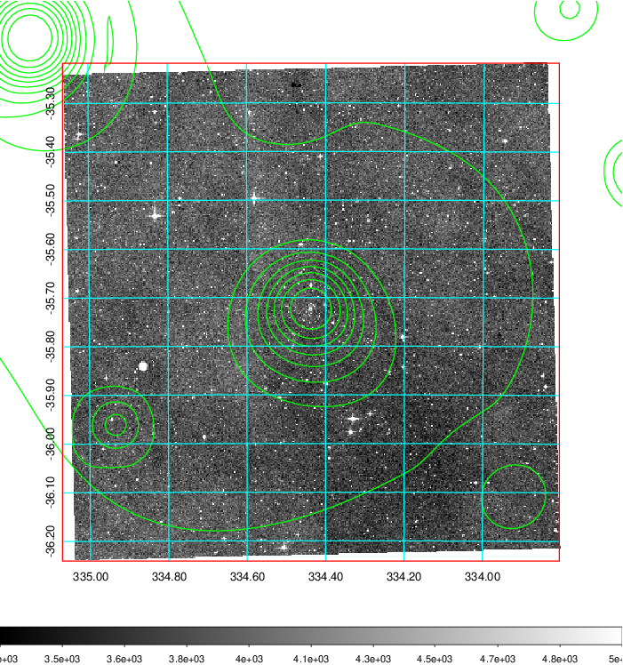
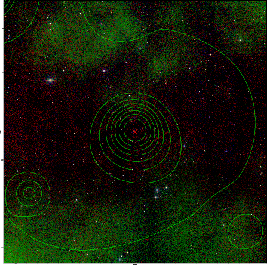

### 884

|Name|RAJ2000[deg]|DEJ2000[deg] |Ext[arcmin]| Ext,ml | z | z_src| C|GC(XSZ,Delta_z<0.01)| GC(OPT,Delta_z<0.01)|GC| R_sig[arcmin] | R500[arcmin] | R500[Mpc]| CRsig[c/s] | CR500[c/s] |L500[1E44 erg/s]|F500[1E-12 erg/s/cm^2]| M500[1E14 Msun]|Tx[keV]|Cnt_sig|Beta|Rc[arcmin]|Comment|Alias|
|---|---|---|---|---|---|------|---|--------|---------|----------|---|---|---|---|---|---|---|---|---|---|---|---|---|---|
|884| 334.437| -35.730| 1.35| 48.13| 0.1491(0.005)| z1, z_xsz| B| MCXC, PSZ2, Tar| A, W| A, MCXC, N, PSZ2, Tar, W, XB| 8.800| 7.439| 1.161| 0.354(0.043)| 0.345(0.042)| 4.255(0.252)| 7.085(0.419)| 5.15(0.15)| 6.17(0.11)| 106.1| 0.845(-0.121+0.104)| 3.367(-0.745+0.567)| -| k085|

|[RASS image](../image/884/884_img.pdf)|[filtered image](../image/884/884_fil.pdf)|[Segment image](../image/884/884_seg.pdf)|
|-------------------|--------------------|-------------------|
|   |    |   |

|[Exposure image](../image/884/884_mex.pdf)| [nH image](../image/884/884_nh.pdf)| [Planck image](../image/884/884_p.pdf)|
|-------------------|--------------------|-------------------|
|   |     |  |

|[Redshift Histogram](../image/884/884_zg.pdf) | [DSS image(z1)](../image/884/884_dss_z1.pdf)      |  [DSS image(z2)](../image/884/884_dss_z2.pdf)    |
|-------------------|--------------------|-------------------|
| |  Blue circle for optical clusters;  Magenta circle for XSZ clusters;  all with r=1Mpc;  Only GC with Delta_z<0.01 are shown. |  Blue circle for optical clusters;  Magenta circle for XSZ clusters;  all with r=1Mpc;  Only GC with Delta_z<0.01 are shown.  |

|[known Abell/XSZ clusters](../image/884/884_gc.pdf) | [2MASS image](../image/884/884_2mass.pdf)      |
|-------------------|-------------------|
|  Magenta, blue and green circles  for optical, X-ray and SZ clusters  respectively, with redshift of clusters  labelled. The radius of circles  are 1Mpc.|  |

|[ATLAS image](../image/884/884_s.pdf)        |
|-------------------|
|   |
