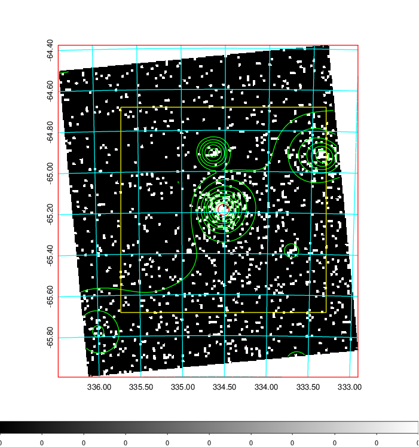
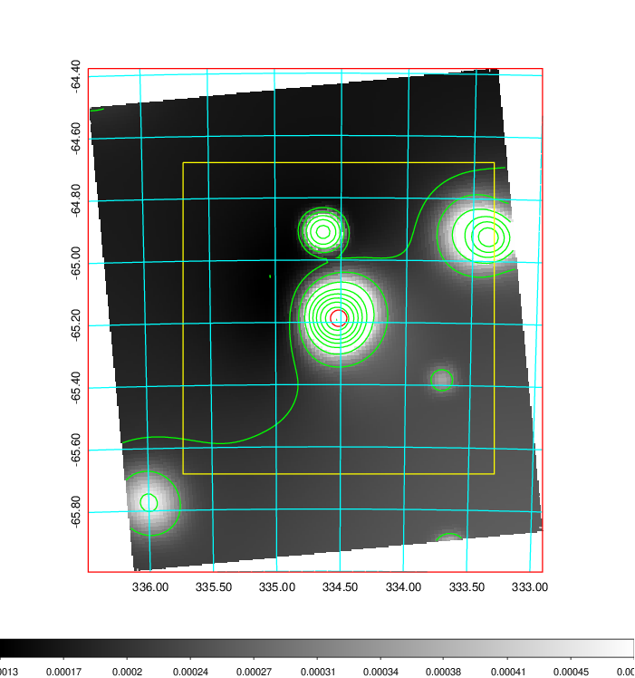
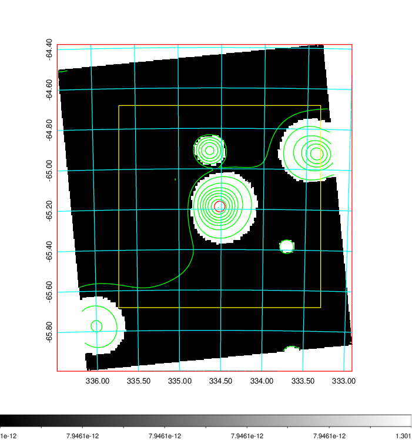
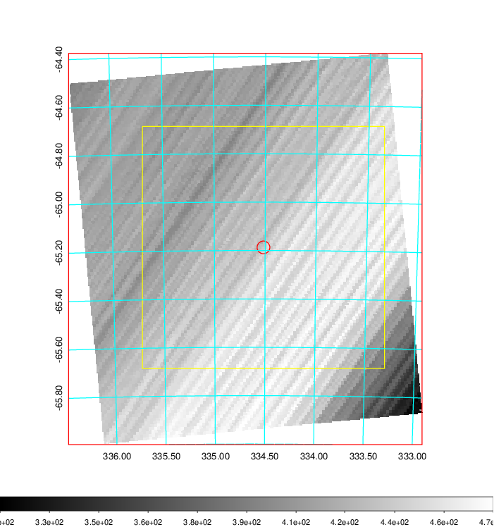
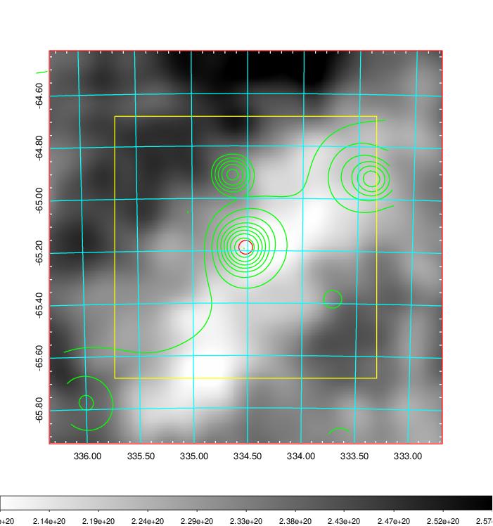
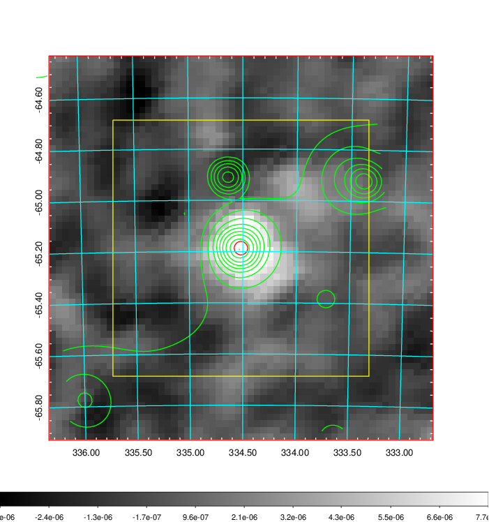
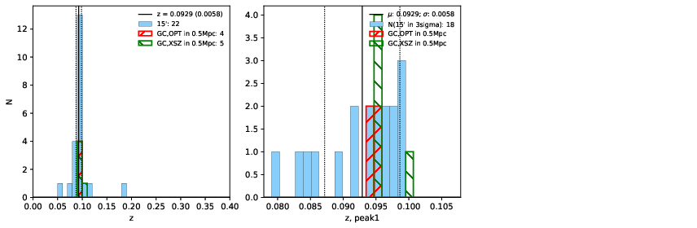
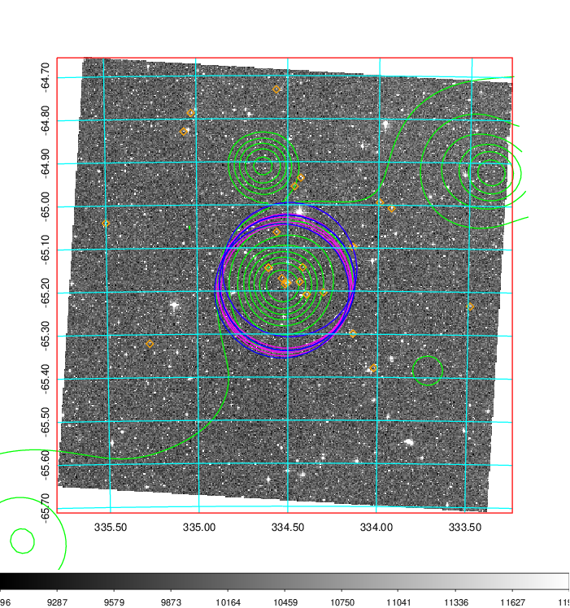
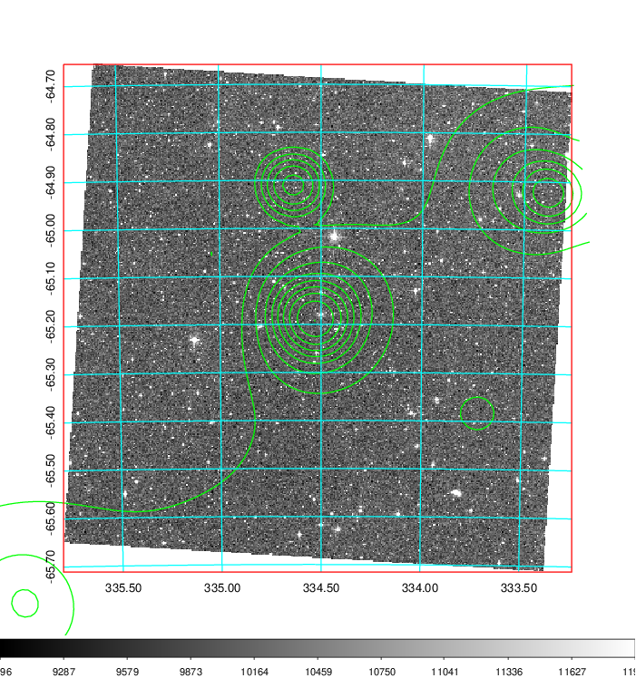
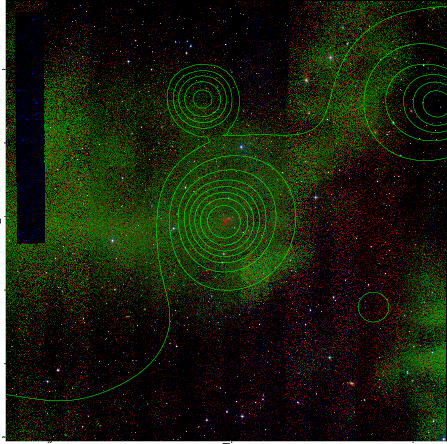

### 885

|Name|RAJ2000[deg]|DEJ2000[deg] |Ext[arcmin]| Ext,ml | z | z_src| C|GC(XSZ,Delta_z<0.01)| GC(OPT,Delta_z<0.01)|GC| R_sig[arcmin] | R500[arcmin] | R500[Mpc]| CRsig[c/s] | CR500[c/s] |L500[1E44 erg/s]|F500[1E-12 erg/s/cm^2]| M500[1E14 Msun]|Tx[keV]|Cnt_sig|Beta|Rc[arcmin]|Comment|Alias|
|---|---|---|---|---|---|------|---|--------|---------|----------|---|---|---|---|---|---|---|---|---|---|---|---|---|---|
|885| 334.517| -65.187| 1.58| 74.81| 0.0929(0.006)| z1, z_xsz| B| B15, MCXC, PSZ2, Tar| N, W| B15, MCXC, N, PSZ2, Tar, W| 11.238| 9.848| 1.021| 0.443(0.043)| 0.435(0.043)| 1.838(0.091)| 8.480(0.421)| 3.30(0.08)| 4.61(0.07)| 183.1| 0.662(-0.069+0.095)| 2.597(-0.582+0.708)| -| k132|

|[RASS image](../image/885/885_img.pdf)|[filtered image](../image/885/885_fil.pdf)|[Segment image](../image/885/885_seg.pdf)|
|-------------------|--------------------|-------------------|
|   |    |   |

|[Exposure image](../image/885/885_mex.pdf)| [nH image](../image/885/885_nh.pdf)| [Planck image](../image/885/885_p.pdf)|
|-------------------|--------------------|-------------------|
|   |     |  |

|[Redshift Histogram](../image/885/885_zg.pdf) | [DSS image(z1)](../image/885/885_dss_z1.pdf)      |  [DSS image(z2)](../image/885/885_dss_z2.pdf)    |
|-------------------|--------------------|-------------------|
| |  Blue circle for optical clusters;  Magenta circle for XSZ clusters;  all with r=1Mpc;  Only GC with Delta_z<0.01 are shown. |  Blue circle for optical clusters;  Magenta circle for XSZ clusters;  all with r=1Mpc;  Only GC with Delta_z<0.01 are shown.  |

|[known Abell/XSZ clusters](../image/885/885_gc.pdf) | [2MASS image](../image/885/885_2mass.pdf)      |
|-------------------|-------------------|
|  Magenta, blue and green circles  for optical, X-ray and SZ clusters  respectively, with redshift of clusters  labelled. The radius of circles  are 1Mpc.|  |

|[DES image](../image/885/885_des.pdf)   |
|-------------------|
|   |
