

### 886

|Name|RAJ2000[deg]|DEJ2000[deg] |Ext[arcmin]| Ext,ml | z | z_src| C|GC(XSZ,Delta_z<0.01)| GC(OPT,Delta_z<0.01)|GC| R_sig[arcmin] | R500[arcmin] | R500[Mpc]| CRsig[c/s] | CR500[c/s] |L500[1E44 erg/s]|F500[1E-12 erg/s/cm^2]| M500[1E14 Msun]|Tx[keV]|Cnt_sig|Beta|Rc[arcmin]|Comment|Alias|
|---|---|---|---|---|---|------|---|--------|---------|----------|---|---|---|---|---|---|---|---|---|---|---|---|---|---|
|886| 334.557| -3.819| 3.38| 56.34| 0.0855(0.008)| z1, z_xsz| B| MCXC| N| C, F20, MCXC, N, W| 25.688| 10.854| 1.044| 0.576(0.084)| 0.525(0.076)| 1.720(0.158)| 9.465(0.871)| 3.51(0.16)| 4.78(0.14)| 194.7| 0.527(-0.018+0.030)| 3.954(-0.437+0.636)| -| k416|

|[RASS image](../image/886/886_img.pdf)|[filtered image](../image/886/886_fil.pdf)|[Segment image](../image/886/886_seg.pdf)|
|-------------------|--------------------|-------------------|
| 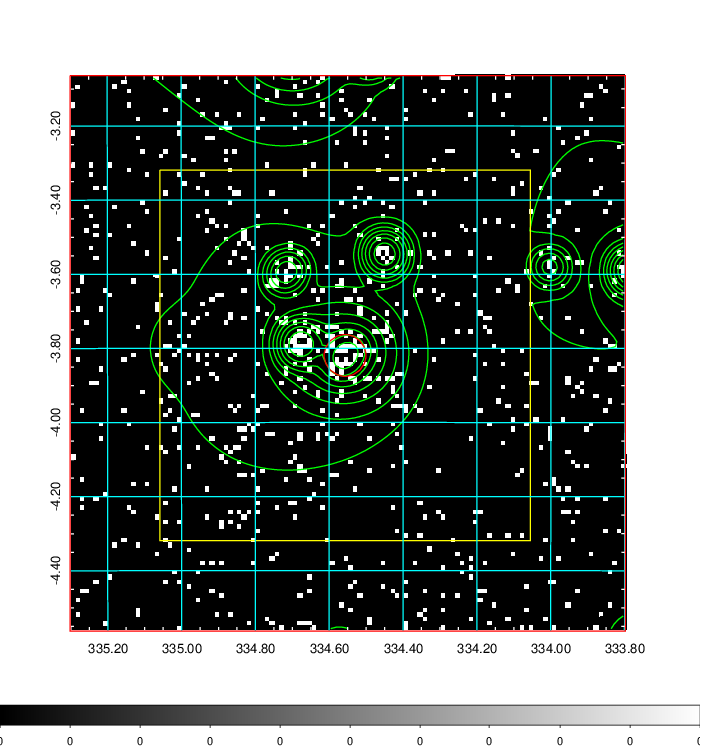  | 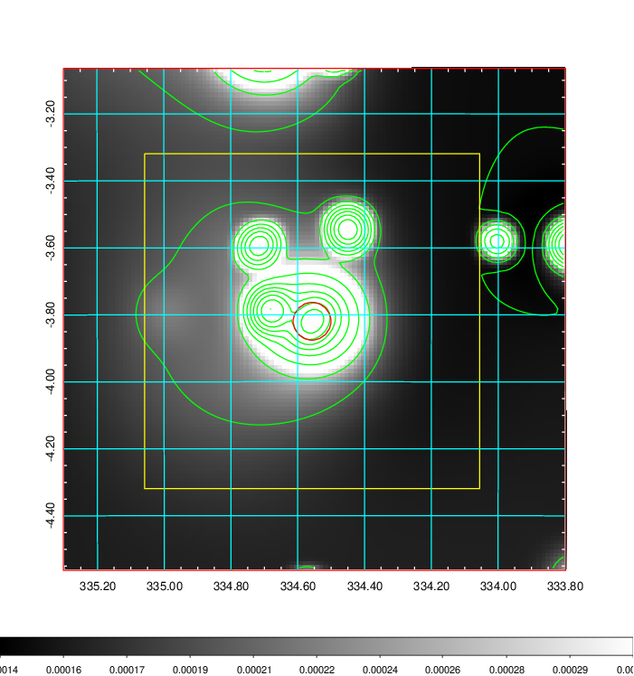   | 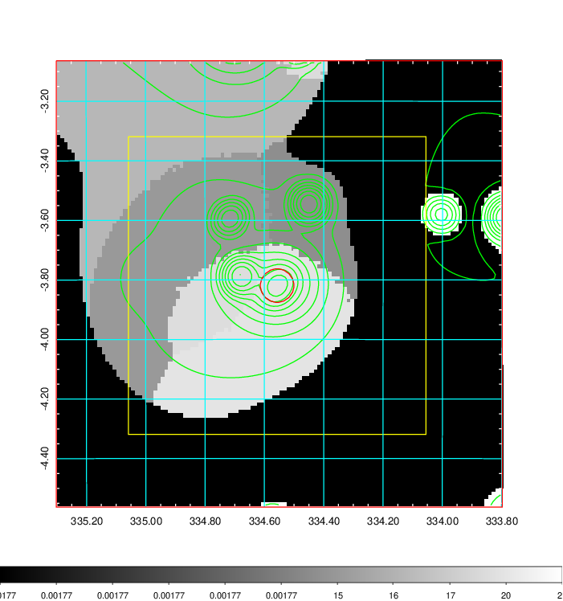  |

|[Exposure image](../image/886/886_mex.pdf)| [nH image](../image/886/886_nh.pdf)| [Planck image](../image/886/886_p.pdf)|
|-------------------|--------------------|-------------------|
|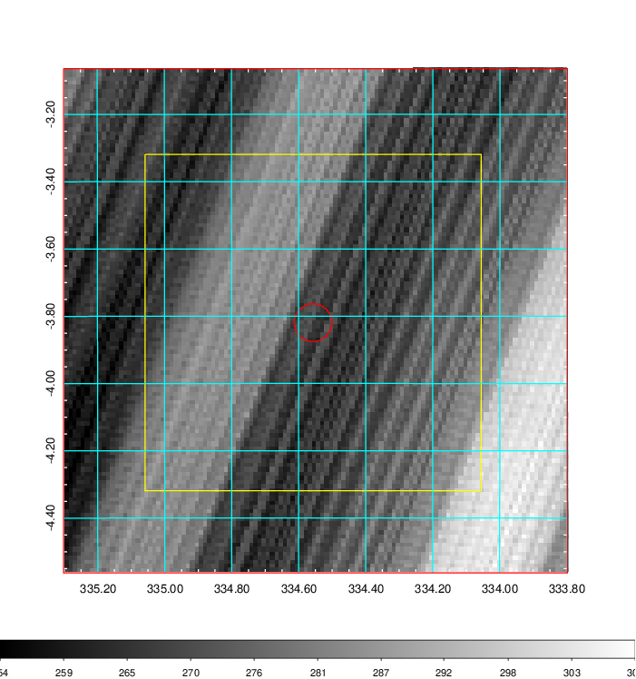   | 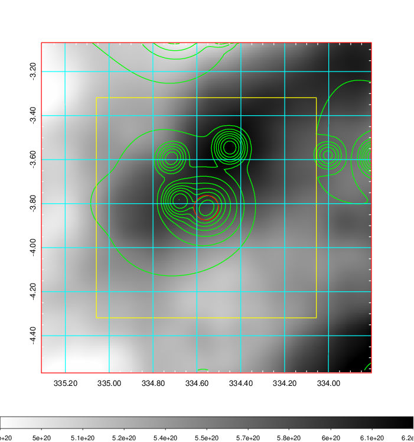    | 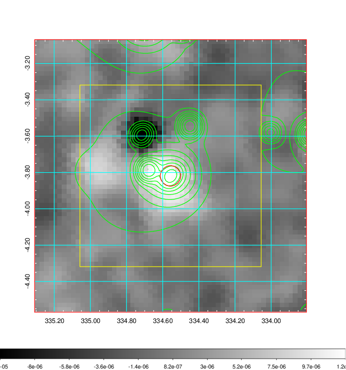 |

|[Redshift Histogram](../image/886/886_zg.pdf) | [DSS image(z1)](../image/886/886_dss_z1.pdf)      |  [DSS image(z2)](../image/886/886_dss_z2.pdf)    |
|-------------------|--------------------|-------------------|
|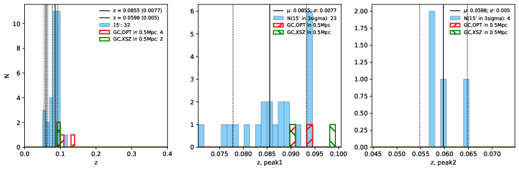 |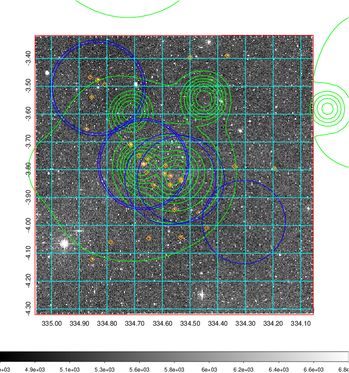  Blue circle for optical clusters;  Magenta circle for XSZ clusters;  all with r=1Mpc;  Only GC with Delta_z<0.01 are shown. | 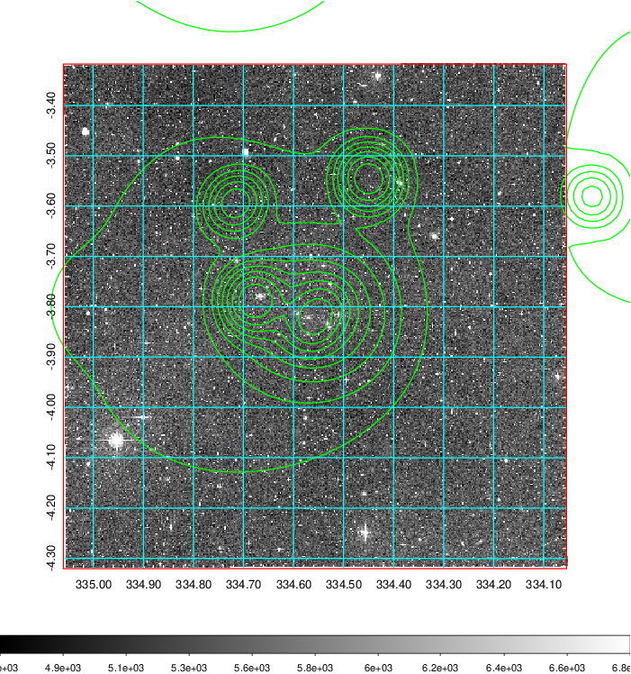 Blue circle for optical clusters;  Magenta circle for XSZ clusters;  all with r=1Mpc;  Only GC with Delta_z<0.01 are shown.  |

|[Previous-identified clusters](../image/886/886_gc.pdf) | [2MASS image](../image/886/886_2mass.pdf)      |[SDSS image](../image/886/886_sdss.pdf)   |
|-------------------|-------------------|-------------------|
|  Green, magenta, and blue circles  for optical, X-ray and SZ clusters  respectively, with redshift of clusters  labelled. The radius of circles  are 1Mpc.|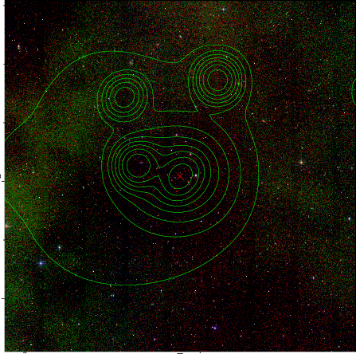  | 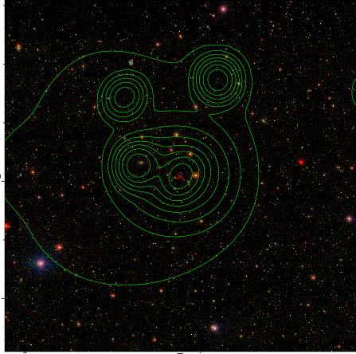  |

