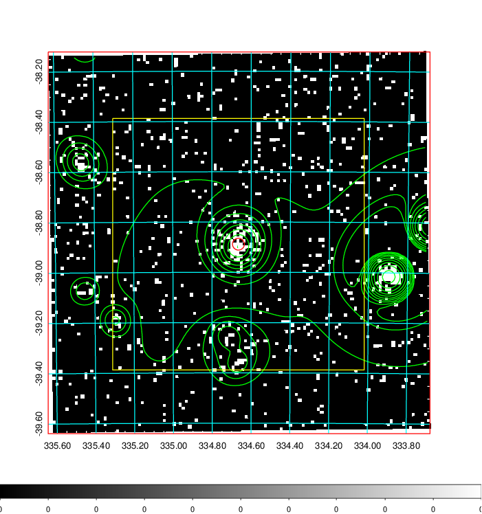
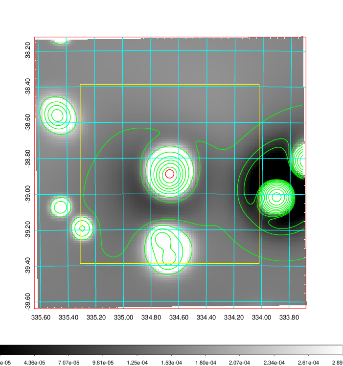
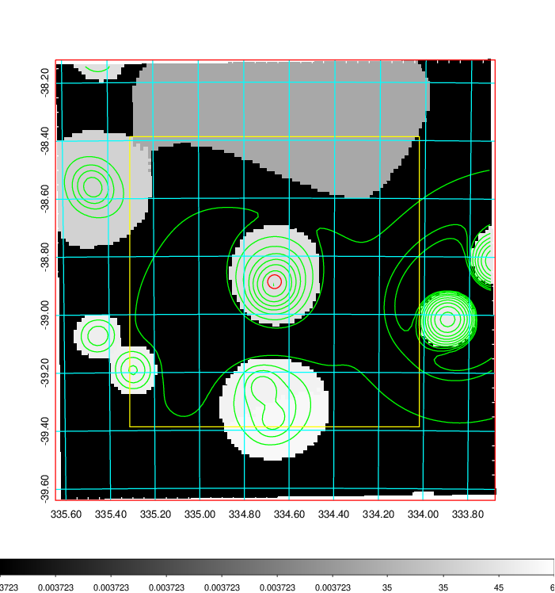
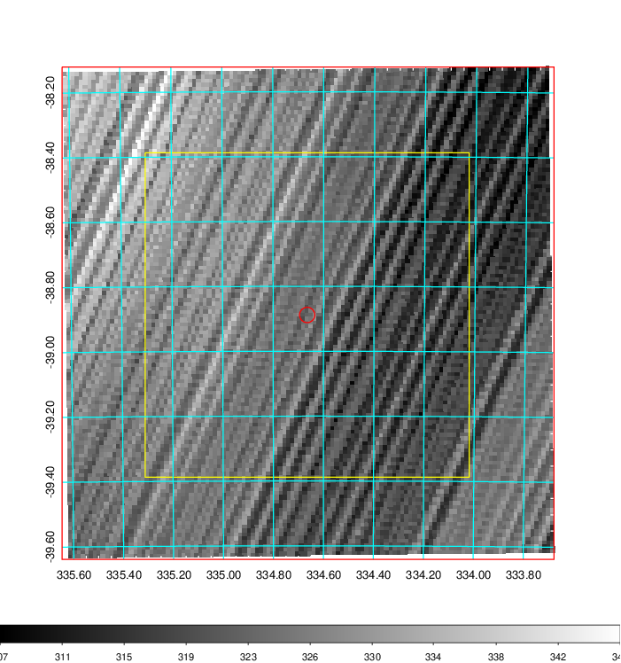
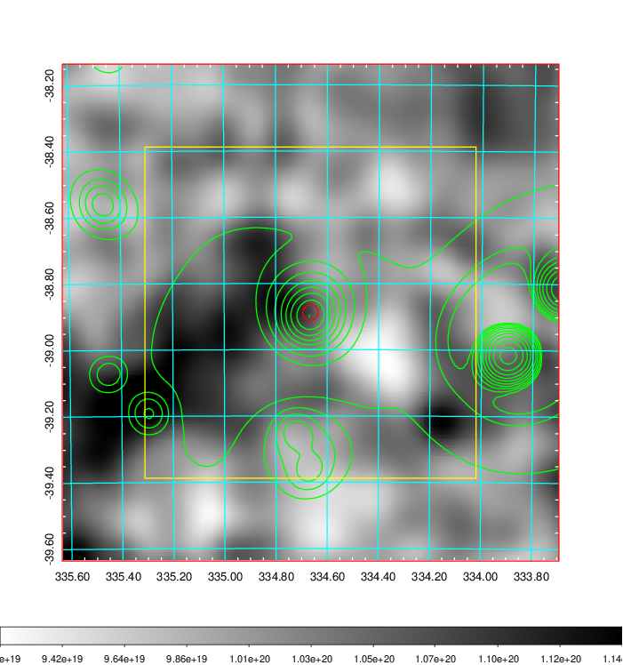
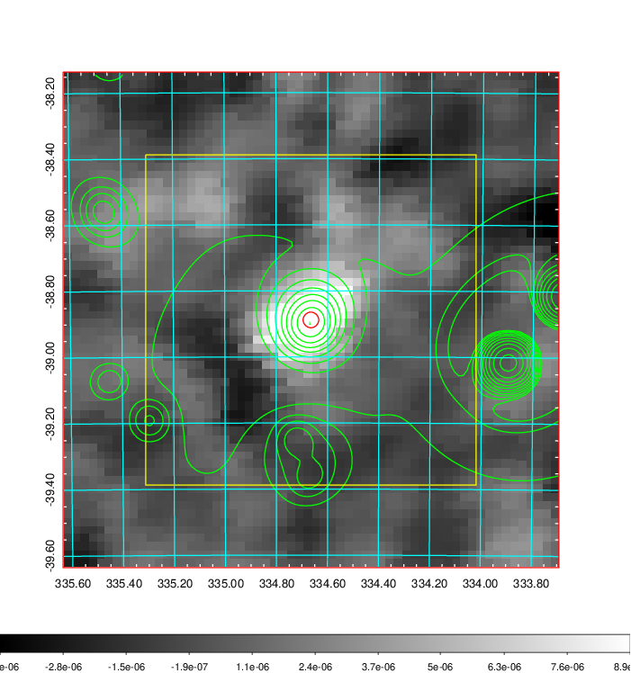
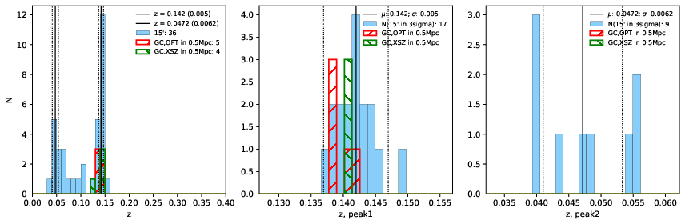
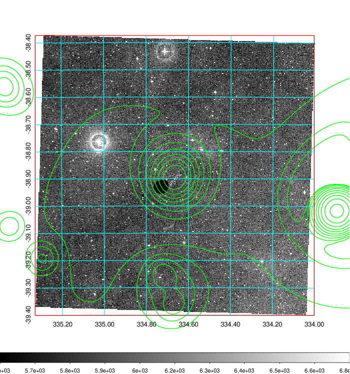
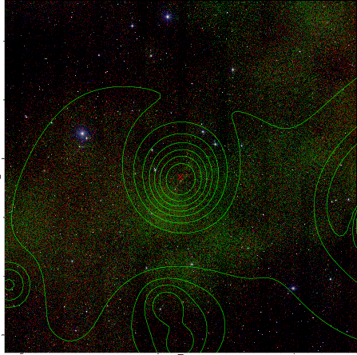
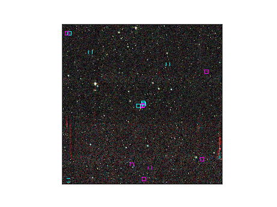

### 887

|Name|RAJ2000[deg]|DEJ2000[deg] |Ext[arcmin]| Ext,ml | z | z_src| C|GC(XSZ,Delta_z<0.01)| GC(OPT,Delta_z<0.01)|GC| R_sig[arcmin] | R500[arcmin] | R500[Mpc]| CRsig[c/s] | CR500[c/s] |L500[1E44 erg/s]|F500[1E-12 erg/s/cm^2]| M500[1E14 Msun]|Tx[keV]|Cnt_sig|Beta|Rc[arcmin]|Comment|Alias|
|---|---|---|---|---|---|------|---|--------|---------|----------|---|---|---|---|---|---|---|---|---|---|---|---|---|---|
|887| 334.665| -38.888| 1.42| 61.36| 0.1420(0.005)| z1, z_xsz| B| MCXC, PSZ2, Tar| A, N, W| A, MCXC, N, PSZ2, Tar, W, XB| 6.362| 7.640| 1.145| 0.339(0.045)| 0.351(0.046)| 3.895(0.215)| 7.215(0.399)| 4.90(0.13)| 5.97(0.10)| 112.1| 0.939(-0.080+0.044)| 3.290(-0.398+0.294)| -| k097|

|[RASS image](../image/887/887_img.pdf)|[filtered image](../image/887/887_fil.pdf)|[Segment image](../image/887/887_seg.pdf)|
|-------------------|--------------------|-------------------|
|   |    |   |

|[Exposure image](../image/887/887_mex.pdf)| [nH image](../image/887/887_nh.pdf)| [Planck image](../image/887/887_p.pdf)|
|-------------------|--------------------|-------------------|
|   |     |  |

|[Redshift Histogram](../image/887/887_zg.pdf) | [DSS image(z1)](../image/887/887_dss_z1.pdf)      |  [DSS image(z2)](../image/887/887_dss_z2.pdf)    |
|-------------------|--------------------|-------------------|
| |  Blue circle for optical clusters;  Magenta circle for XSZ clusters;  all with r=1Mpc;  Only GC with Delta_z<0.01 are shown. |  Blue circle for optical clusters;  Magenta circle for XSZ clusters;  all with r=1Mpc;  Only GC with Delta_z<0.01 are shown.  |

|[Previous-identified clusters](../image/887/887_gc.pdf) | [2MASS image](../image/887/887_2mass.pdf)      |
|-------------------|-------------------|
|  Green, magenta, and blue circles  for optical, X-ray and SZ clusters  respectively, with redshift of clusters  labelled. The radius of circles  are 1Mpc.|  |

|[ATLAS image](../image/887/887_s.pdf)        |
|-------------------|
|   |
