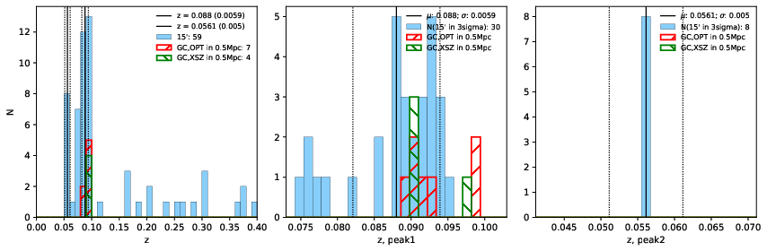

### 888

|Name|RAJ2000[deg]|DEJ2000[deg] |Ext[arcmin]| Ext,ml | z | z_src| C|GC(XSZ,Delta_z<0.01)| GC(OPT,Delta_z<0.01)|GC| R_sig[arcmin] | R500[arcmin] | R500[Mpc]| CRsig[c/s] | CR500[c/s] |L500[1E44 erg/s]|F500[1E-12 erg/s/cm^2]| M500[1E14 Msun]|Tx[keV]|Cnt_sig|Beta|Rc[arcmin]|Comment|Alias|
|---|---|---|---|---|---|------|---|--------|---------|----------|---|---|---|---|---|---|---|---|---|---|---|---|---|---|
|888| 334.705| -2.966| 5.62| 65.98| 0.0880(0.006)| z1, z_xsz| B| MCXC, PSZ2, Tar| N, W| C, F20, MCXC, N, PSZ2, Tar, W| 21.244| 9.291| 0.917| 0.300(0.074)| 0.274(0.068)| 0.954(0.167)| 4.940(0.863)| 2.39(0.21)| 3.77(0.21)| 94.1| 0.627(-0.069+0.111)| 5.495(-1.227+1.726)| -| k533|

|[RASS image](../image/888/888_img.pdf)|[filtered image](../image/888/888_fil.pdf)|[Segment image](../image/888/888_seg.pdf)|
|-------------------|--------------------|-------------------|
|   |    |   |

|[Exposure image](../image/888/888_mex.pdf)| [nH image](../image/888/888_nh.pdf)| [Planck image](../image/888/888_p.pdf)|
|-------------------|--------------------|-------------------|
|   |     |  |

|[Redshift Histogram](../image/888/888_zg.pdf) | [DSS image(z1)](../image/888/888_dss_z1.pdf)      |  [DSS image(z2)](../image/888/888_dss_z2.pdf)    |
|-------------------|--------------------|-------------------|
| |  Blue circle for optical clusters;  Magenta circle for XSZ clusters;  all with r=1Mpc;  Only GC with Delta_z<0.01 are shown. |  Blue circle for optical clusters;  Magenta circle for XSZ clusters;  all with r=1Mpc;  Only GC with Delta_z<0.01 are shown.  |

|[known Abell/XSZ clusters](../image/888/888_gc.pdf) | [2MASS image](../image/888/888_2mass.pdf)      |[SDSS image](../image/888/888_sdss.pdf)   |
|-------------------|-------------------|-------------------|
|  Magenta, blue and green circles  for optical, X-ray and SZ clusters  respectively, with redshift of clusters  labelled. The radius of circles  are 1Mpc.|  |   |

