

### 889

|Name|RAJ2000[deg]|DEJ2000[deg] |Ext[arcmin]| Ext,ml | z | z_src| C|GC(XSZ,Delta_z<0.01)| GC(OPT,Delta_z<0.01)|GC| R_sig[arcmin] | R500[arcmin] | R500[Mpc]| CRsig[c/s] | CR500[c/s] |L500[1E44 erg/s]|F500[1E-12 erg/s/cm^2]| M500[1E14 Msun]|Tx[keV]|Cnt_sig|Beta|Rc[arcmin]|Comment|Alias|
|---|---|---|---|---|---|------|---|--------|---------|----------|---|---|---|---|---|---|---|---|---|---|---|---|---|---|
|889| 335.030| -52.485| 2.33| 34.12| 0.1003(0.006)| z1, z_xsz| B| MCXC, PSZ2, Tar| A, N, W| A, MCXC, N, PSZ2, SWXCS, Tar, W| 8.800| 7.535| 0.836| 0.152(0.036)| 0.149(0.035)| 0.744(0.115)| 2.915(0.452)| 1.83(0.14)| 3.21(0.16)| 50.0| 0.878(-0.128+0.086)| 4.061(-0.795+0.626)| -| k269|

|[RASS image](../image/889/889_img.pdf)|[filtered image](../image/889/889_fil.pdf)|[Segment image](../image/889/889_seg.pdf)|
|-------------------|--------------------|-------------------|
| 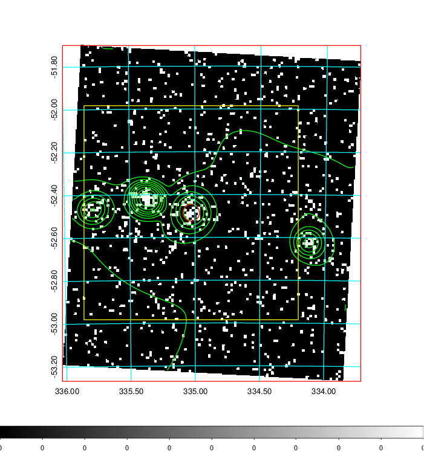  | 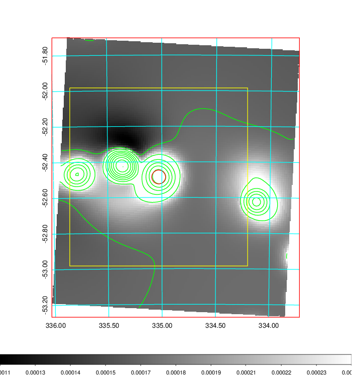   | 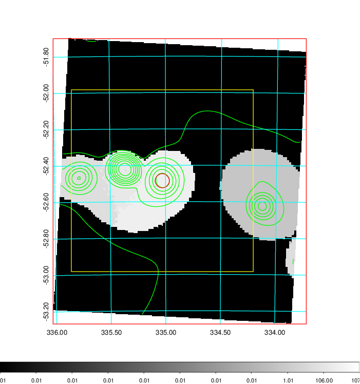  |

|[Exposure image](../image/889/889_mex.pdf)| [nH image](../image/889/889_nh.pdf)| [Planck image](../image/889/889_p.pdf)|
|-------------------|--------------------|-------------------|
|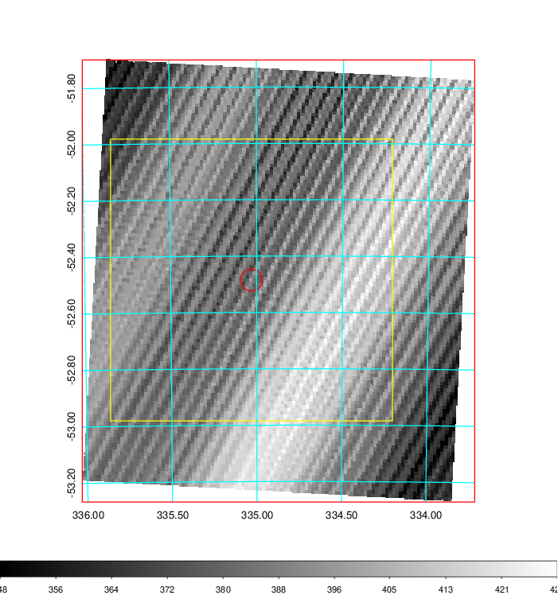   | 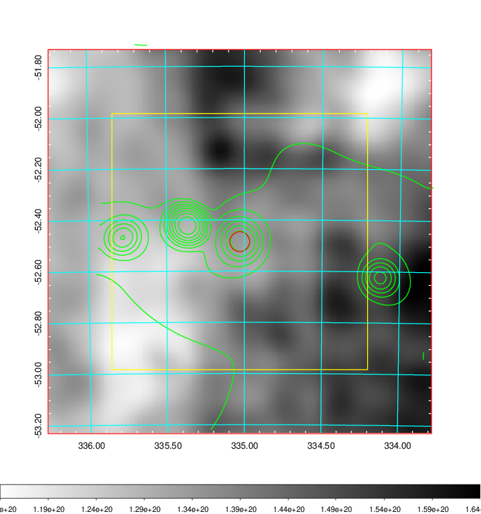    | 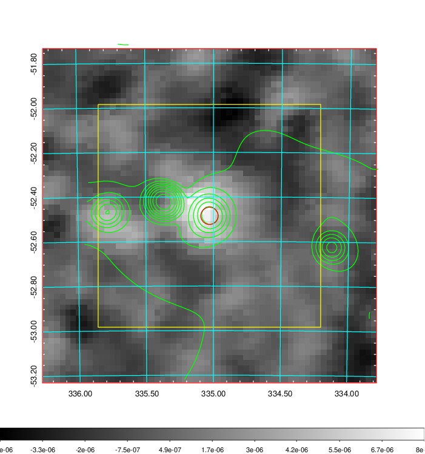 |

|[Redshift Histogram](../image/889/889_zg.pdf) | [DSS image(z1)](../image/889/889_dss_z1.pdf)      |  [DSS image(z2)](../image/889/889_dss_z2.pdf)    |
|-------------------|--------------------|-------------------|
|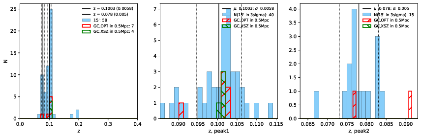 |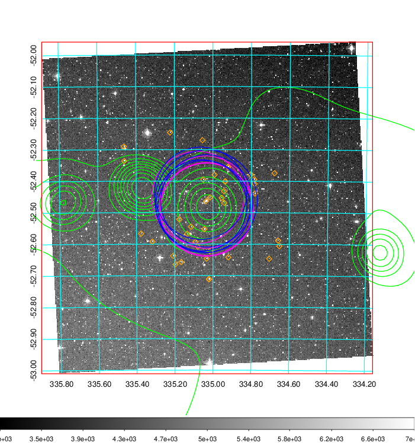  Blue circle for optical clusters;  Magenta circle for XSZ clusters;  all with r=1Mpc;  Only GC with Delta_z<0.01 are shown. | 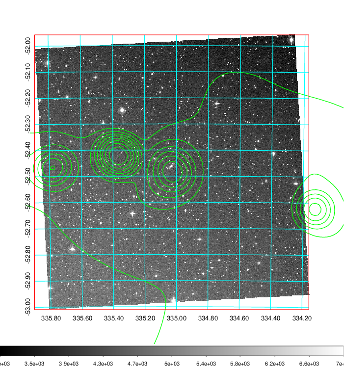 Blue circle for optical clusters;  Magenta circle for XSZ clusters;  all with r=1Mpc;  Only GC with Delta_z<0.01 are shown.  |

|[Previous-identified clusters](../image/889/889_gc.pdf) | [2MASS image](../image/889/889_2mass.pdf)      |
|-------------------|-------------------|
|  Green, magenta, and blue circles  for optical, X-ray and SZ clusters  respectively, with redshift of clusters  labelled. The radius of circles  are 1Mpc.|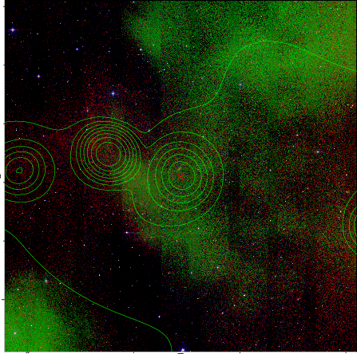  |

|[DES image](../image/889/889_des.pdf)   |
|-------------------|
| 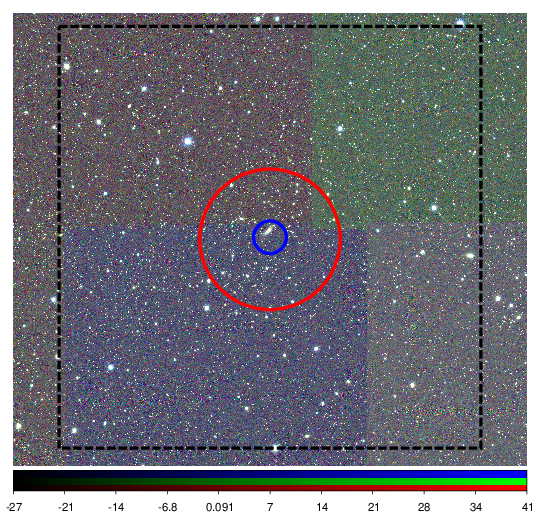  |
