

### 890

|Name|RAJ2000[deg]|DEJ2000[deg] |Ext[arcmin]| Ext,ml | z | z_src| C|GC(XSZ,Delta_z<0.01)| GC(OPT,Delta_z<0.01)|GC| R_sig[arcmin] | R500[arcmin] | R500[Mpc]| CRsig[c/s] | CR500[c/s] |L500[1E44 erg/s]|F500[1E-12 erg/s/cm^2]| M500[1E14 Msun]|Tx[keV]|Cnt_sig|Beta|Rc[arcmin]|Comment|Alias|
|---|---|---|---|---|---|------|---|--------|---------|----------|---|---|---|---|---|---|---|---|---|---|---|---|---|---|
|890| 335.957| -1.627| 2.46| 105.02| 0.0905(0.005)| z1, z_xsz| B| F20, MCXC, PSZ2, SPI, Tar, XB| A, N, RM, W| A, C, F20, MCXC, N, PSZ2, SPI, Tar, W, XB| 8.312| 10.171| 1.030| 0.429(0.060)| 0.445(0.062)| 1.671(0.100)| 8.151(0.489)| 3.39(0.10)| 4.68(0.09)| 103.5| 0.948(-0.072+0.038)| 5.289(-0.467+0.379)| -| k292|

|[RASS image](../image/890/890_img.pdf)|[filtered image](../image/890/890_fil.pdf)|[Segment image](../image/890/890_seg.pdf)|
|-------------------|--------------------|-------------------|
| 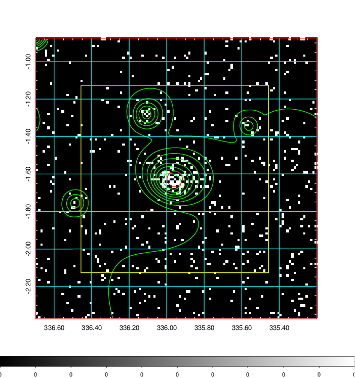  | 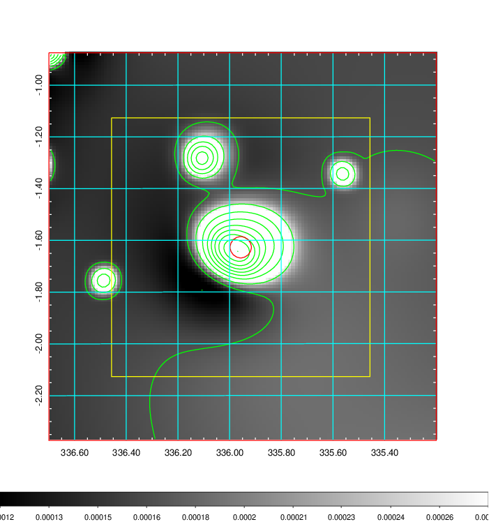   | 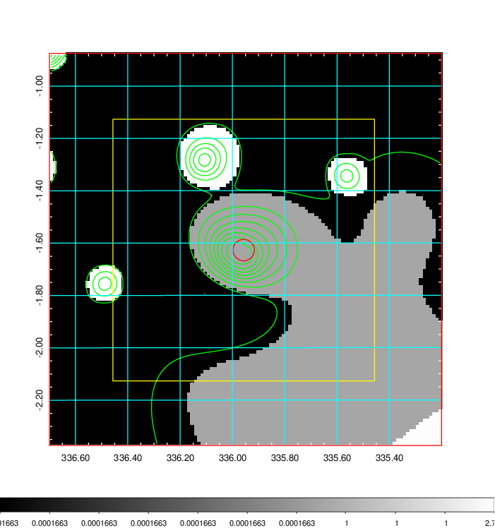  |

|[Exposure image](../image/890/890_mex.pdf)| [nH image](../image/890/890_nh.pdf)| [Planck image](../image/890/890_p.pdf)|
|-------------------|--------------------|-------------------|
|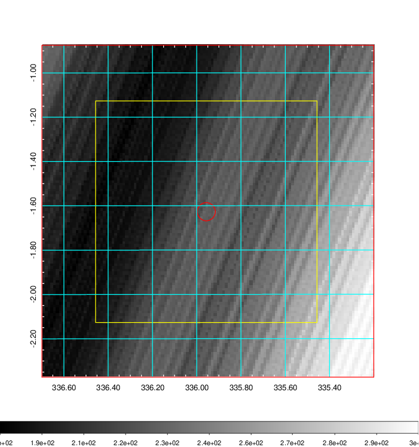   | 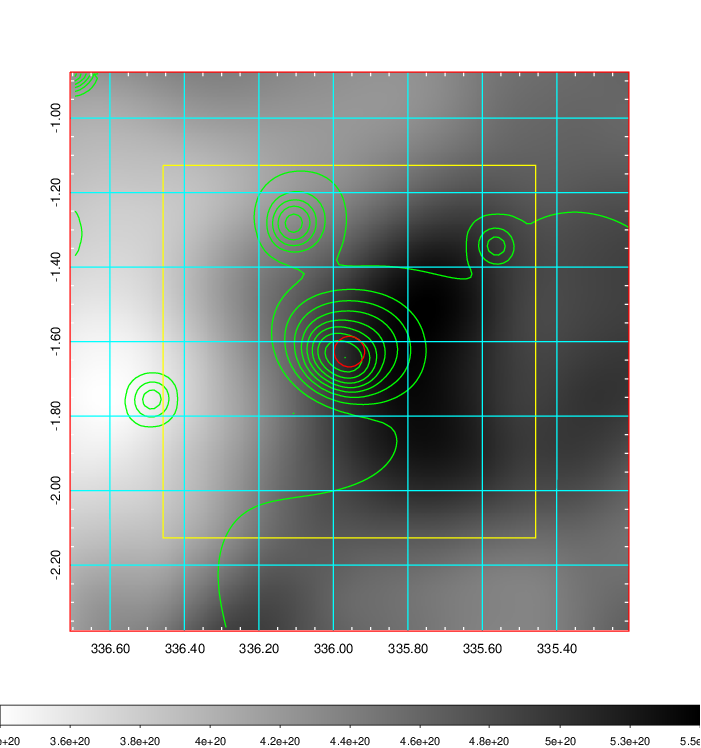    | 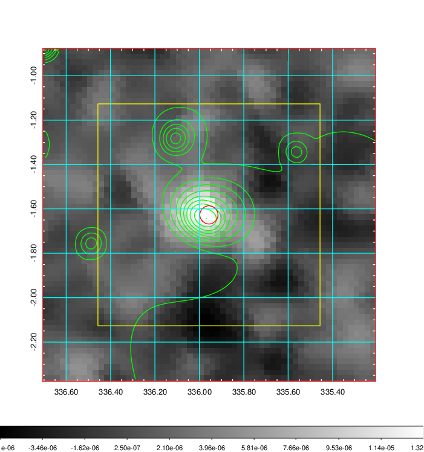 |

|[Redshift Histogram](../image/890/890_zg.pdf) | [DSS image(z1)](../image/890/890_dss_z1.pdf)      |  [DSS image(z2)](../image/890/890_dss_z2.pdf)    |
|-------------------|--------------------|-------------------|
|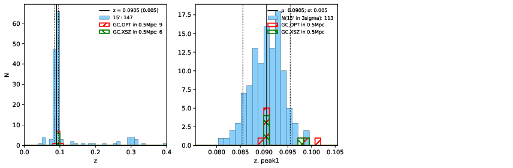 |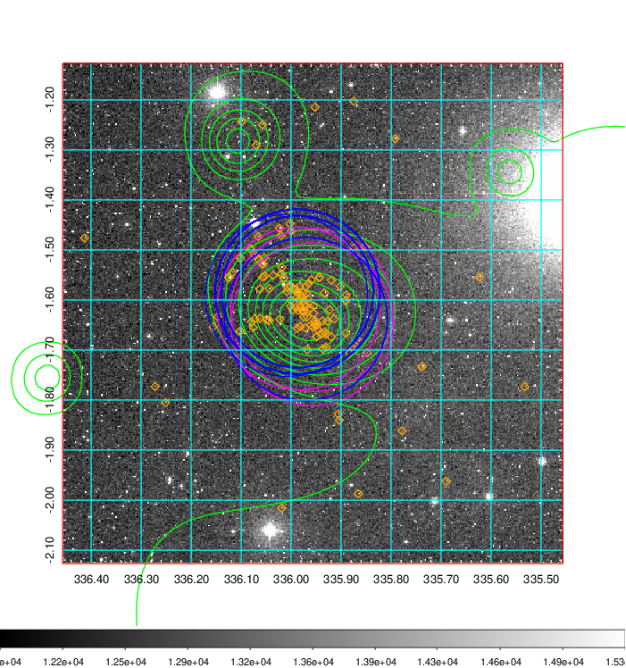  Blue circle for optical clusters;  Magenta circle for XSZ clusters;  all with r=1Mpc;  Only GC with Delta_z<0.01 are shown. | 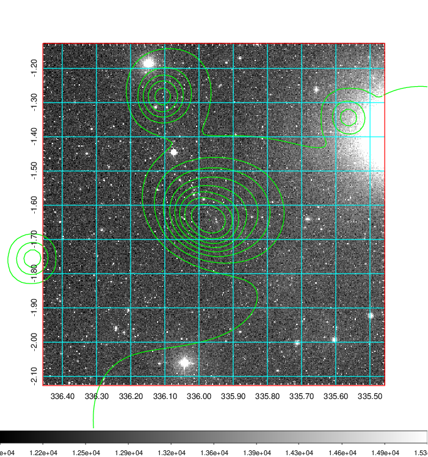 Blue circle for optical clusters;  Magenta circle for XSZ clusters;  all with r=1Mpc;  Only GC with Delta_z<0.01 are shown.  |

|[known Abell/XSZ clusters](../image/890/890_gc.pdf) | [2MASS image](../image/890/890_2mass.pdf)      |[SDSS image](../image/890/890_sdss.pdf)   |
|-------------------|-------------------|-------------------|
|  Magenta, blue and green circles  for optical, X-ray and SZ clusters  respectively, with redshift of clusters  labelled. The radius of circles  are 1Mpc.|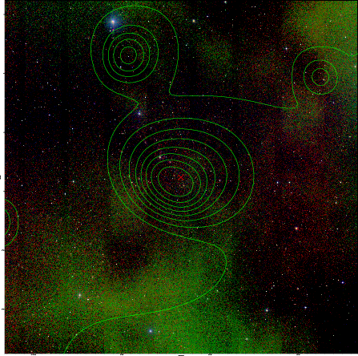  | 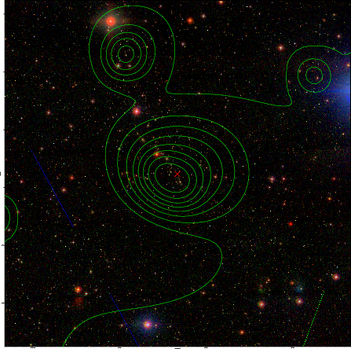  |

|[DES image](../image/890/890_des.pdf)   |
|-------------------|
|   |
