

### 891

|Name|RAJ2000[deg]|DEJ2000[deg] |Ext[arcmin]| Ext,ml | z | z_src| C|GC(XSZ,Delta_z<0.01)| GC(OPT,Delta_z<0.01)|GC| R_sig[arcmin] | R500[arcmin] | R500[Mpc]| CRsig[c/s] | CR500[c/s] |L500[1E44 erg/s]|F500[1E-12 erg/s/cm^2]| M500[1E14 Msun]|Tx[keV]|Cnt_sig|Beta|Rc[arcmin]|Comment|Alias|
|---|---|---|---|---|---|------|---|--------|---------|----------|---|---|---|---|---|---|---|---|---|---|---|---|---|---|
|891| 336.099| -55.260| 2.90| 61.97| 0.0746(0.005)| z1, z_xsz| B| MCXC, PSZ2, Tar, XB| N| MCXC, N, PSZ2, Tar, W, XB| 13.188| 10.048| 0.854| 0.294(0.042)| 0.282(0.041)| 0.747(0.071)| 5.483(0.518)| 1.90(0.09)| 3.26(0.10)| 103.9| 0.637(-0.092+0.162)| 3.504(-1.032+1.482)| -| k363|

|[RASS image](../image/891/891_img.pdf)|[filtered image](../image/891/891_fil.pdf)|[Segment image](../image/891/891_seg.pdf)|
|-------------------|--------------------|-------------------|
| 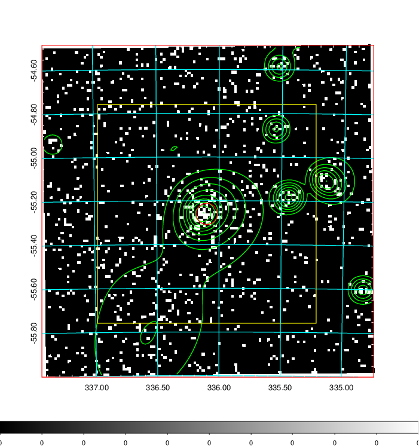  | 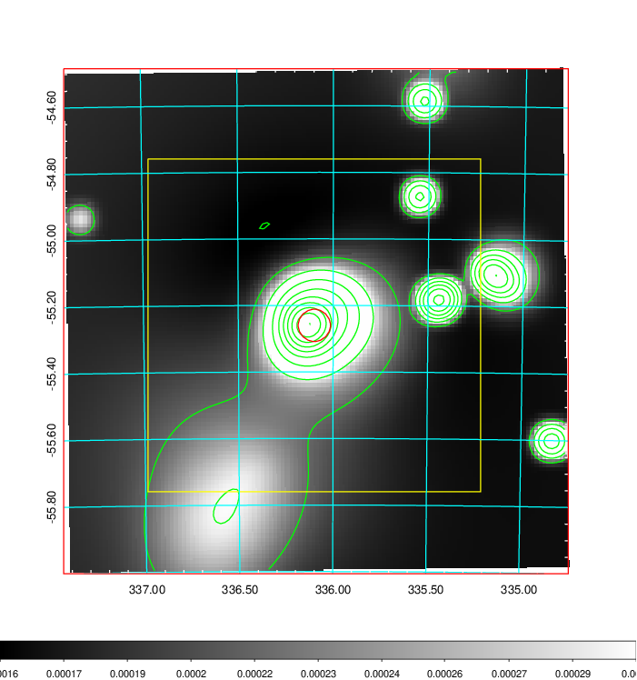   | 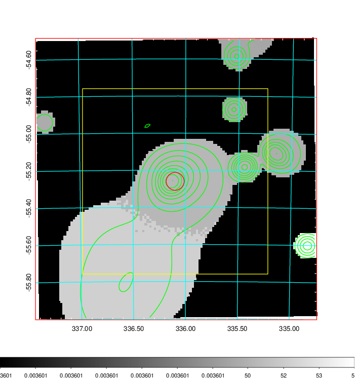  |

|[Exposure image](../image/891/891_mex.pdf)| [nH image](../image/891/891_nh.pdf)| [Planck image](../image/891/891_p.pdf)|
|-------------------|--------------------|-------------------|
|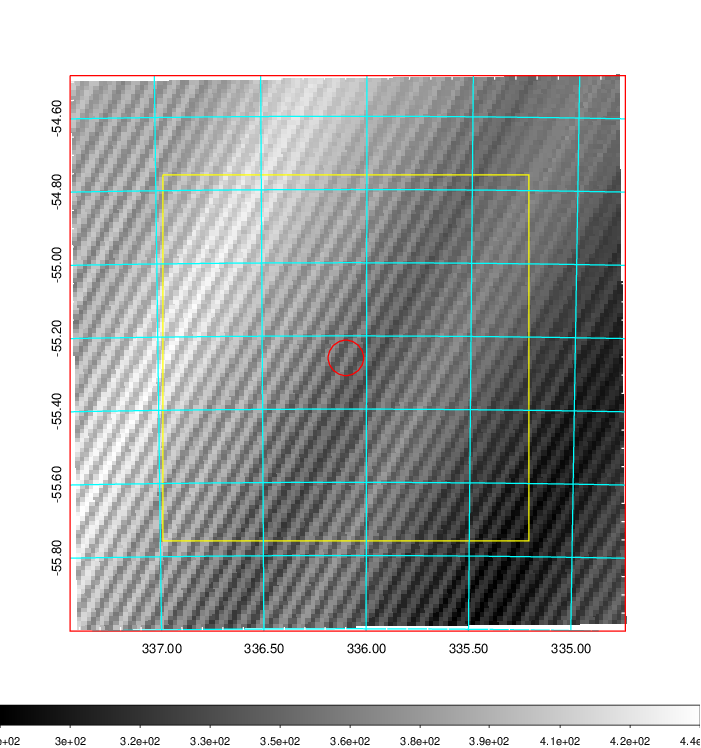   | 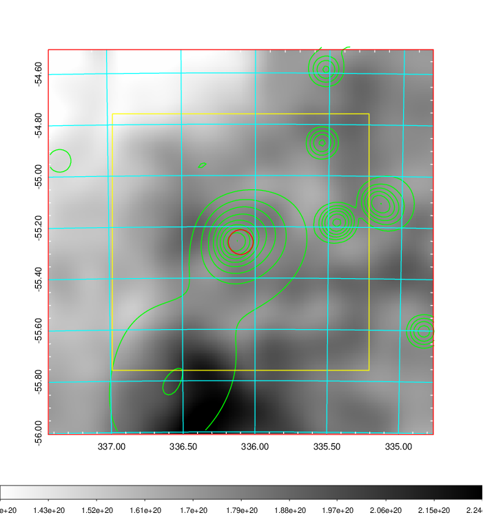    | 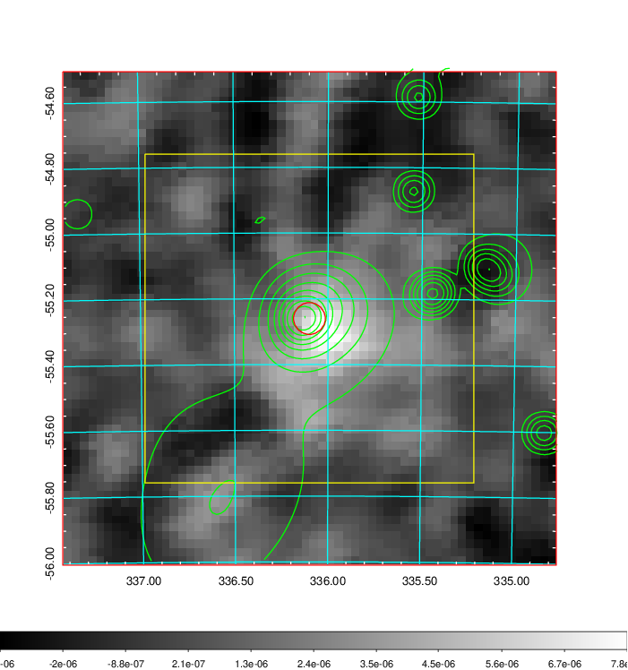 |

|[Redshift Histogram](../image/891/891_zg.pdf) | [DSS image(z1)](../image/891/891_dss_z1.pdf)      |  [DSS image(z2)](../image/891/891_dss_z2.pdf)    |
|-------------------|--------------------|-------------------|
|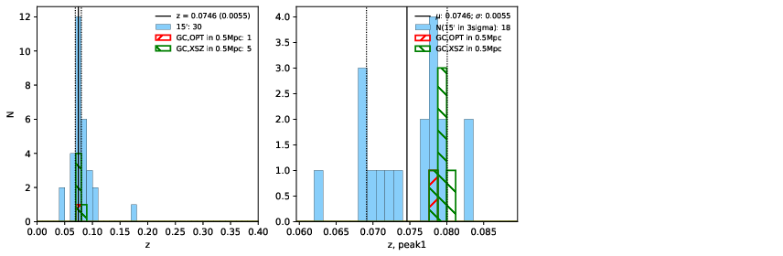 |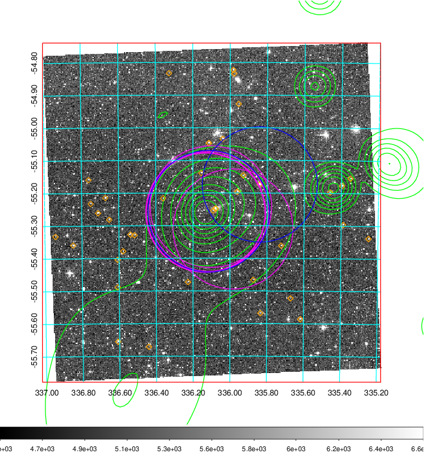  Blue circle for optical clusters;  Magenta circle for XSZ clusters;  all with r=1Mpc;  Only GC with Delta_z<0.01 are shown. | 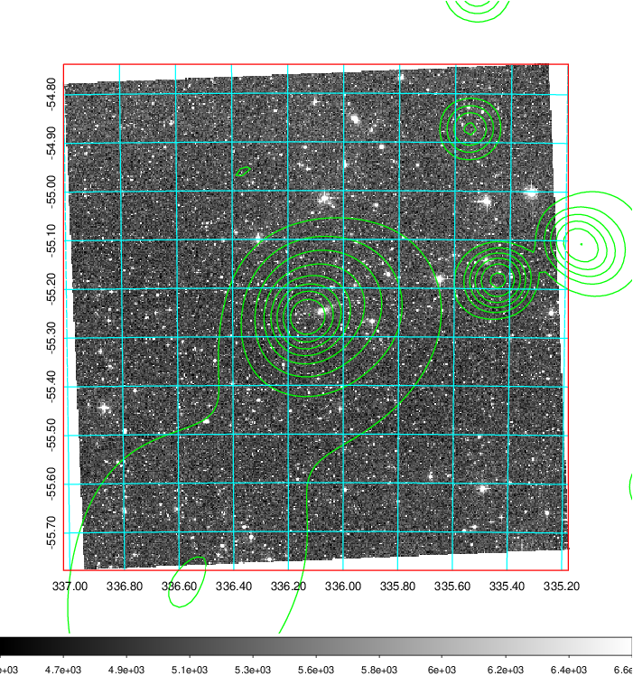 Blue circle for optical clusters;  Magenta circle for XSZ clusters;  all with r=1Mpc;  Only GC with Delta_z<0.01 are shown.  |

|[Previous-identified clusters](../image/891/891_gc.pdf) | [2MASS image](../image/891/891_2mass.pdf)      |
|-------------------|-------------------|
|  Green, magenta, and blue circles  for optical, X-ray and SZ clusters  respectively, with redshift of clusters  labelled. The radius of circles  are 1Mpc.|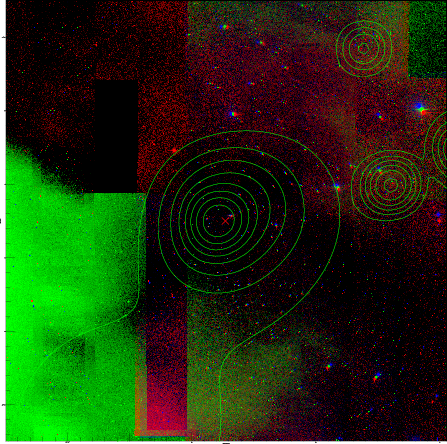  |

|[DES image](../image/891/891_des.pdf)   |
|-------------------|
| 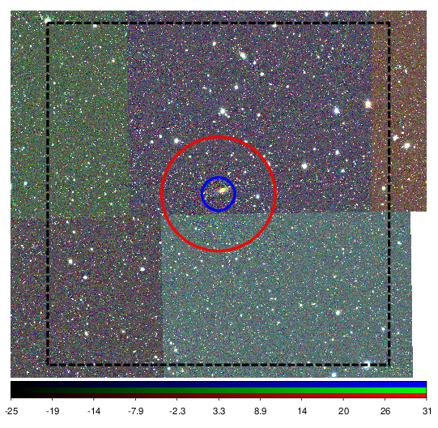  |
