

### 892

|Name|RAJ2000[deg]|DEJ2000[deg] |Ext[arcmin]| Ext,ml | z | z_src| C|GC(XSZ,Delta_z<0.01)| GC(OPT,Delta_z<0.01)|GC| R_sig[arcmin] | R500[arcmin] | R500[Mpc]| CRsig[c/s] | CR500[c/s] |L500[1E44 erg/s]|F500[1E-12 erg/s/cm^2]| M500[1E14 Msun]|Tx[keV]|Cnt_sig|Beta|Rc[arcmin]|Comment|Alias|
|---|---|---|---|---|---|------|---|--------|---------|----------|---|---|---|---|---|---|---|---|---|---|---|---|---|---|
|892| 336.514| 17.375| 1.17| 48.59| 0.1055(0.007)| z1, z_xsz| B| F20, MCXC, PSZ2, SPI, Tar, XB| A, N, RM, W| A, C, F20, MCXC, N, PSZ2, SPI, Tar, W, XB| 7.338| 8.563| 0.993| 0.276(0.033)| 0.284(0.034)| 1.468(0.072)| 5.166(0.255)| 3.08(0.08)| 4.43(0.07)| 128.8| 0.930(-0.083+0.051)| 3.380(-0.406+0.306)| -| k057|

|[RASS image](../image/892/892_img.pdf)|[filtered image](../image/892/892_fil.pdf)|[Segment image](../image/892/892_seg.pdf)|
|-------------------|--------------------|-------------------|
| 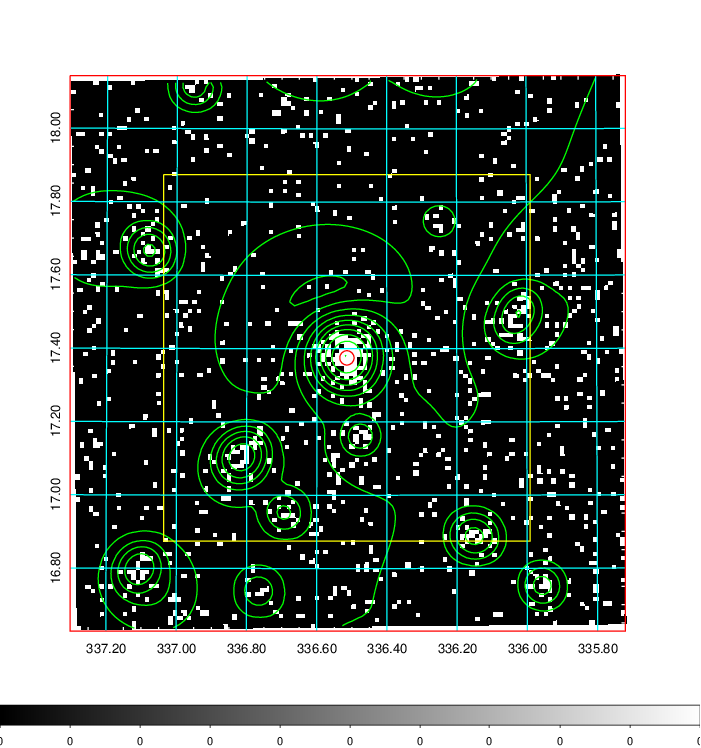  | 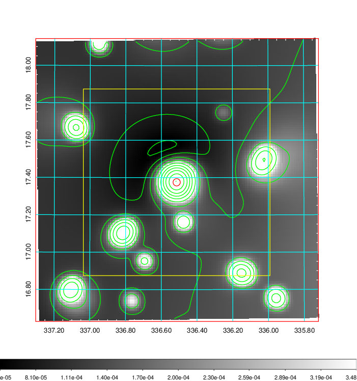   | 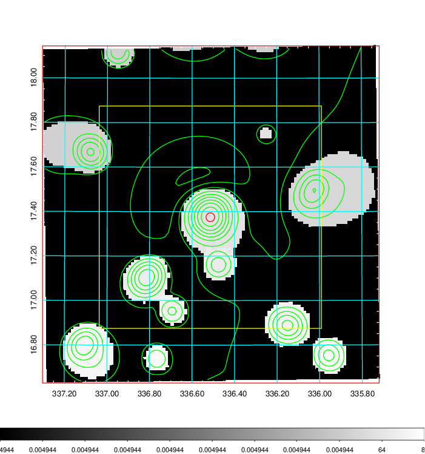  |

|[Exposure image](../image/892/892_mex.pdf)| [nH image](../image/892/892_nh.pdf)| [Planck image](../image/892/892_p.pdf)|
|-------------------|--------------------|-------------------|
|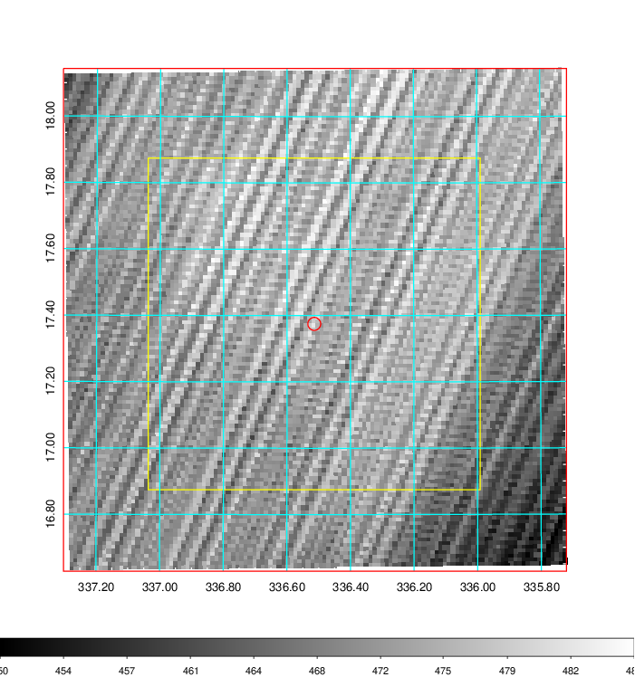   | 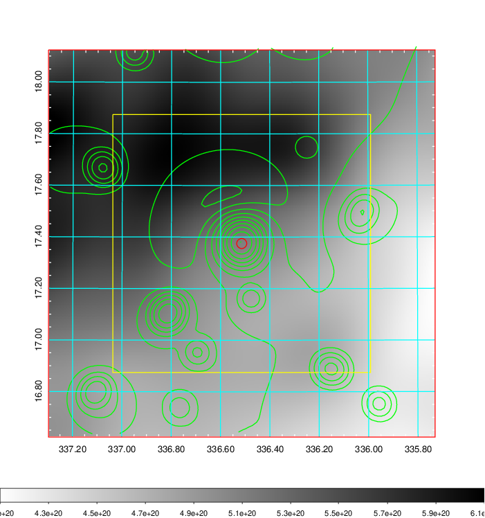    | 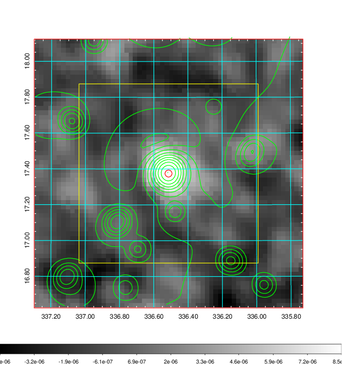 |

|[Redshift Histogram](../image/892/892_zg.pdf) | [DSS image(z1)](../image/892/892_dss_z1.pdf)      |  [DSS image(z2)](../image/892/892_dss_z2.pdf)    |
|-------------------|--------------------|-------------------|
|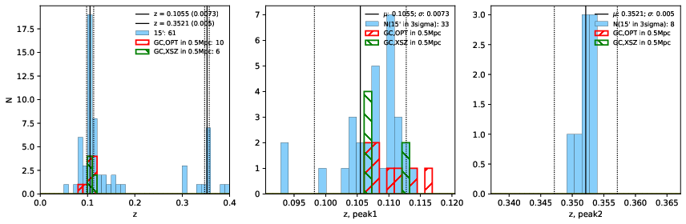 |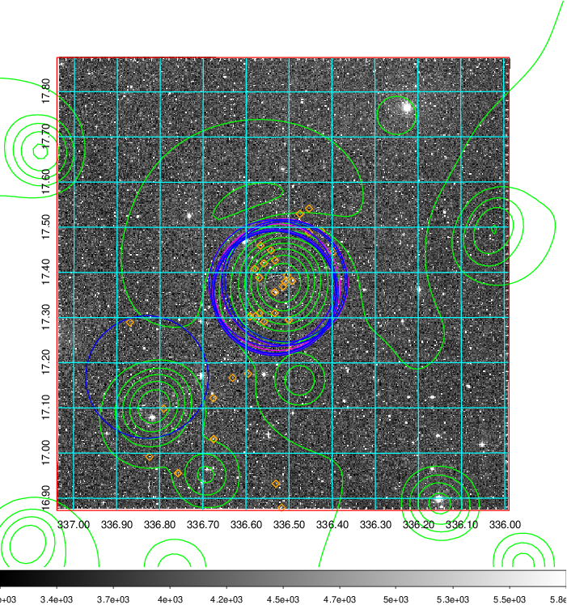  Blue circle for optical clusters;  Magenta circle for XSZ clusters;  all with r=1Mpc;  Only GC with Delta_z<0.01 are shown. | 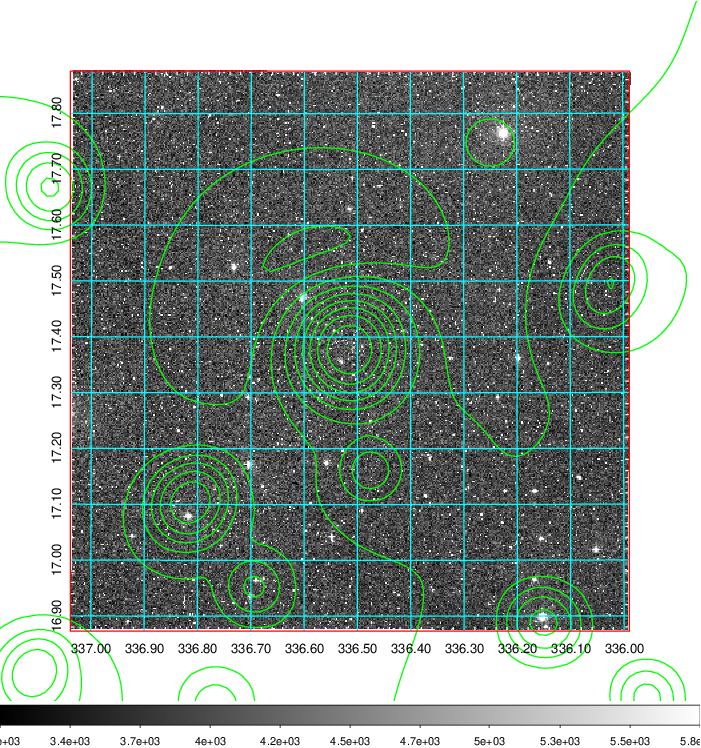 Blue circle for optical clusters;  Magenta circle for XSZ clusters;  all with r=1Mpc;  Only GC with Delta_z<0.01 are shown.  |

|[known Abell/XSZ clusters](../image/892/892_gc.pdf) | [2MASS image](../image/892/892_2mass.pdf)      |[SDSS image](../image/892/892_sdss.pdf)   |
|-------------------|-------------------|-------------------|
|  Magenta, blue and green circles  for optical, X-ray and SZ clusters  respectively, with redshift of clusters  labelled. The radius of circles  are 1Mpc.|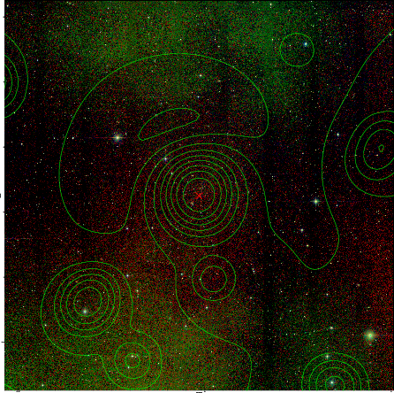  | 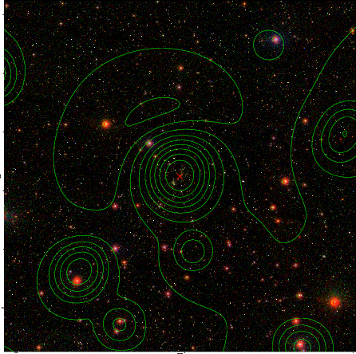  |

