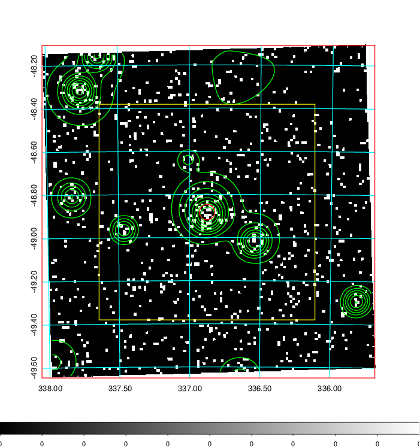
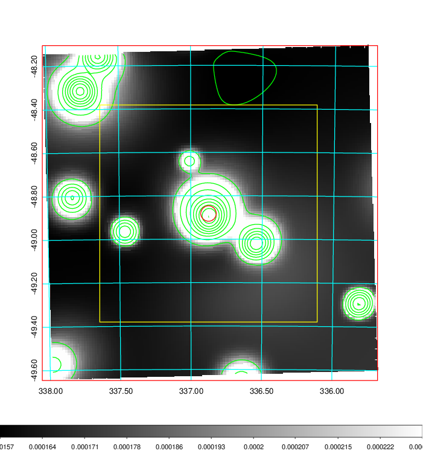
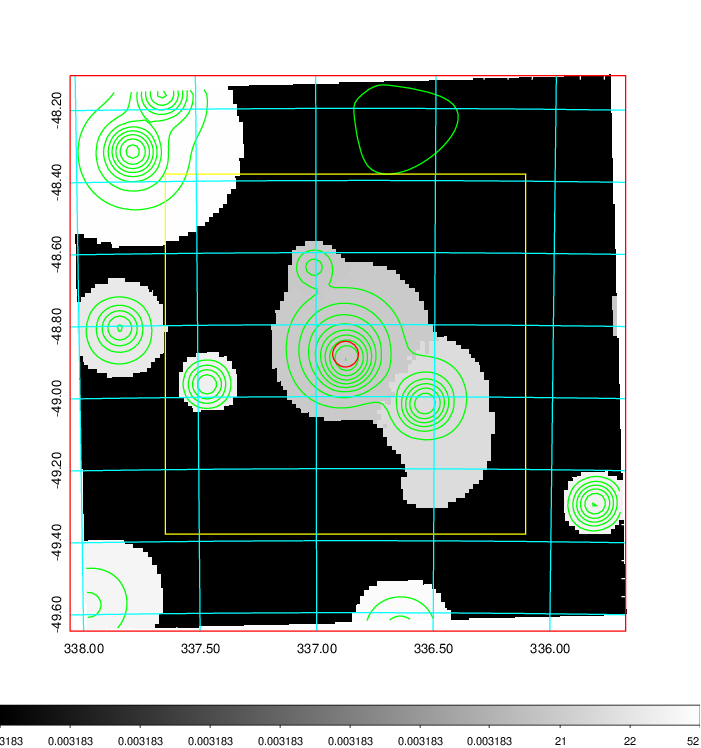
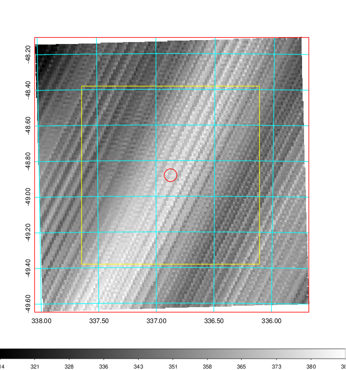
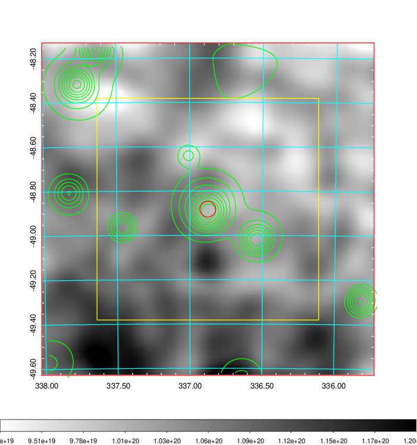
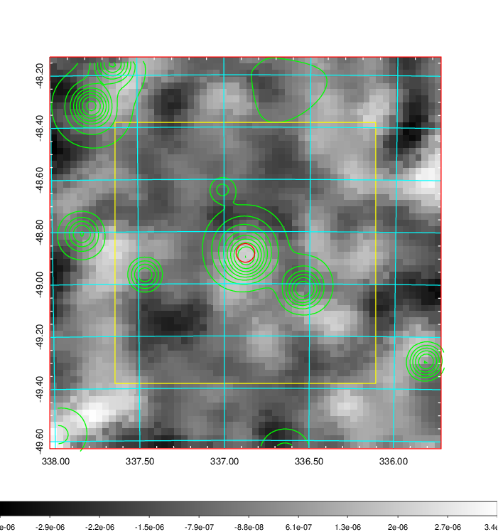
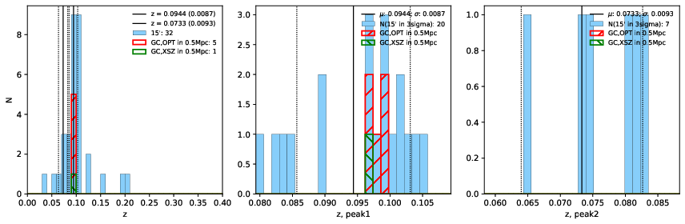
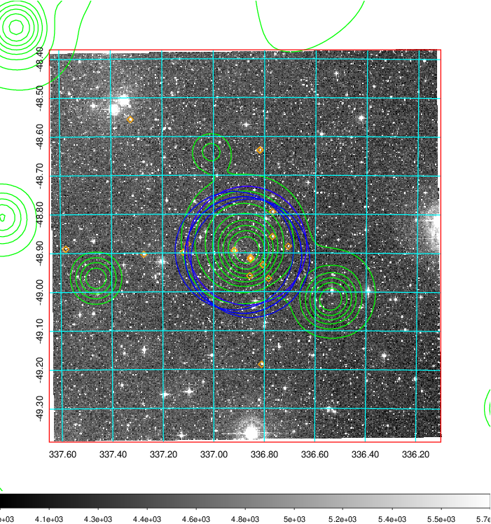
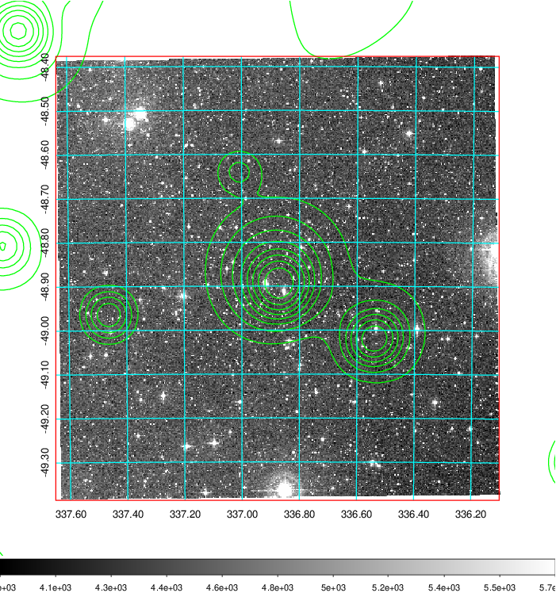
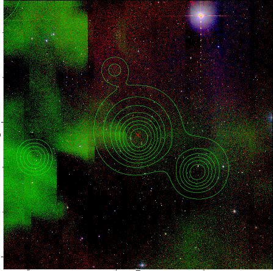

### 893

|Name|RAJ2000[deg]|DEJ2000[deg] |Ext[arcmin]| Ext,ml | z | z_src| C|GC(XSZ,Delta_z<0.01)| GC(OPT,Delta_z<0.01)|GC| R_sig[arcmin] | R500[arcmin] | R500[Mpc]| CRsig[c/s] | CR500[c/s] |L500[1E44 erg/s]|F500[1E-12 erg/s/cm^2]| M500[1E14 Msun]|Tx[keV]|Cnt_sig|Beta|Rc[arcmin]|Comment|Alias|
|---|---|---|---|---|---|------|---|--------|---------|----------|---|---|---|---|---|---|---|---|---|---|---|---|---|---|
|893| 336.876| -48.882| 2.14| 30.85| 0.0944(0.009)| z1, z_xsz| B| MCXC| A, N, W| A, MCXC, N, W| 7.825| 7.736| 0.813| 0.147(0.031)| 0.147(0.031)| 0.657(0.093)| 2.929(0.415)| 1.68(0.12)| 3.03(0.14)| 52.6| 0.857(-0.150+0.103)| 3.894(-0.907+0.712)| -| k244|

|[RASS image](../image/893/893_img.pdf)|[filtered image](../image/893/893_fil.pdf)|[Segment image](../image/893/893_seg.pdf)|
|-------------------|--------------------|-------------------|
|   |    |   |

|[Exposure image](../image/893/893_mex.pdf)| [nH image](../image/893/893_nh.pdf)| [Planck image](../image/893/893_p.pdf)|
|-------------------|--------------------|-------------------|
|   |     |  |

|[Redshift Histogram](../image/893/893_zg.pdf) | [DSS image(z1)](../image/893/893_dss_z1.pdf)      |  [DSS image(z2)](../image/893/893_dss_z2.pdf)    |
|-------------------|--------------------|-------------------|
| |  Blue circle for optical clusters;  Magenta circle for XSZ clusters;  all with r=1Mpc;  Only GC with Delta_z<0.01 are shown. |  Blue circle for optical clusters;  Magenta circle for XSZ clusters;  all with r=1Mpc;  Only GC with Delta_z<0.01 are shown.  |

|[known Abell/XSZ clusters](../image/893/893_gc.pdf) | [2MASS image](../image/893/893_2mass.pdf)      |
|-------------------|-------------------|
|  Magenta, blue and green circles  for optical, X-ray and SZ clusters  respectively, with redshift of clusters  labelled. The radius of circles  are 1Mpc.|  |

|[DES image](../image/893/893_des.pdf)   |
|-------------------|
|   |
