

### 894

|Name|RAJ2000[deg]|DEJ2000[deg] |Ext[arcmin]| Ext,ml | z | z_src| C|GC(XSZ,Delta_z<0.01)| GC(OPT,Delta_z<0.01)|GC| R_sig[arcmin] | R500[arcmin] | R500[Mpc]| CRsig[c/s] | CR500[c/s] |L500[1E44 erg/s]|F500[1E-12 erg/s/cm^2]| M500[1E14 Msun]|Tx[keV]|Cnt_sig|Beta|Rc[arcmin]|Comment|Alias|
|---|---|---|---|---|---|------|---|--------|---------|----------|---|---|---|---|---|---|---|---|---|---|---|---|---|---|
|894| 336.972| -30.572| 0.87| 40.24| 0.0576(0.005)| z1, z_xsz| B| MCXC, XB| A, N, W| A, MCXC, N, W, XB| 5.875| 13.610| 0.911| 0.511(0.053)| 0.653(0.066)| 1.037(0.071)| 13.075(0.891)| 2.27(0.08)| 3.62(0.08)| 151.4| 0.925(-0.088+0.054)| 2.701(-0.384+0.274)| -| k022|

|[RASS image](../image/894/894_img.pdf)|[filtered image](../image/894/894_fil.pdf)|[Segment image](../image/894/894_seg.pdf)|
|-------------------|--------------------|-------------------|
| 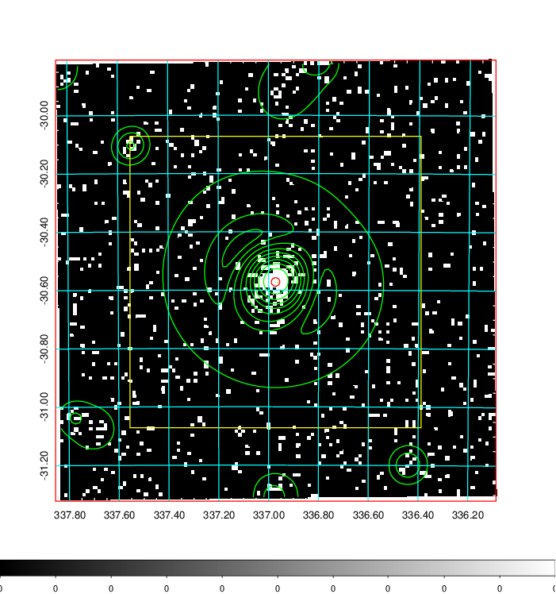  | 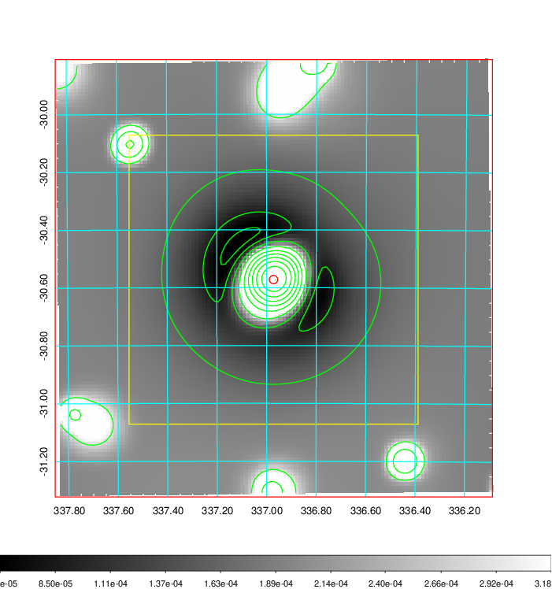   | 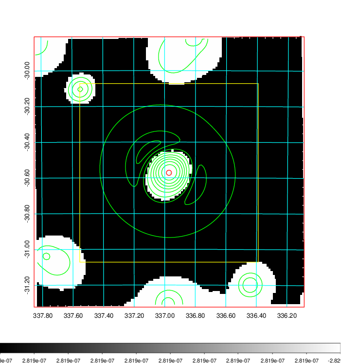  |

|[Exposure image](../image/894/894_mex.pdf)| [nH image](../image/894/894_nh.pdf)| [Planck image](../image/894/894_p.pdf)|
|-------------------|--------------------|-------------------|
|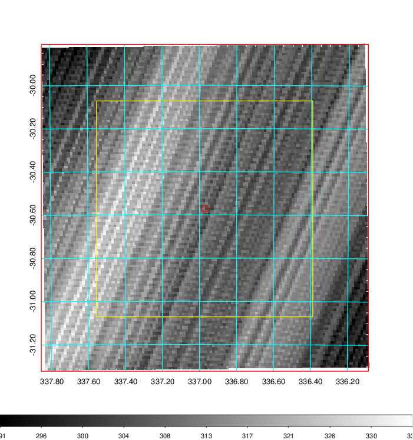   | 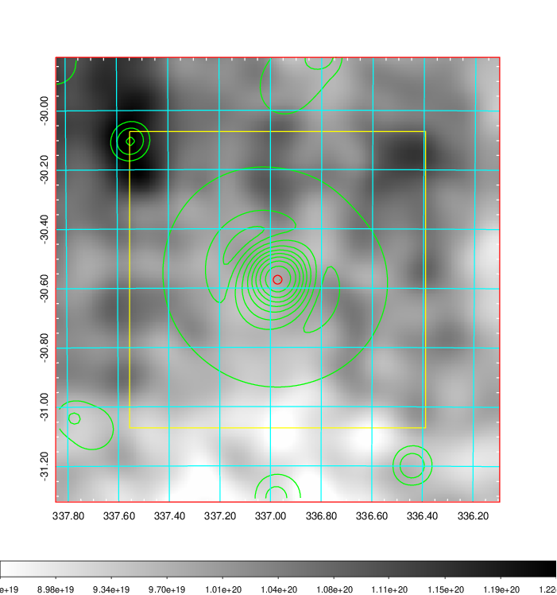    | 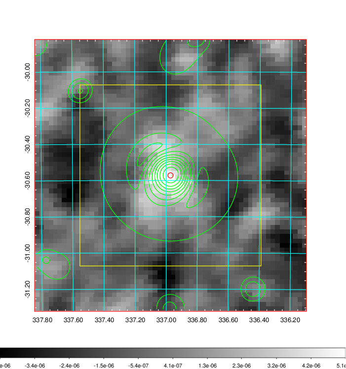 |

|[Redshift Histogram](../image/894/894_zg.pdf) | [DSS image(z1)](../image/894/894_dss_z1.pdf)      |  [DSS image(z2)](../image/894/894_dss_z2.pdf)    |
|-------------------|--------------------|-------------------|
|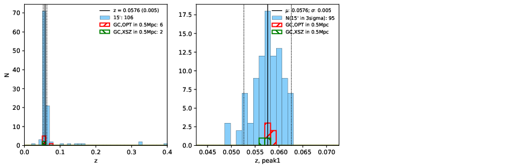 |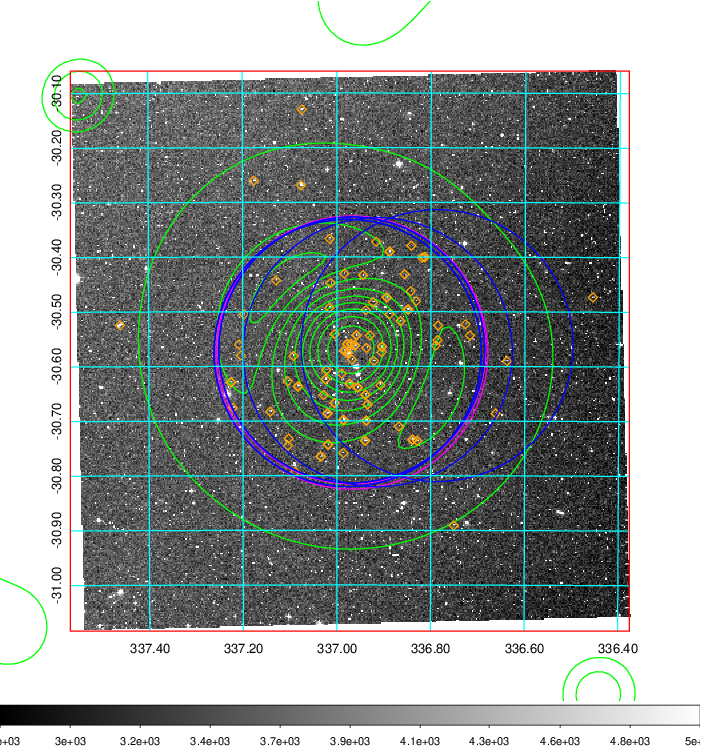  Blue circle for optical clusters;  Magenta circle for XSZ clusters;  all with r=1Mpc;  Only GC with Delta_z<0.01 are shown. | 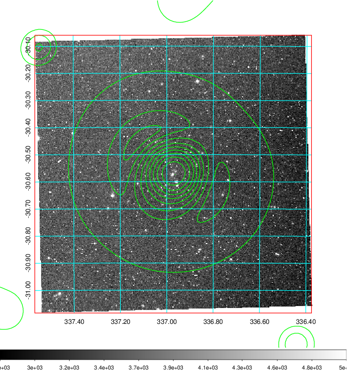 Blue circle for optical clusters;  Magenta circle for XSZ clusters;  all with r=1Mpc;  Only GC with Delta_z<0.01 are shown.  |

|[Previous-identified clusters](../image/894/894_gc.pdf) | [2MASS image](../image/894/894_2mass.pdf)      |
|-------------------|-------------------|
|  Green, magenta, and blue circles  for optical, X-ray and SZ clusters  respectively, with redshift of clusters  labelled. The radius of circles  are 1Mpc.|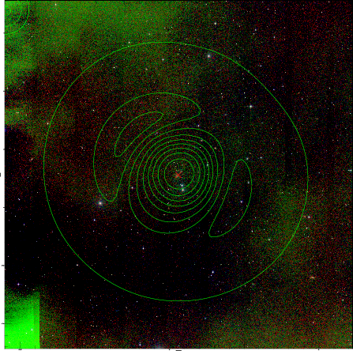  |

|[ATLAS image](../image/894/894_s.pdf)        |
|-------------------|
| 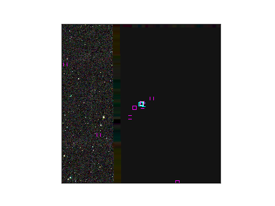  |
