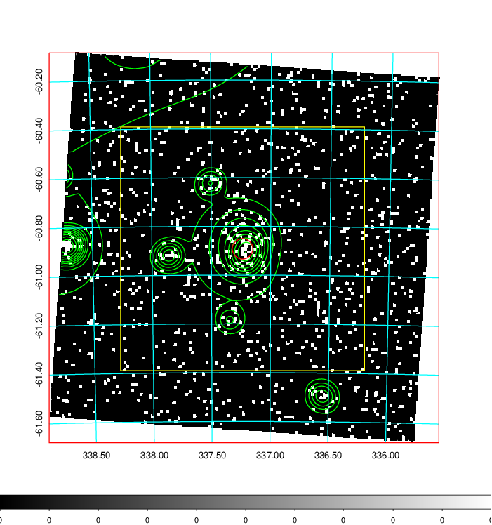
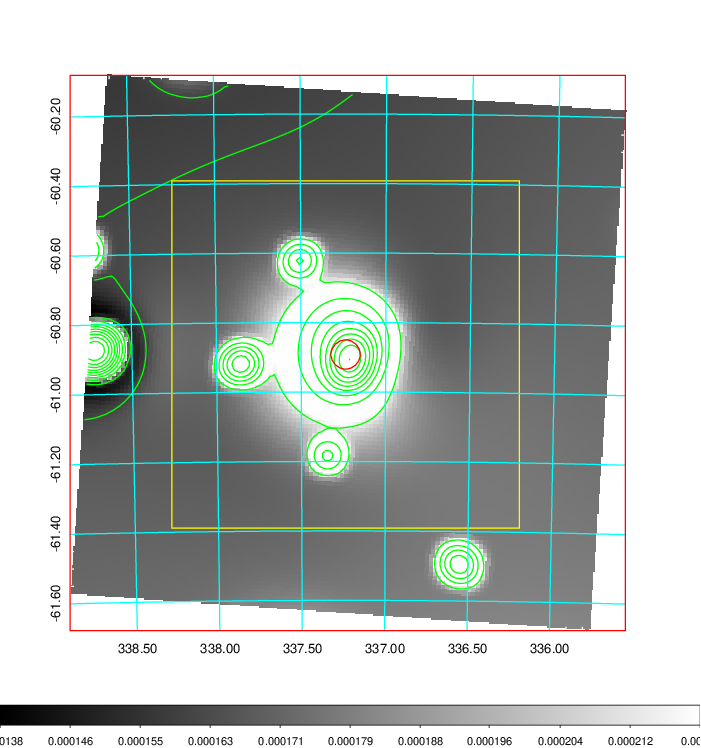
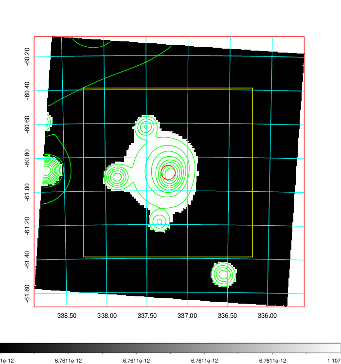
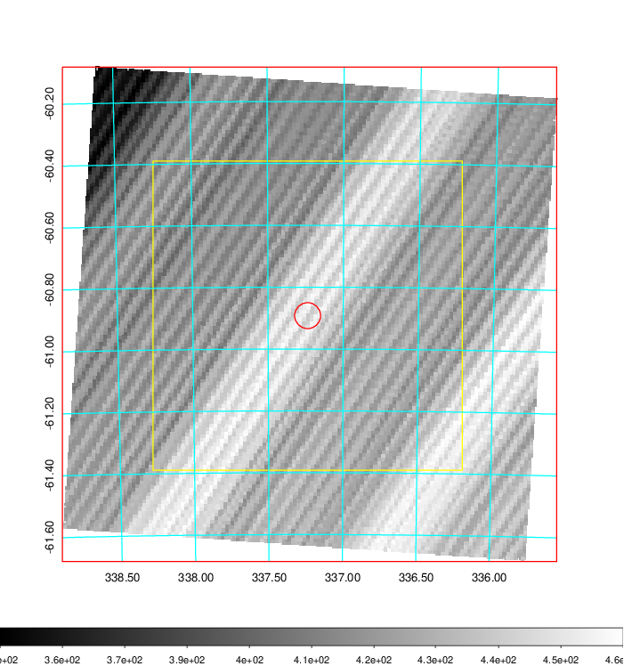
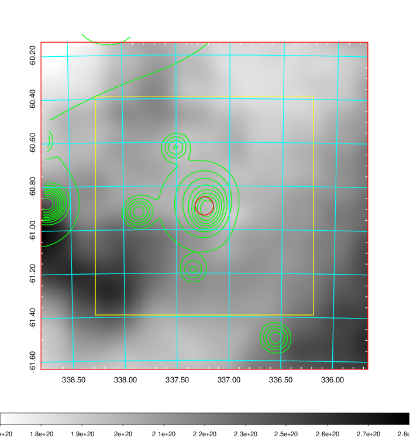
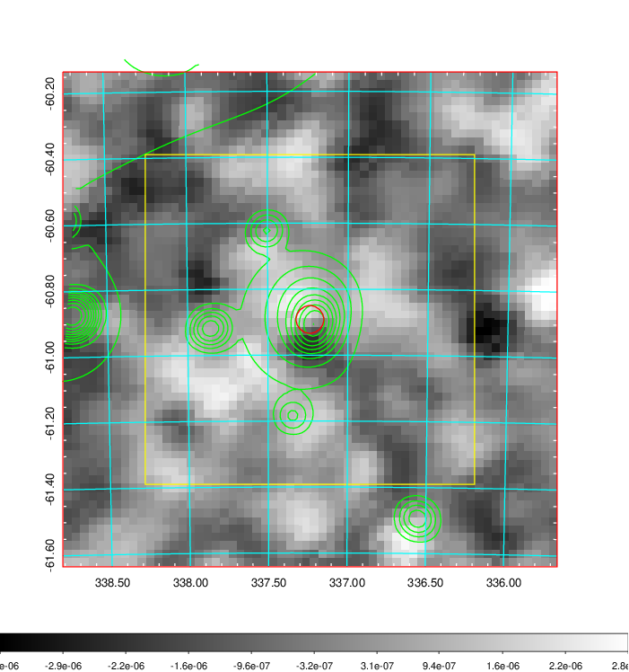
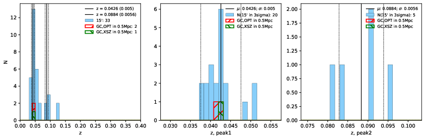
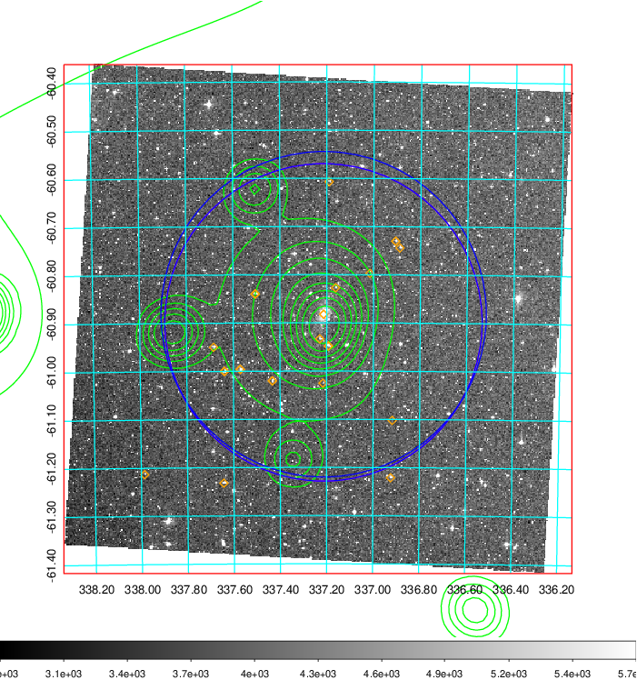
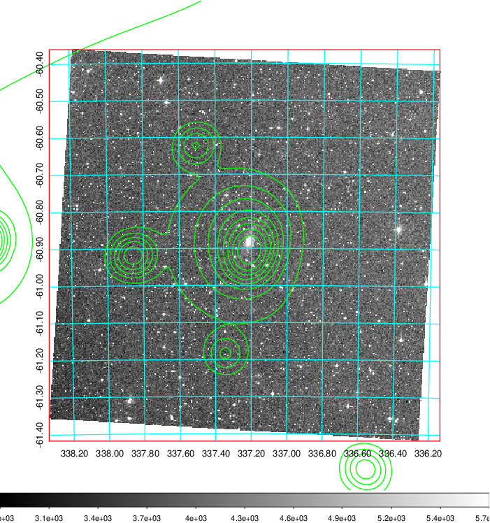
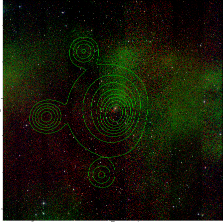

### 895

|Name|RAJ2000[deg]|DEJ2000[deg] |Ext[arcmin]| Ext,ml | z | z_src| C|GC(XSZ,Delta_z<0.01)| GC(OPT,Delta_z<0.01)|GC| R_sig[arcmin] | R500[arcmin] | R500[Mpc]| CRsig[c/s] | CR500[c/s] |L500[1E44 erg/s]|F500[1E-12 erg/s/cm^2]| M500[1E14 Msun]|Tx[keV]|Cnt_sig|Beta|Rc[arcmin]|Comment|Alias|
|---|---|---|---|---|---|------|---|--------|---------|----------|---|---|---|---|---|---|---|---|---|---|---|---|---|---|
|895| 337.237| -60.892| 2.52| 48.82| 0.0426(0.005)| z1, z_xsz| B| MCXC| N, W| MCXC, N, W| 21.738| 12.890| 0.650| 0.245(0.060)| 0.230(0.056)| 0.171(0.029)| 4.028(0.678)| 0.81(0.07)| 1.91(0.10)| 113.6| 0.746(-0.085+0.116)| 4.482(-0.907+1.102)| -| k300|

|[RASS image](../image/895/895_img.pdf)|[filtered image](../image/895/895_fil.pdf)|[Segment image](../image/895/895_seg.pdf)|
|-------------------|--------------------|-------------------|
|   |    |   |

|[Exposure image](../image/895/895_mex.pdf)| [nH image](../image/895/895_nh.pdf)| [Planck image](../image/895/895_p.pdf)|
|-------------------|--------------------|-------------------|
|   |     |  |

|[Redshift Histogram](../image/895/895_zg.pdf) | [DSS image(z1)](../image/895/895_dss_z1.pdf)      |  [DSS image(z2)](../image/895/895_dss_z2.pdf)    |
|-------------------|--------------------|-------------------|
| |  Blue circle for optical clusters;  Magenta circle for XSZ clusters;  all with r=1Mpc;  Only GC with Delta_z<0.01 are shown. |  Blue circle for optical clusters;  Magenta circle for XSZ clusters;  all with r=1Mpc;  Only GC with Delta_z<0.01 are shown.  |

|[known Abell/XSZ clusters](../image/895/895_gc.pdf) | [2MASS image](../image/895/895_2mass.pdf)      |
|-------------------|-------------------|
|  Magenta, blue and green circles  for optical, X-ray and SZ clusters  respectively, with redshift of clusters  labelled. The radius of circles  are 1Mpc.|  |

|[DES image](../image/895/895_des.pdf)   |
|-------------------|
|   |
