

### 897

|Name|RAJ2000[deg]|DEJ2000[deg] |Ext[arcmin]| Ext,ml | z | z_src| C|GC(XSZ,Delta_z<0.01)| GC(OPT,Delta_z<0.01)|GC| R_sig[arcmin] | R500[arcmin] | R500[Mpc]| CRsig[c/s] | CR500[c/s] |L500[1E44 erg/s]|F500[1E-12 erg/s/cm^2]| M500[1E14 Msun]|Tx[keV]|Cnt_sig|Beta|Rc[arcmin]|Comment|Alias|
|---|---|---|---|---|---|------|---|--------|---------|----------|---|---|---|---|---|---|---|---|---|---|---|---|---|---|
|897| 338.920| 1.475| 2.35| 60.93| 0.0587(0.005)| z1, z_xsz| B| L03, MCXC, PSZ2, Tar, XB| A, N, W| A, C, F20, L03, MCXC, N, PSZ2, SPI, Tar, W, XB| 14.650| 13.142| 0.896| 0.535(0.074)| 0.526(0.073)| 0.765(0.051)| 9.266(0.623)| 2.16(0.07)| 3.51(0.08)| 99.3| 0.649(-0.091+0.146)| 3.346(-0.924+1.238)| -| k271|

|[RASS image](../image/897/897_img.pdf)|[filtered image](../image/897/897_fil.pdf)|[Segment image](../image/897/897_seg.pdf)|
|-------------------|--------------------|-------------------|
| 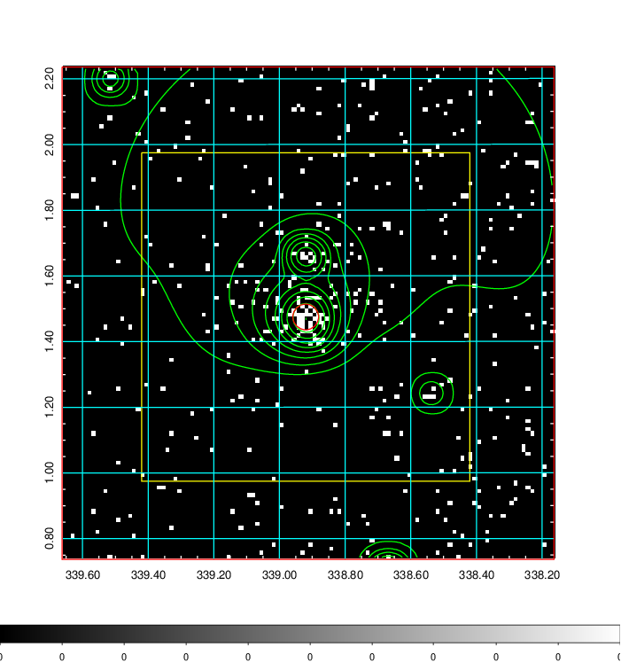  | 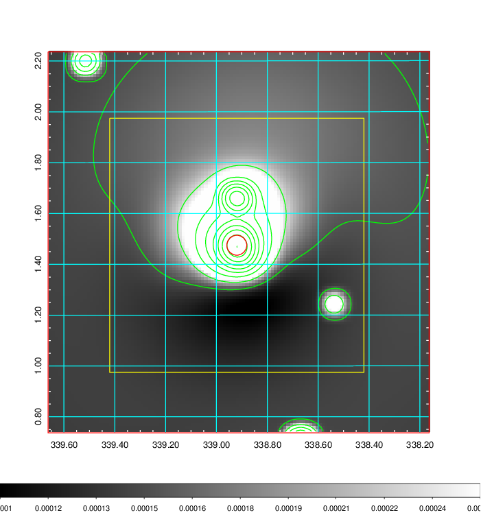   | 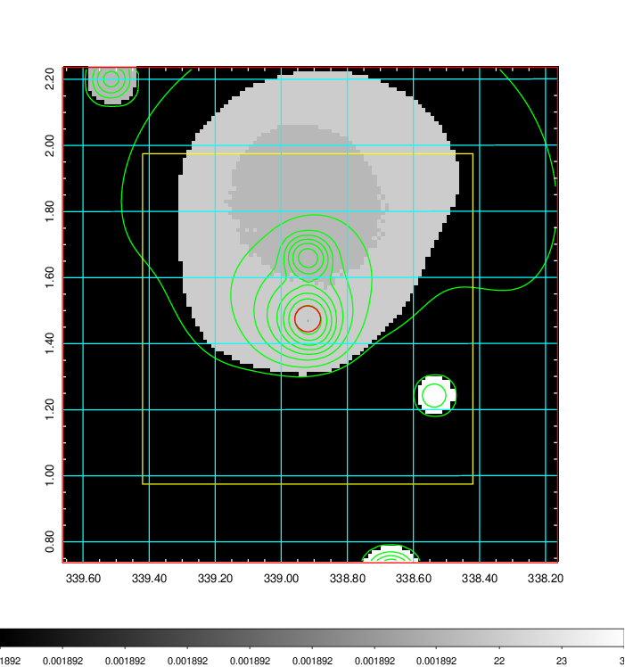  |

|[Exposure image](../image/897/897_mex.pdf)| [nH image](../image/897/897_nh.pdf)| [Planck image](../image/897/897_p.pdf)|
|-------------------|--------------------|-------------------|
|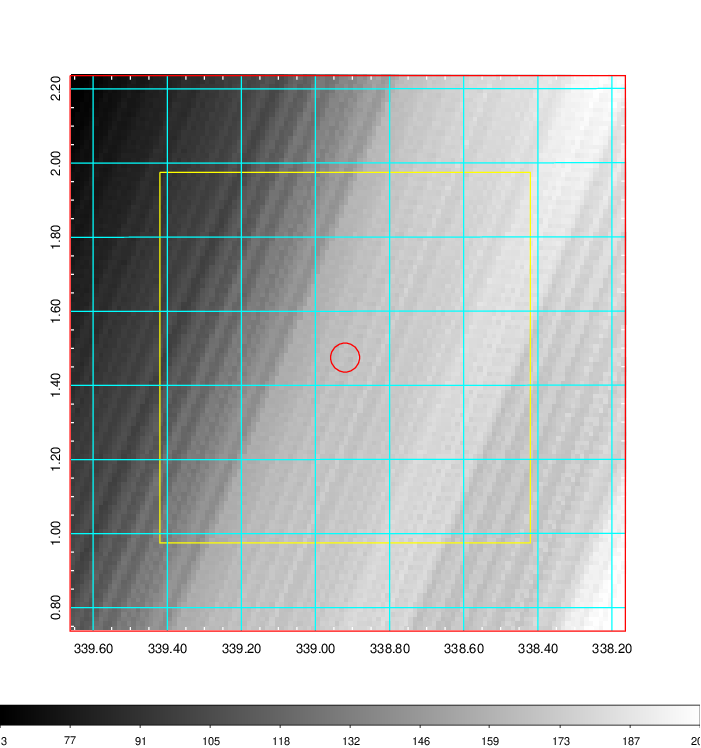   | 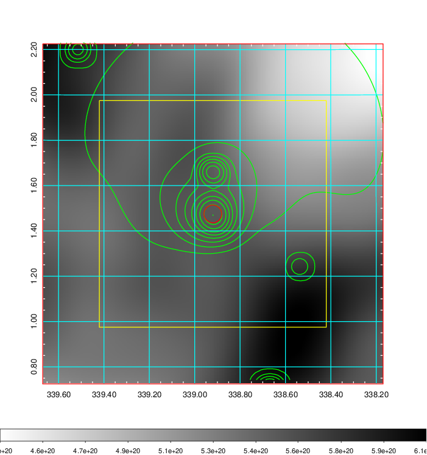    | 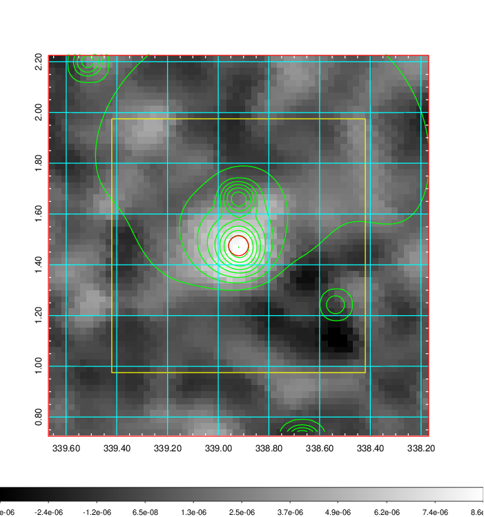 |

|[Redshift Histogram](../image/897/897_zg.pdf) | [DSS image(z1)](../image/897/897_dss_z1.pdf)      |  [DSS image(z2)](../image/897/897_dss_z2.pdf)    |
|-------------------|--------------------|-------------------|
|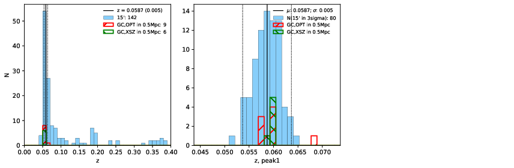 |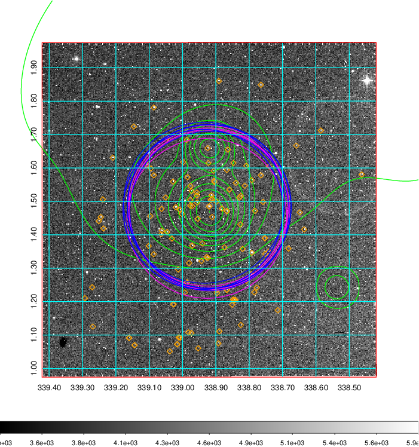  Blue circle for optical clusters;  Magenta circle for XSZ clusters;  all with r=1Mpc;  Only GC with Delta_z<0.01 are shown. | 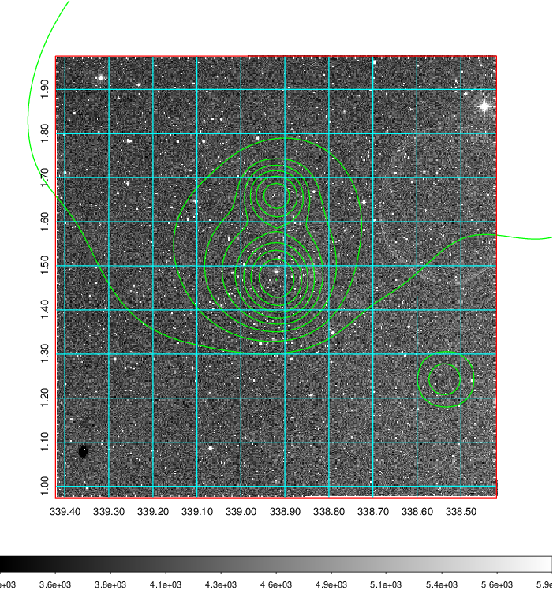 Blue circle for optical clusters;  Magenta circle for XSZ clusters;  all with r=1Mpc;  Only GC with Delta_z<0.01 are shown.  |

|[known Abell/XSZ clusters](../image/897/897_gc.pdf) | [2MASS image](../image/897/897_2mass.pdf)      |[SDSS image](../image/897/897_sdss.pdf)   |
|-------------------|-------------------|-------------------|
|  Magenta, blue and green circles  for optical, X-ray and SZ clusters  respectively, with redshift of clusters  labelled. The radius of circles  are 1Mpc.|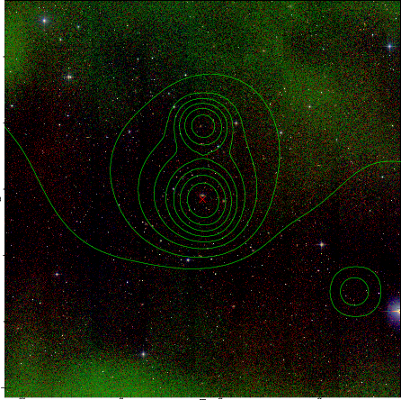  | 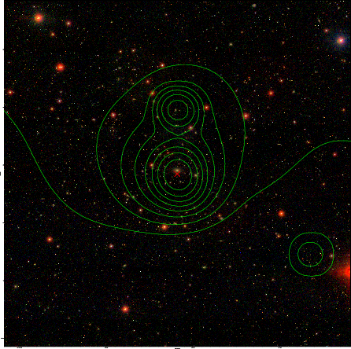  |

|[DES image](../image/897/897_des.pdf)   |
|-------------------|
|   |
