

### 898

|Name|RAJ2000[deg]|DEJ2000[deg] |Ext[arcmin]| Ext,ml | z | z_src| C|GC(XSZ,Delta_z<0.01)| GC(OPT,Delta_z<0.01)|GC| R_sig[arcmin] | R500[arcmin] | R500[Mpc]| CRsig[c/s] | CR500[c/s] |L500[1E44 erg/s]|F500[1E-12 erg/s/cm^2]| M500[1E14 Msun]|Tx[keV]|Cnt_sig|Beta|Rc[arcmin]|Comment|Alias|
|---|---|---|---|---|---|------|---|--------|---------|----------|---|---|---|---|---|---|---|---|---|---|---|---|---|---|
|898| 339.607| -36.755| 5.62| 25.85| 0.0575(0.005)| z1, z_opt| S| -| A| A, N, W| 9.288| 9.593| 0.641| 0.120(0.039)| 0.120(0.039)| 0.176(0.044)| 2.229(0.552)| 0.79(0.10)| 1.89(0.15)| 30.7| 0.844(-0.158+0.111)| 6.770(-1.494+1.285)| -| t288|

|[RASS image](../image/898/898_img.pdf)|[filtered image](../image/898/898_fil.pdf)|[Segment image](../image/898/898_seg.pdf)|
|-------------------|--------------------|-------------------|
| 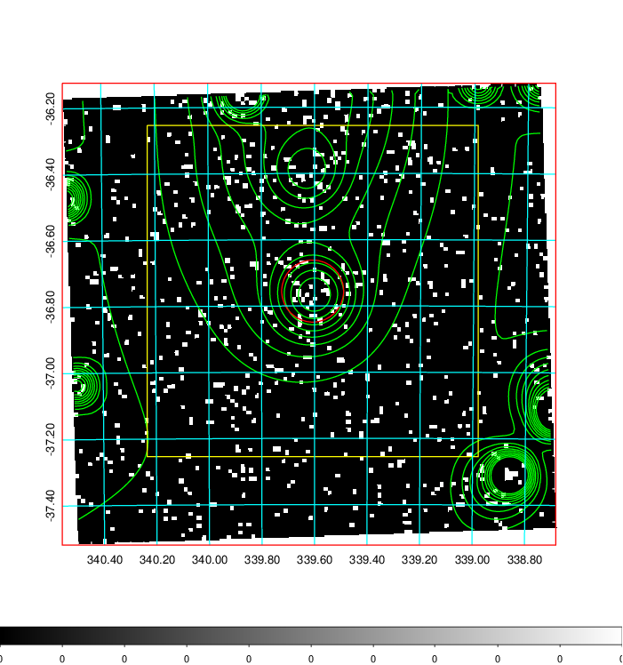  | 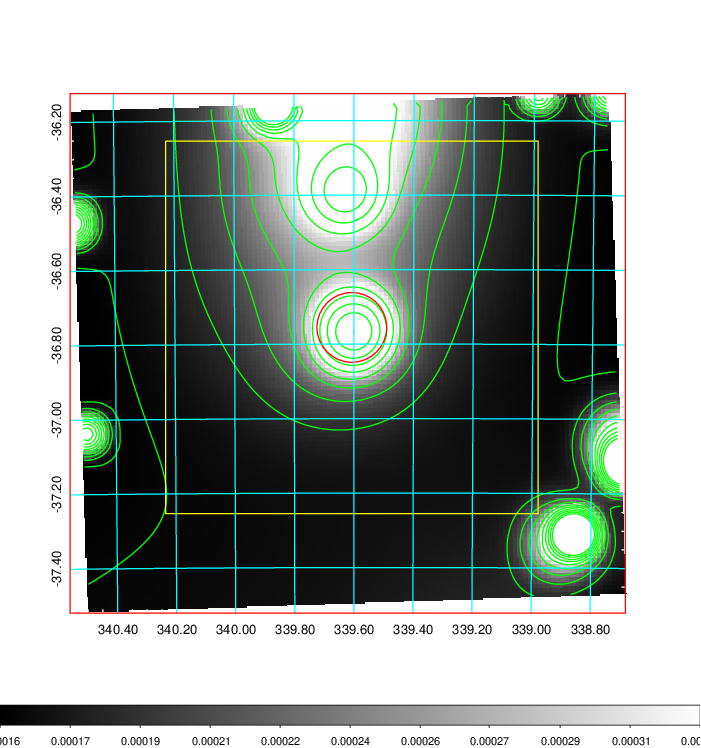   | 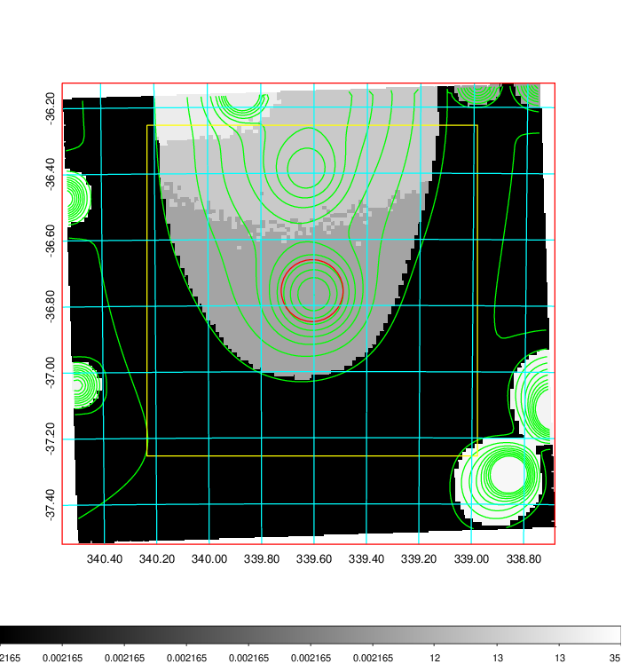  |

|[Exposure image](../image/898/898_mex.pdf)| [nH image](../image/898/898_nh.pdf)| [Planck image](../image/898/898_p.pdf)|
|-------------------|--------------------|-------------------|
|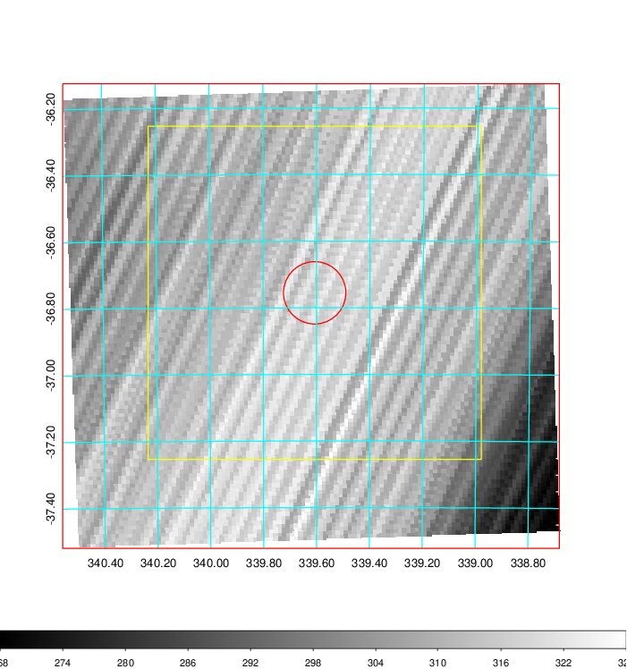   | 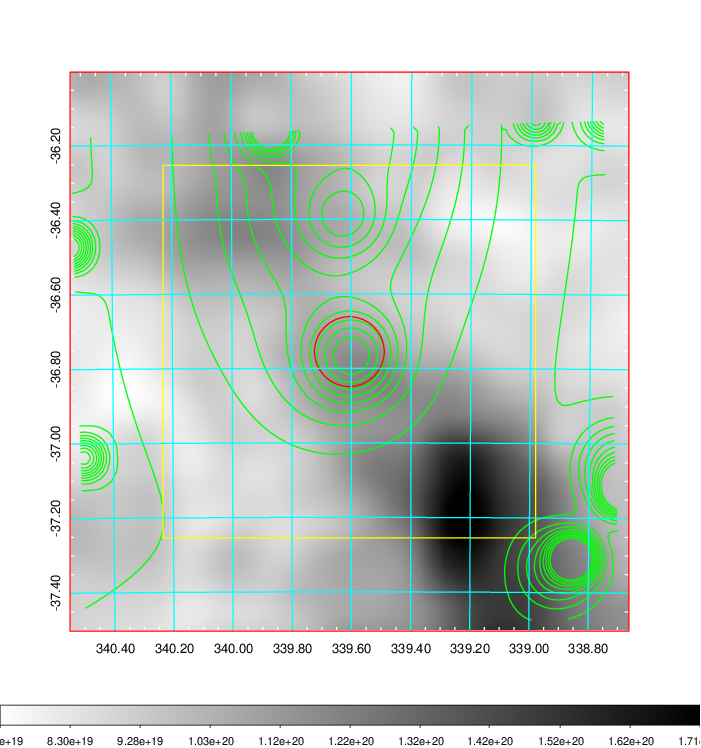    | 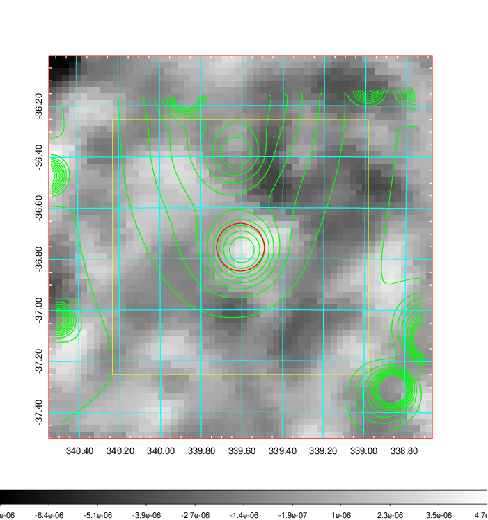 |

|[Redshift Histogram](../image/898/898_zg.pdf) | [DSS image(z1)](../image/898/898_dss_z1.pdf)      |  [DSS image(z2)](../image/898/898_dss_z2.pdf)    |
|-------------------|--------------------|-------------------|
|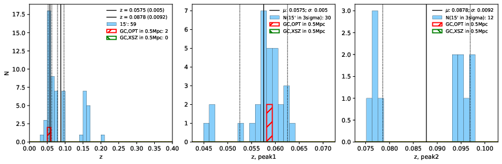 |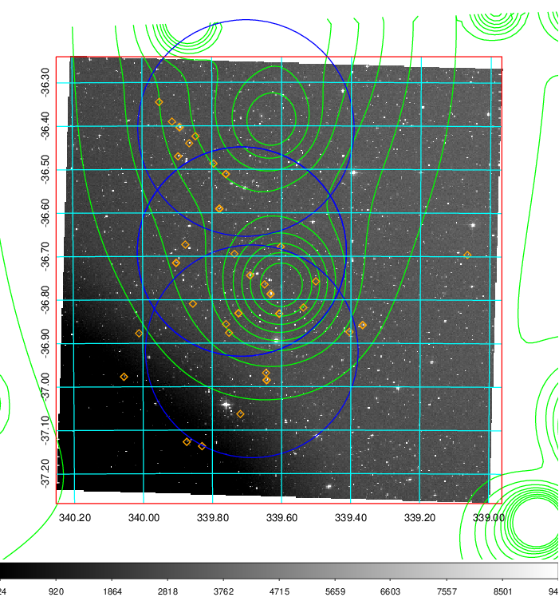  Blue circle for optical clusters;  Magenta circle for XSZ clusters;  all with r=1Mpc;  Only GC with Delta_z<0.01 are shown. | 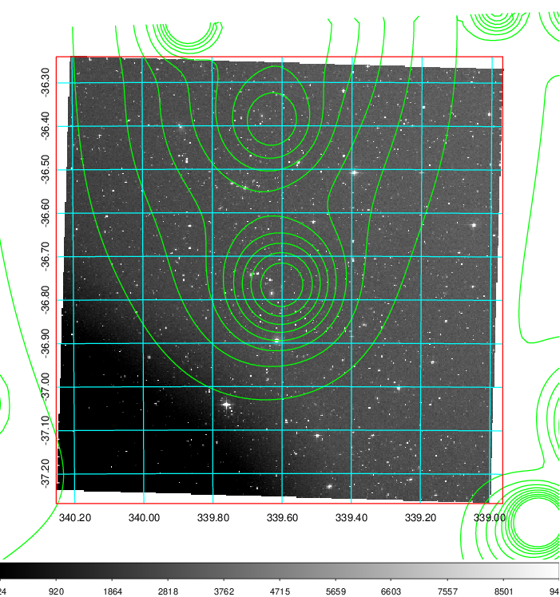 Blue circle for optical clusters;  Magenta circle for XSZ clusters;  all with r=1Mpc;  Only GC with Delta_z<0.01 are shown.  |

|[Previous-identified clusters](../image/898/898_gc.pdf) | [2MASS image](../image/898/898_2mass.pdf)      |
|-------------------|-------------------|
|  Green, magenta, and blue circles  for optical, X-ray and SZ clusters  respectively, with redshift of clusters  labelled. The radius of circles  are 1Mpc.|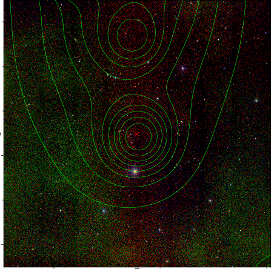  |

|[ATLAS image](../image/898/898_s.pdf)        |
|-------------------|
| 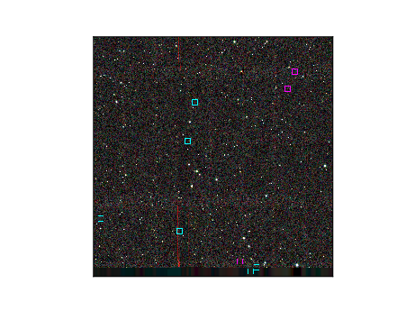  |
