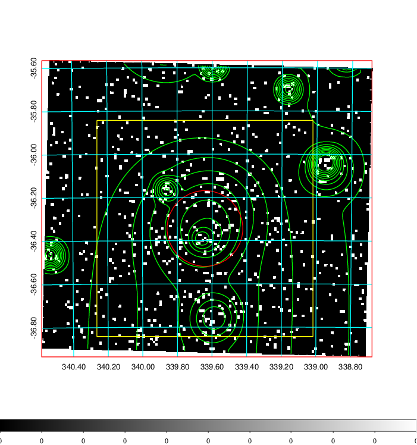
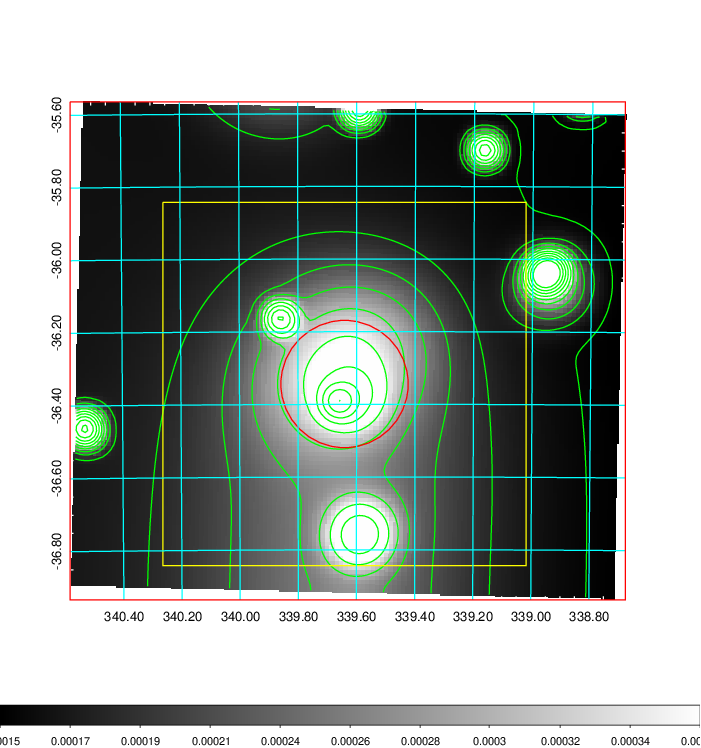
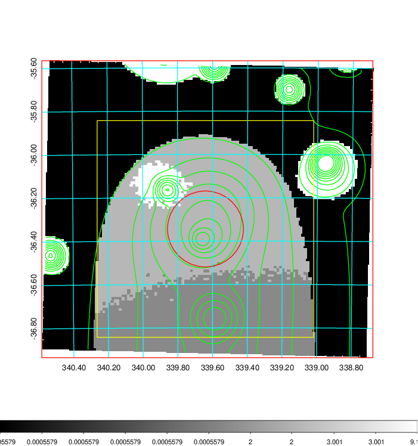
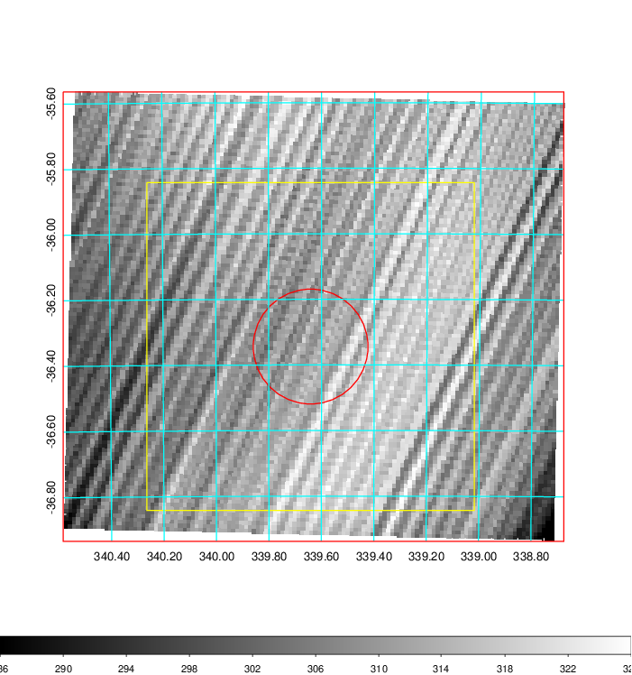
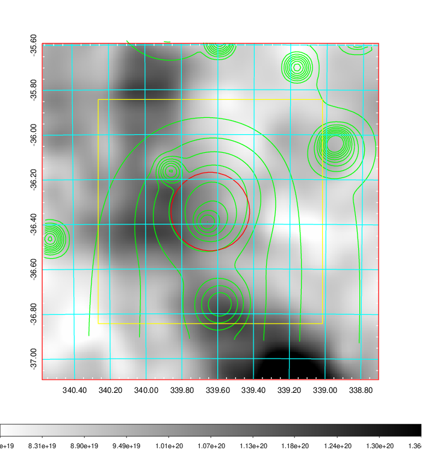
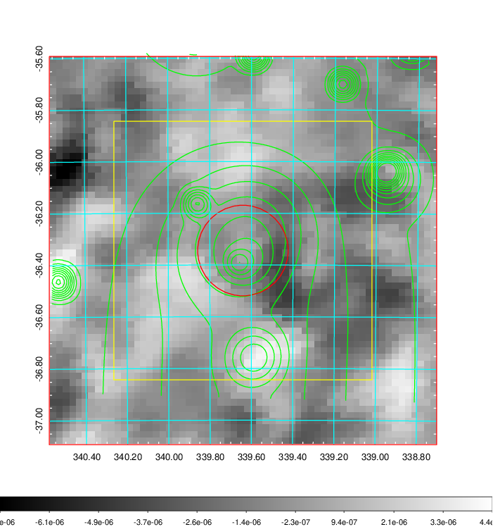
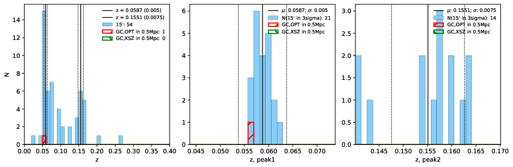
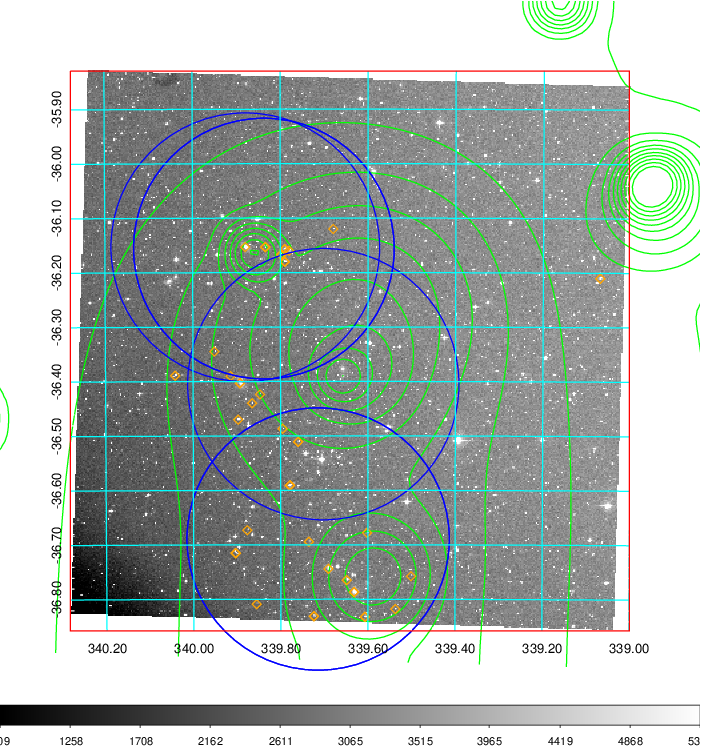
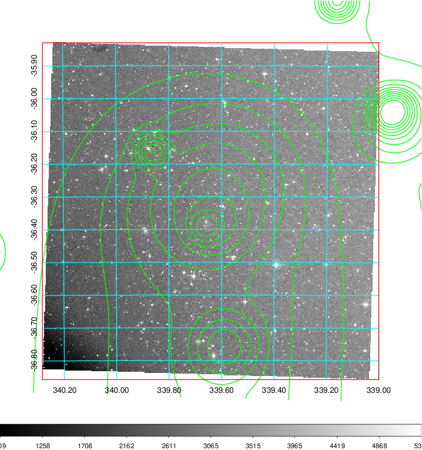
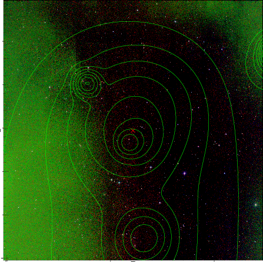

### 899

|Name|RAJ2000[deg]|DEJ2000[deg] |Ext[arcmin]| Ext,ml | z | z_src| C|GC(XSZ,Delta_z<0.01)| GC(OPT,Delta_z<0.01)|GC| R_sig[arcmin] | R500[arcmin] | R500[Mpc]| CRsig[c/s] | CR500[c/s] |L500[1E44 erg/s]|F500[1E-12 erg/s/cm^2]| M500[1E14 Msun]|Tx[keV]|Cnt_sig|Beta|Rc[arcmin]|Comment|Alias|
|---|---|---|---|---|---|------|---|--------|---------|----------|---|---|---|---|---|---|---|---|---|---|---|---|---|---|
|899| 339.641| -36.344| 10.51| 35.74| 0.0587(0.005)| z1, z_opt| S| -| N| A, N, W| 20.256| 11.001| 0.750| 0.265(0.059)| 0.247(0.055)| 0.395(0.126)| 4.783(1.529)| 1.27(0.21)| 2.52(0.26)| 88.5| 0.781(-0.177+0.152)| 16.758(-4.164+3.256)| -| t458|

|[RASS image](../image/899/899_img.pdf)|[filtered image](../image/899/899_fil.pdf)|[Segment image](../image/899/899_seg.pdf)|
|-------------------|--------------------|-------------------|
|   |    |   |

|[Exposure image](../image/899/899_mex.pdf)| [nH image](../image/899/899_nh.pdf)| [Planck image](../image/899/899_p.pdf)|
|-------------------|--------------------|-------------------|
|   |     |  |

|[Redshift Histogram](../image/899/899_zg.pdf) | [DSS image(z1)](../image/899/899_dss_z1.pdf)      |  [DSS image(z2)](../image/899/899_dss_z2.pdf)    |
|-------------------|--------------------|-------------------|
| |  Blue circle for optical clusters;  Magenta circle for XSZ clusters;  all with r=1Mpc;  Only GC with Delta_z<0.01 are shown. |  Blue circle for optical clusters;  Magenta circle for XSZ clusters;  all with r=1Mpc;  Only GC with Delta_z<0.01 are shown.  |

|[known Abell/XSZ clusters](../image/899/899_gc.pdf) | [2MASS image](../image/899/899_2mass.pdf)      |
|-------------------|-------------------|
|  Magenta, blue and green circles  for optical, X-ray and SZ clusters  respectively, with redshift of clusters  labelled. The radius of circles  are 1Mpc.|  |

|[ATLAS image](../image/899/899_s.pdf)        |
|-------------------|
|   |
