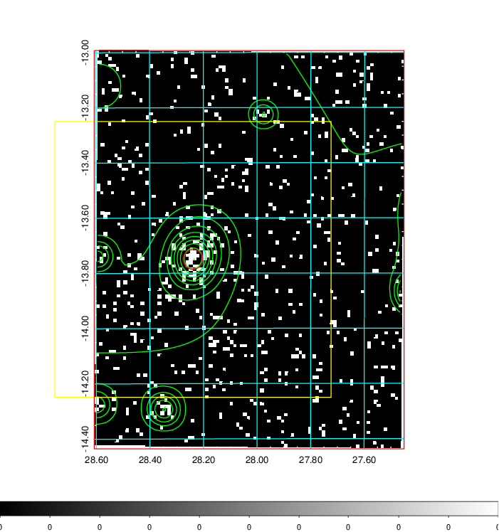
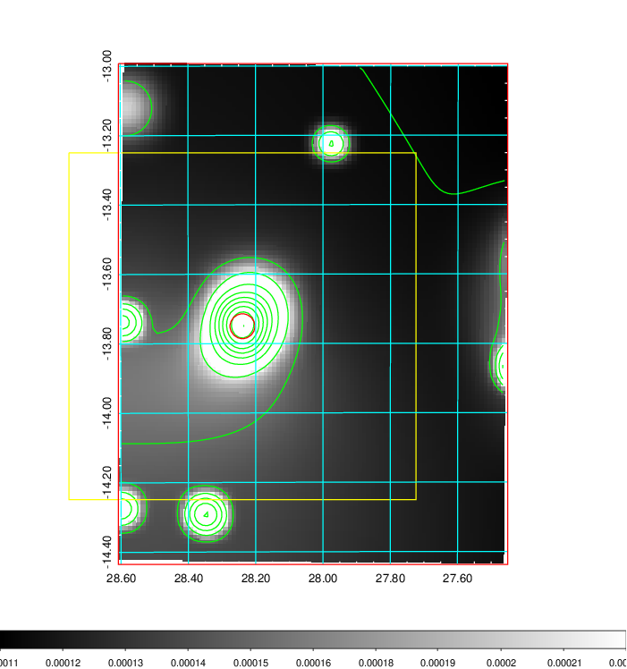
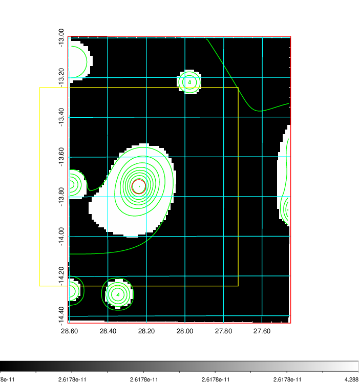
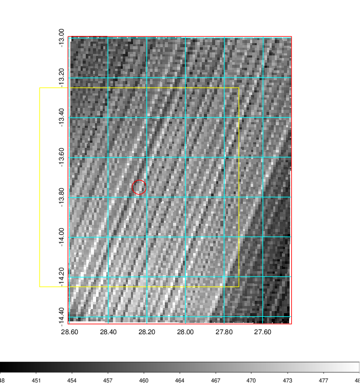
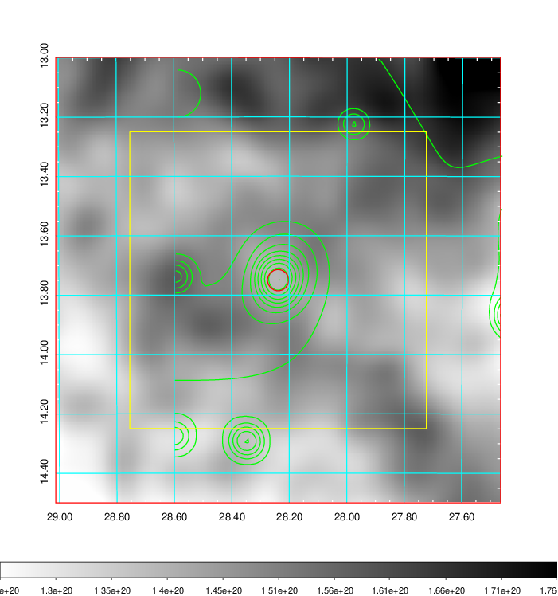
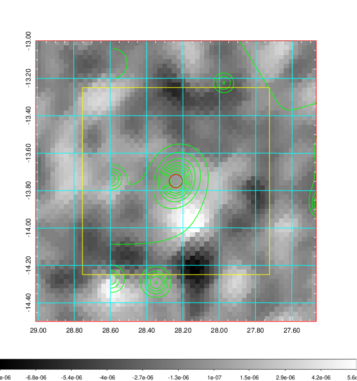
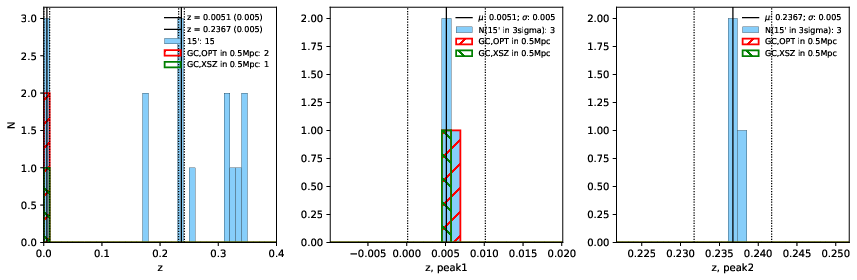
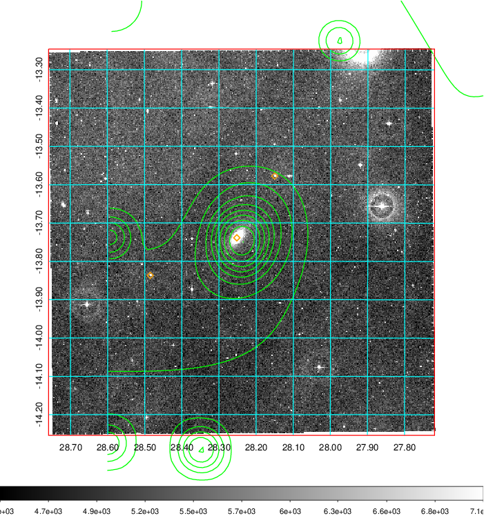
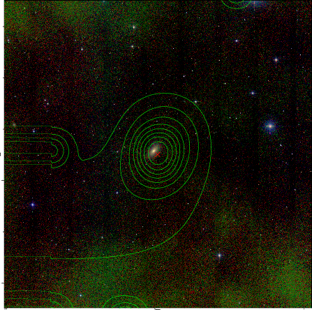

### 90

|Name|RAJ2000[deg]|DEJ2000[deg] |Ext[arcmin]| Ext,ml | z | z_src| C|GC(XSZ,Delta_z<0.01)| GC(OPT,Delta_z<0.01)|GC| R_sig[arcmin] | R500[arcmin] | R500[Mpc]| CRsig[c/s] | CR500[c/s] |L500[1E44 erg/s]|F500[1E-12 erg/s/cm^2]| M500[1E14 Msun]|Tx[keV]|Cnt_sig|Beta|Rc[arcmin]|Comment|Alias|
|---|---|---|---|---|---|------|---|--------|---------|----------|---|---|---|---|---|---|---|---|---|---|---|---|---|---|
|90| 28.239| -13.750| 2.15| 33.70| 0.0051(0.005)| z1, z_xsz| B| MCXC| N| MCXC, N, SPI, XCS| 37.630| 49.933| 0.315| 0.308(0.054)| 0.326(0.057)| 0.003(0.000)| 5.163(0.767)| 0.09(0.01)| 0.48(0.02)| 164.8| 0.510(-0.007+0.013)| 1.746(-0.205+0.282)| -| k248|

|[RASS image](../image/90/90_img.pdf)|[filtered image](../image/90/90_fil.pdf)|[Segment image](../image/90/90_seg.pdf)|
|-------------------|--------------------|-------------------|
|   |    |   |

|[Exposure image](../image/90/90_mex.pdf)| [nH image](../image/90/90_nh.pdf)| [Planck image](../image/90/90_p.pdf)|
|-------------------|--------------------|-------------------|
|   |     |  |

|[Redshift Histogram](../image/90/90_zg.pdf) | [DSS image(z1)](../image/90/90_dss_z1.pdf)      |  [DSS image(z2)](../image/90/90_dss_z2.pdf)    |
|-------------------|--------------------|-------------------|
| |  Blue circle for optical clusters;  Magenta circle for XSZ clusters;  all with r=1Mpc;  Only GC with Delta_z<0.01 are shown. |  Blue circle for optical clusters;  Magenta circle for XSZ clusters;  all with r=1Mpc;  Only GC with Delta_z<0.01 are shown.  |

|[known Abell/XSZ clusters](../image/90/90_gc.pdf) | [2MASS image](../image/90/90_2mass.pdf)      |
|-------------------|-------------------|
|  Magenta, blue and green circles  for optical, X-ray and SZ clusters  respectively, with redshift of clusters  labelled. The radius of circles  are 1Mpc.|  |

|[DES image](../image/90/90_des.pdf)   |[ATLAS image](../image/90/90_s.pdf)        |
|-------------------|-------------------|
|   |   |
