

### 900

|Name|RAJ2000[deg]|DEJ2000[deg] |Ext[arcmin]| Ext,ml | z | z_src| C|GC(XSZ,Delta_z<0.01)| GC(OPT,Delta_z<0.01)|GC| R_sig[arcmin] | R500[arcmin] | R500[Mpc]| CRsig[c/s] | CR500[c/s] |L500[1E44 erg/s]|F500[1E-12 erg/s/cm^2]| M500[1E14 Msun]|Tx[keV]|Cnt_sig|Beta|Rc[arcmin]|Comment|Alias|
|---|---|---|---|---|---|------|---|--------|---------|----------|---|---|---|---|---|---|---|---|---|---|---|---|---|---|
|900| 340.022| 6.055| 21.12| 47.29| 0.0861(0.005)| z1, z_opt| S| -| RM, W| A, C, N, W| 28.650| 8.911| 0.863| 0.233(0.062)| 0.209(0.056)| 0.685(0.267)| 3.715(1.449)| 1.98(0.39)| 3.35(0.42)| 116.8| 0.661(-0.120+0.200)| 15.650(-3.982+5.334)| -| t591|

|[RASS image](../image/900/900_img.pdf)|[filtered image](../image/900/900_fil.pdf)|[Segment image](../image/900/900_seg.pdf)|
|-------------------|--------------------|-------------------|
| 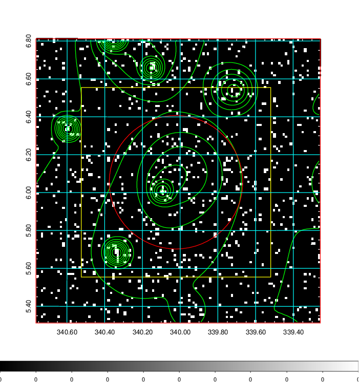  | 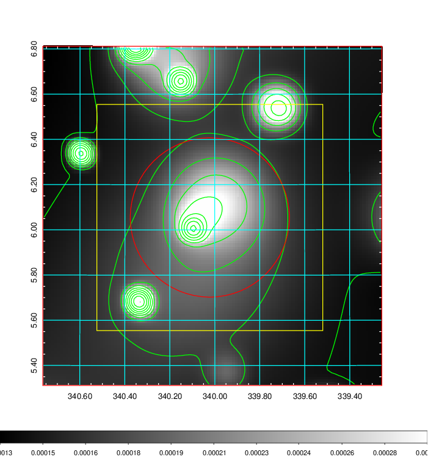   | 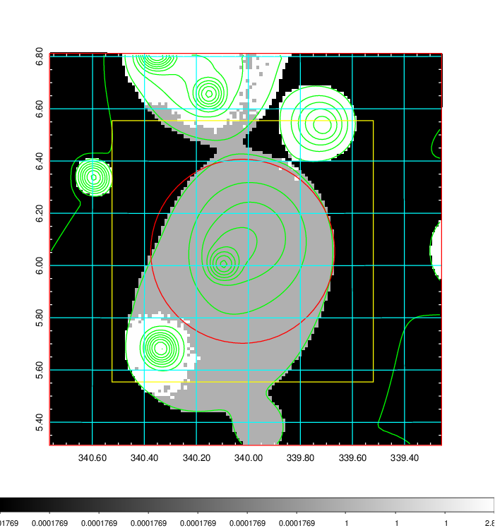  |

|[Exposure image](../image/900/900_mex.pdf)| [nH image](../image/900/900_nh.pdf)| [Planck image](../image/900/900_p.pdf)|
|-------------------|--------------------|-------------------|
|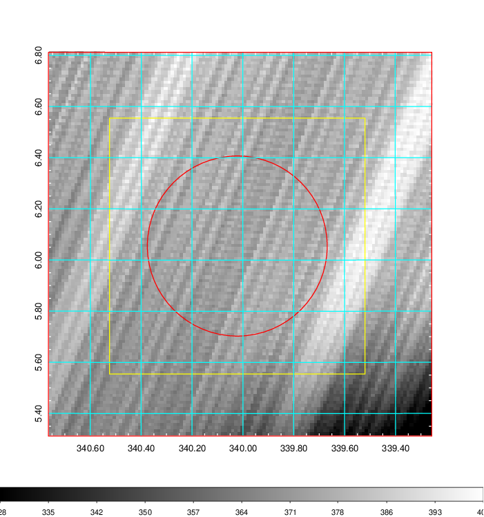   | 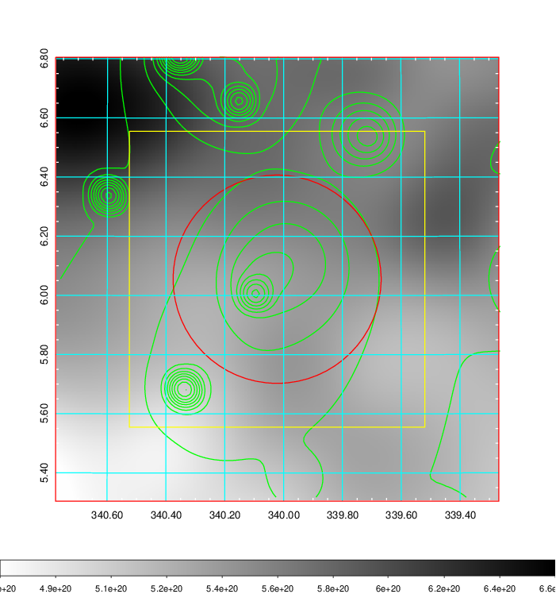    | 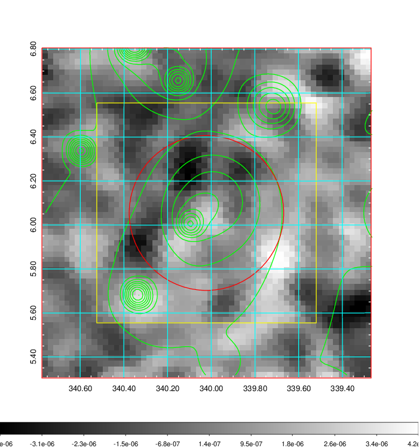 |

|[Redshift Histogram](../image/900/900_zg.pdf) | [DSS image(z1)](../image/900/900_dss_z1.pdf)      |  [DSS image(z2)](../image/900/900_dss_z2.pdf)    |
|-------------------|--------------------|-------------------|
|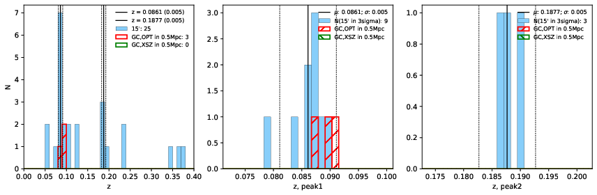 |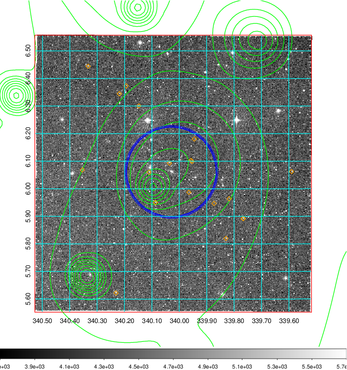  Blue circle for optical clusters;  Magenta circle for XSZ clusters;  all with r=1Mpc;  Only GC with Delta_z<0.01 are shown. | 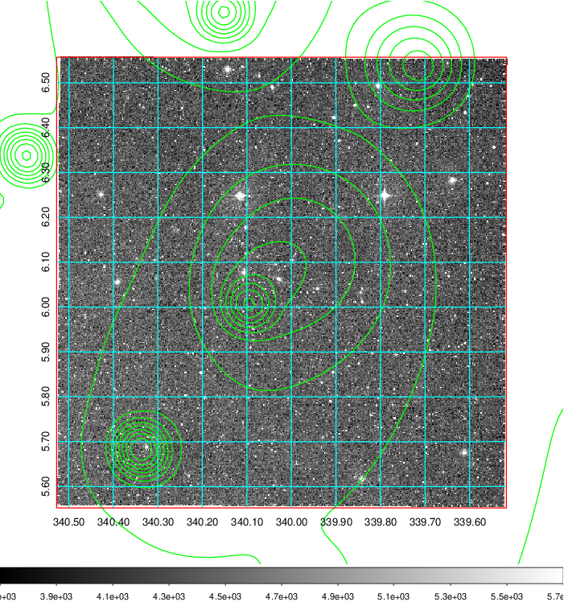 Blue circle for optical clusters;  Magenta circle for XSZ clusters;  all with r=1Mpc;  Only GC with Delta_z<0.01 are shown.  |

|[Previous-identified clusters](../image/900/900_gc.pdf) | [2MASS image](../image/900/900_2mass.pdf)      |[SDSS image](../image/900/900_sdss.pdf)   |
|-------------------|-------------------|-------------------|
|  Green, magenta, and blue circles  for optical, X-ray and SZ clusters  respectively, with redshift of clusters  labelled. The radius of circles  are 1Mpc.|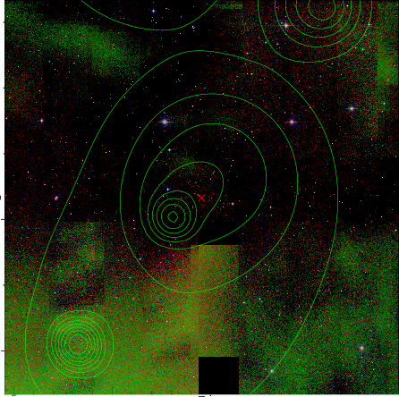  | 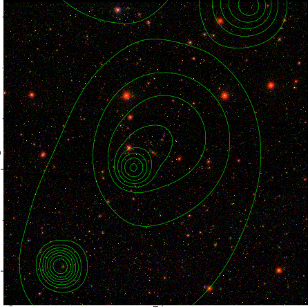  |

