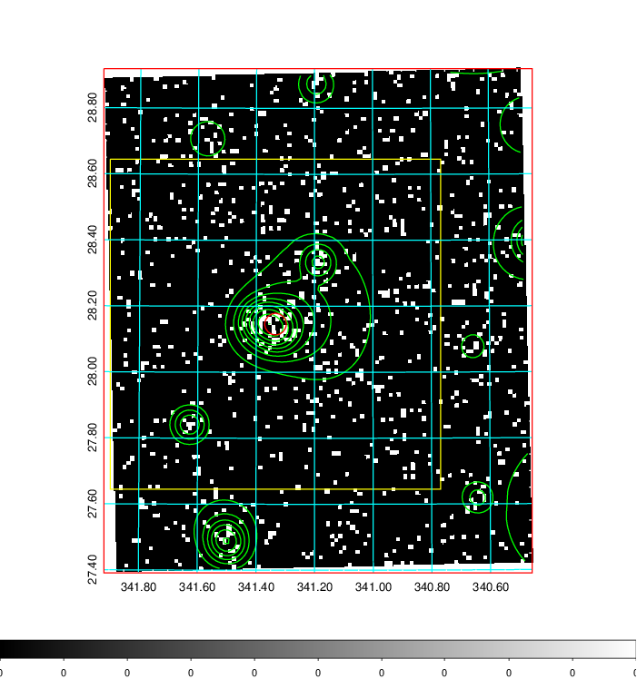
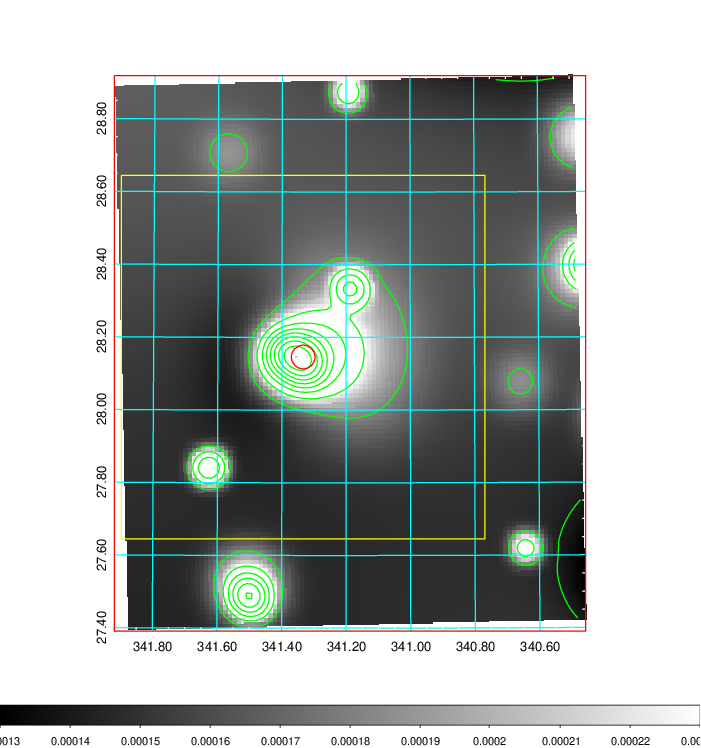
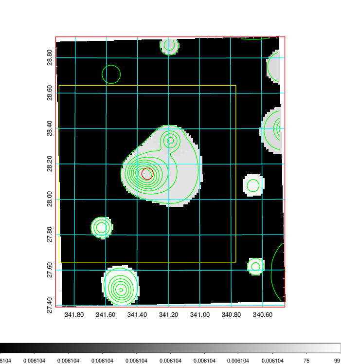
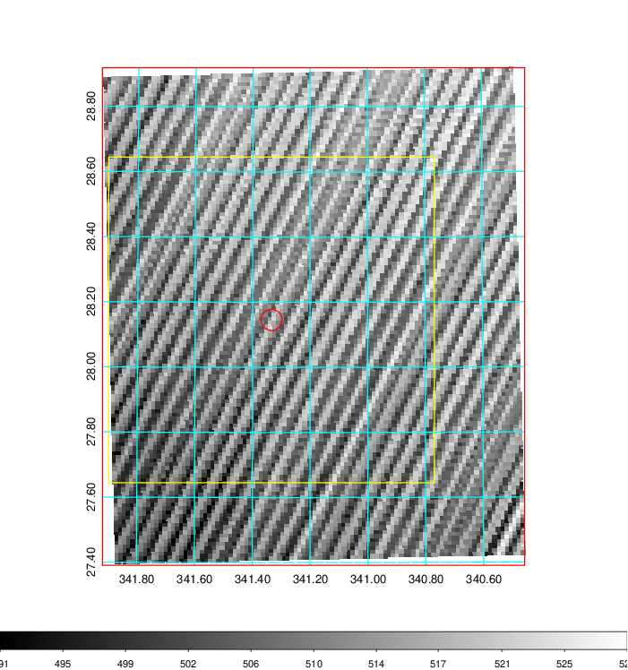
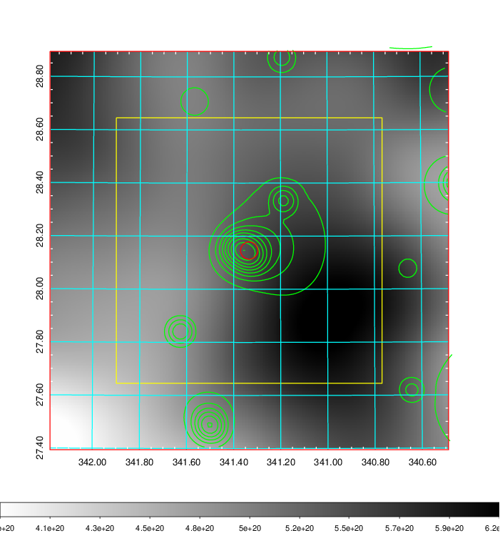
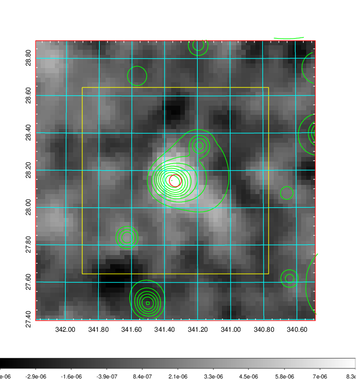
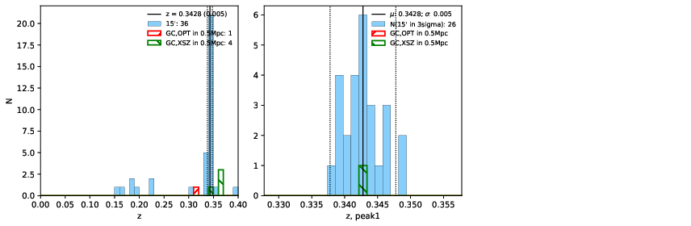
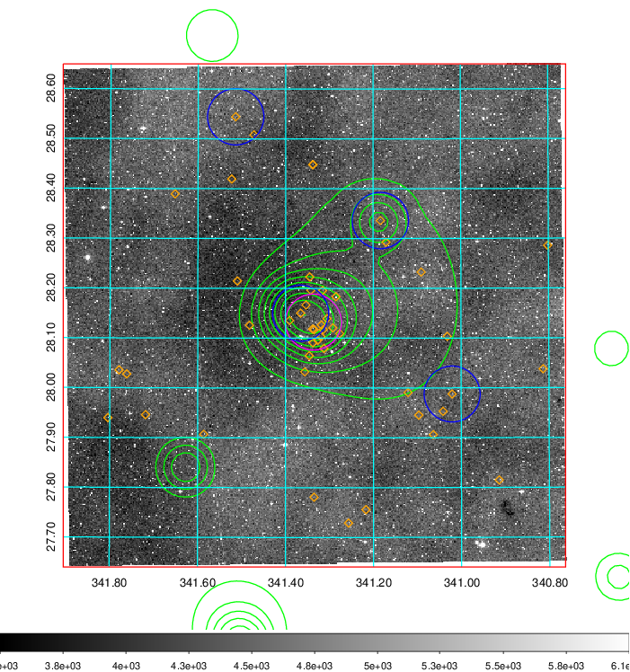
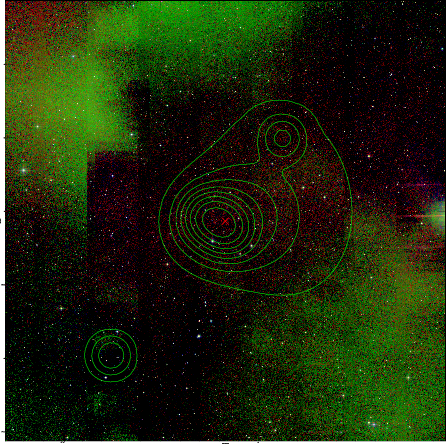
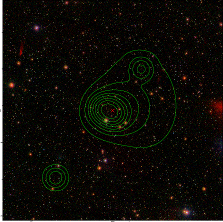

### 901

|Name|RAJ2000[deg]|DEJ2000[deg] |Ext[arcmin]| Ext,ml | z | z_src| C|GC(XSZ,Delta_z<0.01)| GC(OPT,Delta_z<0.01)|GC| R_sig[arcmin] | R500[arcmin] | R500[Mpc]| CRsig[c/s] | CR500[c/s] |L500[1E44 erg/s]|F500[1E-12 erg/s/cm^2]| M500[1E14 Msun]|Tx[keV]|Cnt_sig|Beta|Rc[arcmin]|Comment|Alias|
|---|---|---|---|---|---|------|---|--------|---------|----------|---|---|---|---|---|---|---|---|---|---|---|---|---|---|
|901| 341.334| 28.146| 1.96| 28.94| 0.3428(0.005)| z1, z_xsz| B| Tar| -| C, F20, N, PSZ2, SPI, Tar, W| 6.850| 4.146| 1.212| 0.107(0.027)| 0.101(0.025)| 7.557(0.900)| 1.923(0.229)| 7.24(0.39)| 8.15(0.28)| 54.4| 0.905(-0.111+0.068)| 4.229(-0.671+0.534)| -| k208|

|[RASS image](../image/901/901_img.pdf)|[filtered image](../image/901/901_fil.pdf)|[Segment image](../image/901/901_seg.pdf)|
|-------------------|--------------------|-------------------|
|   |    |   |

|[Exposure image](../image/901/901_mex.pdf)| [nH image](../image/901/901_nh.pdf)| [Planck image](../image/901/901_p.pdf)|
|-------------------|--------------------|-------------------|
|   |     |  |

|[Redshift Histogram](../image/901/901_zg.pdf) | [DSS image(z1)](../image/901/901_dss_z1.pdf)      |  [DSS image(z2)](../image/901/901_dss_z2.pdf)    |
|-------------------|--------------------|-------------------|
| |  Blue circle for optical clusters;  Magenta circle for XSZ clusters;  all with r=1Mpc;  Only GC with Delta_z<0.01 are shown. |  Blue circle for optical clusters;  Magenta circle for XSZ clusters;  all with r=1Mpc;  Only GC with Delta_z<0.01 are shown.  |

|[known Abell/XSZ clusters](../image/901/901_gc.pdf) | [2MASS image](../image/901/901_2mass.pdf)      |[SDSS image](../image/901/901_sdss.pdf)   |
|-------------------|-------------------|-------------------|
|  Magenta, blue and green circles  for optical, X-ray and SZ clusters  respectively, with redshift of clusters  labelled. The radius of circles  are 1Mpc.|  |   |

