

### 902

|Name|RAJ2000[deg]|DEJ2000[deg] |Ext[arcmin]| Ext,ml | z | z_src| C|GC(XSZ,Delta_z<0.01)| GC(OPT,Delta_z<0.01)|GC| R_sig[arcmin] | R500[arcmin] | R500[Mpc]| CRsig[c/s] | CR500[c/s] |L500[1E44 erg/s]|F500[1E-12 erg/s/cm^2]| M500[1E14 Msun]|Tx[keV]|Cnt_sig|Beta|Rc[arcmin]|Comment|Alias|
|---|---|---|---|---|---|------|---|--------|---------|----------|---|---|---|---|---|---|---|---|---|---|---|---|---|---|
|902| 341.586| -52.727| 2.65| 190.10| 0.0956(0.005)| z1, z_xsz| B| MCXC, PSZ2, Tar, XB| A, W| A, MCXC, N, PSZ2, Tar, W, XB| 20.750| 10.491| 1.115| 0.701(0.075)| 0.648(0.069)| 3.046(0.189)| 13.227(0.820)| 4.33(0.13)| 5.45(0.11)| 259.9| 0.612(-0.028+0.033)| 3.117(-0.387+0.434)| -| k327|

|[RASS image](../image/902/902_img.pdf)|[filtered image](../image/902/902_fil.pdf)|[Segment image](../image/902/902_seg.pdf)|
|-------------------|--------------------|-------------------|
| 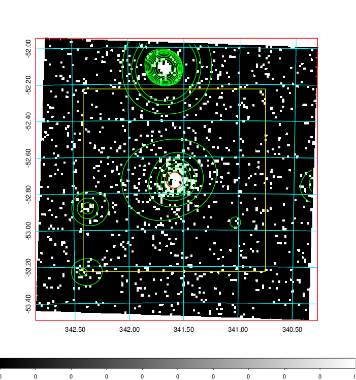  | 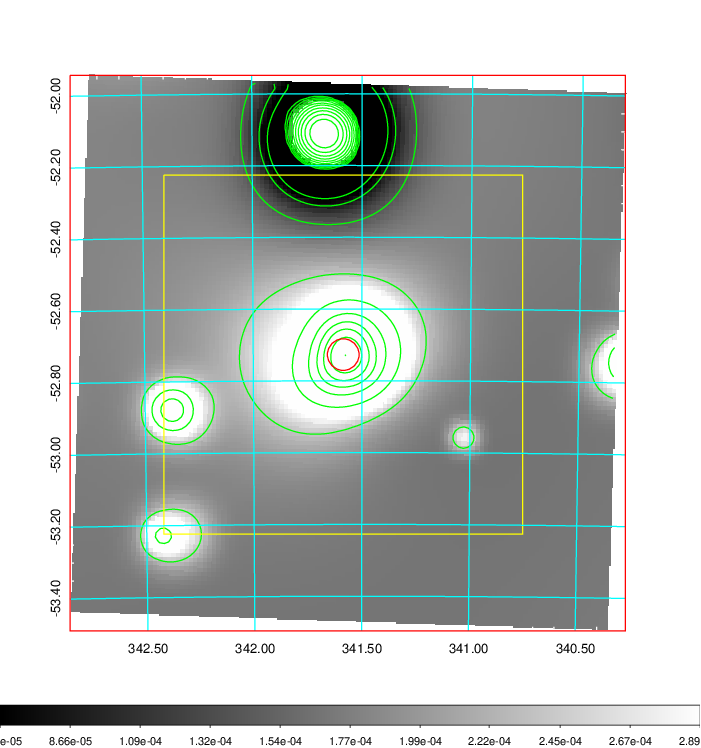   | 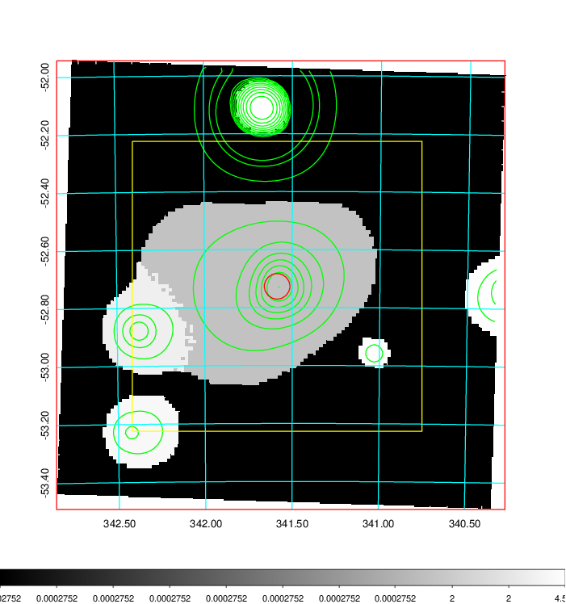  |

|[Exposure image](../image/902/902_mex.pdf)| [nH image](../image/902/902_nh.pdf)| [Planck image](../image/902/902_p.pdf)|
|-------------------|--------------------|-------------------|
|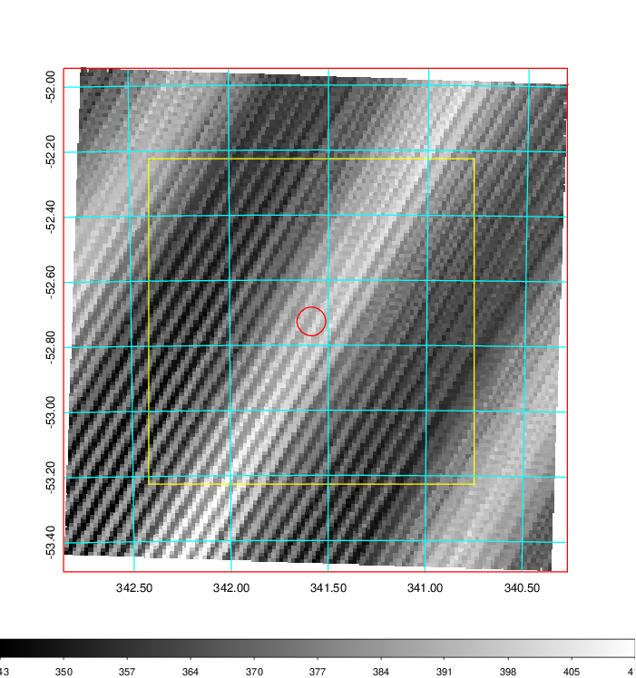   | 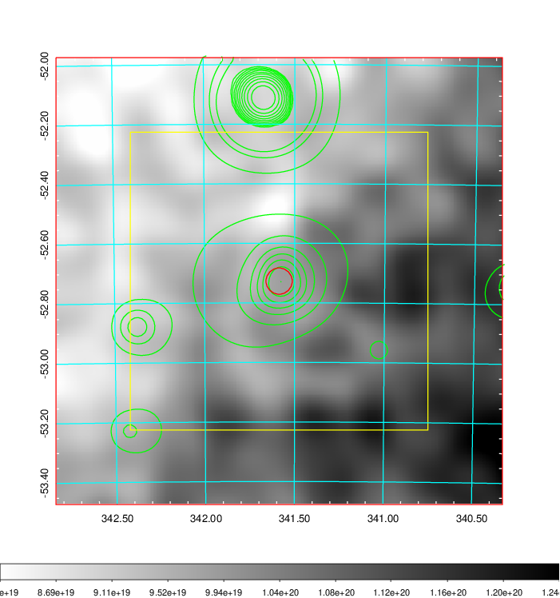    | 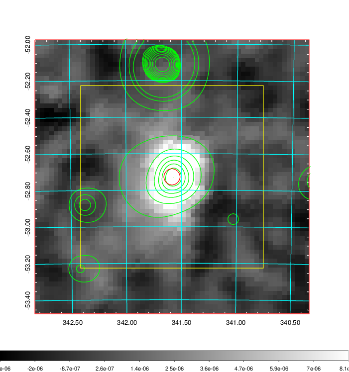 |

|[Redshift Histogram](../image/902/902_zg.pdf) | [DSS image(z1)](../image/902/902_dss_z1.pdf)      |  [DSS image(z2)](../image/902/902_dss_z2.pdf)    |
|-------------------|--------------------|-------------------|
|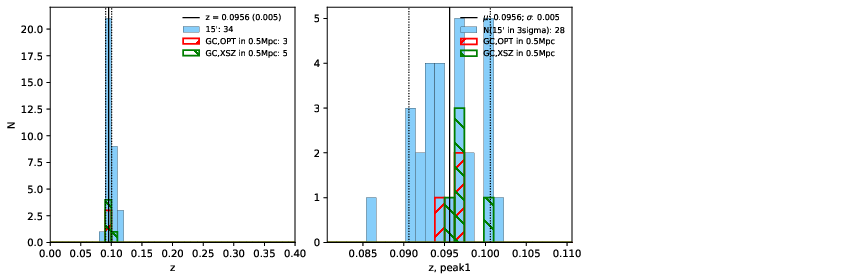 |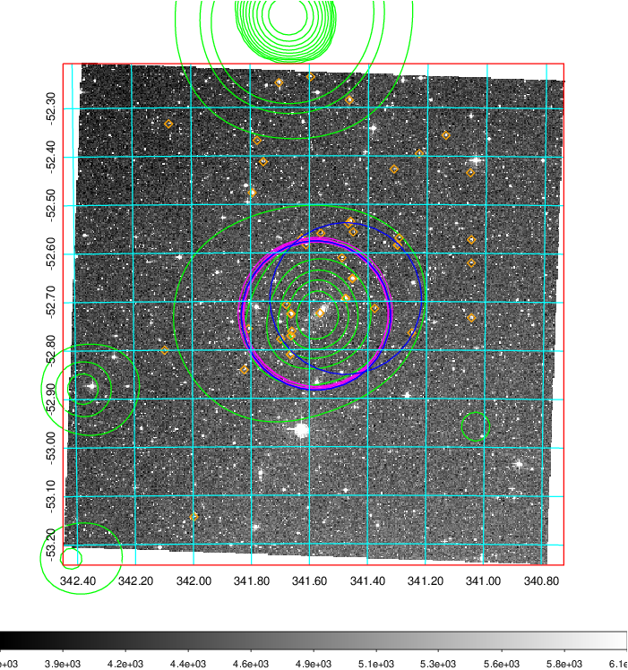  Blue circle for optical clusters;  Magenta circle for XSZ clusters;  all with r=1Mpc;  Only GC with Delta_z<0.01 are shown. | 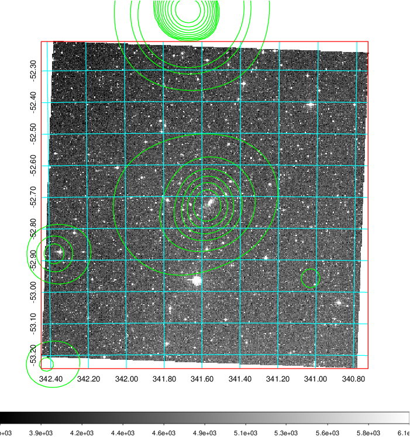 Blue circle for optical clusters;  Magenta circle for XSZ clusters;  all with r=1Mpc;  Only GC with Delta_z<0.01 are shown.  |

|[Previous-identified clusters](../image/902/902_gc.pdf) | [2MASS image](../image/902/902_2mass.pdf)      |
|-------------------|-------------------|
|  Green, magenta, and blue circles  for optical, X-ray and SZ clusters  respectively, with redshift of clusters  labelled. The radius of circles  are 1Mpc.|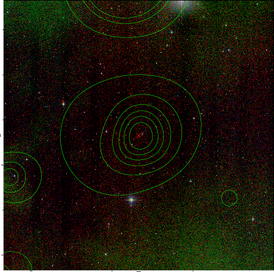  |

|[DES image](../image/902/902_des.pdf)   |
|-------------------|
| 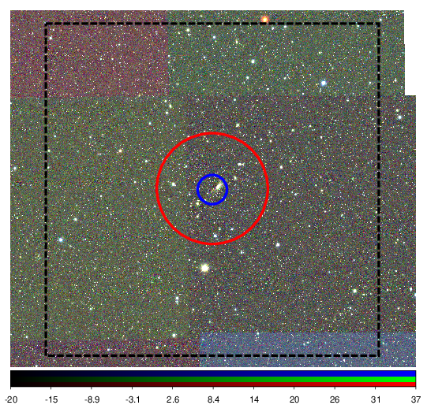  |
