

### 903

|Name|RAJ2000[deg]|DEJ2000[deg] |Ext[arcmin]| Ext,ml | z | z_src| C|GC(XSZ,Delta_z<0.01)| GC(OPT,Delta_z<0.01)|GC| R_sig[arcmin] | R500[arcmin] | R500[Mpc]| CRsig[c/s] | CR500[c/s] |L500[1E44 erg/s]|F500[1E-12 erg/s/cm^2]| M500[1E14 Msun]|Tx[keV]|Cnt_sig|Beta|Rc[arcmin]|Comment|Alias|
|---|---|---|---|---|---|------|---|--------|---------|----------|---|---|---|---|---|---|---|---|---|---|---|---|---|---|
|903| 341.724| 1.473| 18.98| 37.66| 0.0661(0.007)| z1,| G| -| -| C, F20, N, W| 21.738| 9.726| 0.740| 0.181(0.070)| 0.166(0.064)| 0.296(0.302)| 2.796(2.859)| 1.23(0.64)| 2.48(0.82)| 68.5| 0.858(-0.160+0.102)| 22.164(-4.145+3.254)| -| t576|

|[RASS image](../image/903/903_img.pdf)|[filtered image](../image/903/903_fil.pdf)|[Segment image](../image/903/903_seg.pdf)|
|-------------------|--------------------|-------------------|
| 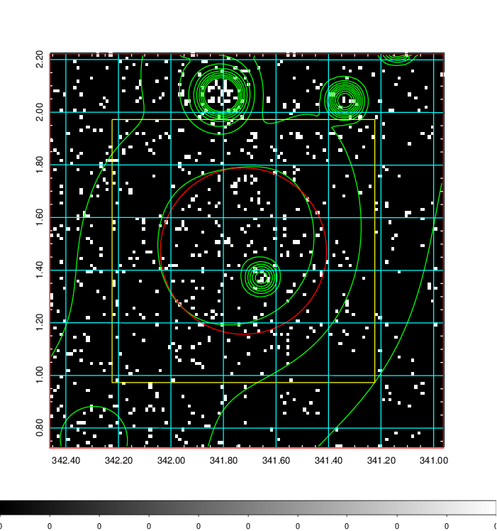  | 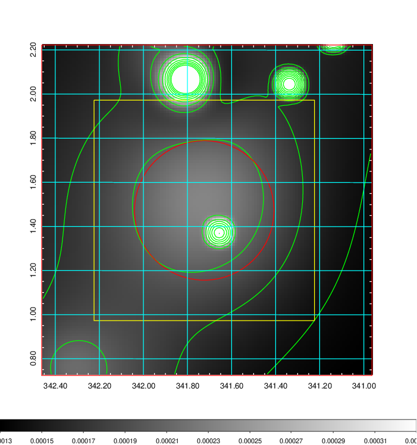   | 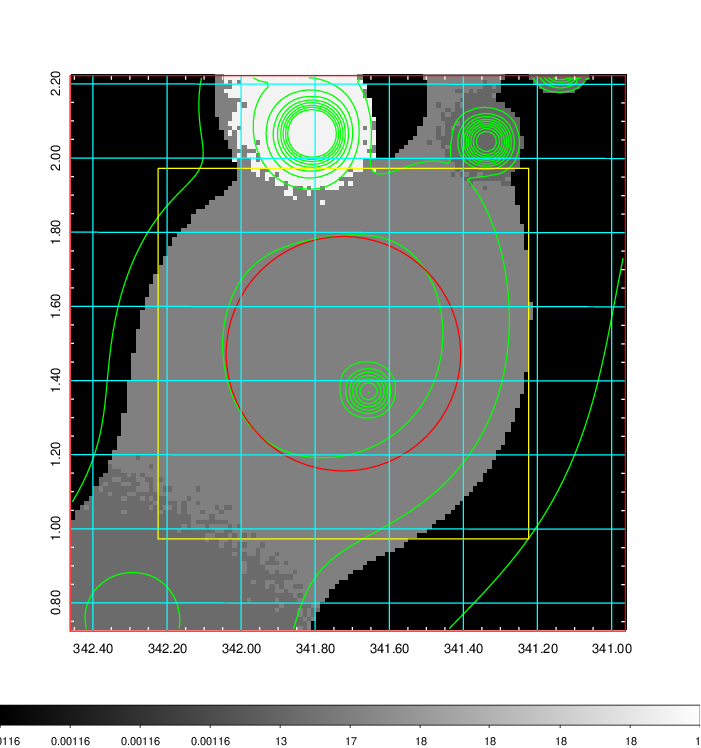  |

|[Exposure image](../image/903/903_mex.pdf)| [nH image](../image/903/903_nh.pdf)| [Planck image](../image/903/903_p.pdf)|
|-------------------|--------------------|-------------------|
|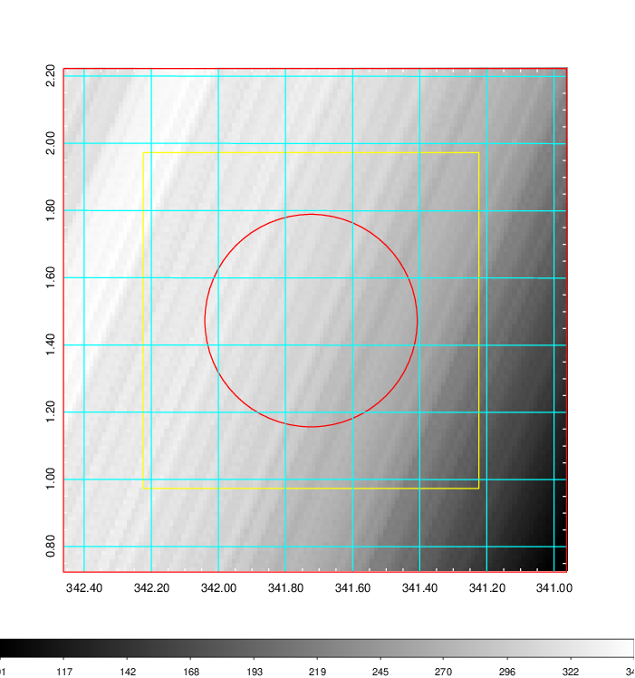   | 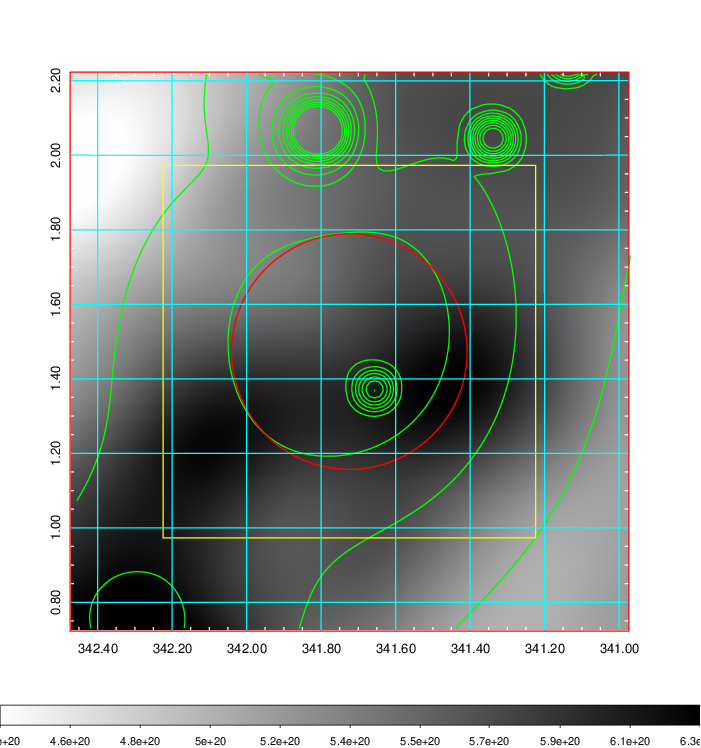    | 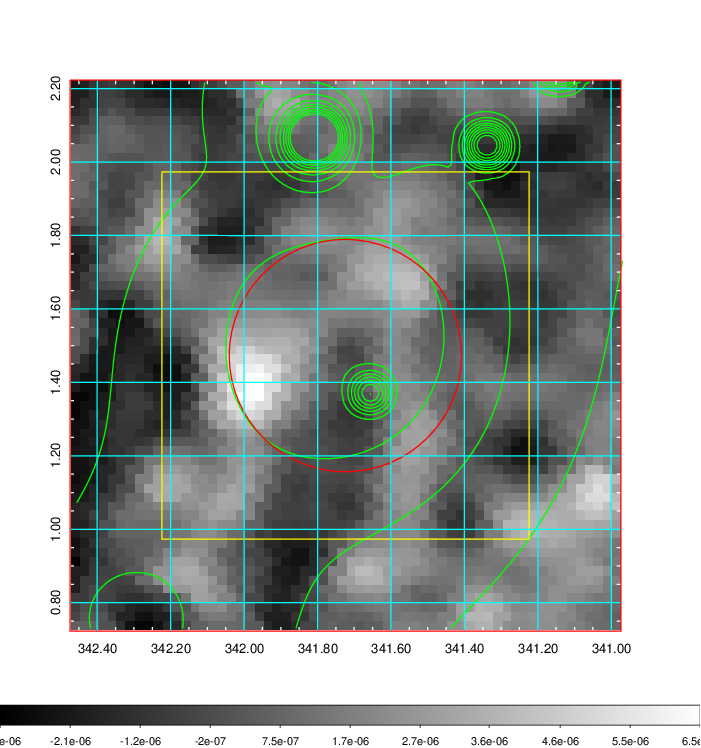 |

|[Redshift Histogram](../image/903/903_zg.pdf) | [DSS image(z1)](../image/903/903_dss_z1.pdf)      |  [DSS image(z2)](../image/903/903_dss_z2.pdf)    |
|-------------------|--------------------|-------------------|
|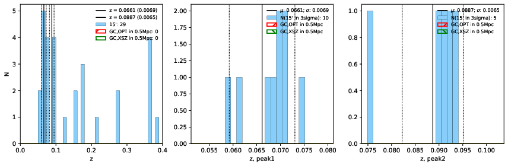 |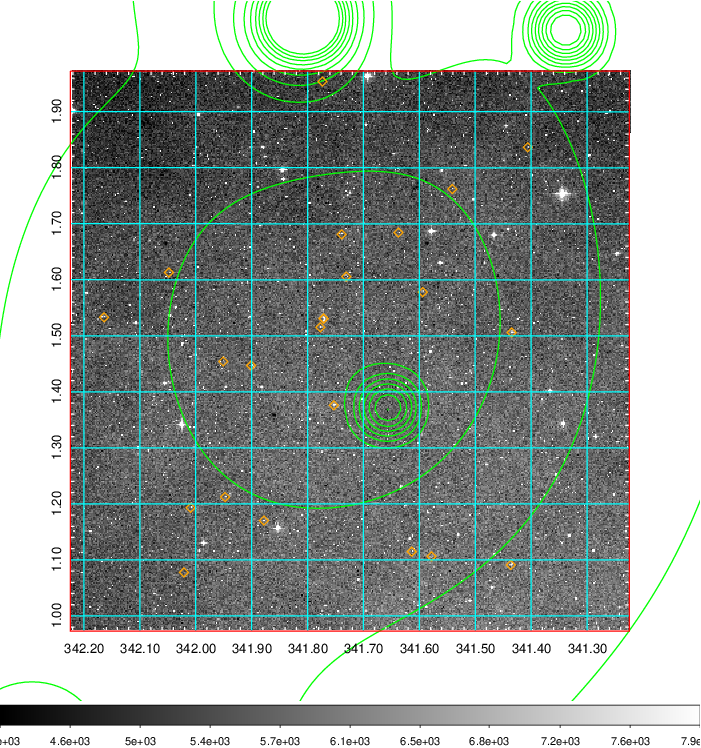  Blue circle for optical clusters;  Magenta circle for XSZ clusters;  all with r=1Mpc;  Only GC with Delta_z<0.01 are shown. | 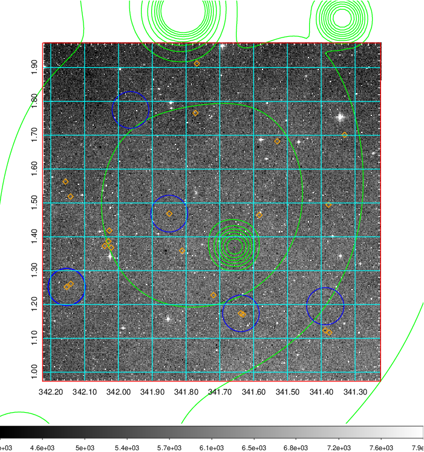 Blue circle for optical clusters;  Magenta circle for XSZ clusters;  all with r=1Mpc;  Only GC with Delta_z<0.01 are shown.  |

|[known Abell/XSZ clusters](../image/903/903_gc.pdf) | [2MASS image](../image/903/903_2mass.pdf)      |[SDSS image](../image/903/903_sdss.pdf)   |
|-------------------|-------------------|-------------------|
|  Magenta, blue and green circles  for optical, X-ray and SZ clusters  respectively, with redshift of clusters  labelled. The radius of circles  are 1Mpc.|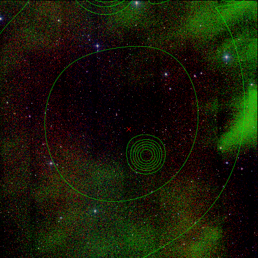  | 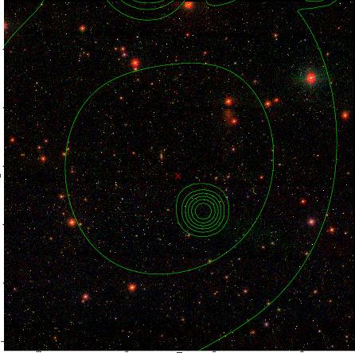  |

|[DES image](../image/903/903_des.pdf)   |
|-------------------|
|   |
