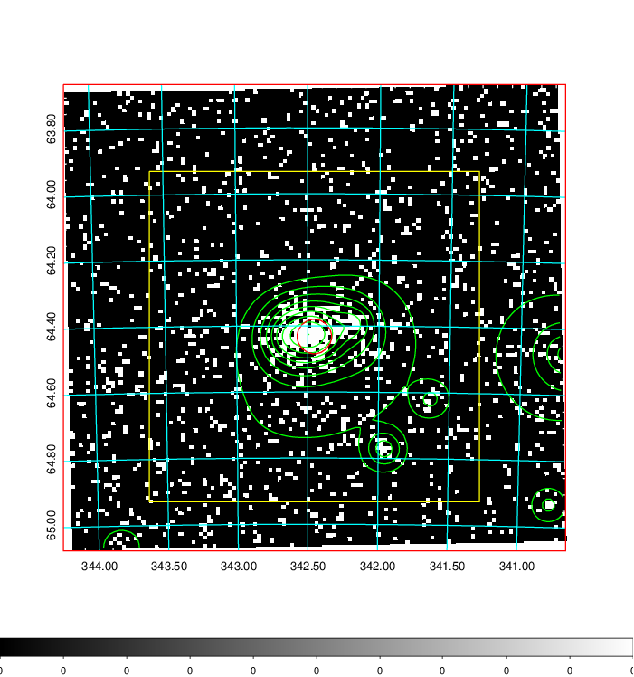
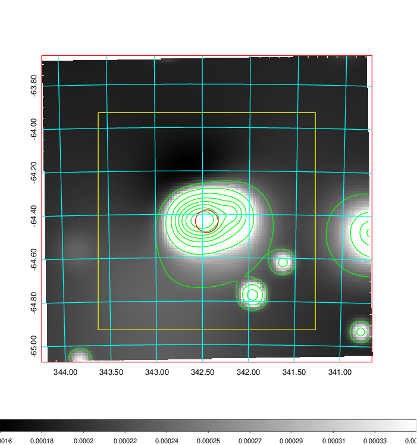
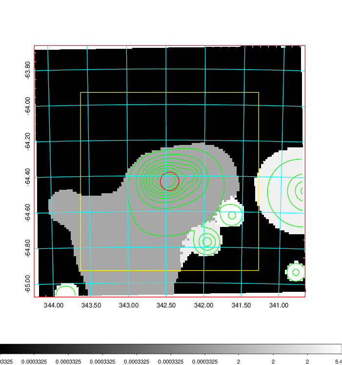
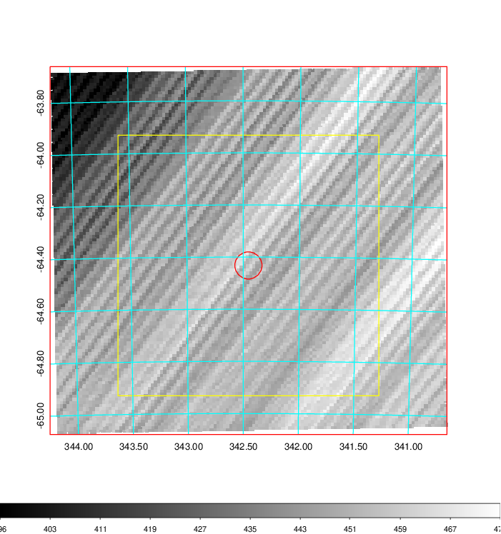
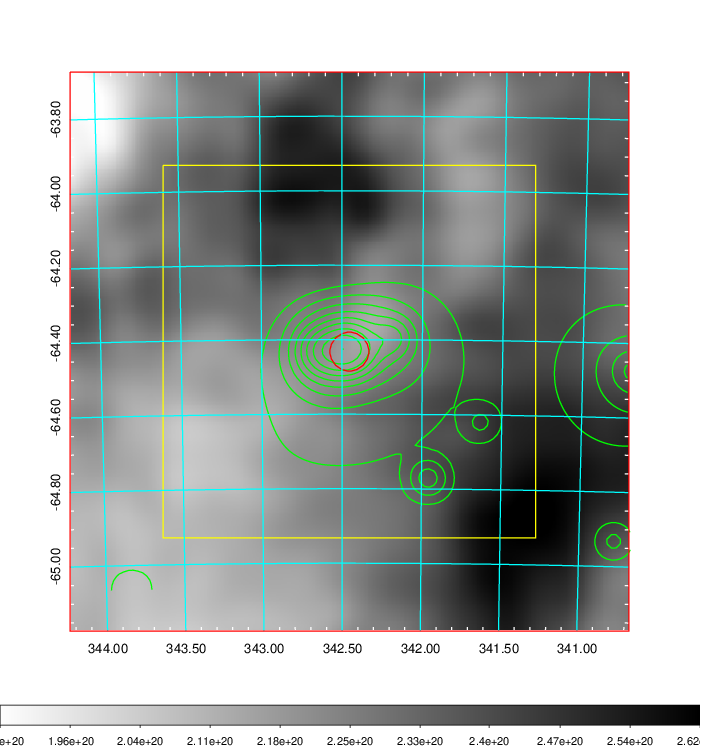
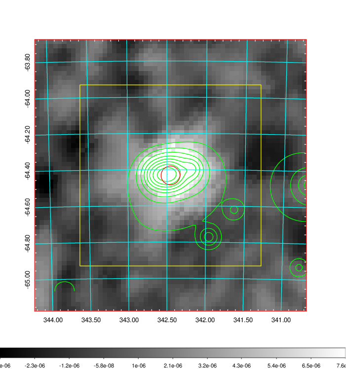
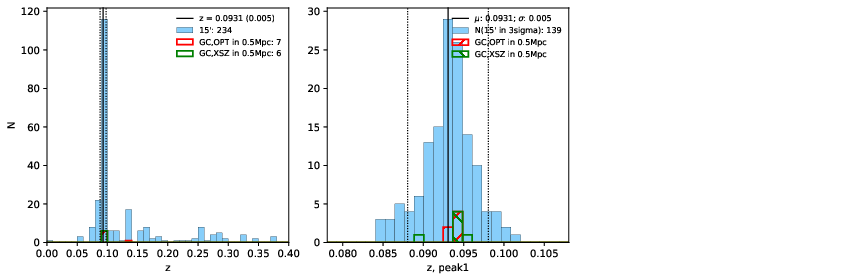
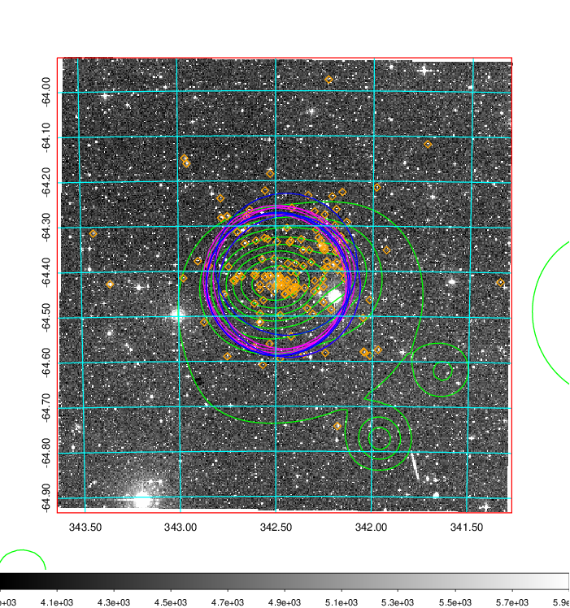
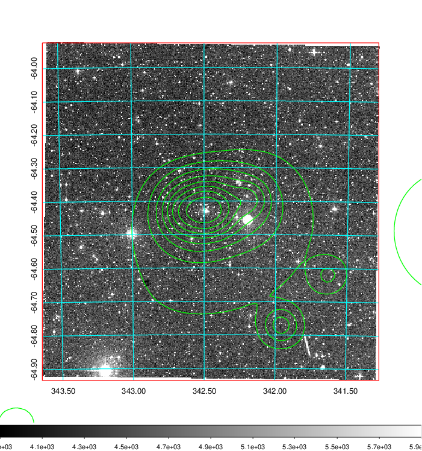
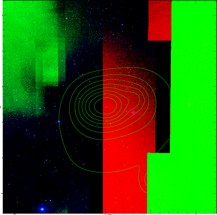

### 904

|Name|RAJ2000[deg]|DEJ2000[deg] |Ext[arcmin]| Ext,ml | z | z_src| C|GC(XSZ,Delta_z<0.01)| GC(OPT,Delta_z<0.01)|GC| R_sig[arcmin] | R500[arcmin] | R500[Mpc]| CRsig[c/s] | CR500[c/s] |L500[1E44 erg/s]|F500[1E-12 erg/s/cm^2]| M500[1E14 Msun]|Tx[keV]|Cnt_sig|Beta|Rc[arcmin]|Comment|Alias|
|---|---|---|---|---|---|------|---|--------|---------|----------|---|---|---|---|---|---|---|---|---|---|---|---|---|---|
|904| 342.454| -64.432| 3.13| 375.99| 0.0931(0.005)| z1, z_xsz| B| B15, MCXC, PSZ2, Tar, XB| A, N, W| A, B15, MCXC, N, PSZ2, Tar, W, XB| 24.206| 11.136| 1.156| 0.853(0.073)| 0.783(0.067)| 3.339(0.141)| 15.338(0.646)| 4.81(0.10)| 5.81(0.08)| 418.8| 0.700(-0.035+0.042)| 4.343(-0.418+0.480)| -| k388|

|[RASS image](../image/904/904_img.pdf)|[filtered image](../image/904/904_fil.pdf)|[Segment image](../image/904/904_seg.pdf)|
|-------------------|--------------------|-------------------|
|   |    |   |

|[Exposure image](../image/904/904_mex.pdf)| [nH image](../image/904/904_nh.pdf)| [Planck image](../image/904/904_p.pdf)|
|-------------------|--------------------|-------------------|
|   |     |  |

|[Redshift Histogram](../image/904/904_zg.pdf) | [DSS image(z1)](../image/904/904_dss_z1.pdf)      |  [DSS image(z2)](../image/904/904_dss_z2.pdf)    |
|-------------------|--------------------|-------------------|
| |  Blue circle for optical clusters;  Magenta circle for XSZ clusters;  all with r=1Mpc;  Only GC with Delta_z<0.01 are shown. |  Blue circle for optical clusters;  Magenta circle for XSZ clusters;  all with r=1Mpc;  Only GC with Delta_z<0.01 are shown.  |

|[known Abell/XSZ clusters](../image/904/904_gc.pdf) | [2MASS image](../image/904/904_2mass.pdf)      |
|-------------------|-------------------|
|  Magenta, blue and green circles  for optical, X-ray and SZ clusters  respectively, with redshift of clusters  labelled. The radius of circles  are 1Mpc.|  |

|[DES image](../image/904/904_des.pdf)   |
|-------------------|
|   |
