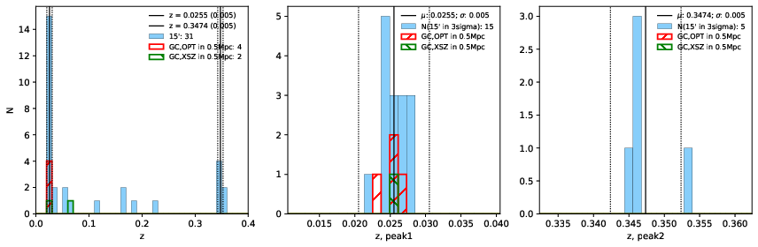

### 905

|Name|RAJ2000[deg]|DEJ2000[deg] |Ext[arcmin]| Ext,ml | z | z_src| C|GC(XSZ,Delta_z<0.01)| GC(OPT,Delta_z<0.01)|GC| R_sig[arcmin] | R500[arcmin] | R500[Mpc]| CRsig[c/s] | CR500[c/s] |L500[1E44 erg/s]|F500[1E-12 erg/s/cm^2]| M500[1E14 Msun]|Tx[keV]|Cnt_sig|Beta|Rc[arcmin]|Comment|Alias|
|---|---|---|---|---|---|------|---|--------|---------|----------|---|---|---|---|---|---|---|---|---|---|---|---|---|---|
|905| 342.500| 11.699| 5.80| 43.80| 0.0255(0.005)| z1, z_xsz| B| MCXC| N| F20, MCXC, N, W| 39.610| 16.891| 0.520| 0.243(0.080)| 0.222(0.073)| 0.045(0.012)| 3.035(0.798)| 0.41(0.06)| 1.25(0.11)| 115.2| 0.852(-0.109+0.098)| 8.785(-1.584+1.289)| -| k536|

|[RASS image](../image/905/905_img.pdf)|[filtered image](../image/905/905_fil.pdf)|[Segment image](../image/905/905_seg.pdf)|
|-------------------|--------------------|-------------------|
|   |    |   |

|[Exposure image](../image/905/905_mex.pdf)| [nH image](../image/905/905_nh.pdf)| [Planck image](../image/905/905_p.pdf)|
|-------------------|--------------------|-------------------|
|   |     |  |

|[Redshift Histogram](../image/905/905_zg.pdf) | [DSS image(z1)](../image/905/905_dss_z1.pdf)      |  [DSS image(z2)](../image/905/905_dss_z2.pdf)    |
|-------------------|--------------------|-------------------|
| |  Blue circle for optical clusters;  Magenta circle for XSZ clusters;  all with r=1Mpc;  Only GC with Delta_z<0.01 are shown. |  Blue circle for optical clusters;  Magenta circle for XSZ clusters;  all with r=1Mpc;  Only GC with Delta_z<0.01 are shown.  |

|[known Abell/XSZ clusters](../image/905/905_gc.pdf) | [2MASS image](../image/905/905_2mass.pdf)      |[SDSS image](../image/905/905_sdss.pdf)   |
|-------------------|-------------------|-------------------|
|  Magenta, blue and green circles  for optical, X-ray and SZ clusters  respectively, with redshift of clusters  labelled. The radius of circles  are 1Mpc.|  |   |

