

### 906

|Name|RAJ2000[deg]|DEJ2000[deg] |Ext[arcmin]| Ext,ml | z | z_src| C|GC(XSZ,Delta_z<0.01)| GC(OPT,Delta_z<0.01)|GC| R_sig[arcmin] | R500[arcmin] | R500[Mpc]| CRsig[c/s] | CR500[c/s] |L500[1E44 erg/s]|F500[1E-12 erg/s/cm^2]| M500[1E14 Msun]|Tx[keV]|Cnt_sig|Beta|Rc[arcmin]|Comment|Alias|
|---|---|---|---|---|---|------|---|--------|---------|----------|---|---|---|---|---|---|---|---|---|---|---|---|---|---|
|906| 342.583| 10.907| 1.43| 93.43| 0.0762(0.007)| z1, z_xsz| B| L03, MCXC, PSZ2, Tar, XB| A, N, W| A, F20, L03, MCXC, N, PSZ2, Tar, W, XB| 11.725| 11.331| 0.982| 0.503(0.044)| 0.500(0.044)| 1.310(0.052)| 9.196(0.367)| 2.90(0.06)| 4.23(0.05)| 238.0| 0.749(-0.085+0.113)| 2.771(-0.577+0.658)| -| k102|

|[RASS image](../image/906/906_img.pdf)|[filtered image](../image/906/906_fil.pdf)|[Segment image](../image/906/906_seg.pdf)|
|-------------------|--------------------|-------------------|
| 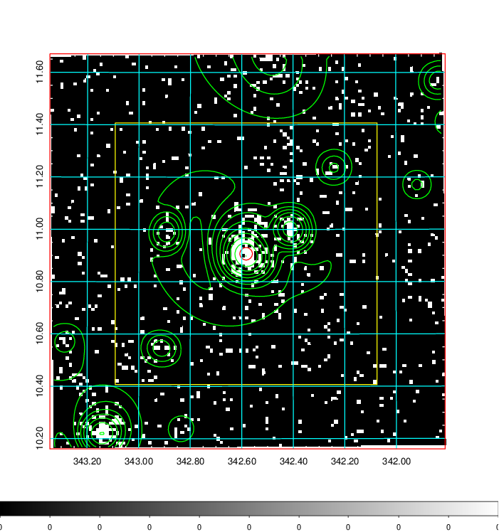  | 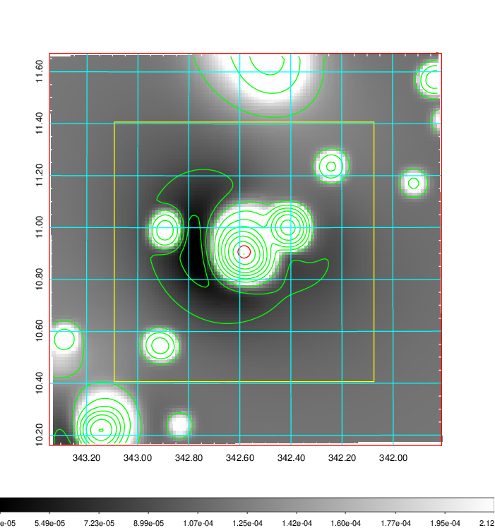   | 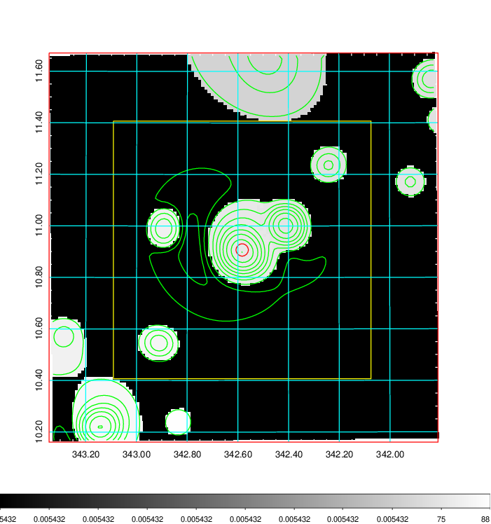  |

|[Exposure image](../image/906/906_mex.pdf)| [nH image](../image/906/906_nh.pdf)| [Planck image](../image/906/906_p.pdf)|
|-------------------|--------------------|-------------------|
|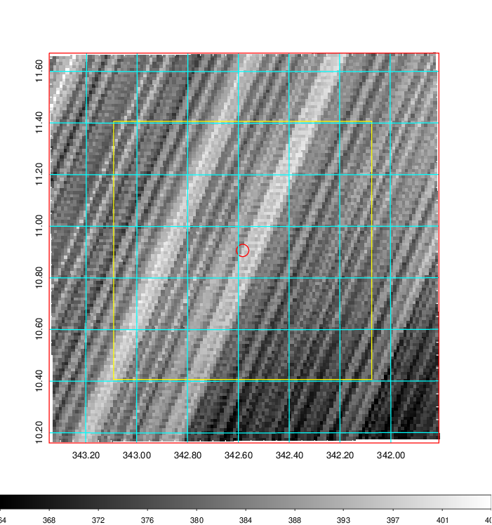   | 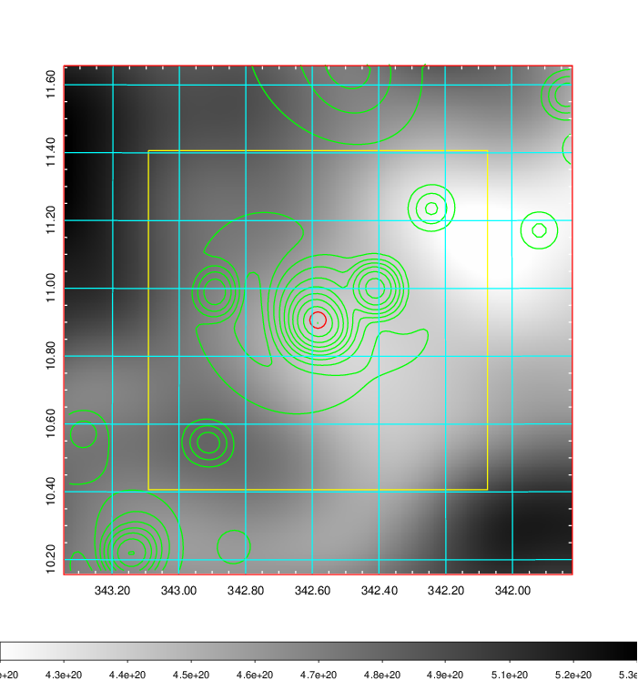    | 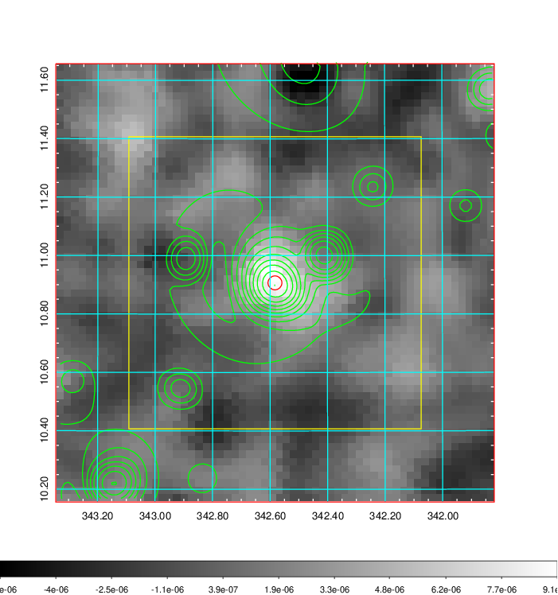 |

|[Redshift Histogram](../image/906/906_zg.pdf) | [DSS image(z1)](../image/906/906_dss_z1.pdf)      |  [DSS image(z2)](../image/906/906_dss_z2.pdf)    |
|-------------------|--------------------|-------------------|
|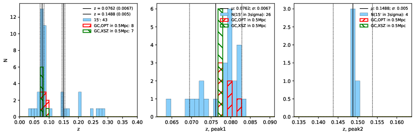 |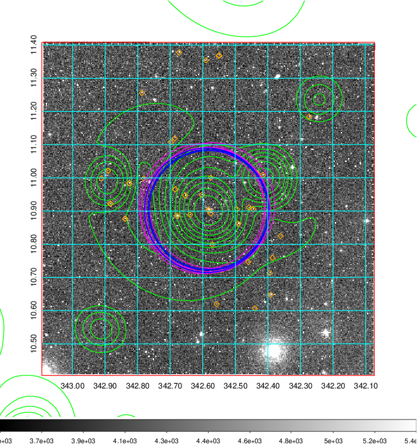  Blue circle for optical clusters;  Magenta circle for XSZ clusters;  all with r=1Mpc;  Only GC with Delta_z<0.01 are shown. | 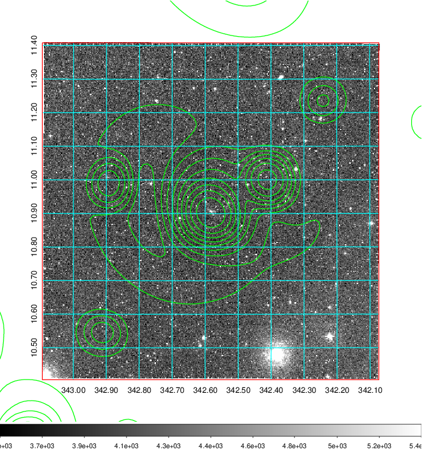 Blue circle for optical clusters;  Magenta circle for XSZ clusters;  all with r=1Mpc;  Only GC with Delta_z<0.01 are shown.  |

|[known Abell/XSZ clusters](../image/906/906_gc.pdf) | [2MASS image](../image/906/906_2mass.pdf)      |[SDSS image](../image/906/906_sdss.pdf)   |
|-------------------|-------------------|-------------------|
|  Magenta, blue and green circles  for optical, X-ray and SZ clusters  respectively, with redshift of clusters  labelled. The radius of circles  are 1Mpc.|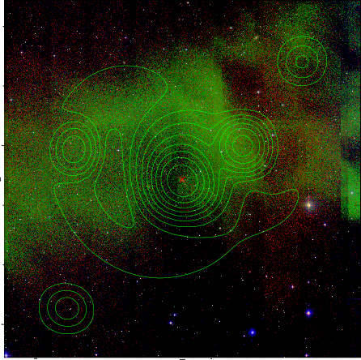  | 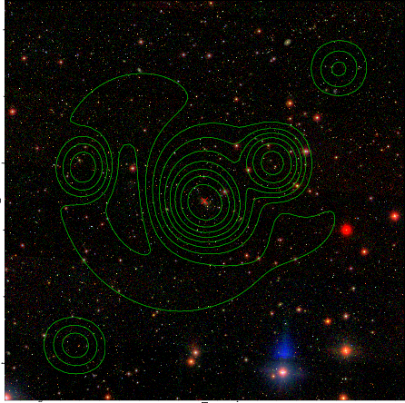  |

