

### 908

|Name|RAJ2000[deg]|DEJ2000[deg] |Ext[arcmin]| Ext,ml | z | z_src| C|GC(XSZ,Delta_z<0.01)| GC(OPT,Delta_z<0.01)|GC| R_sig[arcmin] | R500[arcmin] | R500[Mpc]| CRsig[c/s] | CR500[c/s] |L500[1E44 erg/s]|F500[1E-12 erg/s/cm^2]| M500[1E14 Msun]|Tx[keV]|Cnt_sig|Beta|Rc[arcmin]|Comment|Alias|
|---|---|---|---|---|---|------|---|--------|---------|----------|---|---|---|---|---|---|---|---|---|---|---|---|---|---|
|908| 344.165| 5.438| 0.73| 27.75| 0.1672(0.005)| z1, z_xsz| B| F20, SPI| N, RM| A, C, F20, MCXC, N, PSZ2, SPI, W| 6.362| 7.273| 1.248| 0.347(0.039)| 0.355(0.040)| 5.053(0.182)| 6.542(0.236)| 6.51(0.11)| 7.18(0.08)| 143.9| 0.925(-0.087+0.054)| 2.542(-0.366+0.271)| An SZ cluster with $z$ = 0.1696 and offset = 1.15 Mpc(6.64 arcmin)| k004|

|[RASS image](../image/908/908_img.pdf)|[filtered image](../image/908/908_fil.pdf)|[Segment image](../image/908/908_seg.pdf)|
|-------------------|--------------------|-------------------|
| 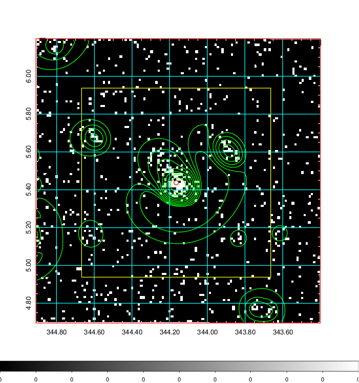  | 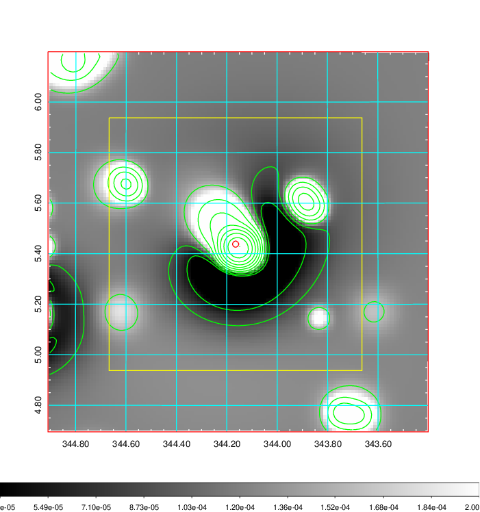   | 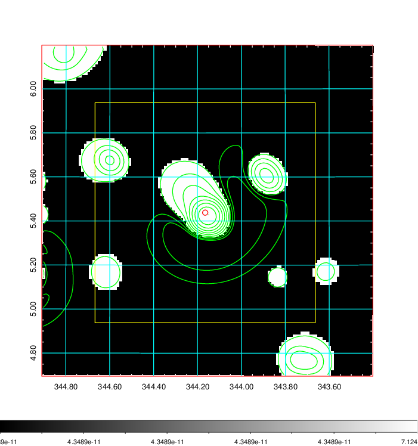  |

|[Exposure image](../image/908/908_mex.pdf)| [nH image](../image/908/908_nh.pdf)| [Planck image](../image/908/908_p.pdf)|
|-------------------|--------------------|-------------------|
|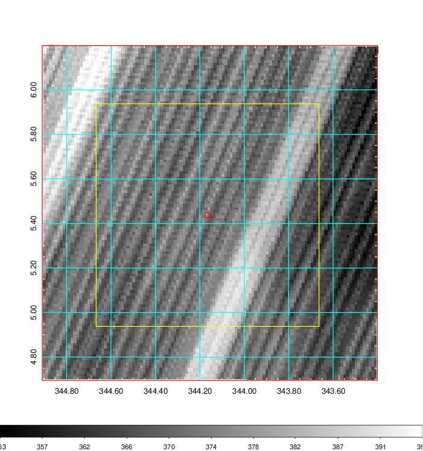   | 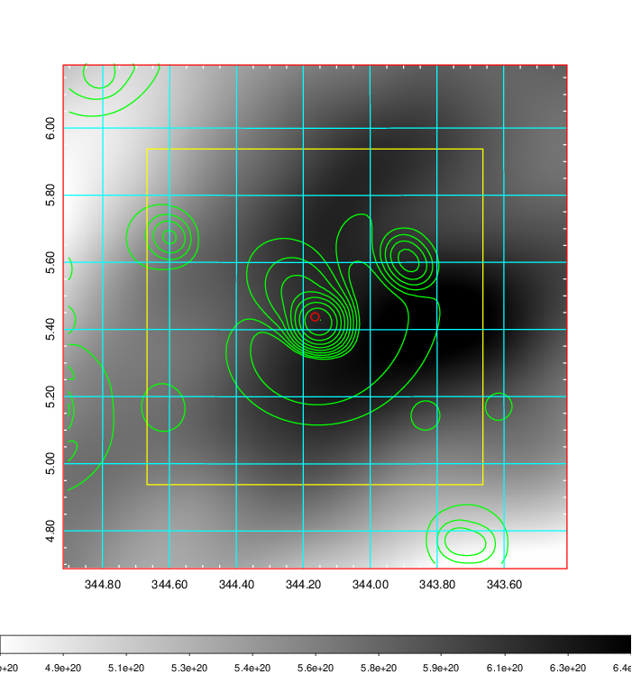    | 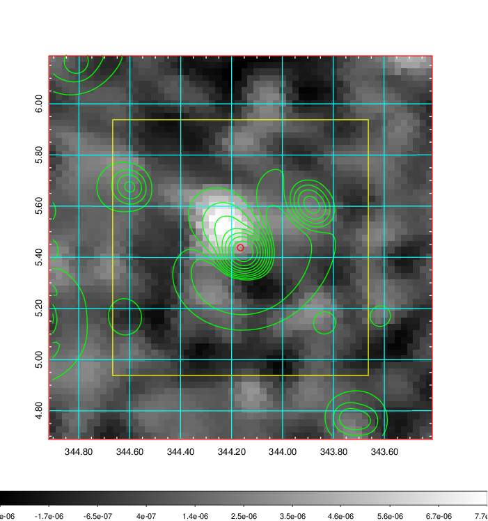 |

|[Redshift Histogram](../image/908/908_zg.pdf) | [DSS image(z1)](../image/908/908_dss_z1.pdf)      |  [DSS image(z2)](../image/908/908_dss_z2.pdf)    |
|-------------------|--------------------|-------------------|
|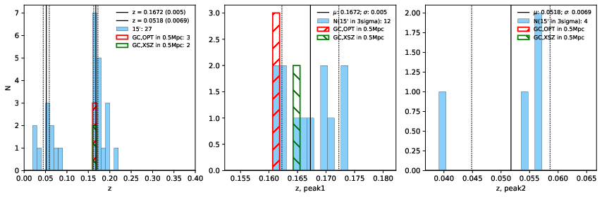 |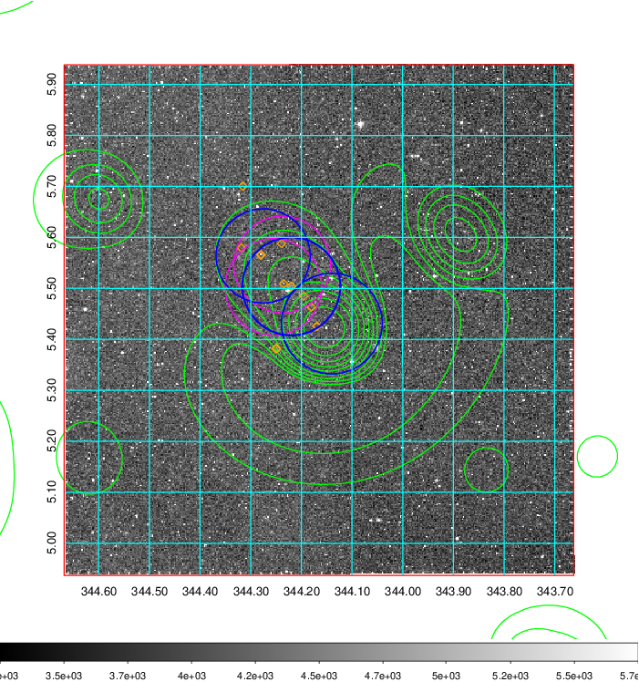  Blue circle for optical clusters;  Magenta circle for XSZ clusters;  all with r=1Mpc;  Only GC with Delta_z<0.01 are shown. | 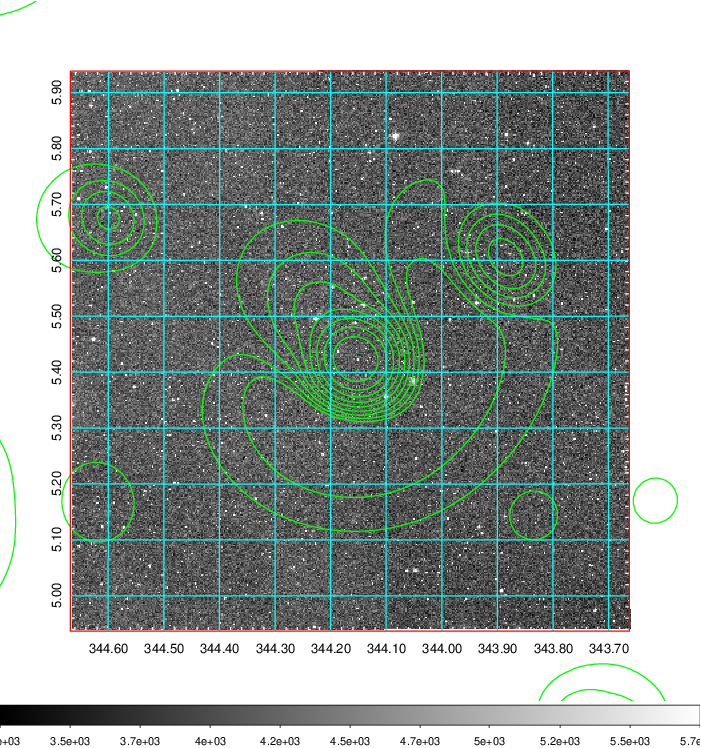 Blue circle for optical clusters;  Magenta circle for XSZ clusters;  all with r=1Mpc;  Only GC with Delta_z<0.01 are shown.  |

|[Previous-identified clusters](../image/908/908_gc.pdf) | [2MASS image](../image/908/908_2mass.pdf)      |[SDSS image](../image/908/908_sdss.pdf)   |
|-------------------|-------------------|-------------------|
|  Green, magenta, and blue circles  for optical, X-ray and SZ clusters  respectively, with redshift of clusters  labelled. The radius of circles  are 1Mpc.|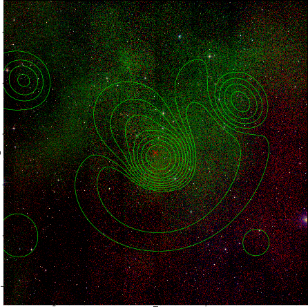  | 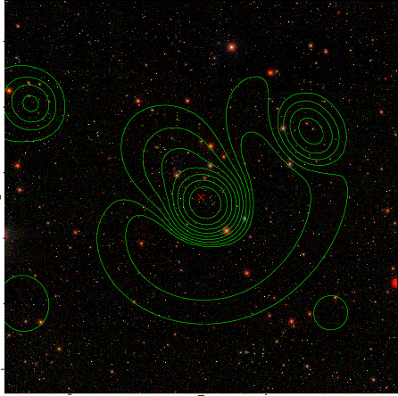  |

