

### 909

|Name|RAJ2000[deg]|DEJ2000[deg] |Ext[arcmin]| Ext,ml | z | z_src| C|GC(XSZ,Delta_z<0.01)| GC(OPT,Delta_z<0.01)|GC| R_sig[arcmin] | R500[arcmin] | R500[Mpc]| CRsig[c/s] | CR500[c/s] |L500[1E44 erg/s]|F500[1E-12 erg/s/cm^2]| M500[1E14 Msun]|Tx[keV]|Cnt_sig|Beta|Rc[arcmin]|Comment|Alias|
|---|---|---|---|---|---|------|---|--------|---------|----------|---|---|---|---|---|---|---|---|---|---|---|---|---|---|
|909| 345.307| 6.806| 6.62| 399.34| 0.0422(0.006)| z1, z_xsz| B| PSZ2, Tar| N| C, F20, N, PSZ2, SPI, Tar, W| 26.181| 16.323| 0.815| 0.684(0.068)| 0.644(0.064)| 0.464(0.025)| 11.143(0.596)| 1.61(0.04)| 2.91(0.05)| 308.0| 0.954(-0.059+0.033)| 11.486(-0.794+0.521)| -| k553|

|[RASS image](../image/909/909_img.pdf)|[filtered image](../image/909/909_fil.pdf)|[Segment image](../image/909/909_seg.pdf)|
|-------------------|--------------------|-------------------|
| 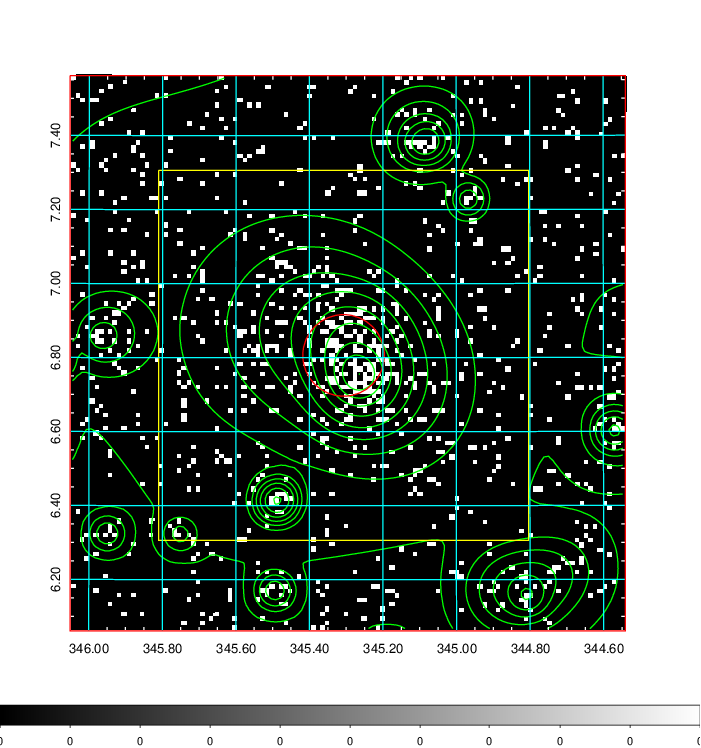  | 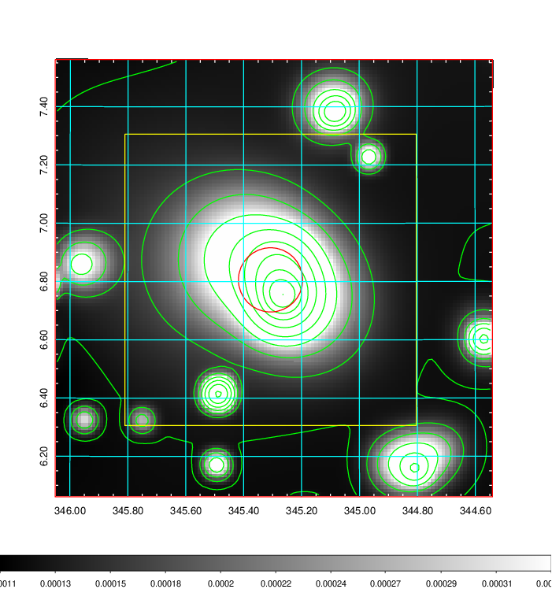   | 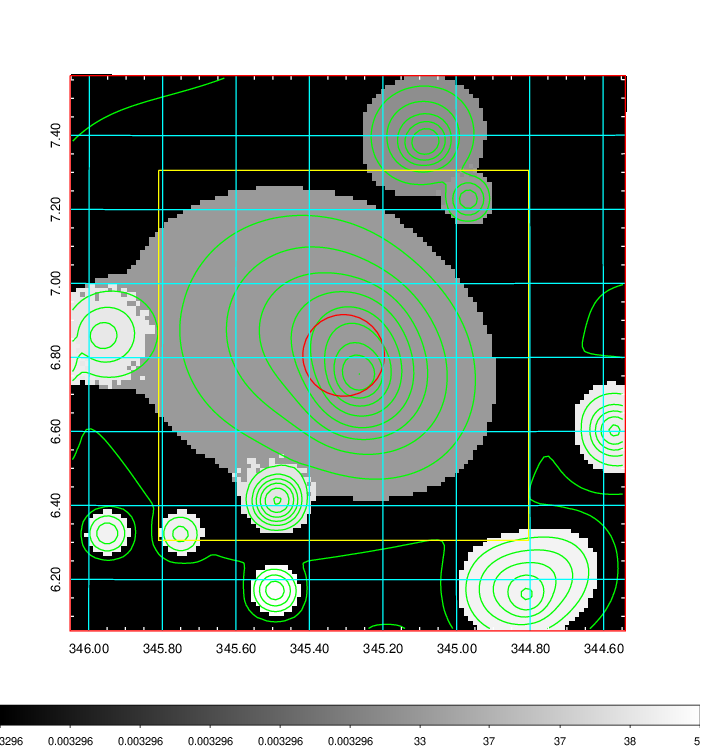  |

|[Exposure image](../image/909/909_mex.pdf)| [nH image](../image/909/909_nh.pdf)| [Planck image](../image/909/909_p.pdf)|
|-------------------|--------------------|-------------------|
|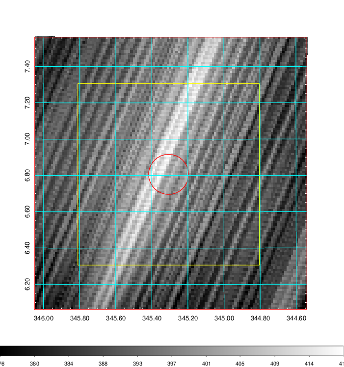   | 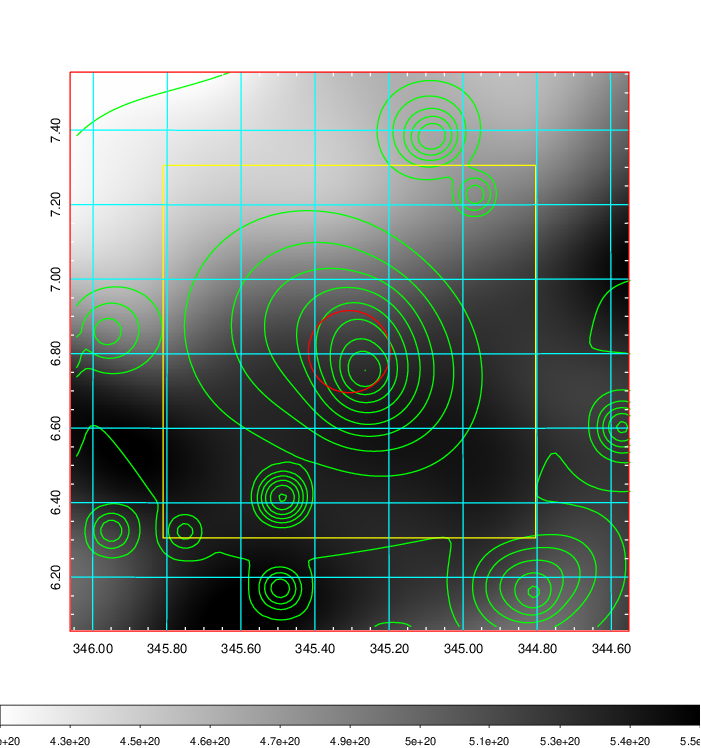    | 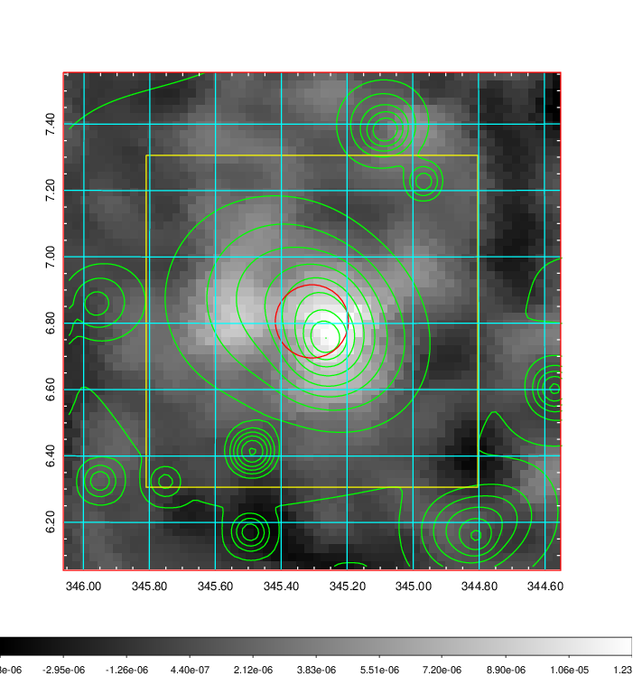 |

|[Redshift Histogram](../image/909/909_zg.pdf) | [DSS image(z1)](../image/909/909_dss_z1.pdf)      |  [DSS image(z2)](../image/909/909_dss_z2.pdf)    |
|-------------------|--------------------|-------------------|
|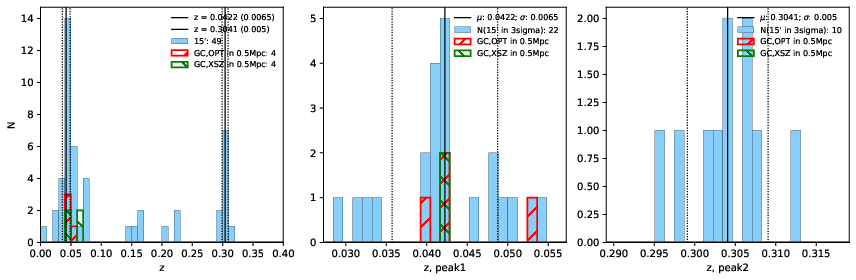 |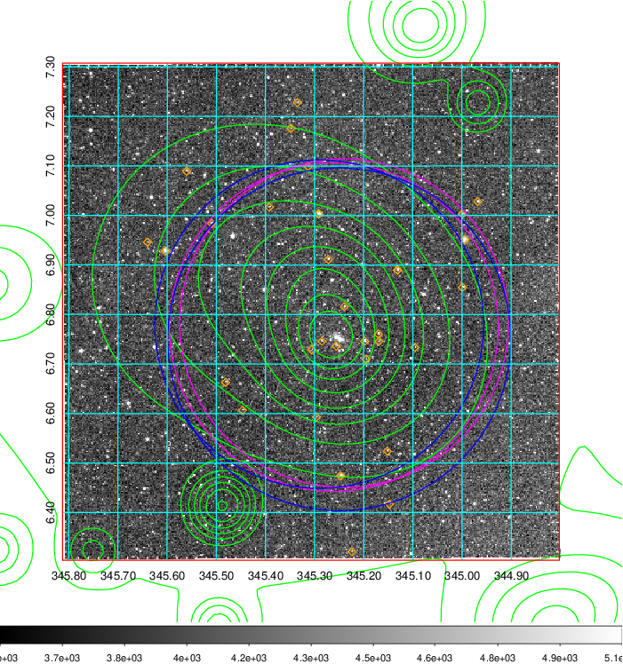  Blue circle for optical clusters;  Magenta circle for XSZ clusters;  all with r=1Mpc;  Only GC with Delta_z<0.01 are shown. | 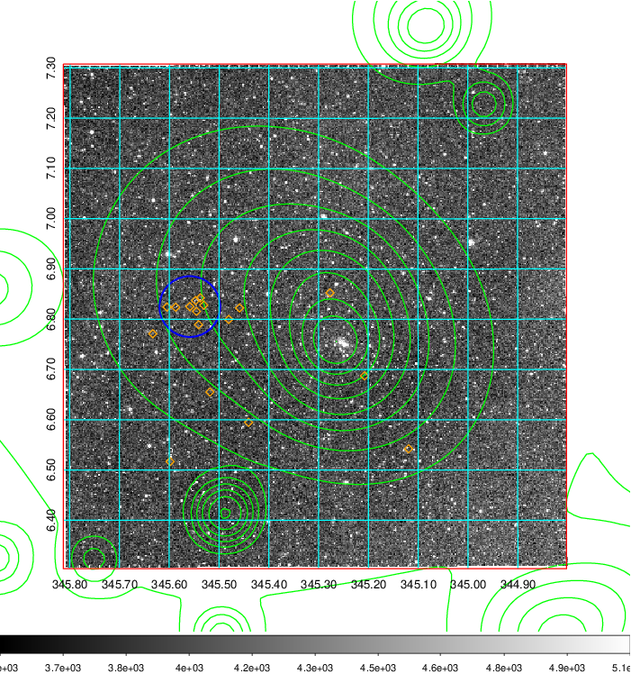 Blue circle for optical clusters;  Magenta circle for XSZ clusters;  all with r=1Mpc;  Only GC with Delta_z<0.01 are shown.  |

|[known Abell/XSZ clusters](../image/909/909_gc.pdf) | [2MASS image](../image/909/909_2mass.pdf)      |[SDSS image](../image/909/909_sdss.pdf)   |
|-------------------|-------------------|-------------------|
|  Magenta, blue and green circles  for optical, X-ray and SZ clusters  respectively, with redshift of clusters  labelled. The radius of circles  are 1Mpc.|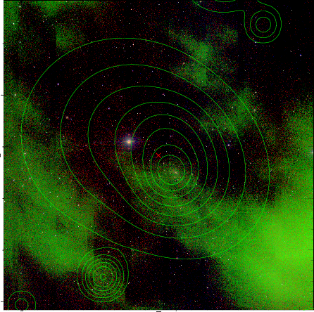  | 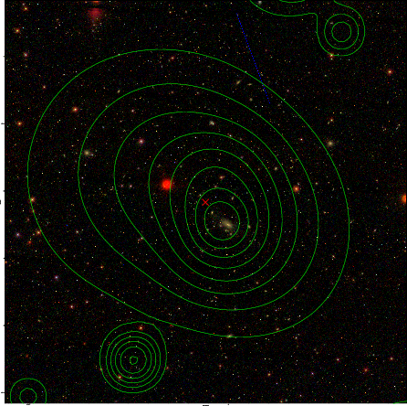  |

